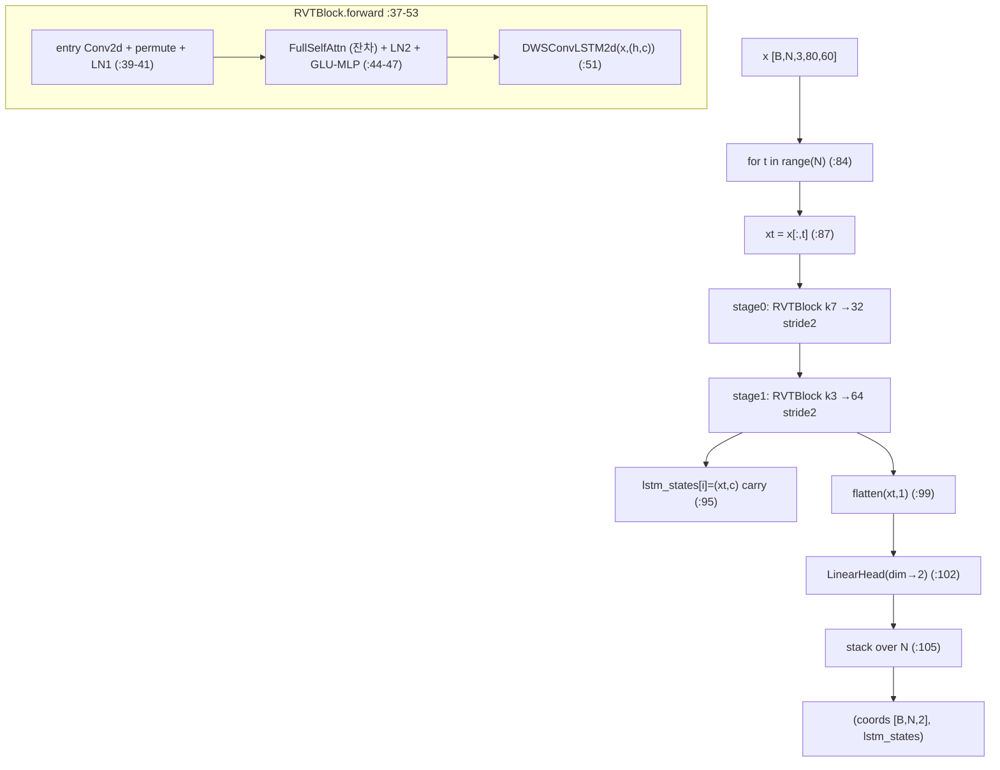
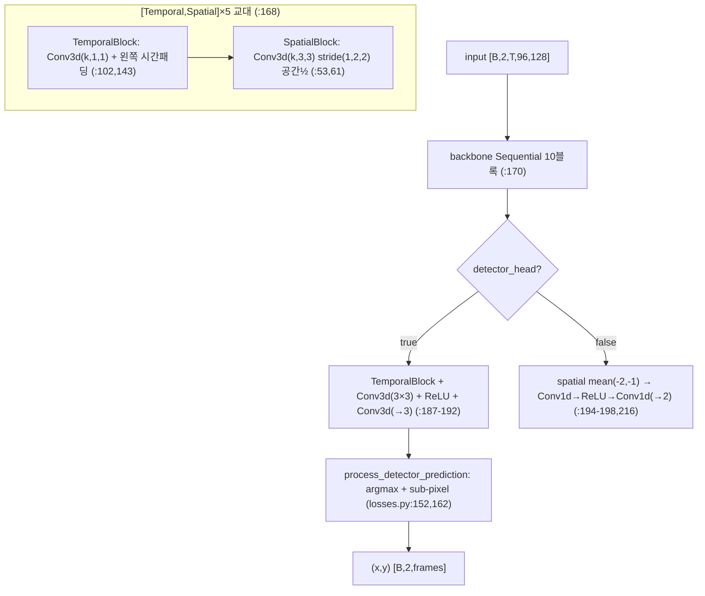

# ais2024 (AIS 2024 Event Eye Tracking Challenge) 모듈 통합 가이드 (S-PyTorch)

> 1차 요약: [`../ais2024.md`](../ais2024.md) — 본 문서는 그 요약을 솔루션/모듈(클래스·함수) 단위로 심화한 S-PyTorch 변형 통합 가이드다.
> 분석 대상: `\\wsl.localhost\ubuntu-24.04\home\user\project\PRJXR-HBTXR\REF\XR-Eye-Tracking\Codebase\ais2024`
> 관련 챌린지: Event-based Eye Tracking Challenge @ CVPR 2024 Workshop "AI for Streaming" (AIS 2024 challenge survey, arXiv:2404.11770). 데이터셋 3ET+(Kaggle).
> 작성 원칙: 실제 소스 Read 후 `파일:라인` 근거 표기. 라인 근거 없는 해석은 "추정", 코드로 확인 불가는 "확인 불가". 정확도(p10/거리)는 README 자기보고 인용, 미실행 수치는 "확인 불가".

---

## 0. 문서 머리말

### 0.1 대표 케이스 선정 + 근거

본 repo는 **동일한 3ET+ 입력·동일 메트릭(p10/euclidean) 위에 3개 독립 솔루션**을 제공한다(공식 베이스라인 + 두 팀 제출본). 스트리밍 저지연이 핵심 관심사이므로 TENNs-Eye를 대표로 두고, 파라미터 효율 최상위인 ERVT, 진입점 베이스라인을 함께 대표로 둔다.

- **대표 스트리밍 저지연 모델: `tenn_model.TennSt` (TENNs-Eye, Brainchip)**
  - 근거: **인과적(causal) 시공간 Conv3d** 백본(`tenn_model.py:153-198`)을 FIFO 버퍼로 1프레임씩 흘려 추론(`generate_submission.py:20-32`). 학습은 전체 시퀀스 Conv3d, 추론은 등가 스트리밍(`tenn_model.py:139-150`). **GPU 없이 CPU 추론**(`generate_submission.py:14-17`). recurrence(LSTM state) 없는 고정커널 conv → 정적 스케줄링·HW 라인버퍼 매핑에 최적(8절). README: p10 3위, 그 외 메트릭 1위(`eye_track_spatiotemporal/README.md:7`).
- **대표 파라미터 효율 모델: `RVT` (ERVT, Efficient RVT)**
  - 근거: Gehrig & Scaramuzza RVT(arXiv:2212.05598)를 4-stage→2-stage·Grid/Block attn→단일 Full Self-Attention으로 단순화(`model/RVT.py:1-4`, `ERVT/README.md:16`). 블록당 entry conv + Full Self-Attn + GLU-MLP + DWSConvLSTM2d(`RVT.py:21-53`). README: **149,570 params로 p10 97.6%, 36.96M mult-adds, 1.06ms(RTX 3060 Laptop, bs=1)**(`ERVT/README.md:21,24-25`).
- **대표 베이스라인(진입점): `CNN_GRU`**
  - 근거: 공식 스타터킷 모델. 3층 2D-CNN + 단일 GRU(hidden=128) + Linear(128→2)(`model/BaselineEyeTrackingModel.py:11-16`). README 자기보고 Averaged Distance 8.99 / p10 0.63(RTX 3090)(`challenge_demo_code/README.md:173`).

> 정리: **스트리밍 경로 = TENNs-Eye(인과 Conv3d + FIFO)**, **경량 SOTA 경로 = ERVT(Conv+Attn+ConvLSTM)**, **진입점 = CNN_GRU(CNN+GRU)**. 세 솔루션이 동일 데이터/메트릭 위에 있어 공정 비교 기준선을 형성(6절 한눈표).

### 0.2 수치 표기 규약 (S-PyTorch)

- **params** = 레이어 차원에서 직접 산정. Conv2d/Conv3d = `Cout·Cin·∏k (+ Cout if bias)`. GRU = `3·(I·H + H·H + 2H)`. Linear = `in·out + out`. LayerNorm = `2·C`. depthwise면 `Cin·∏k`(groups=Cin) + pointwise `Cin·Cout`.
- **MACs / FLOPs** = Conv = `Hout·Wout·Cout·Cin·∏k`(프레임당). 시간 모델별로 시퀀스 처리 방식이 다름 — GRU/ConvLSTM은 **시간 step T 직렬 재귀**(`RVT.py:84`, GRU 내부), Conv3d는 **시간축을 커널 차원으로 흡수**(인과 패딩 후 전체 처리, `tenn_model.py:143`) 또는 FIFO 1프레임 처리(`:146-150`). TENNs-Eye는 코드 내장 `MacsEstimationHook`(`losses.py:15-53`)으로 conv hook 기반 프레임당 MACs를 **실측 가능**(희소도 반영 변형 포함, `:39`).
- **activation memory** = 텐서 `shape × bit`. baseline/ERVT는 시간 step별 carry(GRU h / lstm_states) + voxel grid 입력. TENNs-Eye는 학습 시 `(B,C,T,H,W)` 5D 텐서를 레이어별 보관(activation 지배항), **추론 streaming 시 블록별 FIFO `(B,C,k,H,W)`만 유지**(`tenn_model.py:84,148`)해 메모리 대폭 절감.
- **이벤트 표현** = (a) baseline/ERVT: Tonic **voxel grid**(`EventSlicesToVoxelGrid`, `custom_transforms.py:98-134`), 시간창 내 voxel·per-channel z-score, **비인과**. (b) TENNs-Eye: raw event를 직접 frame으로 — `events_to_frames`가 bilinear/nearest/**causal_linear** 보간으로 공간·시간 다운샘플 동시 수행 → `(T,2,H,W)` 극성 2채널(`eye_dataset.py:37-94`). `causal_linear`(`:68-80`, `:77 td=td1.repeat(4) # causal`)는 시간 보간이 미래 비참조.
- **시간 모델** = baseline **GRU(1층)**(`BaselineEyeTrackingModel.py:15`), ERVT **DWSConvLSTM2d + Self-Attention + entry Conv**(`RVT.py:21-53`), TENNs-Eye **인과 Temporal Conv3d + FIFO 스트리밍**(`tenn_model.py:89-150`). 세 모델 모두 S4/Mamba류 명시적 SSM 미사용(확인됨).
- **정확도** = README 자기보고만 존재. baseline p10 0.63/dist 8.99(`challenge_demo_code/README.md:173`), ERVT p10 97.6%(`ERVT/README.md:21`), TENNs-Eye p10 3위·기타 1위(정량 수치 없음, `eye_track_spatiotemporal/README.md:7`). **본 repo 미실행 → 절대 재현 수치는 "확인 불가", 자기보고 인용**.

### 0.3 운영 경로 (학습 ↔ 체크포인트 ↔ 평가)

```
[3ET+ raw event h5: (t,x,y,p), label 100Hz (x,y,close)]   (Kaggle)
      │
      ├─ [baseline/ERVT] Tonic ThreeETplus_Eyetracking + Downsample(factor=0.125, ×8→80×60)
      │    label: ScaleLabel→TemporalSubsample(0.2→20Hz)→NormalizeLabel  (train.py:137-141)
      │    SliceByTimeEventsTargets(시간창 슬라이싱) → SliceLongEventsToShort → EventSlicesToVoxelGrid(n_bins=3)
      │    train: SlicedDataset→DiskCached(baseline)/MemoryCached+RandomSpatialAugmentor(ERVT)
      │      ▼
      │    [baseline] CNN_GRU: 3×Conv2d(→32→64→32)+MaxPool→GRU(36192→128)→Linear(→2)
      │    [ERVT] RVT: 2×(entry Conv + FullSelfAttn + GLU-MLP + DWSConvLSTM2d) + LinearHead(→2)
      │    loss: weighted_mse(baseline) / weighted_rmse(ERVT)  (configs)
      │    Adam, baseline 200ep bs=20 / ERVT 150ep bs=1 + ExponentialLR(0.98)
      │      ▼
      │    test.py: output * (W·factor, H·factor) → 80×60 환산 → submission.csv ['row_id','x','y']
      │    (ERVT) bench.py: torch.compile + 1000회 CudaTimer latency 측정
      │
      └─ [TENNs-Eye] 자체 EyeTrackingDataset(h5/txt 직접 파싱) + events_to_frames(causal_linear, sd=(5,5)→128×96)
           EventRandomAffine(±15°,scale0.8~1.2) + temporal flip/scale/shift  (eye_dataset.py)
             ▼
           TennSt: 10블록 [Temporal,Spatial]×5 인과 Conv3d, ch[2..256] + detector(CenterNet) head
           loss: tracking_loss(focal+smooth_l1) + L1 활성정규화 + valid_mask(blink 제외)  (losses.py:123-134)
           train.py: Lightning+Hydra, torch.compile(TennSt), AdamW(2e-3,wd1e-3)+WarmupCosine, 16-mixed, 200ep
             ▼
           generate_submission.py: GPU OFF + streaming(FIFO) 1프레임씩 → ::5(20Hz) → 80×60 → submission.csv
           generate_val_results.py: ReLU hook으로 event density, conv hook(MacsEstimationHook)으로 MACs/frame 실측
```
- 체크포인트(`weights/submission.ckpt` 등)·pretrained weights는 [제외].

### 0.4 솔루션 / 데이터셋 / 정확도 요약

| 항목 | baseline (CNN_GRU) | ERVT (RVT) | TENNs-Eye (TennSt) |
|---|---|---|---|
| 입력 표현 | voxel grid(비인과) | voxel grid(n_bins=3, 비인과) | event frame 2ch(causal_linear 인과) |
| 공간 다운샘플 | ×8 → 80×60 (`sliced_baseline.json:11`) | ×8 → 80×60 (`rvt.json:32`) | (5,5) → 128×96 (`config.yaml:4`) |
| 시간 모델 | GRU(1층) | DWSConvLSTM2d + FullSelfAttn | 인과 Temporal Conv3d + FIFO |
| head | Linear(128→2) | LinearHead(dim→2) | CenterNet(heatmap+offset, 기본) / 회귀(옵션) |
| loss | weighted_mse | weighted_rmse | tracking_loss(focal+smooth_l1)+L1 reg |
| optimizer | Adam lr=1e-3, 200ep, bs=20 | Adam lr=1e-3+ExpLR(0.98), 150ep, bs=1 | AdamW 2e-3+WarmupCosine, 200ep, bs=32 |
| params(자기보고) | 확인 불가 | **149,570** (`ERVT/README.md:25`) | 확인 불가(코드로 산정 가능, `generate_val_results.py:135`) |
| 정확도(자기보고) | p10 0.63 / dist 8.99 | **p10 97.6%** / 36.96M mult-adds / 1.06ms | p10 3위·기타 1위(수치 없음) |
| 학습 프레임워크 | argparse+MLflow | argparse+MLflow+torchinfo | Lightning+Hydra+bolts |
| 메트릭 | p_acc/px_euclidean_dist | 동일(+weighted_RMSE) | p10_acc(detector 디코드 후) |

---

## 1. Repo / Layer 개요 (3 솔루션 맵)

ais2024 = 이벤트 카메라로 동공 중심 (x,y)를 회귀(또는 heatmap 검출)하는 **3가지 독립 솔루션**의 학습/평가 묶음. 모두 순수 PyTorch(HW 커널·CUDA 확장 없음). 서브프로젝트는 정확히 3개(Glob 확인).

### 1.1 파일 역할 맵

| 솔루션 | 파일 | 역할 | 메인 사용 |
|---|---|---|---|
| **baseline** | `challenge_demo_code/model/BaselineEyeTrackingModel.py` | `CNN_GRU` 정의 | ★ `train.py:17` import |
| | `challenge_demo_code/train.py` / `test.py` | Tonic 파이프라인·MLflow 학습 / csv 추론 | ★ 진입점 |
| | `challenge_demo_code/utils/metrics.py` | p_acc·px_euclidean_dist·weighted_MSELoss | ★ |
| | `challenge_demo_code/dataset/custom_transforms.py` | SliceByTime·EventSlicesToVoxelGrid | ★ |
| **ERVT** | `ERVT/model/RVT.py` | `RVT`/`RVTBlock`/`DWSConvLSTM2d`/`SelfAttentionCl`/`MLP`/`GLU`/`LayerScale` | ★ `train.py:17` |
| | `ERVT/train.py` / `test.py` / `bench.py` | 학습 / csv 추론 / latency 벤치 | ★ |
| | `ERVT/utils/metrics.py` | weighted_RMSE(+버그 :115) | ★ |
| | `ERVT/dataset/custom_transforms.py` | EventSlicesToVoxelGrid / SpikeTensor / RandomSpatialAugmentor | ★ |
| **TENNs-Eye** | `eye_track_spatiotemporal/tenn_model.py` | `TennSt`/`TemporalBlock`/`SpatialBlock`/`CausalGroupNorm` | ★ |
| | `eye_track_spatiotemporal/losses.py` | tracking_loss·regression_loss·p10_acc·MacsEstimationHook | ★ |
| | `eye_track_spatiotemporal/eye_dataset.py` | events_to_frames·EventRandomAffine·EyeTrackingDataset | ★ |
| | `eye_track_spatiotemporal/train.py` / `generate_submission.py` / `generate_val_results.py` | Lightning 학습 / 스트리밍 추론 / density·MACs 평가 | ★ |
| **[제외]** | `weights/*.ckpt`, `figures/*`, `web/*`, `*.ipynb`, `ThreeET_plus.py`(Tonic 래퍼 미열람) | 체크포인트·이미지·노트북·외부 래퍼 | 제외 |

### 1.2 forward 진입점

- baseline: `model(x)` → `CNN_GRU.forward`(`:19`) → conv1/2/3+pool → `view(B,seq,-1)` → `gru` → `fc` → `[B,seq,2]`.
- ERVT: `model(x)` → `RVT.forward`(`RVT.py:73`) → `for t in range(N)`(`:84`) → 각 stage `RVTBlock.forward`(`:37`)에 lstm_state carry(`:90-95`) → flatten → `LinearHead`(`:102`) → `(coords[B,N,2], lstm_states)`.
- TENNs-Eye: `model(input)` → `TennSt.forward`(`:212`) → `backbone`(10블록 Sequential, `:170`) → detector면 head(`:214`) 아니면 spatial mean 후 head(`:216`). 스트리밍 시 블록 forward가 `_streaming_forward`(FIFO)로 분기(`:140-150`).

### 1.3 제외 목록
- **외부 데이터/체크포인트**: 3ET+ h5 원본, `weights/submission.ckpt`, pretrained Google Drive weights.
- **외부 프레임워크 원본**: torch/tonic/lightning/pl_bolts/hydra/torchinfo/mlflow(import만).
- **미열람 래퍼**: `dataset/ThreeET_plus.py`(Tonic `ThreeETplus_Eyetracking` 래퍼) — README/train.py 시그니처로만 추론.
- **보조/이미지**: `web/`, `figures/`, `*.ipynb`, `generate_website.py`, `mlflow.sh`.

---

## 2. 솔루션: baseline — `CNN_GRU` (CNN + GRU)

### 2.1 역할 + 상위/하위
- **역할**: voxel grid 시퀀스를 프레임 독립 2D-CNN으로 특징 추출 → 시간축으로 펼쳐 단일 GRU에 투입 → 프레임별 (x,y) 회귀. 공간은 conv, 시간은 GRU 재귀.
- **상위**: `train.py`의 학습/검증 루프가 `model(x)` 호출(`train.py:122`). **하위**: `nn.Conv2d`×3, `nn.MaxPool2d`, `nn.GRU`, `nn.Linear`.

### 2.2 데이터플로우 (텐서 shape · 시간축)

```mermaid
flowchart LR
  IN["x [B,seq,C=n_bins,H,W]"] --> RS["view(B·seq,C,H,W) + permute H/W (:22-24)"]
  RS --> C1["conv1 C→32 + ReLU (:11,26-27)"]
  C1 --> C2["conv2 32→64 + ReLU (:12,28-29)"]
  C2 --> C3["conv3 64→32 + ReLU (:13,30-31)"]
  C3 --> P["MaxPool2d(3,2) (:14,32)"]
  P --> FL["view(B,seq,-1) → 36192 (:34)"]
  FL --> G["GRU(36192→128) (:15,35)"]
  G --> FC["Linear(128→2) (:16,38)"]
  FC --> Y["y [B,seq,2]"]
```

> 주: GRU 입력 36192는 pool 후 spatial×channel flatten 값을 **하드코딩**(`:15`). 해상도/채널 변경 시 깨짐(7절 한계). 입력 `permute(0,1,3,2)`(`:24`)로 H/W를 교차 — 의도 주석 없음(추정).

### 2.3 forward call stack
```
model(x) → CNN_GRU.forward (:19)
├─ x.view(B·seq,C,H,W).permute(0,1,3,2) (:22-24)
├─ relu(conv1)→relu(conv2)→relu(conv3)→pool (:26-32)
├─ x.view(B,seq,-1) (:34)
├─ x,_ = self.gru(x) (:35)
└─ self.fc(x) → [B,seq,2] (:38)
```

### 2.4 대표 코드 위치
`BaselineEyeTrackingModel.py:11-16`(레이어 정의), `:19-40`(forward).

### 2.5 대표 코드 블록

**(a) 레이어 정의 — GRU 입력 하드코딩 (`:11-16`)**
```python
self.conv1 = nn.Conv2d(args.n_time_bins, 32, kernel_size=3, stride=1, padding=1)
self.conv2 = nn.Conv2d(32, 64, kernel_size=3, stride=1, padding=1)
self.conv3 = nn.Conv2d(64, 32, kernel_size=3, stride=1, padding=1)
self.pool = nn.MaxPool2d(kernel_size=3, stride=2)
self.gru = nn.GRU(input_size=36192, hidden_size=128, num_layers=1, batch_first=True)
self.fc = nn.Linear(128, 2)
```
→ n_time_bins(=3, `sliced_baseline.json:22`)이 입력 채널. pool 후 flatten = 36192 하드코딩(80×60·factor·3채널·conv·pool 조합 산물, 정확 산식 코드 부재 → 확인 불가).

**(b) 시간축 GRU 처리 (`:34-38`)**
```python
x = x.view(batch_size, seq_len, -1)   # [B,seq,36192]
x, _ = self.gru(x)                     # [B,seq,128]  GRU 내부에서 seq 직렬 재귀
x = self.fc(x)                         # [B,seq,2]
```
→ CNN은 프레임 독립(배치차원으로 펼침, `:22`), 시간 종속성은 GRU가 흡수. GRU h0 미지정 → 0초기화(stateful 미구현).

### 2.6 연산 분해 + 정량
- **params**(차원 산정, n_bins=3):
  - conv1 `3·32·9+32`=896; conv2 `32·64·9+64`=18,496; conv3 `64·32·9+32`=18,464.
  - GRU `3·(36192·128 + 128·128 + 2·128)`=13,946,880 (지배항). fc `128·2+2`=258.
  - **합 ≈ 13.98M** → GRU 입력 36192 하드코딩 때문에 GRU가 전체 params의 99.7% 차지(자기보고 params 없음 → 확인 불가, 차원 산정치).
- **MAC/프레임**: conv ≈ `Hp·Wp` 의존(pool 전 80×60 기준 conv1 80·60·32·3·9≈4.15M 등) + GRU `3·(36192·128+128²)≈13.9M/프레임`. GRU가 conv 대비 큼(하드코딩 flatten 탓).
- **activation**: voxel grid 입력 `[B,seq,3,80,60]` + GRU 시퀀스 텐서. 베이스라인이라 최적화 없음.

---

## 3. 솔루션: ERVT — `RVT` (Conv + Self-Attention + ConvLSTM)

### 3.1 역할 + 상위/하위
- **역할**: voxel grid 시퀀스를 시간축 루프로 순회하며, 각 step마다 2-stage RVTBlock(entry conv→Full Self-Attn→GLU-MLP→DWSConvLSTM2d)을 통과시켜 시공간 특징을 누적, LinearHead로 프레임별 (x,y) 회귀. recurrent state(lstm_states)를 명시적으로 carry.
- **상위**: `train.py:92`가 `RVT(args)` 생성, 학습 루프가 `model(data)`. **하위**: `RVTBlock`×2 → 각각 `nn.Conv2d`, `LayerNorm`, `FullSelfAttention`(`SelfAttentionCl`+`LayerScale`), `MLP`(`GLU`), `DWSConvLSTM2d`.

### 3.2 데이터플로우 (텐서 shape · 시간축)

> 주: 시간 step간 `lstm_states`를 carry(`:90-95`)하므로 **stateful**. 매 forward 시작 시 `lstm_states==None`이면 `[(None,None)]×stages`(`:77-78`), DWSConvLSTM2d가 None을 0으로 초기화(`:159-163`).

### 3.3 forward call stack
```
model(data) → RVT.forward (:73)
├─ lstm_states 초기화 [(None,None)]×2 (:77-78)
├─ for t in range(N) (:84)
│  ├─ xt = x[:,t] (:87)
│  ├─ for i,stage in stages (:90)
│  │  └─ RVTBlock.forward(xt,h,c) (:37)
│  │     ├─ conv→permute→ln1 (:39-41)
│  │     ├─ fsa(잔차)→ln2→mlpb(GLU) (:44-47)
│  │     └─ DWSConvLSTM2d(x,(h,c)) (:51) → (h_t,c_t)
│  └─ flatten→LinearHead (:99-102)
└─ stack(outputs,dim=1) → (coords,lstm_states) (:105-106)
```

### 3.4 대표 코드 위치
`RVT.py:21-53`(RVTBlock), `:55-106`(RVT 시간 루프), `:108-125`(LinearHead+dim 산식), `:130-184`(DWSConvLSTM2d), `:191-236`(Self-Attention), `:243-311`(LayerScale/GLU/MLP).

### 3.5 대표 코드 블록

**(a) RVTBlock 구성 — Conv+Attn+ConvLSTM (`:37-53`)**
```python
x_conv = self.conv(x); x_conv = x_conv.permute(0,2,3,1); x_conv = self.ln1(x_conv)   # entry conv (channels-last)
x_bsa = self.fsa(x_conv); x_bsa = x_bsa + x_conv; x_bsa = self.ln2(x_bsa)            # Full Self-Attn 잔차
x_bsa = self.mlpb(x_bsa)                                                              # GLU-MLP
x_unflattened = x_bsa.permute(0,3,1,2)
x_unflattened, c = self.lstm(x_unflattened, (h, c))                                   # DWSConvLSTM2d
```
→ RVT의 stage = "공간(conv) + 전역(attn) + 시간(convlstm)" 융합 블록. entry conv stride=2로 공간 다운샘플(stage0 k7, stage1 k3, `rvt.json:14-27`).

**(b) DWSConvLSTM2d — depthwise conv 게이트 (`:144-184`)**
```python
self.conv3x3_dws = nn.Conv2d(xh_dim, xh_dim, kernel_size=7, padding=3, groups=xh_dim)  # depthwise 7×7
self.conv1x1 = nn.Conv2d(xh_dim, gates_dim=4·dim, kernel_size=1)                        # pointwise → 4게이트
...
xh = torch.cat((x, h_tm1), dim=1); xh = self.conv3x3_dws(xh); mix = self.conv1x1(xh)
gates, cell_input = torch.tensor_split(mix, [dim*3], dim=1)
forget_gate, input_gate, output_gate = torch.tensor_split(sigmoid(gates), 3, dim=1)
c_t = forget_gate * c_tm1 + input_gate * tanh(cell_input)   # dropout 0.2 on cell_input (:179)
h_t = output_gate * torch.tanh(c_t)
```
→ 표준 ConvLSTM의 conv를 **depthwise-separable**(7×7 dws + 1×1 pw)로 경량화. 게이트 3개(f,i,o)만 sigmoid, cell_input은 tanh+dropout. h0/c0 None이면 `zeros_like(x)`(`:159-163`).

**(c) LinearHead dim 산식 (`:118-119`)**
```python
stride_factor = reduce(lambda x,y: x*y, [s["stride"] for s in args.stages])   # 2·2=4
dim = int(out_ch_last * ((W·spatial_factor)//stride_factor) * ((H·spatial_factor)//stride_factor))
```
→ stride 누적(4)으로 공간 축소 반영. W·factor=80, H·factor=60, //4 → 20×15, ×64ch = **19,200 dim** → Linear(19200→2)(추정 산정, params 대부분 차지).

**(d) Self-Attention + LayerScale (`:208-236, 243-253`)**
```python
q,k,v = qkv(x).view(B,-1,num_heads,dim_head*3).transpose(1,2).chunk(3,3)
attn = (q @ k.transpose(-2,-1)) * scale; attn = attn.softmax(-1); attn = drop(attn)  # dropout 0.5
x = (attn @ v) ... ; x = proj(x)
# LayerScale: x * gamma, gamma 초기 1e-5 (:249)  → 학습 초기 attn 기여 미미하게 시작
```
→ num_heads = dim//dim_head(stage0 32//32=1, stage1 64//32=2). softmax attn은 FPGA 비용 큰 연산(8절).

### 3.6 연산 분해 + 정량
- **params**: README **149,570**(`ERVT/README.md:25`). 차원 산정 시 LinearHead(19200→2 ≈ 38,402)·DWSConvLSTM2d 1×1 conv·QKV linear가 주요 기여(정확 분해는 dim 추정 의존 → 일부 추정).
- **MAC/추론**: README **36.96M mult-adds**(bs=1, 입력 1프레임, `torchinfo.summary` 측정, `train.py:94`·`bench.py:32`). 시간 루프 N step이면 ×N(추정).
- **시간 직렬성**: `for t in range(N)`(`:84`)는 step간 lstm_states 의존 → **병렬화 불가**(batch_size=1, `rvt.json:30`). config `tbptt:15`(truncated BPTT 추정)는 train.py에서 직접 참조처 미발견 → **확인 불가**.
- **latency**: README **1.06ms**(RTX 3060 Laptop, bs=1, `bench.py` torch.compile + CudaTimer 1000회, `:38-43`).
- **버그(확인됨)**: `weighted_RMSE` sum 분기 `torch.sqrt*(...)` 오타(연산자 누락, `ERVT/utils/metrics.py:115`) → mean 분기만 정상. 기본 config reduction='mean'(`train.py:105`)이라 학습엔 영향 없음.

---

## 4. 솔루션: TENNs-Eye — `TennSt` (인과 Conv3d + FIFO 스트리밍)

### 4.1 역할 + 상위/하위
- **역할**: event frame 시퀀스 `(B,2,T,H,W)`를 10개 인과 시공간 블록(Temporal/Spatial 교대)으로 처리 → CenterNet식 detector head(heatmap+sub-pixel offset)로 동공 위치 산출. 학습은 전체 시퀀스 Conv3d, **추론은 FIFO 버퍼로 1프레임씩 등가 스트리밍**.
- **상위**: `train.py`의 `CustomModule`(Lightning)이 `torch.compile(TennSt)` 래핑(`:46`), `forward`/loss/metric 호출. 추론은 `generate_submission.py`가 `streaming_inference`(`:20-32`). **하위**: `TemporalBlock`×5, `SpatialBlock`×5, `CausalGroupNorm`, `nn.Conv3d`, detector head Conv3d×2.

### 4.2 데이터플로우 (텐서 shape · 시간축)

> 채널 `[2,8,16,32,48,64,80,96,112,128,256]`(`config.yaml:12`), 마지막 4블록 depthwise(`n_depthwise_layers=4`, `:13`). SpatialBlock 5회 stride(1,2,2) → 공간 96×128 → 3×4(추정). 시간 T는 Conv3d 인과 패딩으로 보존(`:143`).

### 4.3 forward call stack
```
[학습] model(input) → TennSt.forward (:212)
├─ backbone(input) (10블록 Sequential, :170)
│  ├─ TemporalBlock.forward (:139): F.pad(왼쪽 시간 k-1) → Conv3d(k,1,1) → bn/gn (:143-144)
│  └─ SpatialBlock.forward (:73): Conv3d(k,3,3) stride(1,2,2) → norm (:60-63)
└─ detector면 head(...) (:214), 아니면 head(mean(-2,-1)) (:216)

[추론] streaming_inference (generate_submission.py:20)
├─ model.streaming(True) (:22 → tenn_model.py:200-205 모든 블록 streaming on)
├─ model.reset_memory() (:23 → fifo=None, :207-210)
└─ for frame_id: model(frames[:,:,[frame_id]]) (:27-29)
   └─ 블록 _streaming_forward (:146-150): fifo=cat([fifo[1:],input]) → block(fifo)
```

### 4.4 대표 코드 위치
`tenn_model.py:10-21`(CausalGroupNorm), `:30-86`(SpatialBlock), `:89-150`(TemporalBlock+FIFO), `:153-216`(TennSt), `losses.py:90-120`(tracking_loss), `:137-165`(process_detector_prediction).

### 4.5 대표 코드 블록

**(a) 인과 Temporal Conv3d — 왼쪽 시간 패딩 (`tenn_model.py:139-144`)**
```python
def forward(self, input):
    if self.streaming_mode:
        return self._streaming_forward(input)
    input = F.pad(input, (0, 0, 0, 0, self.kernel_size - 1, 0))   # 시간축 왼쪽만 (k-1) 패딩 → 인과
    return self.block(input)                                       # Conv3d(k,1,1)
```
→ 미래 프레임 비참조(왼쪽 패딩만). 커널 `(k,1,1)`(full_conv3d면 `(k,3,3)`, `:102`)로 시간만 conv. `t_kernel_size=5`(`config.yaml:14`).

**(b) FIFO 스트리밍 등가 (`tenn_model.py:146-150`)**
```python
def _streaming_forward(self, input):
    if self.fifo is None:
        self.fifo = torch.zeros(*input.shape[:2], self.kernel_size, *input.shape[3:]).type_as(input)
    self.fifo = torch.cat([self.fifo[:, :, 1:], input], dim=2)   # 1프레임 push, 가장 오래된 것 pop
    return self.block(self.fifo)                                  # 길이 k FIFO로 conv
```
→ 학습 시 `F.pad` 인과 conv와 **수학적 등가**. FIFO = HW 시프트레지스터/순환버퍼로 직역 가능(8절). 입력 shape `(B,C,1,H,W)`(1프레임) 가정(`:202`).

**(c) CenterNet detector head + 디코드 (`tenn_model.py:186-192`, `losses.py:152-163`)**
```python
# head: TemporalBlock → Conv3d(3×3) → ReLU → Conv3d(→3)   # 3채널 = pupil heatmap + x_mod + y_mod
pupil_ind = pred_pupil.flatten(-2,-1).argmax(-1)   # heatmap argmax → 픽셀 위치 (losses.py:152)
x = (pupil_ind_x + pred_x_mod) / width             # sub-pixel offset 보정 (:162)
y = (pupil_ind_y + pred_y_mod) / height            # (:163)
```
→ heatmap argmax로 정수 픽셀 + sigmoid offset으로 sub-pixel. 회귀보다 위치 정밀도 유리할 수 있음(추정).

**(d) tracking_loss — focal + sub-pixel smooth_l1 (`losses.py:90-120`)**
```python
valid_mask = openness.eq(1) & x.gt(0)&x.lt(1)&y.gt(0)&y.lt(1)   # blink·범위밖 제외
center_loss = F.smooth_l1_loss(pred_center_mod, center_mod, beta=0.11, reduction='none').sum(1)
focal_loss = where(pupil_mask, -(1-p)^γ·log(p)+center_loss, -p^γ·log(1-p))   # γ=2
return focal_loss[valid_mask].sum() / valid_mask.sum()
```
→ heatmap focal(CenterNet) + 정답 픽셀에서만 offset smooth_l1. 추가로 `RegularizationLoss`가 ReLU 출력에 L1 패널티(활성 희소화 유도, `losses.py:56-76`).

### 4.6 연산 분해 + 정량
- **params**: 코드로 산정 가능 — `generate_val_results.py:135`가 `sum(macs_hook.params_per_layer)` 출력. 자기보고 절대치 README 없음 → **확인 불가**(차원: ch[2..256]·Conv3d, depthwise 4블록).
- **MACs/frame**: `MacsEstimationHook`(`losses.py:15-53`)이 conv hook으로 **프레임당 MACs 실측** — `macs_weight = output_size · ∏(weight.shape[1:])`(`:29`), 희소도 반영 변형 `macs * nonzeros/totals`(`:39`). `generate_val_results.py:138-141`가 총 MACs/frame과 sparsity-aware MACs 출력. **본 repo 미실행 → 절대치 확인 불가, 측정 인프라만**.
- **event density(희소도)**: ReLU 출력 hook으로 레이어별 양수 비율 측정(`generate_val_results.py:75-81`) → HW zero-skip 절감 잠재 정량(8절).
- **activation memory**: 학습 `(B,C,T,H,W)` 5D 보관(지배항). 추론 streaming 시 블록별 FIFO `(B,C,k,H,W)`만 유지(`:148`) → 대폭 절감.
- **추론 비용**: GPU OFF·CPU 1프레임 스트리밍(`generate_submission.py:14-17`) → 실시간 저지연 설계(latency 절대치 README 없음 → 확인 불가).

---

## 5. 솔루션: 이벤트 데이터 파이프라인 (3종 비교)

### 5.1 baseline/ERVT — Tonic voxel grid (`custom_transforms.py`)
- **역할**: raw event를 시간창 슬라이싱(`SliceByTimeEventsTargets`, `:9-60`) → 짧은 윈도우 분할(`SliceLongEventsToShort`) → voxel grid 변환(`EventSlicesToVoxelGrid`, `:98-134`).
- **voxel 변환 + per-channel z-score (`:122-134`)**:
  ```python
  voxel_grid = to_voxel_grid_numpy(event_slice, sensor_size, n_time_bins).squeeze(-3)
  if per_channel_normalize:   # 비제로 위치만 정규화
      for c: voxel_grid[c][nz] = (voxel_grid[c][nz] - mean_c) / (std_c + 1e-10)
  ```
  → n_time_bins=3 채널(`rvt.json:49`). baseline은 normalize=false(`sliced_baseline.json:23`), ERVT는 true(`rvt.json:50`). **비인과**(시간창 내 voxel).
- **슬라이싱 산식**(`train.py:154-155`): `slicing_time_window = train_length·(10000/temp_subsample_factor)`. 예: train_length=30, factor=0.2 → 1.5s 윈도우, 프레임당 50ms(`README.md:114`).
- **대체 표현**: `EventSlicesToSpikeTensor`(`custom_transforms.py:136-226`) — SNN/스파이크용 `(3·n_bins,H,W)`, 극성 0→-1 매핑. 기본 미사용(추정).
- **증강(ERVT만)**: `RandomSpatialAugmentor`(h-flip 0.5, noise 0.5, time-reversal/shift=0, `rvt.json:54-61`).

### 5.2 TENNs-Eye — events_to_frames 직접 변환 (`eye_dataset.py:37-94`)
- **역할**: raw event `(p,x,y,t)`를 bilinear/nearest/causal_linear 보간으로 **공간·시간 다운샘플 동시 수행** → `(T,2,H,W)` 극성 2채널.
- **causal_linear (`:68-80`)**:
  ```python
  p = p.long().repeat(4); t = t.repeat(4); td = td1.repeat(4)  # causal (:77)
  events_frames.index_put_((t,p,y,x), xd*yd*td, accumulate=True)
  ```
  → 시간 보간 가중치 `td1`만 사용(미래 비참조). bilinear는 8배 인덱스(`:83-93`, 양방향). spatial_downsample=(5,5)→128×96(`config.yaml:4`).
- **증강(`eye_dataset.py`)**: `EventRandomAffine`(회전±15°, translate, scale 0.8~1.2, `:97-153`) + temporal flip(+극성 flip, `:252-256`) + temporal scale(0.8~1.2, `:282-286`) + temporal shift(`:270-277`). label 보간(`np.interp`, `:307-310`).
- **val split 하드코딩**(`:14`): `["1_6","2_4","4_4","6_2","7_4","9_1","10_3","11_2","12_3"]` (9 recording).

### 5.3 3종 이벤트 표현 비교표

| 솔루션 | 표현 | 변환 위치 | 인과성 | 다운샘플 | 정규화 |
|---|---|---|---|---|---|
| baseline | voxel grid(Tonic) | `custom_transforms.py:98-134` | 비인과 | ×8→80×60 | per-ch off(`:23`) |
| ERVT | voxel grid(n_bins=3) | 동일 | 비인과 | ×8→80×60 | per-ch on(`:50`) |
| TENNs-Eye | event frame 2ch | `eye_dataset.py:37-94` | **causal_linear 인과** | (5,5)→128×96 | 누적값(정규화 없음) |

---

## 6. 솔루션 비교 한눈표

| # | 솔루션 | 모델 파일:라인 | 시간 모델 | head | loss | 정량(자기보고) | 메인 결선 |
|---|---|---|---|---|---|---|---|
| 2 | baseline CNN_GRU | `BaselineEyeTrackingModel.py:4-40` | GRU(1층) | Linear(128→2) | weighted_mse | p10 0.63 / dist 8.99 / params≈13.98M(산정) | ★ 진입점 |
| 3 | ERVT RVT | `RVT.py:55-106` | DWSConvLSTM2d + FullSelfAttn | LinearHead | weighted_rmse | **p10 97.6% / 149,570 params / 36.96M MAC / 1.06ms** | ★ 경량 SOTA |
| 3.5 | RVTBlock | `RVT.py:17-53` | entry Conv+Attn+ConvLSTM 융합 | — | — | 2-stage(k7→32, k3→64) | ★ |
| 3.6 | DWSConvLSTM2d | `RVT.py:130-184` | depthwise 7×7 + 1×1 4게이트 | — | — | dropout 0.2 | ★ |
| 4 | TENNs-Eye TennSt | `tenn_model.py:153-216` | 인과 Conv3d + FIFO | CenterNet(heatmap+offset) | tracking_loss+L1 | **p10 3위·기타 1위**(수치 없음) / MACs 실측가능 | ★ 스트리밍 |
| 4.5 | TemporalBlock | `tenn_model.py:89-150` | 인과 시간 conv + FIFO | — | — | k=5, 왼쪽 패딩 | ★ |
| 4.6 | SpatialBlock | `tenn_model.py:30-86` | 공간 ½ Conv3d(1,2,2) | — | — | depthwise 옵션 | ★ |
| 5.1 | voxel 파이프라인 | `custom_transforms.py:98-134` | — | — | — | n_bins=3, per-ch z-score | ★ baseline/ERVT |
| 5.2 | events_to_frames | `eye_dataset.py:37-94` | — | — | — | causal_linear 인과 | ★ TENNs-Eye |

---

## 7. 학습 · 평가 파이프라인 + 재현 명령

### 7.1 학습 루프
- **baseline**(`train.py`): Adam lr=1e-3(`:123`), MSE/weighted_MSE(`:125-129`), 200ep bs=20(`sliced_baseline.json:9,11`). best val_loss 시 state_dict 저장 + top-k 체크포인트(`:73-81`). MLflow 로깅.
- **ERVT**(`train.py`): Adam lr=1e-3 + ExponentialLR(γ=0.98)(`:96-97`), weighted_rmse(`:104-106`), 150ep bs=1(`rvt.json:29-30`). `torchinfo.summary`로 params 출력(`:94`). best val_p10 기준 저장(`:39-43`).
- **TENNs-Eye**(`train.py`): Lightning+Hydra, `torch.compile(TennSt)`(`:46`), AdamW(lr=2e-3, wd=1e-3)(`:116`) + `LinearWarmupCosineAnnealingLR`(warmup 2.5%, `:117`), grad clip=1(`:148`), **16-mixed precision**(`:154`), 200ep bs=32(`config.yaml:20-21`). val_metric(p10) 최대 체크포인트(`:136-142`). 학습 종료 후 `check_val_score`로 p10/거리/MACs/density를 csv 기록(`:162-184`).

### 7.2 평가 메트릭
- **baseline/ERVT**(`utils/metrics.py`): `p_acc`(pX = dist<X 비율, `:6-27`), `px_euclidean_dist`(평균 거리=p-error, `:63-82`), `p_acc_wo_closed_eye`(blink dist=inf 처리, `:30-60`). pixel_tolerances=[1,3,5,10].
- **TENNs-Eye**(`losses.py:168-186`): `p10_acc`가 detector 예측 디코드(`process_detector_prediction`) 후 80×60 환산, `dist<10` 비율 + blink 제외(`openness==1`) + 평균거리 동시 반환. `generate_val_results.py`가 100Hz/20Hz(`::5`) 둘 다 p10 산출(`:96-124`).
- **공통**: 출력 좌표는 80×60 공간으로 환산 후 csv(`test.py:86`, `generate_submission.py:63-64`). 테스트 평가는 **20Hz**(`challenge_demo_code/README.md:158`).

### 7.3 재현 명령 (README 근거)
```bash
# baseline (challenge_demo_code)
python3 train.py --config sliced_baseline.json                       # README:70
python test.py --config <cfg> --checkpoint <ckpt> --output_path <csv>  # README:198

# ERVT
python train.py --config_file rvt.json                               # README:38
python test.py --config_file rvt.json --checkpoint <ckpt>            # README:43
python bench.py --config_file rvt.json --checkpoint <ckpt>          # README:48 (latency)

# TENNs-Eye (eye_track_spatiotemporal)
python generate_submission.py    # 추론, GPU 불필요, streaming   # README:28
python train.py                  # Hydra config.yaml             # README:31-32
```
- 데이터셋: 3개 모두 3ET+(Kaggle `event-based-eye-tracking-ais2024`). baseline/ERVT는 Tonic `ThreeETplus_Eyetracking` 래퍼, TENNs-Eye는 자체 `EyeTrackingDataset`이 h5/txt 직접 파싱(`eye_dataset.py:207-229`).

---

## 8. 우리 프로젝트(XR + FPGA 저지연) 시사점 + HW 이식성

### 8.1 TENNs-Eye = FPGA 이식 1순위 (추정 + 코드 근거)
- **인과 conv + FIFO = 스트리밍 데이터패스 직역**: `_streaming_forward`의 FIFO(`tenn_model.py:84,146-150`)는 HW **시프트레지스터/순환버퍼**로 1:1 매핑. recurrence(LSTM state) 없이 고정커널 Conv3d만 → 파이프라인화·정적 스케줄링 용이. 왼쪽 시간 패딩(`:143`)은 라인버퍼 워밍업으로 대응(추정).
- **CPU 추론 가능**(`generate_submission.py:14-17`) → on-device·엣지 실시간성 입증. ERVT 1.06ms(GPU)와 함께 FPGA latency 목표 baseline 수치로 사용.

### 8.2 희소도/MACs 계측 자산 (확인됨)
- `MacsEstimationHook`(`losses.py:15-53`)이 conv hook으로 프레임당 MACs + **희소도 반영 MACs**(`macs · nonzeros/totals`, `:39`) 산출. ReLU 출력 density 측정(`generate_val_results.py:75-81`)과 결합 → FPGA **zero-skip MAC**(0 입력 곱셈 생략) 절감 정량 입력. L1 활성정규화(`losses.py:56-76`)가 희소도를 학습으로 유도 → HW 절감 자산.
- 이 계측 인프라는 우리 가속기 리소스/전력 예측에 직접 재활용 가능(추정).

### 8.3 시간 모델별 HW 리스크
- **GRU(baseline)**: 시퀀스 직렬 + 입력 36192 하드코딩(`BaselineEyeTrackingModel.py:15`)으로 GRU가 params 99.7% 차지 → 비효율. FPGA 매핑 부적합(확인됨/산정).
- **ConvLSTM+Attention(ERVT)**: `for t`(`RVT.py:84`) step간 lstm_states 의존 → **병렬화 불가**(bs=1, `rvt.json:30`). softmax self-attention(`RVT.py:215`)·LayerNorm(`:27,31`)은 FPGA 비용 큰 비선형 → 정수화·접기 어려움(추정).
- **Conv3d(TENNs-Eye)**: recurrence 없는 고정커널 → 파이프라인 stall 없음. BN/GroupNorm(`tenn_model.py:25-26`)은 conv에 fold 가능 → 정수화 친화(추정).

### 8.4 입력 표현·전처리 부담
- voxel grid(baseline/ERVT)는 per-channel z-score(`custom_transforms.py:125-132`) 부동소수 정규화 포함 → on-device 전처리 부담. TENNs-Eye event frame(누적 2채널, `eye_dataset.py:44`)은 정수 누적기로 HW 구현 단순(추정). `causal_linear`는 미래 비참조라 실시간 파이프라인 적합.

### 8.5 양자화·벤치마크 정합
- 본 repo 양자화 코드 없음("확인 불가"). ERVT(150k)·TENNs-Eye 모두 소형 → PTQ/QAT INT8 후보. 동일 인벤토리의 ViT-Quant(lsq/dorefa)·ESDA INT8 경로 재활용 검토(추정).
- 세 솔루션이 **동일 3ET+ 데이터·동일 메트릭(p10/euclidean)** 위에 있어(7.2절) 가속 후 정확도 손실의 공정 비교 기준선 제공. 챌린지가 latency를 핵심 리포트 지표로 명시(`challenge_demo_code/README.md` latency 항) → 우리 FPGA 저지연 목표와 평가 축 일치.

---

## 9. 근거 표기 정리
- **확인됨(코드 라인)**: 3 솔루션 모델 정의(`BaselineEyeTrackingModel.py:4-40`, `RVT.py:55-106`, `tenn_model.py:153-216`); TENNs-Eye 인과 conv 왼쪽 패딩(`:143`)·FIFO 등가(`:146-150`); ERVT 시간 루프 lstm_states carry(`RVT.py:84-95`)·DWSConvLSTM2d depthwise 게이트(`:144-184`); `weighted_RMSE` sum 분기 오타(`ERVT/utils/metrics.py:115`); GRU 입력 36192 하드코딩(`:15`); causal_linear `td=td1.repeat(4)`(`eye_dataset.py:77`); MacsEstimationHook 희소도 반영(`losses.py:39`); val split 하드코딩(`eye_dataset.py:14`).
- **추정(라인 근거 없는 해석)**: baseline `permute(0,1,3,2)` H/W 교차 의도; 36192 정확 산식; ERVT LinearHead dim=19200·params 분해; `tbptt:15` 미사용 가능성; spike tensor 미사용; detector head 정확도 우위 원인; HW zero-skip·양자화·FPGA 이식 우선순위.
- **확인 불가(미실행/부재)**: 3 모델 실제 재현 정확도(README 자기보고만); TENNs-Eye params·MACs 절대치(측정 인프라만, 미실행); ERVT MAC의 시간 루프 ×N 척도; `ThreeET_plus.py` Tonic 래퍼 본문(미열람); Kaggle hidden-test 점수; checkpoint 내부(제외).
- **인용(README 자기보고)**: baseline p10 0.63/dist 8.99(`challenge_demo_code/README.md:173`); ERVT p10 97.6%·149,570 params·36.96M MAC·1.06ms(`ERVT/README.md:21,24-25`); TENNs-Eye p10 3위·기타 1위(`eye_track_spatiotemporal/README.md:7`).
