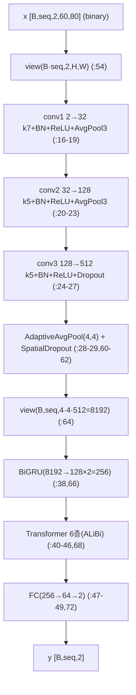
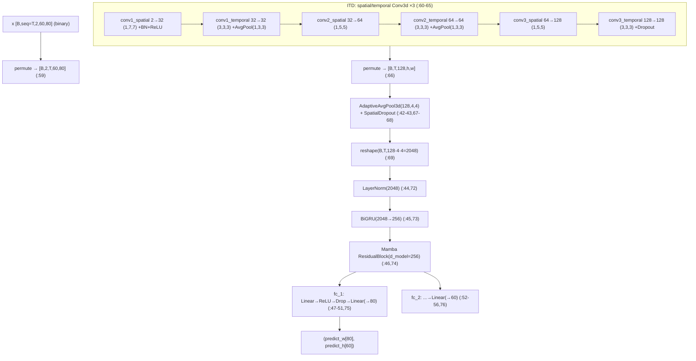

# ais2025 (AIS 2025 / CVPR 2025 Event-based Eye Tracking Challenge) 모듈 통합 가이드 (S-PyTorch)

> 1차 요약: [`../ais2025.md`](../ais2025.md) — 본 문서는 그 요약을 솔루션/모듈(클래스·함수) 단위로 심화한 S-PyTorch 변형 통합 가이드다. 형제 문서 [`../ais2024/MODULE_GUIDE.md`](../ais2024/MODULE_GUIDE.md)와 동형(同型) 구조.
> 분석 대상: `\\wsl.localhost\ubuntu-24.04\home\user\project\PRJXR-HBTXR\REF\XR-Eye-Tracking\Codebase\ais2025`
> 관련 챌린지: Event-based Eye Tracking Challenge @ CVPR 2025 Event-based Vision Workshop (AIS/3ET+ 계열). 데이터셋 3ET+ 2025(Kaggle `event-based-eye-tracking-cvpr-2025`).
> 관련 논문: [`../../Papers/TDTracker.md`](../../Papers/TDTracker.md) (3위 솔루션 원논문, arXiv:2503.23725).
> 작성 원칙: 실제 소스 Read 후 `파일:라인` 근거 표기. 라인 근거 없는 해석은 "추정", 코드로 확인 불가는 "확인 불가". 정확도(p-error/MSE/p10)는 README 자기보고 인용, 미실행 수치는 "확인 불가".

---

## 0. 문서 머리말

### 0.1 대표 케이스 선정 + 근거

본 repo는 **동일한 3ET+ 2025 입력·동일 메트릭(p-error/euclidean) 위에 3개 독립 솔루션**을 제공한다(공식 베이스라인 + 두 수상팀). 2024와 달리 세 솔루션 모두 **80×60 다운샘플 입력 + binary/voxel 표현 + 시퀀스 시간모델(GRU/Transformer/Mamba)**로 수렴한 점이 특징이다. 시간 동역학 모델링이 핵심 관심사이므로 1위(ALiBi Transformer)·3위(TDTracker, Mamba SSM)를 대표로, 진입점 베이스라인(CNN_GRU)을 함께 대표로 둔다.

- **대표 장기 시간모델: `CNN_GRU_base.Model` (1위, ALiBi Transformer)**
  - 근거: 3단 2D-CNN(ch 512) → **BiGRU(256) → ALiBi 상대위치 Transformer 6층**(`CNN_GRU_base.py:38-46`). `MultiHeadAttentionRelative`가 ALiBi forward/backward bias를 head 절반씩 분할해 양방향 시퀀스 모델링(`:155-187`). 절대 위치 임베딩 없이 가변 시퀀스 외삽에 강건. README "1st Solution"(`README.md:1`). leaderboard 1위(정확도 수치 README 미기재 → 확인 불가).
- **대표 스트리밍·SSM 모델: `TDTracker.Model` (3위, 3D-CNN+BiGRU+Mamba+SimDR)**
  - 근거: **spatial/temporal 분리 3D-CNN**(`TDTracker.py:14-36`) → BiGRU → **순수 PyTorch Mamba SSM**(`:46`, `MambaBlock` `:147-381`) → **SimDR per-axis 분류 head(x 80bin / y 60bin)**(`:47-56`). Mamba `step()`/`ssm_step()`가 상수시간 RNN형 추론 캐시 구현(`:317-381`) → 온디바이스 스트리밍 친화. README test MSE 1.5532 → 후처리 **1.4932**(`README.md:28-34`).
- **대표 베이스라인(진입점): `CNN_GRU` (공식 2025 베이스라인)**
  - 근거: 주최측 스타터킷. 3층 2D-CNN + 단일 GRU(hidden=128) + Linear(128→2)(`BaselineEyeTrackingModel.py:11-16`). 2024 베이스라인과 사실상 동일 구조. README 자기보고 Avg Euclidean Distance **7.91384**(RTX 4090 Mobile, `../ais2025.md:18` 인용).

> 정리: **장기 양방향 경로 = 1위(BiGRU+ALiBi Transformer)**, **선형복잡도 SSM·스트리밍 경로 = 3위 TDTracker(3D-CNN+BiGRU+Mamba+SimDR)**, **진입점 = CNN_GRU**. 세 솔루션이 동일 데이터/메트릭 위에 있어 공정 비교 기준선을 형성(6절 한눈표). 2024 대비 가장 큰 변화: (a) head가 회귀(2024 TENNs는 CenterNet) → 회귀(1위)/분류(3위)로 분기, (b) 시간모델이 Conv3d 스트리밍(2024) → Transformer/Mamba SSM(2025)로 이동, (c) Top-10 모델은 **Neurobench 메모리 풋프린트** 평가로 경량화가 명시 목표(`../ais2025.md:19`).

### 0.2 수치 표기 규약 (S-PyTorch)

- **params** = 레이어 차원에서 직접 산정. Conv2d/Conv3d = `Cout·Cin·∏k (+ Cout if bias)`. GRU = `3·(I·H + H·H + 2H)`, bidirectional이면 ×2. Linear = `in·out + out`. LayerNorm = `2·C`. Mamba: in_proj `D·2ED`, conv1d depthwise `ED·d_conv`, x_proj `ED·(dt_rank+2N)`, dt_proj `dt_rank·ED+ED`, A_log `ED·N`, D `ED`, out_proj `ED·D`(`TDTracker.py:154-193`).
- **MACs / FLOPs** = Conv = `Hout·Wout·Cout·Cin·∏k`(프레임당), Conv3d면 `Tout·Hout·Wout·Cout·Cin·∏k`. 시간 모델별로 처리 방식이 다름 — GRU/BiGRU는 **시간 step T 직렬 재귀**(GRU 내부), Transformer는 **시퀀스 전체 softmax attention O(T²·d)**(`CNN_GRU_base.py:184`, `scaled_dot_product_attention`), Mamba는 **선형 O(T·d·N) selective scan**(`TDTracker.py:283-287` 순차 for-loop 또는 `:255` pscan 병렬). TDTracker `__main__`에 fvcore `FlopCountAnalysis` 후크 내장(`:421-425`)으로 측정 가능하나 본 repo **미실행 → 절대치 확인 불가**(논문 자기보고 3.248M params / 318M FLOPs는 `TDTracker.md:50` 인용).
- **activation memory** = 텐서 `shape × bit`. 세 모델 모두 **시퀀스 전체를 메모리 보관**(TDTracker는 `(B,T,2,60,80)` 5D 입력 + Conv3d 중간 5D 텐서가 지배항, `TDTracker.py:58-65`). 2024 TENNs와 달리 FIFO 스트리밍 추론 경로는 **TDTracker Mamba step만** 제공(`:317-348`), CNN/GRU/Transformer 본체는 비스트리밍.
- **이벤트 표현** = (a) 베이스라인: Tonic **voxel grid**(Zhu 2019 event volume, 시간축 bilinear, `custom_transforms.py:8-65`), n_time_bins=3, 비인과. (b) 1위: **binary(이진 누적) 표현** — `EventSlicesToMap` map_type='binary'이 Tonic `to_frame_numpy`→`to_bina_rep_numpy(n_bits=4)`(`custom_transforms.py:310-322`), 2채널 고정 입력(`CNN_GRU_base.py:16`). (c) TDTracker: **오프라인 .h5로 binary 표현** — `ToFrame(sensor_size=(80,60,2), n_time_bins=4)`+`ToBinaRep(n_frames=1, n_bits=4)`(`3etplus.py:137-148`). 세 솔루션 모두 spatial_factor=0.125로 640×480 → **80×60** 공간 다운샘플.
- **시간 모델** = 베이스라인 **GRU(1층)**(`BaselineEyeTrackingModel.py:15`), 1위 **BiGRU + ALiBi Transformer(6층, head 4)**(`CNN_GRU_base.py:38-46`), TDTracker **BiGRU + Mamba SSM(d_model=256, d_state=16)**(`TDTracker.py:45-46`). 2024의 ConvLSTM(ERVT)·인과 Conv3d(TENNs)는 2025 3솔루션에 미사용.
- **정확도** = README 자기보고만 존재. 베이스라인 p-error 7.91384(`../ais2025.md:18`), TDTracker MSE 1.5532→후처리 1.4932(`tdtracker/README.md:28-34`), 1위 수치 README 미기재(leaderboard 1위만, **확인 불가**). 논문 TDTracker는 3ET+ 2025 p3=0.912/p5=0.972/p10=0.992/MSE 1.62→후처리 1.4936(`TDTracker.md:52`). **본 repo 미실행 → 절대 재현 수치는 "확인 불가", 자기보고 인용**.

### 0.3 운영 경로 (학습 ↔ 체크포인트 ↔ 평가)

```
[3ET+ 2025 raw event h5: (t,x,y,p), label 100Hz (x,y,close)]   (Kaggle)
      │  센서 640×480×2 (ThreeET_plus.py:36), p 0/1→-1/+1
      │
      ├─ [baseline] Tonic ThreeETplus_Eyetracking + Downsample(factor=0.125→80×60)
      │    label: ScaleLabel→TemporalSubsample(tsf=1, 100Hz 유지)→NormalizeLabel
      │    SliceByTimeEventsTargets → SliceLongEventsToShort → EventSlicesToVoxelGrid(n_bins=3)
      │    SlicedDataset→DiskCachedDataset 캐싱
      │      ▼
      │    CNN_GRU: 3×Conv2d(→32→64→32)+MaxPool→GRU(36192→128)→Linear(→2)
      │    loss: weighted_MSELoss(640/480,1)  Adam lr=1e-3, 20ep bs=20  (train_baseline.json)
      │      ▼
      │    test.py → ×(80,60) 환산 → submission.csv (tsf=1.0 강제)
      │
      ├─ [1위] 동일 Tonic 파이프라인 + EventSlicesToMap(map_type=binary, n_bits=4) + Jitter 증강
      │    label transform 동일(tsf=1) ; train_length=45, stride=10 (train.sh)
      │      ▼
      │    Model: conv(2→32→128→512)+BN+ReLU+AvgPool → AdaptiveAvgPool(4,4)=8192
      │         → BiGRU(8192→128×2=256) → ALiBi Transformer(6층,head4) → FC(256→64→2)
      │    loss: weighted_MSELoss  Adam + CosineAnnealingWarmRestarts(T0=8,Tm=2), 800ep bs=32, DataParallel
      │      ▼
      │    test.py: ×(640f,480f)·0.125/f 환산 → submission_test.csv + inference_time.txt(GPU 50회 warm-up 후 계측)
      │            tsf=0.2면 5-fold 보간 TTA 분기
      │
      └─ [3위 TDTracker] 오프라인 dataprocess/3etplus.py:
           10000us 슬라이딩 → ToFrame(80,60,2)+ToBinaRep(n_bits=4) → (T,2,60,80) binary
           오프라인 증강(train만): flip_x/flip_y/rotate(±15°) 4배 → train.h5/test.h5 저장
           group_size=100(seq), step_size 50(train)/100(test)
             ▼
           TDTracker.Model: [spatial Conv3d(1,k,k) + temporal Conv3d(3,3,3)]×3 (ch 2→32→64→128)
                → AdaptiveAvgPool3d(128,4,4)=2048 → LN → BiGRU(2048→256) → Mamba(ResidualBlock)
                → SimDR fc_1(→80)/fc_2(→60)
           loss: KLDiscretLoss(SimDR, 1D Gaussian heatmap + LogSoftmax+KLDiv)
           train.py: AdamW(2e-3, wd1e-4)+CosineAnnealingWarmRestarts(T0=8,Tm=2), 1000ep bs=16, TensorDataset 전체 RAM
             ▼
           test.py: decode_batch_sa_simdr(argmax bin→/80,/60 + softmax confidence) → submission.csv(x,y,gt,num_events,prob)
           post_process.py: prob<0.5·num_events_y<0.09(blink) 구간을 직전값으로 대체 → submission_postprocess.csv
```
- 체크포인트(`ckpt/final.pth`, `best_checkpoint.pth` 등)·pretrained weights(Google Drive/Baidu)는 [제외].

### 0.4 솔루션 / 데이터셋 / 정확도 요약

| 항목 | baseline (CNN_GRU) | 1위 (CNN_GRU_base) | 3위 TDTracker |
|---|---|---|---|
| 입력 표현 | voxel grid(n_bins=3, 비인과) | binary(n_bits=4, 2ch) | binary(n_bits=4, 2ch, 오프라인 .h5) |
| 공간 다운샘플 | ×8 → 80×60 (`train_baseline.json:11`) | ×8 → 80×60 (`train.sh:16`) | ×8 → 80×60 (`3etplus.py:139`) |
| 공간 백본 | 2D CNN 3층(→32) | 2D CNN 3층(→512)+BN+AvgPool | **3D CNN spatial/temporal 분리**(→128) |
| 시간 모델 | GRU(1층) | **BiGRU → ALiBi Transformer 6층** | **BiGRU → Mamba SSM** |
| head | Linear(128→2) 회귀 | Linear(256→64→2) 회귀 | **SimDR 분류(80+60 bin)** |
| loss | weighted_MSELoss | weighted_MSELoss | **KLDiscretLoss(KL-div)** |
| optimizer | Adam 1e-3, 20ep, bs=20 | Adam+CosWarmRestart, 800ep, bs=32 | AdamW 2e-3+CosWarmRestart, 1000ep, bs=16 |
| params(자기보고) | 확인 불가(산정 가능) | 확인 불가(CNN 512·Transformer 6층, 큼) | **3.248M**(논문, `TDTracker.md:50`) |
| 정확도(자기보고) | p-error 7.91384 | 미기재(leaderboard 1위) | MSE 1.5532→**1.4932**(후처리) |
| 학습 프레임워크 | argparse+MLflow+rich | argparse+sh+DataParallel | argparse+sh+TensorBoard |
| 메트릭 | p_acc / px_euclidean_dist | 동일 | 동일(+SimDR decode) |
| 스트리밍 추론 | 없음 | 없음 | **Mamba step() 상수시간 캐시** |

---

## 1. Repo / Layer 개요 (3 솔루션 맵)

ais2025 = 이벤트 카메라로 동공 중심 (x,y)를 회귀(베이스라인/1위) 또는 분류(3위)하는 **3가지 독립 솔루션**의 학습/평가 묶음. 모두 순수 PyTorch(HW 커널·CUDA 확장 없음; Mamba도 자체 PyTorch 구현). 서브프로젝트는 정확히 3개(Glob 확인).

### 1.1 파일 역할 맵

| 솔루션 | 파일 | 역할 | 메인 사용 |
|---|---|---|---|
| **baseline** | `3et_challenge_2025/model/BaselineEyeTrackingModel.py` | `CNN_GRU` 정의 | ★ `train.py:18` import |
| | `3et_challenge_2025/train.py` / `test.py` | Tonic 파이프라인·MLflow 학습 / csv 추론 | ★ 진입점 |
| | `3et_challenge_2025/utils/metrics.py` | p_acc·px_euclidean_dist·weighted_MSELoss | ★ |
| | `3et_challenge_2025/dataset/custom_transforms.py` | voxel grid·SliceByTime | ★ |
| **1위** | `Event-based-.../model/CNN_GRU_base.py` | `Model`/`Transformer`/`MultiHeadAttentionRelative`(ALiBi)/`SpatialDropout` | ★ `train.py:64` |
| | `Event-based-.../train.py` / `test.py` | DataParallel 학습 / csv+inference_time 추론 | ★ |
| | `Event-based-.../dataset/custom_transforms.py` | `EventSlicesToMap`(voxel/binary)·`Jitter` 증강 | ★ |
| | `Event-based-.../train.sh` / `test.sh` | 실행 하이퍼파라미터(binary, len45, 800ep) | ★ |
| **3위** | `tdtracker/models/TDTracker.py` | `Model`/`MambaBlock`/`ResidualBlock`/`fftlayer_temporal`/`MambaConfig` | ★ |
| | `tdtracker/metrics.py` | `KLDiscretLoss`(SimDR)·`decode_batch_sa_simdr`·p_acc | ★ |
| | `tdtracker/dataprocess/3etplus.py` | 오프라인 binary .h5 생성 + 증강 | ★ |
| | `tdtracker/train.py` / `test.py` / `post_process.py` | TensorBoard 학습 / csv 추론 / confidence·blink 후처리 | ★ |
| | `tdtracker/provider_data.py` | .h5 frames/label 로더 | ★ |
| **[제외]** | `ckpt/*.pth`, `vis_result/*`, `Fig/*`, `figures/*`, `cached_dataset/`, `metadata/`, `mlruns/`, `submission*.csv`, `.git/.idea/.vscode/` | 체크포인트·시각화·캐시·제출 | 제외 |

### 1.2 forward 진입점

- baseline: `model(x)` → `CNN_GRU.forward`(`:19`) → conv1/2/3+pool → `view(B,seq,-1)` → `gru` → `fc` → `[B,seq,2]`.
- 1위: `model(x)` → `Model.forward`(`CNN_GRU_base.py:51`) → conv1/2/3+pool+spatialdropout → `view(B,seq,-1)` → `gru` → `transformer` → `fc` → `[B,seq,2]`.
- 3위: `model(x)` → `Model.forward`(`TDTracker.py:57`) → `permute(0,2,1,3,4)` → spatial/temporal Conv3d×3 → `pool`+spatialdropout → `reshape(B,seq,-1)` → `layernorm`→`gru`→`mamba` → `(predict_w[80], predict_h[60])`. 추론 디코드는 `decode_batch_sa_simdr`(`metrics.py:151`).

### 1.3 제외 목록
- **외부 데이터/체크포인트**: 3ET+ 2025 h5 원본, SEET 데이터, `ckpt/final.pth`, `best_checkpoint.pth`, Google Drive/Baidu pretrained weights.
- **외부 프레임워크 원본**: torch/tonic/mlflow/tensorboard/open3d/scipy/fvcore(import만). Mamba는 외부 mamba_ssm이 아닌 **자체 PyTorch 구현**(`TDTracker.py:147-419`)이라 분석 포함.
- **보조/시각화**: `visualize.py`, `vis_result/`, `Fig/`, `figures/`, `dataprocess/seet.py`(SEET 전처리, 3ET+와 동형이라 본문 생략).
- **미열람 래퍼**: `ThreeET_plus.py` Tonic 래퍼 본문은 `../ais2025.md:12,55`의 요약(센서 640×480×2, p→-1/+1, split txt)으로 대체.

---

## 2. 솔루션: baseline — `CNN_GRU` (CNN + GRU)

### 2.1 역할 + 상위/하위
- **역할**: voxel grid 시퀀스를 프레임 독립 2D-CNN으로 특징 추출 → 시간축으로 펼쳐 단일 GRU에 투입 → 프레임별 (x,y) 회귀. 공간은 conv, 시간은 GRU 재귀. 2024 베이스라인과 사실상 동일.
- **상위**: `train.py`의 학습/검증 루프가 `model(x)` 호출. **하위**: `nn.Conv2d`×3, `nn.MaxPool2d`, `nn.GRU`, `nn.Linear`.

### 2.2 데이터플로우 (텐서 shape · 시간축)

```mermaid
flowchart LR
  IN["x [B,seq,C=n_bins,H,W]"] --> RS["view(B·seq,C,H,W) + permute H/W (:22-24)"]
  RS --> C1["conv1 C→32 + ReLU (:11,26-27)"]
  C1 --> C2["conv2 32→64 + ReLU (:12,28-29)"]
  C2 --> C3["conv3 64→32 + ReLU (:13,30-31)"]
  C3 --> P["MaxPool2d(3,2) (:14,32)"]
  P --> FL["view(B,seq,-1) → 36192 (:34)"]
  FL --> G["GRU(36192→128) (:15,35)"]
  G --> FC["Linear(128→2) (:16,38)"]
  FC --> Y["y [B,seq,2]"]
```

> 주: GRU 입력 36192는 pool 후 spatial×channel flatten 값을 **하드코딩**(`:15`). 해상도/채널 변경 시 깨짐(7절 한계). 입력 `permute(0,1,3,2)`(`:24`)로 H/W를 교차 — 의도 주석 없음(추정). n_time_bins=3(`train_baseline.json:22`)이 입력 채널.

### 2.3 forward call stack
```
model(x) → CNN_GRU.forward (:19)
├─ x.view(B·seq,C,H,W).permute(0,1,3,2) (:22-24)
├─ relu(conv1)→relu(conv2)→relu(conv3)→pool (:26-32)
├─ x.view(B,seq,-1) (:34)
├─ x,_ = self.gru(x) (:35)
└─ self.fc(x) → [B,seq,2] (:38)
```

### 2.4 대표 코드 위치
`BaselineEyeTrackingModel.py:11-16`(레이어 정의), `:19-40`(forward).

### 2.5 대표 코드 블록

**(a) 레이어 정의 — GRU 입력 하드코딩 (`:11-16`)**
```python
self.conv1 = nn.Conv2d(args.n_time_bins, 32, kernel_size=3, stride=1, padding=1)
self.conv2 = nn.Conv2d(32, 64, kernel_size=3, stride=1, padding=1)
self.conv3 = nn.Conv2d(64, 32, kernel_size=3, stride=1, padding=1)
self.pool = nn.MaxPool2d(kernel_size=3, stride=2)
self.gru = nn.GRU(input_size=36192, hidden_size=128, num_layers=1, batch_first=True)
self.fc = nn.Linear(128, 2)
```
→ pool 후 flatten = 36192 하드코딩(80×60·factor·3채널·conv·pool 조합 산물, 정확 산식 코드 부재 → 확인 불가). 2024와 동일한 하드코딩 한계.

**(b) 시간축 GRU 처리 (`:34-38`)**
```python
x = x.view(batch_size, seq_len, -1)   # [B,seq,36192]
x, _ = self.gru(x)                     # [B,seq,128]  GRU 내부에서 seq 직렬 재귀
x = self.fc(x)                         # [B,seq,2]
```
→ CNN은 프레임 독립(배치차원으로 펼침, `:22`), 시간 종속성은 GRU가 흡수. GRU h0 미지정 → 0초기화(stateful 미구현, 비스트리밍).

### 2.6 연산 분해 + 정량
- **params**(차원 산정, n_bins=3): conv1 `3·32·9+32`=896; conv2 `32·64·9+64`=18,496; conv3 `64·32·9+32`=18,464. GRU `3·(36192·128 + 128·128 + 2·128)`=13,946,880(지배항). fc `128·2+2`=258. **합 ≈ 13.98M** → GRU 입력 36192 하드코딩 때문에 GRU가 전체 params의 99.7% 차지(자기보고 params 없음 → 확인 불가, 차원 산정치). 2024 동일 산정.
- **MAC/프레임**: conv ≈ `Hp·Wp` 의존 + GRU `3·(36192·128+128²)≈13.9M/프레임`(지배항).
- **activation**: voxel grid 입력 `[B,seq,3,80,60]` + GRU 시퀀스 텐서. 베이스라인이라 최적화 없음.
- **학습 설정**: lr=1e-3, 20ep, bs=20, weighted_MSELoss(640/480,1), tsf=1(100Hz 유지)(`train_baseline.json:8-24`, `train.py:140`). val_interval=2, best val_loss 저장(`train.py:42,82`).

---

## 3. 솔루션: 1위 — `CNN_GRU_base.Model` (CNN + BiGRU + ALiBi Transformer)

### 3.1 역할 + 상위/하위
- **역할**: binary 표현 시퀀스를 강화된 2D-CNN(ch 512)으로 특징 추출 → BiGRU로 양방향 단기 시간문맥 → **ALiBi 상대위치 Transformer 6층**으로 장기 양방향 시간 모델링 → FC로 프레임별 (x,y) 회귀. 절대 위치 임베딩 없이 ALiBi bias만으로 시퀀스 길이 외삽.
- **상위**: `train.py:64`가 `importlib`로 `model.CNN_GRU_base.Model(args)` 생성 후 `nn.DataParallel`(`:65`), 학습 루프가 `model(data)`. **하위**: `nn.Conv2d`×3(BN/ReLU/AvgPool/Dropout), `AdaptiveAvgPool2d`, `SpatialDropout`, `nn.GRU(bidirectional)`, `Transformer`(→`MultiHeadAttentionRelative`, `nn.LayerNorm`, GELU-MLP), `fc`.

### 3.2 데이터플로우 (텐서 shape · 시간축)

> 주: 입력 채널 **2 고정**(`:16`) — binary 표현의 2 폴라리티(map_type=binary, `test.sh:17`)와 정합. n_time_bins=4는 binary n_bits로만 쓰이고 입력 채널과 무관. 주석에 `# self.mamba`(`:39`)·EfficientNet encoder(`:30-35`) 잔재 → **Mamba/EfficientNet은 실험 후 비활성, 최종 Transformer 채택**(확인).

### 3.3 forward call stack
```
model(data) → Model.forward (:51)
├─ x.view(B·seq,2,H,W) (:54)
├─ conv1→conv2→conv3→pool→spatialdropout (:57-62)
├─ x.view(B,seq,8192) (:64)
├─ x,_ = self.gru(x)  # BiGRU → 256 (:66)
├─ x = self.transformer(x)  # Transformer.forward (:68,221)
│   └─ for layer in 6: LN1→attn(ALiBi)→residual ; LN2→GELU-MLP→residual (:223-232)
│       └─ MultiHeadAttentionRelative.forward (:170)
│           ├─ q/k/v linear proj (:173-175)
│           ├─ ALiBi bias_forward/backward (:178-182)
│           └─ scaled_dot_product_attention(attn_mask=bias) (:184)
└─ x = self.fc(x) → [B,seq,2] (:72)
```

### 3.4 대표 코드 위치
`CNN_GRU_base.py:11-73`(Model), `:104-112`(ALiBi 헬퍼), `:155-192`(MultiHeadAttentionRelative), `:194-234`(Transformer), `:75-103`(SpatialDropout).

### 3.5 대표 코드 블록

**(a) CNN 백본 (ch 512) + binary 2채널 입력 (`:16-29`)**
```python
self.conv1 = nn.Sequential(nn.Conv2d(2, 32, 7, padding=3), nn.BatchNorm2d(32), nn.ReLU(), nn.AvgPool2d(3))
self.conv2 = nn.Sequential(nn.Conv2d(32, 128, 5, padding=2), nn.BatchNorm2d(128), nn.ReLU(), nn.AvgPool2d(3))
self.conv3 = nn.Sequential(nn.Conv2d(128, 512, 5, padding=2), nn.BatchNorm2d(512), nn.ReLU(), nn.Dropout())
self.pool = nn.AdaptiveAvgPool2d((4, 4))   # → 4·4·512 = 8192
```
→ 베이스라인(ch 32) 대비 BN·AvgPool 추가 + ch 16배 확대. AvgPool3 두 번 + AdaptiveAvgPool(4,4)로 공간 강제 4×4 고정 → flatten 8192 안정. `:15`에 죽은 첫 conv1 정의(즉시 `:16`이 덮어씀) — 가독성 저하.

**(b) BiGRU → Transformer 직렬 (`:38-46, 66-68`)**
```python
self.gru = nn.GRU(input_size=4*4*512, hidden_size=128, num_layers=1, batch_first=True, bidirectional=True)  # → 256
self.transformer = Transformer(num_heads=4, num_layers=6, attn_size=256//4, dropout_rate=0., widening_factor=4)
...
x, _ = self.gru(x)          # [B,seq,256]
x = self.transformer(x)     # [B,seq,256]
```
→ BiGRU(양방향 256) 출력을 Transformer model_size(attn_size·num_heads = 64·4 = 256)로 그대로 투입. BiGRU가 국소 시간문맥, Transformer가 전역 시간문맥 담당(추정).

**(c) ALiBi 상대위치 bias — 양방향 분할 (`:104-112, 178-184`)**
```python
def get_relative_positions(seq_len, reverse=False):
    x = arange(seq_len)[None,:]; y = arange(seq_len)[:,None]
    return tril(x - y) if not reverse else triu(y - x)
def get_alibi_slope(num_heads):
    x = (24) ** (1/num_heads)
    return tensor([1/x**(i+1) for i in range(num_heads)]).view(-1,1,1)
...
bias_forward = get_alibi_slope(H//2) * get_relative_positions(L)            # 인과(과거)
bias_forward += triu(full_like(bias_forward, -1e9), diagonal=1)            # 미래 마스킹
bias_backward = get_alibi_slope(H//2) * get_relative_positions(L, reverse=True)  # 역인과(미래)
bias_backward += tril(full_like(bias_backward, -1e9), diagonal=-1)          # 과거 마스킹
attn_bias = cat([bias_forward, bias_backward], dim=0)                       # head 절반씩
attn = F.scaled_dot_product_attention(q, k, v, attn_mask=attn_bias, scale=1/sqrt(key_size))
```
→ head 4개 중 절반은 forward(과거만 attend), 절반은 backward(미래만 attend) → **양방향 ALiBi**. 절대 위치 임베딩 불필요, 가변 길이/외삽 강건(추정). slope base 24는 표준 ALiBi(2^...)와 다른 커스텀 값.

**(d) Transformer 블록 (pre-LN) (`:221-234`)**
```python
for layer in self.layers:           # 6층
    h_norm = layer['layer_norm1'](h); h_attn = layer['attn'](h_norm,h_norm,h_norm); h = h + h_attn
    h_norm = layer['layer_norm2'](h); h_dense = layer['dense'](h_norm); h = h + h_dense  # GELU-MLP ×4 widening
return self.ln_out(h)
```
→ pre-LN Transformer, MLP widening_factor=4(256→1024→256). dropout_rate=0(`:44`)이라 추론·학습 동일. softmax attention(`:184` SDPA) + LayerNorm 다수 → FPGA 비용 큰 비선형(8절).

### 3.6 연산 분해 + 정량
- **params**(차원 산정): conv1 `2·32·49+32`≈3,168; conv2 `32·128·25`≈102K(+BN); conv3 `128·512·25`≈1.64M(지배). BiGRU `2·3·(8192·128+128²+2·128)`≈6.39M(지배). Transformer 1층 ≈ qkvo 4×(256·256)+MLP 2×(256·1024) ≈ 0.79M, ×6 ≈ 4.7M. fc `256·64+64·2`≈16K. **합 추정 ≈ 13M+급**(자기보고 없음 → 확인 불가; CNN 512·BiGRU·Transformer 6층으로 3솔루션 중 최대로 추정).
- **MAC/추론**: 측정 인프라 없음(test.py가 wall-clock만 계측). Transformer attention은 **O(seq²·d)** — seq=45(`train.sh:11`)면 작지만 d=256이라 6층 누적. **확인 불가**(미실행).
- **시간 모델링**: BiGRU는 양방향 직렬 재귀(병렬화 제한), Transformer는 시퀀스 전체 병렬(softmax). **비스트리밍**(시퀀스 일괄 처리).
- **latency**: test.py가 GPU 50회 warm-up 후 wall-clock 측정 → `inference_time.txt`(`test.py:145-147,192-194`). 절대치 README 미기재(2080Ti/2080Ti, `README.md:19`) → **확인 불가**.
- **정확도**: README 미기재, leaderboard 1위만(`README.md:1`) → **확인 불가**.

---

## 4. 솔루션: 3위 TDTracker — `TDTracker.Model` (3D-CNN + BiGRU + Mamba SSM + SimDR)

### 4.1 역할 + 상위/하위
- **역할**: binary 표현 `(B,2,T,60,80)`를 **spatial/temporal 분리 3D-CNN**(ITD, 암묵 시간동역학)으로 시공간 특징 추출 → BiGRU → **Mamba SSM**(ETD, 명시 시간동역학)으로 장기 선형복잡도 시간 모델링 → **SimDR per-axis 분류 head**(x 80bin / y 60bin)로 동공 위치 산출. 좌표 회귀가 아닌 1D heatmap 분류 + argmax 디코드.
- **상위**: `train.py:171`이 `Model(args)` 생성, 학습 루프가 `net(frame)`로 `(predict_w, predict_h)` 수령 후 `KLDiscretLoss`(`metrics.py:104`). **하위**: `nn.Conv3d`×6(spatial/temporal, BN3d/ReLU/AvgPool3d), `AdaptiveAvgPool3d`, `SpatialDropout`, `nn.LayerNorm`, `nn.GRU(bidirectional)`, `ResidualBlock`(→`MambaBlock`→`RMSNorm`), `fc_1`/`fc_2`.

### 4.2 데이터플로우 (텐서 shape · 시간축)

> 주: spatial conv는 `(1,k,k)`로 시간축 보존, temporal conv는 `(3,3,3)`로 시간 혼합 — 시공간 분해(논문 ITD, `TDTracker.md:32-36`). `fftlayer_temporal`(Frequency-aware, `:38-39,79-89`)는 forward에서 **주석처리 → 미사용**(`:70-71`; 논문에서도 챌린지엔 제거, `TDTracker.md:58`). group_size=100(seq 길이, `3etplus.py:262`).

### 4.3 forward call stack
```
[학습] net(frame) → Model.forward (:57)
├─ x.permute(0,2,1,3,4)  # (B,2,T,H,W) (:59)
├─ conv1_spatial→conv1_temporal→...→conv3_temporal (:60-65)
├─ x.permute(0,2,1,3,4) → pool(128,4,4) → spatialdropout (:66-68)
├─ x.reshape(B,T,2048) → layernorm → gru (:69,72-73)
├─ x = self.mamba(x)  # ResidualBlock.forward (:74,402)
│   └─ MambaBlock.forward (:195): in_proj→conv1d(depthwise)→silu→ssm→gate(silu z) → out_proj
│       └─ ssm (:219): x_proj→split(Δ,B,C)→softplus(Δ) → selective_scan_seq (:263)
│           └─ for t in range(L): h = deltaA[t]·h + BX[t] (:283-285)  # 순차 스캔
└─ predict_w=fc_1(x), predict_h=fc_2(x) → ([B,T,80],[B,T,60]) (:75-77)

[추론 디코드] decode_batch_sa_simdr (metrics.py:151)
├─ preds_x = output_x.max(2) ; preds_y = output_y.max(2)  # argmax bin (:153-154)
├─ avg_pool1d + softmax → confidence prob = x_prob + y_prob (:155-161)
└─ output[...,0]=preds_x/80 ; output[...,1]=preds_y/60 → (output, prob) (:162-166)
```

### 4.4 대표 코드 위치
`TDTracker.py:14-77`(Model), `:147-294`(MambaBlock 학습 경로), `:317-381`(Mamba step/ssm_step 추론 캐시), `:395-419`(ResidualBlock), `metrics.py:104-149`(KLDiscretLoss), `:151-166`(decode), `post_process.py:15-49`(후처리).

### 4.5 대표 코드 블록

**(a) spatial/temporal 분리 3D-CNN (`TDTracker.py:14-28`)**
```python
self.conv1_spatial  = Sequential(Conv3d(2, 32, (1,7,7), padding=(0,3,3)), BN3d(32), ReLU())
self.conv1_temporal = Sequential(Conv3d(32, 32, (3,3,3), padding=(1,1,1), bias=False), BN3d(32), ReLU(), AvgPool3d((1,3,3)))
self.conv2_spatial  = Sequential(Conv3d(32, 64, (1,5,5), padding=(0,2,2)), BN3d(64), ReLU())
self.conv2_temporal = Sequential(Conv3d(64, 64, (3,3,3), padding=(1,1,1), bias=False), BN3d(64), ReLU(), AvgPool3d((1,3,3)))
# stage3: 64→128 (1,5,5) + (3,3,3)+Dropout
```
→ spatial `(1,k,k)`는 시간축 stride/kernel 1로 프레임 독립 공간 추출, temporal `(3,3,3)`은 시간 3-tap 혼합. AvgPool `(1,3,3)`은 공간만 ⅓ 다운샘플(시간 보존). 시간 차원 T=100은 끝까지 유지 → SSM에 전달. 논문 ITD(`TDTracker.md:32-36`).

**(b) Mamba selective scan (순차) — 학습 경로 (`:263-293`)**
```python
deltaA = exp(delta.unsqueeze(-1) * A)          # (B,L,ED,N) ZOH 이산화
deltaB = delta.unsqueeze(-1) * B.unsqueeze(2)
BX = deltaB * x.unsqueeze(-1)
h = zeros(B, d_inner, d_state)
for t in range(0, L):                          # 순차 스캔(파이썬 for-loop)
    h = deltaA[:, t] * h + BX[:, t]            # h_t = Ā·h_{t-1} + B̄·x_t
    hs.append(h)
y = (stack(hs) @ C.unsqueeze(-1)).squeeze(3) + D * x   # y_t = C·h_t + D·x_t
```
→ Mamba SSMv6 선형순환. `config.pscan=False`(`:139`)라 학습 시 순차 for-loop(`:236` 분기) — GPU 비효율(7절). `A = -exp(A_log)`(`:224`)로 안정 음수, `delta = softplus(...)`(`:231`). 외부 mamba_ssm 커널 의존 없는 순수 PyTorch(이식 시 유리, 8절).

**(c) Mamba step() — 상수시간 RNN형 추론 캐시 (`:317-348`)**
```python
def step(self, x, cache):       # x:(B,D)  cache:(h, inputs)
    h, inputs = cache
    xz = self.in_proj(x); x, z = xz.chunk(2, dim=1)
    x_cache = x.unsqueeze(2)
    x = self.conv1d(cat([inputs, x_cache], dim=2))[:, :, d_conv-1]   # 마지막 d_conv-1 입력만 캐시
    x = F.silu(x); y, h = self.ssm_step(x, h)                         # h만 갱신, O(1) wrt seq
    output = self.out_proj(y * F.silu(z))
    inputs = cat([inputs[:, :, 1:], x_cache], dim=2)                  # FIFO 시프트
    return output, (h, inputs)
```
→ hidden state `h:(B,ED,N)` + conv 입력 `inputs:(B,ED,d_conv-1)`만 유지 → **시퀀스 길이 무관 상수시간** 추론. conv1d 입력 캐시가 2024 TENNs FIFO와 동형(시프트레지스터). 단 본 repo 추론(`test.py`)은 step()이 아닌 시퀀스 일괄 forward 사용 — step은 스트리밍 인프라로만 존재(8절).

**(d) SimDR KLDiscretLoss + decode (`metrics.py:104-166`)**
```python
# loss: GT 좌표 → 1D Gaussian heatmap(variance=1.0) → LogSoftmax+KLDiv
target_x = exp(-((x - coord_x_gt)^2)/(2·var^2)) / (var·sqrt(2π))    # x∈[0,80) (:143)
loss += criterion(LogSoftmax(coord_x_pred), normalize(target_x))     # KLDivLoss (:147)
# decode: argmax + softmax confidence
preds_x = output_x.max(2)                                            # bin argmax (:153)
prob = softmax(avgpool1d(output_x)).max() + softmax(avgpool1d(output_y)).max()  # confidence (:155-161)
output[...,0]=preds_x/80 ; output[...,1]=preds_y/60                  # 정규화 좌표 (:163-164)
```
→ 회귀(MSE) 대신 80/60 bin 이산 분류 → argmax로 정수 bin + 1D Gaussian soft label로 KL-div 학습. confidence(prob)를 부산물로 얻어 후처리 게이팅에 활용(아래 e).

**(e) post_process — confidence·blink 대체 (`post_process.py:15-34`)**
```python
mask = df['prob'].values < 0.5                       # 저신뢰
for j in where(mask): outputs[j] = outputs[직전 신뢰 샘플]   # hold
mask = binary_dilation(df['num_events_y'] < 0.09, iterations=2)  # 눈감음(상/하 이벤트비) (:26-28)
for j in where(mask): outputs[j] = outputs[직전 정상 샘플]
```
→ SimDR confidence<0.5 + 눈감음 추정(상반/하반 이벤트 비율 num_events_y<0.09) 구간을 직전값으로 hold. README MSE 1.5532 → **1.4932**(`README.md:28-34`). num_events_y는 `3etplus.py:125-128`에서 y<30/y≥30 영역 이벤트 비율로 산출.

### 4.6 연산 분해 + 정량
- **params**: 논문 자기보고 **3.248M**(SEET 60×80, `TDTracker.md:50`). 본 repo 차원 산정: Conv3d 6개(2→32→64→128, `(1,5/7,5/7)`+`(3,3,3)`) + BiGRU `2·3·(2048·128+128²+2·128)`≈1.66M(지배) + Mamba(d_model=256, d_inner=512, d_state=16): in_proj `256·1024`≈262K, x_proj/dt_proj/out_proj 등 ≈ 0.5M + fc_1/fc_2 각 `256·128+128·80/60`≈42K. **합 ≈ 논문 3.248M과 정합**(repo 미실행 절대치 → 확인 불가, 논문 인용).
- **FLOPs**: 논문 **318M**(SEET, `TDTracker.md:50`). repo `TDTracker.py:421-425`에 fvcore `FlopCountAnalysis` 후크 내장(입력 `(1,1,2,60,80)`) → 측정 가능하나 미실행 → **확인 불가**.
- **시간 모델링 복잡도**: Mamba selective scan **O(T·ED·N)** 선형(`:283-287`) — Transformer O(T²·d) 대비 장기 시퀀스(T=100) 유리. 학습은 순차 for-loop(GPU 비효율), 추론은 step() O(1)/step 가능.
- **activation memory**: 학습 `(B,T=100,2,60,80)` + Conv3d 중간 `(B,C,T,h,w)` 5D 지배. TensorDataset 전체 RAM 로드(`train.py:158-166`)도 메모리 부담(7절).
- **정확도**: README MSE 1.5532→1.4932(`README.md:28-34`). 논문 3ET+ 2025 p3=0.912/p10=0.992/MSE 1.62→1.4936(`TDTracker.md:52`), inference 1.7923ms(RTX 4090). repo 미실행 → 자기보고 인용.

---

## 5. 솔루션: 이벤트 데이터 파이프라인 (3종 비교)

### 5.1 baseline — Tonic voxel grid (`3et_challenge_2025/custom_transforms.py`)
- **역할**: raw event를 시간창 슬라이싱(`SliceByTimeEventsTargets`, `:67-`) → 짧은 윈도우(`SliceLongEventsToShort`) → voxel grid(`custom_to_voxel_grid_numpy`, `:8-65`).
- **voxel 변환 (`:24-65`)**: 시간축 정규화 후 bilinear 보간(`vals_left = pols·(1-dts)`, `vals_right = pols·dts`, `:40-41`), 극성 0→-1(`:36`). n_time_bins=3(`train_baseline.json:22`), per_channel_normalize=false(`:23`). **비인과**(시간창 내 voxel).
- **슬라이싱 산식**(`train.py`-측, 동형 1위 `train.py:99`): `slicing_time_window = train_length·(10000/tsf)`. tsf=1이라 100Hz 라벨 정렬, 프레임당 10000us=10ms.

### 5.2 1위 — EventSlicesToMap binary (`Event-based-.../custom_transforms.py:282-334`)
- **역할**: voxel 또는 binary 표현 선택(`map_type`). 실제 실행은 **binary**(`test.sh:17`, `train.sh:17`).
- **binary 변환 (`:310-322`)**:
  ```python
  ev_map = tof.to_frame_numpy(event_slice, sensor_size, n_time_bins=self.n_time_bins)
  ev_map = tof.to_bina_rep_numpy(ev_map, n_frames=1, n_bits=self.n_time_bins)   # n_bits=4 → 2채널 비트인코딩
  ```
  → n_bits=4 binary 누적(`train.sh:8`). 빈 슬라이스 예외 시 직전 map 재사용(`:316-319`). 2채널(극성) 고정 → `CNN_GRU_base.py:16` 입력 2와 정합.
- **증강 `Jitter`(train만, DiskCachedDataset transforms 주입, `train.py:117`)**: x/y circular shift(±10px), x/y flip(라벨 1-x), t shift(±3), random cutout(`:175-223`). mix_flag patch-mixup은 `mix_flag=None`(`:168`)이라 미사용(`:244-275` 데드코드).
- **슬라이싱**: `SliceByTimeEventsTargets`(2024 동형, `:14-129`), train_length=45/stride=10(`train.sh:10-13`).

### 5.3 TDTracker — 오프라인 binary .h5 (`tdtracker/dataprocess/3etplus.py`)
- **역할**: 학습 전 오프라인으로 .h5 생성(런타임 Tonic 슬라이싱 없음). `walk_and_process`(`:202`) → `process`(10000us 슬라이딩, `:74-105`) → `transform`(`:114-172`).
- **binary 변환 (`:137-148`)**:
  ```python
  transform = Compose([ToFrame(sensor_size=(80,60,2), n_time_bins=4), ToBinaRep(n_frames=1, n_bits=4)])
  frame = transform(events_tonic)   # → (1,2,60,80) → squeeze → (2,60,80)
  ```
  → 1위와 동일 binary(n_bits=4) 표현이나 **오프라인 사전계산**. group_size=100/step_size 50(train)·100(test)(`:262-269`)으로 시퀀스 묶음.
- **오프라인 증강(train만, `:235-255`)**: flip_x(`:174`), flip_y(`:181`), rotate(±15°, `:188`) → 원본+3증강 = 4배 확장. 라벨 좌표 동시 변환.
- **눈감음 라벨 정제(`:55-70`)**: 연속 동일좌표면 close=1로 간주 → 후처리(num_events_y) 근거.
- **num_events 산출(`:125-128`)**: y<30(상)·y≥30(하) 이벤트 비율 ratio 기록 → post_process blink 게이팅 입력.

### 5.4 3종 이벤트 표현 비교표

| 솔루션 | 표현 | 변환 위치 | 인과성 | 다운샘플 | 정규화/증강 |
|---|---|---|---|---|---|
| baseline | voxel grid(n_bins=3) | `custom_transforms.py:8-65` | 비인과 | ×8→80×60 | per-ch off, 증강 없음 |
| 1위 | binary(n_bits=4, 2ch) | `custom_transforms.py:310-322` | 비인과(런타임) | ×8→80×60 | per-ch off, Jitter(shift/flip/cutout) |
| TDTracker | binary(n_bits=4, 2ch) | `3etplus.py:137-148` | 비인과(오프라인) | ×8→80×60 | 오프라인 flip/rotate 4배 |

→ 상위 2솔루션이 **binary 표현으로 수렴**(2024 voxel/event-frame 대비) → 노이즈 강건성·정수 비트 표현 선호(추정).

---

## 6. 솔루션 비교 한눈표

| # | 솔루션 | 모델 파일:라인 | 공간 백본 | 시간 모델 | head | loss | 정량(자기보고) | 메인 결선 |
|---|---|---|---|---|---|---|---|---|
| 2 | baseline CNN_GRU | `BaselineEyeTrackingModel.py:4-40` | 2D CNN 3층(→32) | GRU(1층) | Linear(128→2) 회귀 | weighted_MSE | p-error 7.91 / params≈13.98M(산정) | ★ 진입점 |
| 3 | 1위 Model | `CNN_GRU_base.py:11-73` | 2D CNN 3층(→512)+BN | **BiGRU + ALiBi Transformer 6층** | Linear(256→64→2) 회귀 | weighted_MSE | leaderboard 1위(수치 없음) | ★ 장기 양방향 |
| 3.5 | MultiHeadAttentionRelative | `CNN_GRU_base.py:155-192` | — | ALiBi forward/backward bias | — | — | head 절반씩 양방향 | ★ |
| 3.6 | Transformer | `CNN_GRU_base.py:194-234` | — | pre-LN 6층 + GELU-MLP ×4 | — | — | dropout 0 | ★ |
| 4 | 3위 TDTracker | `TDTracker.py:9-77` | **3D CNN spatial/temporal 분리(→128)** | **BiGRU + Mamba SSM** | **SimDR 분류(80+60)** | KLDiscretLoss | **MSE 1.5532→1.4932 / 3.248M(논문)** | ★ SSM·스트리밍 |
| 4.5 | MambaBlock | `TDTracker.py:147-294` | — | selective scan(순차/pscan) | — | — | d_model=256, N=16 | ★ |
| 4.6 | Mamba step() | `TDTracker.py:317-381` | — | 상수시간 RNN 캐시 | — | — | h+conv FIFO | ★ 스트리밍 |
| 5.1 | voxel 파이프라인 | `custom_transforms.py:8-65` | — | — | — | — | n_bins=3 | ★ baseline |
| 5.2 | EventSlicesToMap binary | `custom_transforms.py:282-334` | — | — | — | — | n_bits=4, 2ch | ★ 1위 |
| 5.3 | 오프라인 binary .h5 | `3etplus.py:114-172` | — | — | — | — | flip/rotate 4배 | ★ TDTracker |

---

## 7. 학습 · 평가 파이프라인 + 재현 명령

### 7.1 학습 루프
- **baseline**(`train.py`): Adam lr=1e-3, weighted_MSELoss(640/480,1)(`train.py:140`), 20ep bs=20(`train_baseline.json:8-10`), tsf=1. MLflow+rich 로깅. val_interval=2, best val_loss 저장(`train.py:42,82`). DiskCachedDataset 캐싱.
- **1위**(`train.py`): Adam lr=1e-3 + **CosineAnnealingWarmRestarts(T_0=8, T_mult=2, eta_min=1e-6)**(`:29`), weighted_MSELoss(`:73-75`), 800ep bs=32(`train.sh:6,9`), **nn.DataParallel**(`:65`). train_length=45/stride=10(`train.sh:10-13`). **best는 val p_error 최소** 기준(`:37-42`). 종료 후 자동 test 호출(`:132-137`).
- **TDTracker**(`train.py`): **AdamW(lr=2e-3, wd=1e-4)**(`:178`) + CosineAnnealingWarmRestarts(T_0=8, T_mult=2)(`:179`), KLDiscretLoss(`:172`), 1000ep bs=16(`:36,31`). TensorDataset 전체 RAM 로드(`:158-166`), TensorBoard. best val p_error 최소 저장(`:194-199`).

### 7.2 평가 메트릭
- **3솔루션 공통**(각 `metrics.py`, 동일 시그니처): `p_acc`(pₜ = dist<tolerance 비율, `:6-30`), `px_euclidean_dist`(평균 거리=p-error, `:66-86`), `p_acc_wo_closed_eye`(blink dist=inf, `:33-63`). 좌표 환산은 `width_scale=640·0.125=80`, `height_scale=480·0.125=60`(`train.py:64-65`).
- **TDTracker 추가**: `decode_batch_sa_simdr`(SimDR argmax bin→/80,/60 + softmax confidence, `metrics.py:151-166`). pixel_tolerances=[1,3,5,10,15](`train.py:35`).
- **공식 순위 메트릭**: **Average Euclidean Distance(p-error)**(`../ais2025.md:16`). 베이스라인은 pixel_tolerances=[5,10,15](`train_baseline.json:15`). Top-10은 **Neurobench 메모리 풋프린트** 추가 평가(`../ais2025.md:19`).

### 7.3 재현 명령 (README/sh 근거)
```bash
# baseline (3et_challenge_2025)
python train.py --config train_baseline.json                          # ../ais2025.md:58
python test.py --config test_config.json --checkpoint <PATH>           # (tsf=1.0 강제)

# 1위 (Event-based-Eye-Tracking-Challenge-Solution)
./train.sh    # binary, len45/stride10, 800ep, bs32, DataParallel device7  (train.sh)
./test.sh     # ckpt/final.pth, GPU warm-up 후 inference_time.txt          (test.sh)

# 3위 TDTracker (tdtracker)
cd dataprocess; python 3etplus.py   # 오프라인 binary .h5 생성 (README:18)
python train.py                     # AdamW 2e-3, 1000ep, TensorBoard
python test.py                      # MSE 1.5532, submission.csv(prob 포함)
python post_process.py              # MSE 1.4932, submission_postprocess.csv
```
- 데이터셋: 3개 모두 3ET+ 2025(Kaggle `event-based-eye-tracking-cvpr-2025`). baseline/1위는 Tonic `ThreeETplus_Eyetracking` 래퍼 + 런타임 슬라이싱, TDTracker는 오프라인 .h5 사전계산(`provider_data.load_h5_f`). TDTracker는 SEET(`dataprocess/seet.py`) 병용 가능. 1위는 dataset=`t_v`(train+val 합집합 추정, `train.sh:18`).

---

## 8. 우리 프로젝트(XR + FPGA 저지연) 시사점 + HW 이식성

### 8.1 백본 FPGA 친화도 순위 (추정 + 코드 근거)
- **TDTracker Mamba/SSM = FPGA 이식 1순위 후보**: (a) selective scan이 순수 PyTorch 행렬연산(MAC+exp+softplus)으로 분해(`TDTracker.py:240-293`)되어 외부 mamba_ssm 커널 의존 없음 → HLS 매핑 명확. (b) `step()`/`ssm_step()`(`:317-381`)이 hidden state `h:(B,ED,N)` + conv FIFO `(B,ED,d_conv-1)`만 유지하는 **상수시간 RNN형 재귀** → 2024 TENNs FIFO와 동형, 스트리밍 저지연 파이프라인 직역 가능. softmax attention(1위) 대비 메모리 대역폭·면적 유리(추정). 단 `exp`/`softplus`/`silu` element-wise gating(`:209,231`)은 FPGA LUT 근사·고정소수점화 필요(우리 on-device LayerNorm/Softmax/GELU 데이터패스와 직결).
- **1위 Transformer = HW 비용 큼**: softmax `scaled_dot_product_attention`(`CNN_GRU_base.py:184`) O(T²·d) + LayerNorm 다수(`:213-214,219`) + GELU(`:210`) → FPGA 비선형 비용 큼. CNN 채널 512(`:24`)도 과대 → 양자화/경량화 부담(추정).
- **3D-CNN spatial/temporal 분리(TDTracker) = systolic 친화**: spatial `(1,k,k)`/temporal `(3,3,3)` 분리(`TDTracker.py:14-33`)는 곱셈 재사용·systolic array 매핑·depthwise/separable 양자화에 유리(추정). 32/64/128 채널은 1위 512 대비 INT8 친화.

### 8.2 입력 표현·전처리 부담
- **binary(이진 누적) 표현 채택 권장**: 상위 2솔루션 모두 binary map 수렴(`custom_transforms.py:310-322`, `3etplus.py:137-148`). voxel(베이스라인) 대비 **정수/비트 단위 표현**으로 FPGA 입력 버퍼·곱셈 제거 가능, 입력단 양자화 자연스러움. 80×60×2 저해상도(`spatial_factor=0.125`)라 on-chip BRAM 상주 가능(80·60·2=9600 elem, 추정).
- voxel grid(베이스라인)는 시간축 bilinear 부동소수(`custom_transforms.py:40-41`) → on-device 전처리 부담. TDTracker 오프라인 .h5 사전계산은 FPGA 추론과 분리 가능 → 이식 시 slice+ToBinaRep만 RTL/C 포팅.

### 8.3 head 패러다임 — SimDR 분류의 HW 이점
- **SimDR 분류(TDTracker)**: 좌표 회귀(MSE, 베이스라인/1위) 대신 80/60 bin **argmax 분류**(`metrics.py:153-164`)는 FPGA에서 비교기 트리(argmax)만으로 디코딩 가능. confidence(prob)를 부산물로 얻어 **눈감음/저신뢰 게이팅**(`post_process.py:15-34`)을 저렴하게 구현. 회귀 FC 대비 양자화 강건성도 유리(추정, `TDTracker.md:63`).
- 후처리(prob<0.5·num_events_y<0.09 hold)는 **호스트(CPU/ARM) 측 경량 SW로 분리** 가능 → FPGA는 추론만. 단 `binary_dilation`/scipy(`post_process.py:3,28`)는 FPGA 미적합, 단순 임계+직전값 hold 로직으로 RTL화(추정).

### 8.4 시간 모델별 HW 리스크
- **GRU(baseline)**: 시퀀스 직렬 + 입력 36192 하드코딩(`BaselineEyeTrackingModel.py:15`)으로 GRU가 params 99.7% 차지 → 비효율, FPGA 부적합(확인/산정).
- **BiGRU+Transformer(1위)**: BiGRU 양방향 직렬 + softmax attention/LayerNorm 다수 → 병렬성과 비선형 비용 충돌. **비스트리밍**(시퀀스 일괄). FPGA 매핑 난도 최상(추정).
- **Mamba SSM(TDTracker)**: 학습은 순차 for-loop(`:283-287`) GPU 비효율이나, **추론 step() O(1)/step**(`:317`)으로 스트리밍 저지연 가능. BN3d/LayerNorm은 conv fold/정수화 친화(추정). 단 selective scan ZOH(`exp`, `:250,275`)는 LUT 근사 필요.

### 8.5 양자화·벤치마크 정합
- 본 repo 양자화 코드 없음("확인 불가"). TDTracker(3.248M)·1위 소형은 PTQ/QAT INT8 후보(1위 CNN 512는 채널 가지치기 선행 권장). 동일 인벤토리 ViT-Quant(lsq/dorefa)·ESDA INT8 경로 재활용 검토(추정).
- **저지연 평가 관행 차용**: 1위 test.py warm-up 후 wall-clock(`test.py:145-147,192-194`) + `inference_time.txt`, TDTracker step 캐시 추론 → 우리 FPGA latency 벤치/사이클 리포트와 직접 대응. **Neurobench 메모리 평가**(Top-10 대상, `../ais2025.md:19`)는 우리 BRAM/면적 목표 설정 지표.
- 세 솔루션이 **동일 3ET+ 2025 데이터·동일 메트릭(p-error/euclidean)** 위에 있어(7.2절) 가속 후 정확도 손실의 공정 비교 기준선 제공. 챌린지가 p-error를 핵심 순위 지표로, 경량화(Neurobench)를 보조 목표로 명시 → 우리 FPGA 저지연·저면적 목표와 평가 축 일치.

---

## 9. 근거 표기 정리
- **확인됨(코드 라인)**: 3 솔루션 모델 정의(`BaselineEyeTrackingModel.py:4-40`, `CNN_GRU_base.py:11-73`, `TDTracker.py:9-77`); 1위 ALiBi forward/backward bias head 분할(`CNN_GRU_base.py:178-184`)·SDPA(`:184`)·Mamba/EfficientNet 주석 비활성(`:30-39,69`); TDTracker spatial/temporal Conv3d 분리(`:14-33`)·Mamba 순차 scan(`:283-287`)·step() 상수시간 캐시(`:317-348`)·FFT layer 미사용(`:70-71`); SimDR KLDiscretLoss·argmax decode·confidence(`metrics.py:104-166`); post_process prob<0.5·num_events<0.09 hold(`post_process.py:15-34`); 입력 표현 binary 수렴(`custom_transforms.py:310-322`, `3etplus.py:137-148`); baseline GRU 36192 하드코딩(`:15`); 학습 하이퍼파라미터(`train_baseline.json`, `train.sh`, `tdtracker/train.py:178-179`).
- **추정(라인 근거 없는 해석)**: baseline `permute(0,1,3,2)` H/W 교차 의도; 36192 정확 산식; 1위/TDTracker params 분해; binary 표현 채택 동기(노이즈 강건성); FPGA 친화도 순위·zero-skip·양자화·SimDR HW 이점; dataset=`t_v` 의미.
- **확인 불가(미실행/부재)**: 3 모델 실제 재현 정확도; 1위 leaderboard p-error 절대치(README 미기재); TDTracker params/FLOPs repo 측정치(fvcore 후크만, 미실행 → 논문 3.248M/318M 인용); 1위 inference time 절대치; ThreeET_plus.py Tonic 래퍼 본문(요약 대체); checkpoint 내부(제외); 실제 FPGA 합성·자원(순수 PyTorch, RTL/HLS 미포함).
- **인용(자기보고)**: baseline p-error 7.91384(`../ais2025.md:18`); TDTracker MSE 1.5532→1.4932(`tdtracker/README.md:28-34`), 논문 3.248M/318M/MSE 1.62→1.4936(`TDTracker.md:50,52`); 1위 leaderboard 1위(`Event-based-.../README.md:1`).
