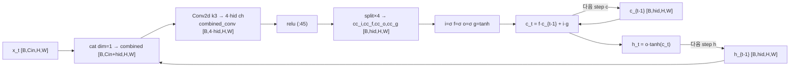
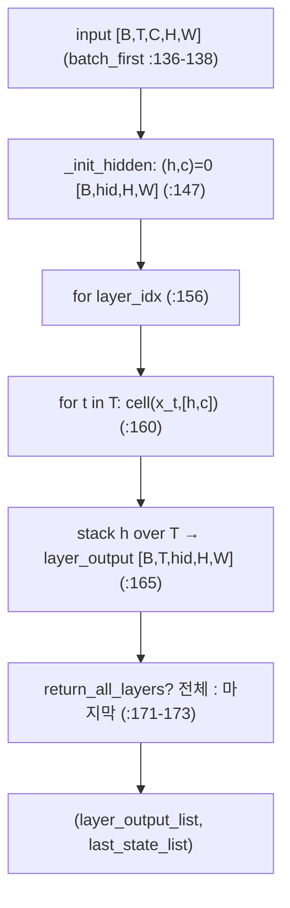
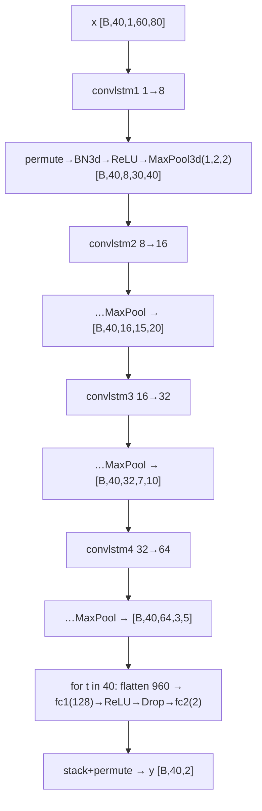
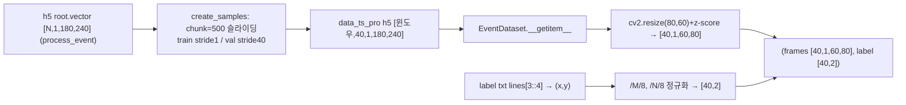

# cb-convlstm-eyetracking 모듈 통합 가이드 (S-PyTorch)

> 1차 요약: [`../cb-convlstm-eyetracking.md`](../cb-convlstm-eyetracking.md) — 본 문서는 그 요약을 모듈(클래스/함수) 단위로 심화한 S-PyTorch 변형 통합 가이드다.
> 분석 대상: `\\wsl.localhost\ubuntu-24.04\home\user\project\PRJXR-HBTXR\REF\XR-Eye-Tracking\Codebase\cb-convlstm-eyetracking`
> 관련 논문: [`../../Papers/3ET.md`](../../Papers/3ET.md) (3ET, IEEE BioCAS 2023, arXiv:2308.11771)
> 작성 원칙: 실제 소스 Read 후 `파일:라인` 근거 표기. 라인 근거 없는 추론은 "추정", 코드로 확인 불가는 "확인 불가"로 명시. 정확도(p-error/거리)는 README/논문 인용, 미실행 수치는 "확인 불가".

---

## 0. 문서 머리말

### 0.1 대표 케이스 선정 + 근거

본 repo는 **동일한 ConvLSTM 골격을 4가지 변형**으로 제공한다. 메인 학습 스크립트가 실제 사용하는 것과, 논문 기여(CB-ConvLSTM delta encoder)를 구현한 것을 모두 대표로 선정한다.

- **대표 실행 모델(trained): `convlstmbak.ConvLSTM` + `MyModel`**
  - 근거: 메인 스크립트가 `from convlstmbak import ConvLSTM`로 임포트(`convlstm-et-pytorch-event.py:9`)하고, `MyModel`이 이를 4단 적층(`:168,176,180,184`). **실제 학습/평가에 쓰이는 유일한 모델 본체**다.
  - 특이점: 표준 ConvLSTM과 달리 게이트 conv 출력에 `torch.relu` 적용(`convlstmbak.py:45`). delta/threshold 희소화는 **미적용**(순수 ConvLSTM). 즉 trained 모델 = vanilla(θ=0)에 해당.
- **대표 change-based delta encoder(논문 핵심): `convlstm_delta.ConvLSTMCell`**
  - 근거: hidden·input 양쪽에 `delta = h_cur - h_pre` / `delta_inp = input - input_pre`를 만들고 threshold(0.002)로 작은 변화를 0으로 잘라 conv에 투입(`convlstm_delta.py:43-48`). 논문 §CB-ConvLSTM의 `ΔH_{t-1}` 수식(3ET.md:38-41)을 코드로 직접 구현. **시간 sparsity 유도 + 희소율 로깅**이 활성 상태인 유일한 셀.
- **대표 보조 변형(계측·구조 실험)**: `convlstm.ConvLSTMCell`(delta=h_cur, 희소율 로깅 활성), `convlstm_sp.ConvLSTMCell`(BN + 출력 hidden을 delta-threshold). 본문 5절에서 4변형을 표로 비교.

> 정리: **trained 경로 = `convlstmbak`(vanilla+ReLU)**, **논문 4.7× 절감 경로 = `convlstm_delta`(delta encoder)**. 본 repo는 두 경로를 분리해 두고, delta 셀은 희소율 계측용 instrumentation으로 보존한 상태(메인 모델에 자동 결선되어 있지 않음 — 5.5절 "확인됨").

### 0.2 수치 표기 규약 (S-PyTorch)

- **params** = 레이어 차원에서 직접 산정. ConvLSTMCell conv = `Conv2d(in+hidden → 4·hidden, k×k)` → 가중치 `(in+hidden)·4·hidden·k²` + bias `4·hidden`(`convlstmbak.py:32-36`). BN3d = `2·C`(γ,β). FC = `in·out + out`.
- **MACs / FLOPs** = ConvLSTM 셀의 핵심은 **4-게이트 conv 1회**(i,f,o,g를 한 conv로 묶음, `:32-33`). 표준식 `MAC = H·W·Cout·Cin·k²`, `Cout=4·hidden`, `Cin=in+hidden`. **시간축 T번 재귀** 반복(`:160`)하므로 시퀀스당 ×T. 게이트 elementwise(σ/tanh/곱/합)는 conv 대비 소규모라 별도 표기.
- **activation memory** = 텐서 `shape × bit`. ConvLSTM 셀은 step마다 `h,c`(각 `[B,hidden,H,W]`)를 유지 + `combined`(`[B,in+hidden,H,W]`) + `combined_conv`(`[B,4·hidden,H,W]`). 학습 역전파용으로 T step·레이어 전부 보관(activation 메모리 지배항).
- **이벤트 표현** = constant time-bin count(논문 ΔT=4.4ms, 3ET.md:25)로 누적한 **이벤트 프레임** `[B,T,1,60,80]`. voxel grid 아님(단일 채널 누적 프레임). 본 repo는 누적·리사이즈된 h5를 입력으로 받음(`process_event.py`, `EventDataset`).
- **CB-ConvLSTM delta sparsity 절감율** = `convlstm_delta.py:49-56`가 eval 모드에서 `(numel - count_nonzero)/numel`로 `combined`(tot)/`delta_inp`(inp)/`delta`(delta) 0비율을 로그. 논문: θ 0→0.5에서 시간 sparsity 69.2%→85.3%, conv 8.8× 절감, 네트워크 4.7× 절감(3ET.md:51). **본 repo 코드만으론 정확한 절감율 미실행 → "확인 불가", 논문값 인용**.
- **정확도** = README는 28 epoch 좌표 예측 그림(README:38-40), 코드 메트릭은 `dist>{1,3,5,10}px` 초과율(err_rate, `:327-337`). 논문 p3/p5/p10 검출률은 3ET.md:48-50 인용. **본 repo 미실행 → 학습 결과 수치는 "확인 불가"**.

### 0.3 운영 경로 (학습 ↔ 체크포인트 ↔ 평가)

```
[원시 이벤트 h5: /DATA/pupil_st/data_ts_500/*.h5  (root.vector, 180×240 누적 프레임)]
      │  process_event.py: create_samples (chunk=500 슬라이딩 윈도우, seq=40)
      │    train stride=1(증강), val stride=40(비중첩)  →  blosc 압축 carray 저장
      ▼
[전처리 h5: data_ts_pro/{train,val}/*.h5]   +   [라벨 txt: pupil_st/label/*.txt (lines[3::4])]
      │  EventDataset.__getitem__: cv2.resize(80,60) + z-score normalize → [seq,1,60,80]
      │    label = (x/M/8, y/N/8) 정규화 → [seq,2]
      ▼
[학습: convlstm-et-pytorch-event.py]
      │  MyModel = ConvLSTM×4 (1→8→16→32→64) + BN3d + ReLU + MaxPool3d + FC(960→128→2)
      │  criterion = SmoothL1Loss (:262), optimizer = Adam lr=1e-3 (:263), 100 epoch (:28)
      ▼
[검증: dist = ||target-output||, 픽셀 환산(×H/×W) → err_rate(>1/3/5/10px) (:322-337)]
      │  best val loss 시 checkpoint.pth 저장 (epoch/model/optimizer/loss, :351-356)
      ▼
[평가/플롯: 좌표 시계열 + 프레임 위 예측점 오버레이 (:359-429), training_log.txt 기록 (:342-344)]
```
- pretrained=True 시 checkpoint.pth 복원(`:266-278`). 체크포인트 자체는 [제외].

### 0.4 모델 / 데이터셋 / 정확도 요약

| 항목 | 값 | 근거 |
|---|---|---|
| 입력 | 이벤트 프레임 시퀀스 `[B,T=40,1,60,80]` | `:21-26`, `EventDataset:106-107` |
| 출력 | 동공 중심 `(x,y)` 정규화 `[B,T,2]` | `MyModel.forward:247-249`, `fc2:197` |
| 모델 | ConvLSTM×4 (h=8/16/32/64, k=3) + FC×2 | `MyModel:168-197` |
| params | ≈ 0.417M (산정 6.6절) | 차원 계산, 논문 0.42M(3ET.md:29,49) 일치 |
| Loss | SmoothL1Loss(Huber) | `:262` (논문은 MSE, 3ET.md:44 — 코드와 상이) |
| optimizer | Adam lr=1e-3, 100ep | `:263,28` (논문은 SGD 30ep, 3ET.md:44 — 코드와 상이) |
| 데이터셋 | SEET(event frame), LPW→v2e DVS, 3ET(Tonic) | README:24-65, 3ET.md:26 |
| 메트릭 | err_rate(dist>{1,3,5,10}px) / 논문 p3/p5/p10 | `:327-337` / 3ET.md:48-50 |
| 정확도(논문 CB θ=0.5) | p3=88.5%, p5=96.7%, p10=99.2%, 9.0M FLOPs | 3ET.md:49 (본 repo 미실행 → 확인 불가) |

---

## 1. Repo / Layer 개요 (모델 / 데이터 / 학습 맵)

cb-convlstm-eyetracking = 이벤트 카메라 프레임으로 동공 중심 (x,y)를 회귀하는 **4단 ConvLSTM 시공간 모델**의 학습/평가 스크립트 + ConvLSTM 셀 4변형(표준·delta·base·sparse). HW 커널·CUDA 확장 없는 **순수 PyTorch**(이식성 최상).

### 1.1 파일 역할 맵

| 구분 | 파일 | 역할 | 메인 사용 |
|---|---|---|---|
| **메인(학습/모델/평가)** | `convlstm-et-pytorch-event.py` | Dataset·MyModel·Train·Val·Plot 전부 | ★ 실행 진입점 |
| **표준 ConvLSTM(trained 본체)** | `convlstmbak.py` | `ConvLSTMCell`(relu+conv) + `ConvLSTM` 컨테이너 | ★ `:9` import |
| **CB delta encoder(논문 핵심)** | `convlstm_delta.py` | hidden·input 양쪽 delta + threshold(0.002) + 희소율 로깅 | 미결선(계측) |
| **CB base 변형** | `convlstm.py` | delta=h_cur concat + 희소율 로깅(활성) + relu conv | 미결선(계측) |
| **CB sparse 변형** | `convlstm_sp.py` | BN + 출력 hidden을 delta-threshold(0.005) + relu(c) | 미결선(실험) |
| **peephole 셀(별 계보)** | `convlstm_cell.py` | `BaseConvLSTMCell`(W_ci/co/cf peephole), 컨테이너 없음 | 미사용 |
| **전처리** | `process_event.py` | 원시 h5 → 슬라이딩 윈도우 h5(blosc) | ★ 1차 실행 |
| **목록/로그** | `train_files.txt`/`val_files.txt`/`files.txt`, `log/` | 파일 분할·학습 로그 | — |
| **[제외]** | `checkpoint.pth`, `plot/*`(이미지/gif) | 체크포인트·산출 이미지 | 제외 |

### 1.2 forward 진입점

`model(images)` → `MyModel.forward(x)`(`:200`) → 4× `ConvLSTM.forward`(`convlstmbak.py:122`) → 각 셀 `ConvLSTMCell.forward`(`convlstmbak.py:38`)를 시퀀스 T=40번 재귀(`convlstmbak.py:160-163`) → step별 FC head(`:240-246`) → `[B,T,2]`.

### 1.3 제외 목록
- **외부 데이터/체크포인트**: SEET h5 원본, `checkpoint.pth`, `plot/`의 png·gif.
- **외부 프레임워크 원본**: torch/torchvision/cv2/tables/thop/scipy/tonic(import만, 본 repo 소스 아님).
- **별 계보 미사용 셀**: `convlstm_cell.py`는 컨테이너 없는 peephole 셀로 메인과 결선 안 됨(4.6절에서 구조만 기록).

---

## 2. 모듈: 표준 ConvLSTM 셀 — `convlstmbak.ConvLSTMCell` (trained 본체)

### 2.1 역할 + 상위/하위
- **역할**: 입력 프레임 `x_t`와 직전 은닉 `h_{t-1}`을 채널축으로 concat → 단일 conv로 4게이트(i,f,o,g) 동시 산출 → LSTM 게이팅으로 셀상태 `c`·은닉 `h` 갱신. **공간은 conv, 시간은 게이트 재귀**로 처리하는 시공간 단위 셀.
- **상위**: `convlstmbak.ConvLSTM`(컨테이너)이 T step 순회하며 호출(`convlstmbak.py:160-163`). 그 위는 `MyModel`(4단 적층, `:168-184`).
- **하위**: `nn.Conv2d` 1개(`convlstmbak.py:32`), elementwise σ/tanh.

### 2.2 데이터플로우 (텐서 shape · 시간축)

시간축: `ConvLSTM.forward`가 `for t in range(seq_len)`로 동일 셀에 `x_t`를 순차 투입, `(h,c)`를 step간 carry(`convlstmbak.py:160-163`).

### 2.3 forward call stack
```
MyModel.forward (:200)
└─ self.convlstm1(x)  → ConvLSTM.forward (convlstmbak.py:122)
   └─ for layer_idx → for t in range(seq_len) (convlstmbak.py:156,160)
      └─ ConvLSTMCell.forward(x_t, [h,c]) (convlstmbak.py:38)
         ├─ cat([x_t, h_cur]) (convlstmbak.py:41)
         ├─ relu(conv(combined)) (convlstmbak.py:45)
         ├─ split → σ/σ/σ/tanh (convlstmbak.py:46-50)
         └─ c_next, h_next (convlstmbak.py:52-53)
```

### 2.4 대표 코드 위치
`convlstmbak.py:32-36`(conv 정의), `:38-55`(forward 게이팅), `:57-60`(init_hidden 0초기화).

### 2.5 대표 코드 블록

**(a) 4-게이트 단일 conv 정의 (`convlstmbak.py:32-36`)**
```python
self.conv = nn.Conv2d(in_channels=self.input_dim + self.hidden_dim,
                      out_channels=4 * self.hidden_dim,
                      kernel_size=self.kernel_size,
                      padding=self.padding, bias=self.bias)
```
→ i,f,o,g 4게이트를 한 conv의 출력채널로 묶음. padding=k//2로 same-conv(H,W 보존).

**(b) ConvLSTM 갱신식 + ReLU 특이점 (`convlstmbak.py:41-53`)**
```python
combined = torch.cat([input_tensor, h_cur], dim=1)        # [B,Cin+hid,H,W]
combined_conv = torch.relu(self.conv(combined))           # ★ ReLU (표준 ConvLSTM엔 없음)
cc_i, cc_f, cc_o, cc_g = torch.split(combined_conv, self.hidden_dim, dim=1)
i = torch.sigmoid(cc_i); f = torch.sigmoid(cc_f); o = torch.sigmoid(cc_o); g = torch.tanh(cc_g)
c_next = f * c_cur + i * g                                 # 셀 상태
h_next = o * torch.tanh(c_next)                            # 은닉 상태
```
→ 논문 갱신식(3ET.md:32-36)과 동일 구조이나, conv 직후 ReLU(`:45`)는 논문/표준에 없는 추가(게이트 입력을 비음수로 클램프). 의도 문서화 없음 — **추정**(희소화·안정화 목적).

**(c) 컨테이너의 시간축 재귀 (`convlstmbak.py:160-166`)**
```python
for t in range(seq_len):
    h, c = self.cell_list[layer_idx](input_tensor=cur_layer_input[:, t, :, :, :],
                                     cur_state=[h, c])
    output_inner.append(h)
layer_output = torch.stack(output_inner, dim=1)   # [B,T,hid,H,W]
```
→ 시퀀스를 시간 step으로 풀어 동일 셀 재사용. h만 누적해 다음 레이어 입력으로 stack.

### 2.6 연산 분해 + 정량 (대표 입력 `[B=16,T=40,1,60,80]`)

게이트 conv MAC(1 step) = `H·W·(4·hid)·(in+hid)·k²`. step당 elementwise는 conv 대비 무시.

| 레이어 | in→hid | 입력 H×W | conv params | 1-step MAC | ×T=40 MAC |
|---|---|---|---|---|---|
| convlstm1 | 1→8 | 60×80 | 2,624 | 60·80·32·9·9 = 12.44M | 497.7M |
| convlstm2 | 8→16 | 30×40 | 13,888 | 30·40·64·24·9 = 16.59M | 663.6M |
| convlstm3 | 16→32 | 15×20 | 55,424 | 15·20·128·48·9 = 16.59M | 663.6M |
| convlstm4 | 32→64 | 7×10 | 221,440 | 7·10·256·96·9 = 15.48M | 619.0M |

- 입력 H×W는 각 단 뒤 MaxPool3d(1,2,2)로 공간만 절반(`:170,178,182,186`). 시간 T=40 유지.
- conv MAC 합(시퀀스, B=1) ≈ **2.44 GMAC/시퀀스**(4단×T). FC head: `(960·128+128·2)·T` ≈ 4.93M/시퀀스. → conv가 지배.
- **논문 대조**: 논문 vanilla ConvLSTM FLOPs 18.86M(θ적용 전)/42.61M(원본), CB(θ=0.5) 9.0M(3ET.md:49-50). 논문은 **단일 프레임/단축 시퀀스 기준 정규화 FLOPs**로 보이며(코드 T=40 풀스택과 척도 상이) — 절대치 직접 비교 불가, **추정**. 본 repo thop(`:16`)로 측정 가능하나 미실행 → "확인 불가".
- **activation memory**(B=16, 1 step, fp32): convlstm1의 `combined_conv [16,32,60,80]` = 16·32·60·80·4B ≈ 9.83MB; 4단·T=40·역전파 보관 시 수 GB 규모(학습 메모리 지배항). hidden carry `h,c` 각 `[16,8,60,80]`=2.46MB(L1).
- **params 합(4 ConvLSTM)** = 2,624+13,888+55,424+221,440 = **293,376**.

---

## 3. 모듈: ConvLSTM 컨테이너 — `convlstmbak.ConvLSTM`

### 3.1 역할 + 상위/하위
- **역할**: ConvLSTMCell을 num_layers 스택으로 묶고, 입력 `[B,T,C,H,W]`(batch_first)를 시간축 T로 순회하며 각 레이어 출력 시퀀스를 산출. hidden state 0초기화는 forward 내부에서 수행(stateful 미구현, `:143-144` NotImplementedError).
- **상위**: `MyModel`이 layer당 1개씩(num_layers=1) 4개 인스턴스 생성(`:168,176,180,184`). **하위**: `ConvLSTMCell`(`:115`).

### 3.2 데이터플로우


### 3.3 forward call stack
```
MyModel.forward → self.convlstmN(x) → ConvLSTM.forward (:122)
├─ permute batch_first (:136-138, MyModel은 batch_first=True라 skip)
├─ _init_hidden (:147 → init_hidden :57)
├─ for layer_idx (:156) → for t (:160) → ConvLSTMCell (:161)
└─ return layer_output_list[-1:], last_state_list[-1:] (:171-175)
```

### 3.4 대표 코드 위치
`convlstmbak.py:91-120`(생성자·cell_list), `:122-175`(forward), `:177-181`(init_hidden).

### 3.5 대표 코드 블록

**(a) 다층 cell 생성 (`convlstmbak.py:111-120`)**
```python
for i in range(0, self.num_layers):
    cur_input_dim = self.input_dim if i == 0 else self.hidden_dim[i - 1]
    cell_list.append(ConvLSTMCell(input_dim=cur_input_dim,
                                  hidden_dim=self.hidden_dim[i],
                                  kernel_size=self.kernel_size[i], bias=self.bias))
self.cell_list = nn.ModuleList(cell_list)
```
→ MyModel에선 num_layers=1이라 ConvLSTM 1개당 셀 1개. 깊이는 ConvLSTM 인스턴스를 4개 적층해 확보(`MyModel`).

**(b) hidden 0초기화 (`convlstmbak.py:57-60`)**
```python
return (torch.zeros(batch_size, self.hidden_dim, height, width, device=self.conv.weight.device),
        torch.zeros(batch_size, self.hidden_dim, height, width, device=self.conv.weight.device))
```
→ 매 forward마다 (h,c) 0으로 시작(시퀀스 간 상태 비유지). 실시간 스트리밍엔 stateful 변환 필요 — **HW 이식 관점 핵심**(8절).

### 3.6 연산 분해 + 정량
- 컨테이너 자체는 파라미터 없음(셀에 위임). 시간 복잡도는 `O(num_layers · T · cell_cost)`.
- **시간 재귀의 직렬성**: `for t`(`:160`)는 step간 (h,c) 의존이라 **병렬화 불가**(FPGA 파이프라인 stall 원인, 8절). T=40 직렬.
- activation: layer_output `stack` `[B,T,hid,H,W]`를 레이어 경계마다 생성 → L1 출력 `[16,40,8,60,80]`=98.3MB(fp32). 레이어 깊어질수록 H·W↓·hid↑로 상쇄.

---

## 4. 모듈: 메인 모델 — `MyModel` (4-stage ConvLSTM + FC head)

### 4.1 역할 + 상위/하위
- **역할**: ConvLSTM 4단(backbone, 시공간) → 각 단 BN3d+ReLU+MaxPool3d(neck, 공간만 2× 다운샘플·시간 유지) → step별 flatten+MLP(head, 좌표 회귀). 입력 `[B,T,1,60,80]` → 출력 `[B,T,2]`.
- **상위**: 학습 루프(`:295`)·검증(`:320`)·플롯(`:374`)이 `model(images)` 호출. **하위**: `ConvLSTM`×4, `BatchNorm3d`×4, `MaxPool3d`×4, `Linear`×2, `Dropout`.

### 4.2 데이터플로우 (텐서 shape · 시간축)

> 주: MaxPool3d 커널 (1,2,2)는 floor 다운샘플. 60→30→15→7→3, 80→40→20→10→5. 최종 64·3·5=**960**(=fc1 입력, `:195`와 일치, 확인됨).

### 4.3 forward call stack
```
model(images) → MyModel.forward (:200)
├─ x,_ = convlstm1(x); x=x[0].permute(0,2,1,3,4) (:201-202)
├─ bn1→relu→pool1 (:203-205)  [각 단 동형: :208-227]
├─ ... convlstm4 → bn4→relu→pool4 (:222-227)
└─ for t in range(seq): reshape(b,-1)→fc1→relu→drop→fc2 (:240-246)
   └─ stack(dim=0).permute(1,0,2) → [B,T,2] (:247-249)
```

### 4.4 대표 코드 위치
`:165-198`(생성자: ConvLSTM×4·BN·Pool·FC), `:200-249`(forward), `:195-197`(FC head 차원).

### 4.5 대표 코드 블록

**(a) backbone 1단 + neck (`:201-205`)**
```python
x, _ = self.convlstm1(x)              # ([B,T,8,60,80],_)  ConvLSTM은 list 반환
x = x[0].permute(0, 2, 1, 3, 4)       # [B,8,T,60,80]  (BN3d/Pool3d는 C가 dim1)
x = self.bn1(x); x = F.relu(x); x = self.pool1(x)   # MaxPool3d(1,2,2): 공간만 2×↓
```
→ ConvLSTM 출력(시간축 dim1)을 permute해 3D conv류 연산(BN3d/MaxPool3d)에 맞춤. pool 커널 (1,2,2)로 **시간 T 보존**, 공간만 축소.

**(b) step별 FC head — 시퀀스 길이 T번 실행 (`:238-249`)**
```python
b, c, seq, h, w = x.size()            # [B,64,40,3,5]
for t in range(seq):
    data = x[:,:,t,:,:].reshape(b, -1)   # [B,960]
    data = F.relu(self.fc1(data)); data = self.drop(data); data = self.fc2(data)  # [B,2]
    x_list.append(data)
y = torch.stack(x_list, dim=0).permute(1, 0, 2)   # [B,T,2]
```
→ 각 시간 step의 64×3×5 feature를 독립 회귀(논문 "FC는 시퀀스 길이 T번 실행", 3ET.md:30 일치, 확인됨). Dropout 0.5(`:196`)는 학습시만.

### 4.6 보조: peephole 셀 `convlstm_cell.BaseConvLSTMCell` (별 계보, 미사용)
- 컨테이너 없는 단독 셀. **peephole 연결**: 학습 파라미터 `W_ci/W_co/W_cf [out,H,W]`를 셀상태에 곱해 게이트에 더함(`convlstm_cell.py:59-67, 105-114`).
  ```python
  input_gate  = torch.sigmoid(i_conv + self.W_ci * prev_cell)   # :105
  forget_gate = torch.sigmoid(f_conv + self.W_cf * prev_cell)   # :106
  C = forget_gate * prev_cell + input_gate * self.activation(c_conv)  # :109
  output_gate = torch.sigmoid(o_conv + self.W_co * C)           # :111
  H = output_gate * self.activation(C)                          # :114
  ```
- 메인과 결선 안 됨(컨테이너·forward 호출 부재). 1차 요약이 이 파일을 "change-based cell"로 본 것은 오기 — 실제 change-based는 `convlstm_delta.py`임(**확인됨**, 본 가이드에서 정정).

### 4.7 연산 분해 + 정량 (전체 MyModel)
- **params**(차원 산정):
  - ConvLSTM conv: 2,624 + 13,888 + 55,424 + 221,440 = 293,376
  - BN3d(8,16,32,64): 2·(8+16+32+64) = 240
  - fc1: 960·128+128 = 123,008; fc2: 128·2+2 = 258
  - **합 ≈ 416,882 ≈ 0.417M** → 논문 0.42M(3ET.md:29,49)과 일치(확인됨).
- **MAC/시퀀스**(B=1, T=40): conv ≈ 2.44 GMAC(2.5절) + FC ≈ 4.93M → conv 지배. 프레임당(÷T) ≈ 61.1 MMAC.
- **activation memory**: 2.6절 참조(combined_conv·layer_output stack이 지배). 추론(B=1, eval)시엔 step별 carry만 유지 가능(stateful화 시 메모리 대폭 절감 — 8절).

---

## 5. 모듈: CB-ConvLSTM delta encoder 변형 (논문 핵심, 계측)

본 repo는 change-based 아이디어를 **3개 셀 파일**로 점진 구현. 메인엔 미결선이나 논문 4.7× 절감의 근거. 4변형 비교:

### 5.1 `convlstm_delta.ConvLSTMCell` — 완전 delta encoder (대표)

- **역할**: hidden·input **둘 다** delta화 + threshold 희소화 후 conv 투입. 논문 `ΔH_{t-1}` 수식(3ET.md:39-41)의 직접 구현.
- **상태**: cur_state = `(h_cur, c_cur, h_pre)` 3-튜플 + 추가 인자 `input_tensor_pre`(직전 프레임). 컨테이너가 t=0이면 0, 아니면 `cur_layer_input[:,t-1]`로 공급(`convlstm_delta.py:174-178`).

**(a) delta + threshold (`convlstm_delta.py:42-48`)**
```python
h_cur, c_cur, h_pre = cur_state
delta = h_cur - h_pre                          # 은닉 변화량 (ΔH)
delta_inp = input_tensor - input_tensor_pre    # 입력 변화량 (ΔX)
threshold = torch.tensor(0.002).cuda()
delta = torch.where(delta < threshold, torch.tensor(0.0).cuda(), delta)        # 작은 변화 → 0
delta_inp = torch.where(delta_inp < threshold, torch.tensor(0.0).cuda(), delta_inp)
combined = torch.cat([delta_inp, delta], dim=1)
```
→ θ=0.002 미만은 0으로 잘라 **시간 sparsity 유도**. 논문 θ는 0~0.5 스윕(3ET.md:51) — 코드 기본값(0.002)과 상이(**추정**: 데모 보수값). `torch.where(delta < θ, 0, delta)`는 음수 delta도 0이 됨(단측 임계) — 논문 수식과 부호 처리 차이 있음(**추정**).

**(b) 희소율 로깅 (`convlstm_delta.py:49-56`)**
```python
if self.training == False:
    non_zero_count = torch.count_nonzero(combined).float()
    sparse_rate = (combined.numel() - non_zero_count) / combined.numel()
    sparse_rate_inp = (delta_inp.numel() - torch.count_nonzero(delta_inp).float()) / delta_inp.numel()
    sparse_rate_delta = (delta.numel() - torch.count_nonzero(delta).float()) / delta.numel()
    with open(file_path, 'a') as f:
        f.write(f"sparse_rate: tot {sparse_rate} inp {sparse_rate_inp} delta{sparse_rate_delta} ...")
```
→ eval 모드에서 tot/inp/delta 0비율을 `log/xxsparse_rate_th_0.00200.txt`에 기록. **HW zero-skip 절감율의 정량 근거 생산기**. conv는 ReLU 없이 적용(`:57`, vanilla와 다름).

### 5.2 `convlstm.ConvLSTMCell` — base 변형(delta=h_cur)
- `delta = h_cur`(차분 아님, 은닉 그대로) concat(`convlstm.py:46-49`). 희소율 로깅 **항상 활성**(`:50-58`), conv 후 ReLU(`:68`). threshold 코드는 주석처리(`:47-48`). → "vanilla 입력 희소율 기준선" 측정용.

### 5.3 `convlstm_sp.ConvLSTMCell` — sparse 변형(출력 delta-threshold + BN)
- 추가 `BatchNorm2d(4·hid)`(`convlstm_sp.py:42,68`). 갱신식 변형: `c_next = f·relu(c_cur) + i·g`, `h_next = o·relu(c_next)`(`:78-79`, tanh 대신 relu). **출력 hidden을 delta화**: `delta = h_next - h_cur`, θ=0.005, `h_next_delta = where(delta<θ,0,delta)` 반환(`:81-83`). → 다음 step 입력 hidden이 희소.

### 5.4 4변형 비교표

| 파일:라인 | delta 대상 | threshold | conv 후 ReLU | BN | 희소율 로깅 | 반환 hidden | 메인 결선 |
|---|---|---|---|---|---|---|---|
| `convlstmbak.py:45` | 없음(vanilla) | — | ✔(:45) | ✘ | ✘ | h_next | **★ trained** |
| `convlstm.py:46` | h_cur(차분X) | 주석(0) | ✔(:68) | ✘ | ✔ 활성(:50) | h_next | 미결선 |
| `convlstm_delta.py:43` | h_cur−h_pre + 입력 | 0.002(:45) | ✘ | ✘ | ✔ 활성(:49) | h_next | 미결선(논문 핵심) |
| `convlstm_sp.py:81` | h_next−h_cur(출력) | 0.005(:82) | ✘(주석:69) | ✔(:42) | 주석(:50) | h_next_delta | 미결선 |

### 5.5 연산 분해 + 정량 (delta sparsity 절감)
- **conv 게이트 연산 자체는 vanilla와 동일 차원** → params·이론 MAC 동일. 절감은 **입력 0비율을 HW zero-skip으로 흘릴 때** 실현(PyTorch dense conv는 0도 곱하므로 실측 wall-time 절감 없음 — "추정/확인 불가").
- **논문 정량**(3ET.md:51, 인용): θ 0→0.5에서 시간 sparsity **69.2%→85.3%**, CB-ConvLSTM이 vanilla 대비 **~3× sparsity**, conv에서 **8.8× 연산 절감**, 네트워크 전체 **4.7× 절감**. CB(θ=0.5) **9.0M FLOPs** vs vanilla 18.86M(3ET.md:49-50).
- **본 repo 미실행**: 실제 sparse_rate 값은 데이터 의존이며 코드 미실행 → **"확인 불가"**(로깅 인프라만 존재, `:54-56`).
- **결선 공백(확인됨)**: 메인 `MyModel`은 `convlstmbak`(vanilla)만 import(`:9`). delta 셀을 쓰려면 import 교체 + 컨테이너 forward가 `input_tensor_pre`를 셀에 전달하도록 결선 필요(현재 `convlstm_delta.py`의 컨테이너는 이를 처리, `:174-178` — 단 `.cuda()` 하드코딩으로 CPU 미지원).

---

## 6. 모듈: 데이터 파이프라인 — `EventDataset` / `process_event.py` / `create_samples`

### 6.1 역할 + 상위/하위
- **역할**: 원시 이벤트 프레임 h5를 chunk(500) 단위 슬라이딩 윈도우(길이 seq=40)로 잘라 시퀀스 샘플 생성, 리사이즈·정규화·라벨 정렬해 `(frames, label)` 반환.
- **상위**: `DataLoader`(`:158-159`)가 배치화 → 학습/검증 루프. **하위**: cv2.resize, normalize_data, tables(h5).

### 6.2 데이터플로우


### 6.3 forward call stack (데이터)
```
DataLoader → EventDataset.__getitem__ (:97)
├─ tables.open_file → file.root.vector[sample_index] (:102-103)
├─ for i: normalize_data(cv2.resize(sample[i,0],(80,60))) (:105-106)
├─ expand_dims axis=1 → [seq,1,60,80] (:107)
└─ label = (target[:,0]/M/8, target[:,1]/N/8) concat → [seq,2] (:109-112)
_concatenate_files (:115): label txt lines[3::4] → create_samples (:126)
```

### 6.4 대표 코드 위치
`:44-61`(normalize_data), `:63-83`(create_samples), `:86-127`(EventDataset), `process_event.py:46-58`(get_data).

### 6.5 대표 코드 블록

**(a) 슬라이딩 윈도우 인덱싱 (`:72-80`)**
```python
within_chunk_indices = np.arange(sequence) + np.arange(0, chunk_size - sequence + 1, stride)[:, None]
indices = chunk_starts[:, None, None] + within_chunk_indices[None, :, :]
indices = indices.reshape(-1, indices.shape[-1])
subframes = data[indices]
```
→ chunk(500) 안에서 길이 seq=40 윈도우를 stride만큼 이동. train stride=1 → chunk당 461 윈도우(강한 시간 증강), val stride=40 → 비중첩 12 윈도우. interval = `(500-40)/stride+1`(`:93`).

**(b) 입력 리사이즈·정규화 + 라벨 스케일 (`:105-112`)**
```python
sample_resize.append(normalize_data(cv2.resize(sample[i,0], (int(width), int(height)))))  # 240→80, 180→60
sample_resize = np.expand_dims(np.array(sample_resize), axis=1)   # [seq,1,60,80]
label1 = self.target[index][:, 0]/M/(8)    # x / 80 / 8
label2 = self.target[index][:, 1]/N/(8)    # y / 60 / 8
```
→ z-score 정규화(`normalize_data:50-59`, std=0 가드 포함). 라벨 `/M/8`,`/N/8`: M·N으로 [0,1] 정규화 후 추가 `/8`은 근거 주석 없음 — **추정**(검증부 픽셀 환산 `dis[...,0]*=height; *=width`(`:323-324`)와 정합되려면 별도 의미, 또는 4× MaxPool 누적 스케일 보정 가능성). 검증식과의 정합성은 **확인 불가**.

**(c) 라벨 추출 — 4줄마다 1개 (`:122`)**
```python
lines = lines[3::4]   # 라벨 txt에서 4번째 줄마다 1개 (이벤트 프레임율↔라벨율 매칭)
```
→ 원본 라벨 샘플링율을 이벤트 프레임에 맞춤(**추정**: 프레임 누적 비율).

### 6.6 연산 분해 + 정량
- params 없음(전처리). 비용은 I/O·resize. train 윈도우 수 = 파일수 × 461(stride1), val = 파일수 × 12(stride40, `:93,154`).
- 입력 텐서/샘플: `[40,1,60,80]` fp32 = 40·60·80·4B = **768KB/샘플**, 배치(16) = 12.3MB. 라벨 `[40,2]` 미미.
- 전처리 h5: blosc complevel=5 압축 carray(`process_event.py:56-58`) — 디스크 절감.

---

## 7. 모듈 한눈표

| # | 모듈 | 파일:라인 | 역할 | 대표 정량 |
|---|---|---|---|---|
| 2 | ConvLSTMCell(vanilla+ReLU) | convlstmbak.py:5-60 | 4게이트 conv + LSTM 게이팅 셀(trained) | params 293,376(4단) / 2.44 GMAC·시퀀스 |
| 3 | ConvLSTM 컨테이너 | convlstmbak.py:63-191 | T step 재귀·다층 스택 | 직렬 T=40(병렬화 불가) |
| 4 | MyModel | convlstm-...event.py:164-249 | ConvLSTM×4+BN+Pool+FC head | **0.417M params** / 61.1 MMAC·프레임 |
| 4.6 | BaseConvLSTMCell(peephole) | convlstm_cell.py:16-116 | W_ci/co/cf peephole 셀(미사용) | params +3·hid·H·W/셀 |
| 5.1 | CB delta encoder | convlstm_delta.py:8-73 | hidden·input delta+θ0.002+로깅 | 논문 4.7× 절감(인용) |
| 5.2 | base 변형 | convlstm.py:10-89 | delta=h_cur+희소율 로깅 활성 | 기준선 sparsity 측정 |
| 5.3 | sparse 변형 | convlstm_sp.py:8-91 | BN+출력 delta θ0.005+relu(c) | — |
| 6 | EventDataset/create_samples | convlstm-...event.py:63-127 | 슬라이딩 윈도우·resize·정규화 | 768KB/샘플, train ×461 윈도우 |
| 6 | process_event.get_data | process_event.py:46-58 | 원시 h5→윈도우 h5(blosc) | seq40, stride1/40 |

---

## 8. 학습 · 평가 파이프라인 + 재현 명령

### 8.1 학습 루프 (`:280-356`)
- 손실 `SmoothL1Loss`(`:262`, **논문 MSE와 상이** 3ET.md:44), optimizer `Adam lr=1e-3`(`:263`, **논문 SGD와 상이**), 100 epoch(`:28`, 논문 30). seed=1 고정(`:32-34`).
- 매 epoch 검증 후 best val loss면 checkpoint.pth 저장(`:346-356`), training_log.txt append(`:342-344`), 좌표 시계열·프레임 오버레이 플롯(`:359-429`).

### 8.2 평가 메트릭 (`:322-337`)
```python
dis = targets - outputs
dis[:, :, 0] *= height   # 60: x 정규좌표 → 픽셀
dis[:, :, 1] *= width    # 80: y 정규좌표 → 픽셀
dist = torch.norm(dis, dim=-1)
num_values_{1,3,5} = Σ(dist > {1,3,5}); num_values = Σ(dist > 10)
err_rate_k = num_values_k / tot_values
```
→ err_rate = `dist>kpx` 초과 비율(작을수록 우수). 논문 검출률 p_k = `dist≤kpx`(= 1−err_rate_k 대응). **본 repo 미실행 → 절대 수치 확인 불가**, 논문 인용: CB θ=0.5 p3=88.5% p5=96.7% p10=99.2%(3ET.md:49).
> 주의: `dis[...,0]*=height(60)`, `dis[...,1]*=width(80)`로 x에 height·y에 width를 곱함(축 교차) — 입력 라벨 정의(`label1=x/M`, M=width=80)와 교차되어 스케일 정합성 **확인 불가/추정**(버그 가능성).

### 8.3 재현 명령 (README:30-37)
```bash
# 1. SEET event-frame 데이터셋 다운로드 → /DATA/
# 2. cd eyetracking-convlstm
python process_event.py          # 원시 h5 → 슬라이딩 윈도우 h5 (seq 파라미터로 길이 조정)
python convlstm-et-pytorch-event.py   # 학습+검증+플롯 (100 epoch)
# (대안) 3ET raw 로더: pip install tonic --pre
#   tonic.datasets.ThreeET_Eyetracking(save_to="./data", split='Train')   # README:59-65
```
- 데이터셋: SEET(event frame Google Drive), LPW→v2e DVS(논문), 3ET(Tonic). 메트릭: err_rate(코드) / p3·p5·p10(논문).

---

## 9. 우리 프로젝트(XR + FPGA 저지연) 시사점 + HW 이식성

### 9.1 FPGA 매핑 적합성 — 세 후보(ConvLSTM / GG-SSM / Mamba) 중 최상 (추정)
- ConvLSTM = **conv + elementwise σ/tanh + 셀상태 누적**의 정형 데이터플로 → systolic conv array + 게이트 LUT(σ/tanh) + 셀상태 SRAM으로 직접 매핑. 동적 그래프·불규칙 연산 없음(3ET.md:54, "delta encoder 방식 단순·HW 친화" 인용).
- 순수 PyTorch·CUDA 커스텀 커널 무의존 → HLS/RTL 변환 출발점으로 최적(1차 요약 7절 일치).
- 논문 결론이 **"Spartus FPGA LSTM 가속기 등 시공간 sparsity 활용 전용 HW에 구현 가능"**을 명시(3ET.md:58) → FPGA 가속 직접 연관(직접 인용).

### 9.2 delta sparsity → HW zero-skip 자산
- `convlstm_delta.py:43-56`의 threshold 희소화 + 희소율 로깅을 HW에서 **zero-skip MAC(0 입력 곱셈 생략)**로 구현하면 논문 conv 8.8×·네트워크 4.7× 절감을 실현(3ET.md:51, 추정+논문 시사).
- θ는 **정확도-sparsity-자원 trade-off 노브**(3ET.md:61): HW 자원 예산에 맞춰 θ 상향 → sparsity↑(85.3%@θ0.5) 정확도 손실 없음(3ET.md:51). 코드 기본 θ(0.002/0.005)는 보수값 → 재튜닝 권장.
- **선결 과제**: 메인 모델은 vanilla(`convlstmbak`)로 학습됨 → delta 셀로 **재학습/스위칭 후** sparsity 효과 검증 필요(5.5절). delta 셀의 `.cuda()` 하드코딩(`convlstm_delta.py:45-47`)은 이식 전 제거 필요.

### 9.3 경량화·저지연
- **0.417M params**(6.6절, 논문 0.42M 일치), 입력 80×60×1, 채널 8~64, 프레임당 ≈61 MMAC → on-device XR baseline으로 매우 경량.
- **양자화 여지**: 본 repo 양자화 코드 없음("확인 불가") → 동일 인벤토리의 ViT-Quant(lsq/dorefa) 또는 ESDA INT8 경로 재활용 검토. INT8 적용 시 추가 경량화·DSP packing(2 MAC/DSP) 가능(추정).

### 9.4 ConvLSTM 순환의 HW 리스크 (확인됨/추정)
- **시간 재귀 직렬성**: `for t`(`convlstmbak.py:160`)는 step간 (h,c) 의존 → 파이프라인 stall(3ET.md:55,60). 완화책: hidden state 캐싱·더블버퍼링·레이어 간 파이프라이닝, **stateful 변환**(현재 매 forward 0초기화 `:147` → 스트리밍 시 상태 carry로 변경)(추정).
- **activation 메모리**: 학습은 T×레이어 보관(수 GB, 2.6절)이나 **추론 stateful화 시 step별 (h,c)만 유지**해 대폭 절감 → FPGA on-chip SRAM에 셀상태 상주 가능(추정).

### 9.5 벤치마크 정합 (추정)
- 본 repo의 EventDataset/전처리는 gg_ssms/eye_tracking_lpw upstream 원본(1차 요약 비고)과 동일 → **동일 입력으로 ConvLSTM vs GG-SSM vs Mamba 정확도/지연/리소스 공정 비교** 가능. ConvLSTM을 FPGA 1차 타깃·reference point로, GG-SSM/Mamba를 정확도 상한 비교군으로 배치 권장(추정).

---

## 10. 근거 표기 정리
- **확인됨(코드 라인)**: 메인이 `convlstmbak` 사용(`:9`); FC head T번 실행(`:240-246`); fc1 입력 960 = 64·3·5(`:195` ↔ pool 누적); 4변형 셀 차이(5.4절 표); change-based 실체는 `convlstm_delta.py`이며 1차 요약의 `convlstm_cell.py` 지정은 오기(peephole 셀)로 정정.
- **추정(라인 근거 없는 해석)**: `convlstmbak` conv-후-ReLU(`:45`) 의도; 라벨 `/8` 의미; 검증부 height/width 축 교차(`:323-324`); θ 기본값 보수성; HW zero-skip·stateful·양자화 전략.
- **확인 불가(미실행/부재)**: 실제 학습 정확도·err_rate(README 그림/논문값만); delta 셀 실측 sparse_rate(로깅 인프라만); 논문 FLOPs 절대치와 코드 T=40 풀스택의 척도 정합; checkpoint.pth 내부(제외).
- **인용(논문 3ET.md)**: 0.42M params; CB θ=0.5 p3/p5/p10·9.0M FLOPs; sparsity 69.2→85.3%·conv 8.8×·네트워크 4.7×; Spartus FPGA 시사.
