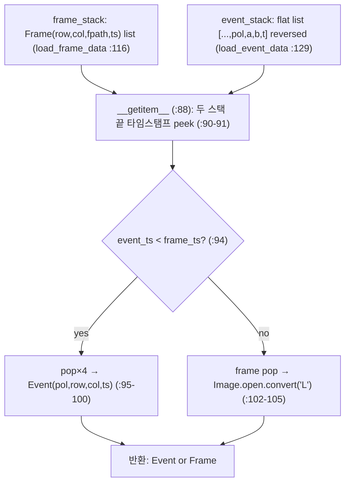

# event_based_gaze_tracking 모듈 통합 가이드 (S-PyTorch)

> 1차 요약: [`../event_based_gaze_tracking.md`](../event_based_gaze_tracking.md) — 본 문서는 그 요약을 모듈(클래스/함수) 단위로 심화한 S-PyTorch 변형 통합 가이드다.
> 분석 대상: `\\wsl.localhost\ubuntu-24.04\home\user\project\PRJXR-HBTXR\REF\XR-Eye-Tracking\Codebase\event_based_gaze_tracking`
> 관련 논문: [`../../Papers/NearEye-10000Hz.md`](../../Papers/NearEye-10000Hz.md) (Angelopoulos*, Martel* et al., "Event Based, Near Eye Gaze Tracking Beyond 10,000 Hz", IEEE VR 2020 / TVCG 27(5):2577-2586, 2021, arXiv:2004.03577)
> 작성 원칙: 실제 소스 Read 후 `파일:라인` 근거 표기. 라인 근거 없는 추론은 "추정", 코드로 확인 불가는 "확인 불가"로 명시. 정확도(각도/주파수)는 논문 인용, 미실행·부재 수치는 "확인 불가".

---

## 0. 문서 머리말

### 0.1 실체 확정: 데이터셋 repo vs 모델 repo (cb-convlstm과의 동형/차이)

형제 가이드(cb-convlstm-eyetracking)는 **학습 가능한 ConvLSTM 모델 repo**였다. 본 repo는 **그 반대편 극단** — **모델·학습·추론·평가 코드가 전무한 "데이터셋 배포 + 시각화 데모" repo**다(확정).

- **근거 1 (파일 인벤토리)**: repo 자체 소스는 **단 4개**뿐. `README.md`(110줄), `setup.sh`(116줄), `visualize.py`(193줄, 실코드 ~185줄), `ebv-eye.yml`(9줄). Glob `**/*.{py,sh,yml,md}` 결과 정확히 이 4개만 매칭(나머지는 `.git/`·`misc/*.gif`·`LICENSE`·`.gitignore`, [제외]).
- **근거 2 (의존성)**: 환경 정의가 **matplotlib·pillow 둘뿐**(`ebv-eye.yml:4-6`). torch/tensorflow/numpy 의존성 **0** → 딥러닝 모델 코드 부재의 결정적 정황.
- **근거 3 (README 자기선언)**: "This repository includes instructions for downloading and using our 27-person ... dataset"(`README.md:14`). 시각화 스크립트의 목적도 "a minimal example of proper data parsing and alignment"로 명시(`README.md:39-40`).

> 정리: **본 repo의 핵심 자산은 "알고리즘"이 아니라 "데이터 입력 계약(data contract)"이다.** 따라서 cb-convlstm 가이드의 "backbone/neck/head/loss/MAC" 6요소 분석 골격을 **데이터 파싱·시간정렬·렌더링 모듈**에 적용한다. 모델·parametric pupil model·calibration·정확도 수치는 모두 **코드 부재 → "확인 불가"**, 논문 시사만 인용. cb-convlstm이 "trained 경로 vs delta encoder 경로"를 분리했듯, 본 repo는 "**문서(README) 선언 vs 코드(visualize.py) 실제**"가 갈라지므로(0.3절) 그 분기를 진실의 원천 판정으로 추적한다.

### 0.2 수치 표기 규약 (S-PyTorch)

- **모델 params / FLOPs** = **해당 없음(확인 불가)**. 본 repo에 학습 가능 레이어가 단 한 개도 없음(`ebv-eye.yml:4-6` torch 무의존). params/MAC 산정 대상 자체가 부재.
- **이벤트 포맷(9B BHHI)** = 본 repo의 유일한 정량 자산. `read_aerdat`이 `packet_format='BHHI'`(`visualize.py:46`)로 패킷당 **정확히 9바이트**(B=uchar 1B + H=ushort 2B + H=ushort 2B + I=uint32 4B = 9B, `struct.calcsize('='+packet_format)`, `:47`). `'='`(native, no alignment)로 패딩 없이 9B 보장. 본 가이드는 이 9B 레이아웃을 **비트/바이트 오프셋 단위로 정밀 해부**(2절).
- **데이터 파이프라인 처리량** = 프레임 ~25 FPS, 8-bit 346×260 grayscale PNG(`README.md:68`). 이벤트는 raw AER 스트림(per-event tuple), 시간해상도 μs(`README.md:58,88`). 프레임당 바이트: 346·260·1B = **89,960 B/frame**(grayscale, 비압축 기준). 이벤트당 9B(`visualize.py:46-47`).
- **하이브리드 frame+event** = 두 모달(프레임/이벤트)을 μs 타임스탬프로 **머지**하는 로직이 `EyeDataset.__getitem__`에 존재(`visualize.py:88-105`). 이것이 논문의 하이브리드 파이프라인(프레임 초기화 + 이벤트 보간)의 **입력단 동기화 패턴**에 해당(논문 §하이브리드, NearEye-10000Hz.md:18-19 인용). 단 텐서화·모델 갱신은 코드에 없음(확인 불가).
- **parametric pupil model** = **본 repo에 없음(확인 불가)**. 논문은 "parametric pupil model + 이벤트 갱신(pupil-fitting)"으로 >10kHz 달성(NearEye-10000Hz.md:19,23 교차인용). 코드는 동공을 추정하지 않고 응시 화면좌표(gaze point) GT를 파일명에서 읽기만 함(`visualize.py:63-71`).
- **정확도** = 논문 인용값 **0.45°-1.75° 각도오차, 업데이트율 ≥10kHz**(NearEye-10000Hz.md:30, Retina Table 1 교차확인). **본 repo 미실행·코드 부재 → 모든 정량 정확도는 "확인 불가"**, 논문 인용만.

### 0.3 진실의 원천 분기 (README 문서 ↔ visualize.py 코드)

cb-convlstm이 "1차 요약의 `convlstm_cell.py` 오기를 코드로 정정"했듯, 본 repo는 **README의 이벤트 포맷 서술이 코드와 모순**된다 — HW 파서 작성 시 어느 쪽을 따를지가 치명적이라 별도 절로 확정한다.

| 항목 | README 서술(`README.md:57-61`) | 코드 실제(`visualize.py:46-47`) | 판정(진실의 원천) |
|---|---|---|---|
| 필드 순서 | Polarity, Timestamp, Row, Col | B, H, H, I = pol, x/y, y/x, t | **코드** (`BHHI`) |
| Polarity 타입 | unsigned char, 1 byte | B = uchar 1B | 일치 |
| Timestamp 타입 | uint16, **4 bytes** (자체 모순) | I = uint32 4B | **코드** (uint32) |
| Row 타입 | uint8, **2 bytes** (자체 모순) | H = ushort 2B | **코드** (ushort) |
| Col 타입 | uint8, **2 bytes** (자체 모순) | H = ushort 2B | **코드** (ushort) |
| 패킷 총 크기 | 9 bytes(`:61`) | 9 bytes(`:47` 주석·calcsize) | 일치 |
| 파싱 순서 권고 | (uint8, uint8, uint16, uchar)(`:61`) | `'='+BHHI`(`:56`) | **코드** |

> 판정: README 본문의 타입 서술(`README.md:57-60`)은 **타입명·바이트수가 자기모순**(예: uint16인데 4 bytes, uint8인데 2 bytes)이며 코드 `BHHI`와도 불일치. 총 9B 결론만 코드와 일치. **HW 파서·재현 코드는 반드시 `visualize.py:46-47`의 `BHHI`(9B)를 진실의 원천으로 채택**(확정). README는 데이터 의미(이벤트=극성/시각/행/열) 이해용으로만 참조.

### 0.4 모델 / 데이터셋 / 정확도 요약

| 항목 | 값 | 근거 |
|---|---|---|
| 모델 | **없음(데이터셋 repo)** | Glob 4파일, torch 무의존 `ebv-eye.yml:4-6` |
| params / FLOPs | **확인 불가**(학습 레이어 부재) | — |
| 이벤트 포맷 | 9B 패킷 `BHHI`(pol 1B + 2×ushort + uint32 t 4B) | `visualize.py:46-47` |
| 프레임 | 8-bit 346×260 grayscale PNG, ~25 FPS | `README.md:67-68` |
| 입력 모달 | 좌/우 양안 + IR 조명, DAVIS 346b | `README.md:43-44` |
| 출력/GT | 응시 화면좌표 (row,col), 화면중심 (540,960) | `README.md:70-81` |
| 데이터셋 규모 | 27인(논문은 subject 4-27만 사용) | `README.md:14,25`, `setup.sh:7-113` |
| 동기화 | μs 타임스탬프(DAVIS sync connector) | `README.md:88-90`, `visualize.py:90-94` |
| 정확도(논문) | 0.45°-1.75°, ≥10kHz | NearEye-10000Hz.md:30 (본 repo 미실행 → 확인 불가) |
| Loss/optimizer/metric | **없음(확정)** | 학습/평가 코드 부재 |

---

## 1. Repo / Layer 개요 (데이터 / 시각화 / 모델 유무 맵)

event_based_gaze_tracking = DAVIS 346b 이벤트 카메라로 수집한 **27인 양안 near-eye event+frame 데이터셋**의 배포 스크립트 + 데이터 포맷을 정확히 파싱·시각화하는 **최소 데모**. HW 커널·딥러닝 프레임워크 없는 **순수 Python(matplotlib·pillow)**. cb-convlstm과 달리 **모델·학습 경로 전무**.

### 1.1 파일 역할 맵 (모델 유무 명시)

| 구분 | 파일 | 역할 | 모델/학습 코드 | 메인 사용 |
|---|---|---|---|---|
| **메인(파싱+시각화)** | `visualize.py` | aerdat 파서·프레임명 파서·시간정렬·렌더 | ✘ 없음 | ★ 실행 진입점 |
| **데이터 획득** | `setup.sh` | user1~27 Box 링크 wget→tar 해제 | ✘ 없음 | ★ 1차 실행 |
| **문서/포맷 사양** | `README.md` | 논문·데이터셋·포맷·파일명 스키마 | ✘ 없음 | 사양 원천 |
| **환경** | `ebv-eye.yml` | conda env = matplotlib+pillow | ✘ 없음(torch 무) | — |
| **[제외]** | `.git/`, `misc/*.gif`, `LICENSE`, `.gitignore` | VCS·티저 영상·부수 파일 | — | 제외 |
| **[부재]** | (backbone/neck/head/loss/dataset(torch)/train/infer) | — | **존재하지 않음(확정)** | — |

> cb-convlstm의 "ConvLSTM 4변형·MyModel·train loop" 칸에 대응하는 **모델 본체 행이 전부 [부재]**. 이 공백이 본 repo의 정체성이다.

### 1.2 실행 진입점 (forward 대응)

cb-convlstm의 `model(images) → MyModel.forward`에 대응하는 본 repo의 진입 흐름은 **"데이터 로드 → 시간정렬 이터레이션 → 렌더"**:

`python visualize.py`(`:184-185`) → `main()`(`:168`) → `EyeDataset.collect_data(eye)`(`:108`, 프레임·이벤트 스택 로드) → `display_data(eye_dataset)`(`:137`) → `for data in eye_dataset`(`:144`)가 `EyeDataset.__getitem__`(`:88`)를 반복 호출해 이벤트/프레임을 시간순 1개씩 yield → `Frame`이면 imshow, `Event`면 scatter 버퍼 누적(`:145-163`).

### 1.3 제외 목록
- **외부 데이터/미디어**: `eye_data/`(`.gitignore` 등재, repo 미포함 — `setup.sh`로 별도 다운로드), `misc/github_event_based_eye_tracking_teaser.gif`(티저 영상, 대용량 바이너리).
- **VCS·부수 파일**: `.git/`, `LICENSE`, `.gitignore`.
- **외부 프레임워크 원본**: matplotlib·PIL·struct·glob·argparse(import만, 본 repo 소스 아님).
- **부재로 분석 불가**: 모델·loss·optimizer·train/infer 루프·메트릭·텐서화(voxel/time-surface) — 코드에 존재하지 않음(확정).

---

## 2. 모듈: 이벤트 바이너리 파서 — `read_aerdat` (★ 핵심 자산, 9B BHHI 정밀해부)

### 2.1 역할 + 상위/하위
- **역할**: `events.aerdat` raw binary를 통째로 읽어 **9바이트 고정폭 패킷**(`BHHI`)을 일괄 언팩, **평탄화된 flat list**로 반환. cb-convlstm의 `EventDataset.__getitem__`(이벤트 프레임 h5 디코딩)에 대응하는 **본 repo의 이벤트 디코딩 1차 관문**.
- **상위**: `EyeDataset.load_event_data`(`:129-133`)가 호출 → `event_stack`에 저장. 그 위는 `collect_data`(`:108`).
- **하위**: `struct.unpack`(파이썬 표준), 파일 I/O.

### 2.2 9바이트 BHHI 패킷 레이아웃 (바이트 오프셋 정밀해부)

```
events.aerdat = [packet_0][packet_1]...[packet_{N-1}]   (extra_bits 절삭, :49-53)

 1개 패킷 (9 bytes, native '=' no padding, :47):
 ┌──────┬──────────┬──────────┬──────────────────────┐
 │ off0 │ off1..2  │ off3..4  │  off5..6..7..8        │
 │  B   │    H     │    H     │         I             │
 │ pol  │ ushort#0 │ ushort#1 │   uint32 timestamp    │
 │ 1B   │   2B     │   2B     │         4B            │
 └──────┴──────────┴──────────┴──────────────────────┘
   pol = 극성(0/1)   |  주석(:46): "(x,y)=ushort"  |  t = us 타임스탬프
```

- 합계 1+2+2+4 = **9B**(`:47` 주석·`calcsize` 확인됨).
- **ushort#0/#1의 row/col 매핑은 코드만으론 확정 불가**: `:46` 주석은 "(x,y)=ushort"로 x먼저, README는 Row먼저(`:59-60`), 소비측 `__getitem__`은 pop 순서로 polarity→row→col→timestamp(`:95-98`)로 해석. 즉 코드 내부에서도 ushort#0=row인지 col인지 **데이터 생성 규약 의존**(추정). HW 파서는 두 ushort를 "축A/축B"로 두고 다운스트림에서 의미 바인딩 권장.

### 2.3 데이터플로우 (바이트 → flat list)

```mermaid
flowchart LR
  F["events.aerdat (raw bytes, :42-43)"] --> SZ["packet_size=calcsize('=BHHI')=9 (:47)"]
  SZ --> N["num_events=len//9 (:48)"]
  N --> TRIM["extra_bits=len%9 절삭 (:49-53)"]
  TRIM --> UP["struct.unpack('='+'BHHI'*N) (:56)"]
  UP --> FL["flat list [pol0,a0,b0,t0, pol1,...] (튜플 아님!)"]
  FL --> REV["list.reverse() (:57) — pop() 시간순 소비용"]
  REV --> OUT["event_list 반환 (:59)"]
```

- **반환은 (pol,a,b,t) 4-튜플 list가 아니라 평탄화된 단일 리스트**(`:56`). 소비측(`__getitem__`)이 `pop()` 4회로 수동 재조립(3절). 결합도 높고 오류 취약(High).

### 2.4 대표 코드 위치
`visualize.py:41-59` 전체. 핵심 `:46`(packet_format), `:47`(9B calcsize), `:48-53`(개수·절삭), `:56`(일괄 unpack), `:57`(reverse).

### 2.5 대표 코드 블록

**(a) 9B BHHI 포맷 정의 + 크기 산정 (`visualize.py:46-47`)**
```python
packet_format = 'BHHI'                              # pol = uchar, (x,y) = ushort, t = uint32
packet_size = struct.calcsize('='+packet_format)    # 2 + 2 + 1 + 4 bytes => 9 bytes
```
→ `'='`(native byte order, no alignment)로 **패딩 없는 정확히 9B** 보장. 이것이 본 repo의 단일 정량 자산이자 HW 입력 디코더 사양(8절). `'='` 미지정 시 컴파일러 정렬로 12B가 될 수 있으므로 `'='`는 필수(확인됨).

**(b) 잔여 바이트 절삭 + 일괄 언팩 + 역순 (`visualize.py:48-57`)**
```python
num_events = len(file_content)//packet_size        # 9로 정수 나눗셈
extra_bits = len(file_content)%packet_size         # 9의 배수 아닌 잔여
if extra_bits:
    file_content = file_content[0:-extra_bits]      # 잔여 절삭
event_list = list(struct.unpack('=' + packet_format * num_events, file_content))  # N패킷 한 번에
event_list.reverse()                                # 뒤에서 pop()으로 시간 오름차순 소비
```
→ 전체 파일을 단일 `unpack`로 처리(메모리 일괄 적재, 스트리밍 아님 — 대용량 시 메모리 부담, Medium). `reverse()`는 끝에서 `pop()`(O(1))으로 원래 앞(=가장 이른 시각)부터 꺼내기 위함.

### 2.6 연산 분해 + 정량 (HW 파서 관점)
- **params/MAC**: 없음(파싱). 비용은 I/O + 단일 `struct.unpack`(C 레벨, O(9N)).
- **이벤트당 9B**: 1M 이벤트 = 9MB. flat list 적재 시 파이썬 객체 오버헤드로 메모리 수배 팽창(Info).
- **HW 환산**: 9B = 72-bit 고정폭 워드. 스트리밍 파서로 9B 정렬 시프트레지스터 1개면 디코딩(8절). `extra_bits` 절삭은 HW에서 "패킷 경계 미정렬 잔여 드롭"으로 대응.
- **활용도**: 본 함수 + 포맷이 cb-convlstm 대비 본 repo가 우리 프로젝트에 제공하는 **유일한 직접 이식 자산**(8절).

---

## 3. 모듈: 시간정렬 컨테이너 — `EyeDataset` (하이브리드 frame+event 머지)

### 3.1 역할 + 상위/하위
- **역할**: 프레임 스택과 이벤트 스택(flat list)을 보유하고, `__getitem__`에서 **두 모달의 다음 타임스탬프를 비교해 더 이른 쪽을 1개 반환** — 이벤트/프레임을 단일 시간순 스트림으로 머지. cb-convlstm `EventDataset`(슬라이딩 윈도우 텐서화)과 역할명은 같으나, 본 repo는 **텐서화 없이 시각화용 시간정렬만** 수행.
- **상위**: `display_data`(`:144`)가 이터레이터로 소비, `main`(`:169`)이 인스턴스화. **하위**: `read_aerdat`(이벤트), `glob_imgs`·`get_path_info`·`PIL.Image`(프레임).
- **주의**: 클래스명이 `EyeDataset`이나 PyTorch `Dataset` 상속 아님(`:75`, torch 무의존). `__len__`/`__getitem__`만 가진 순수 파이썬 컨테이너 — DataLoader 결선 불가(확정).

### 3.2 데이터플로우 (양모달 타임스탬프 머지)

- frame_stack은 `index` 정렬 후 `reverse()`(`:121-122`), event_stack은 `read_aerdat`에서 `reverse()`(`:57`) → 둘 다 끝에서 pop()하면 시간 오름차순.

### 3.3 forward call stack (데이터)
```
display_data → for data in eye_dataset (:144)
└─ EyeDataset.__getitem__ (:88)
   ├─ frame_timestamp = frame_stack[-1].timestamp (:90)
   ├─ event_timestamp = event_stack[-4]            (:91)  ← ★ 잠재 버그(3.6)
   ├─ if event<frame: pop×4 → Event (:94-100)
   └─ else: frame.pop → PIL convert('L') → _replace (:101-105)
collect_data (:108) → load_frame_data (:116) / load_event_data (:129)
```

### 3.4 대표 코드 위치
`:75-86`(생성자·`__len__`), `:88-105`(`__getitem__` 머지 핵심), `:108-114`(collect_data), `:116-127`(load_frame_data), `:129-133`(load_event_data).

### 3.5 대표 코드 블록

**(a) 양모달 타임스탬프 머지 (`visualize.py:90-100`)**
```python
frame_timestamp = self.frame_stack[-1].timestamp   # 다음 프레임 시각
event_timestamp = self.event_stack[-4]             # 다음 이벤트의 timestamp...라는 전제
if event_timestamp < frame_timestamp:
    polarity = self.event_stack.pop()              # 끝(=원래 앞)부터
    row      = self.event_stack.pop()
    col      = self.event_stack.pop()
    timestamp= self.event_stack.pop()
    event = Event(polarity, row, col, timestamp)
    return event
```
→ 두 스트림을 us 단위로 비교해 이른 쪽 1개 yield. **HW 듀얼 FIFO 머지(타임스탬프 비교 스케줄러)의 개념적 원형**(8절). cb-convlstm은 단일 이벤트 프레임 입력이라 이 머지가 없었음 — 본 repo만의 하이브리드 특성.

**(b) 프레임 lazy 로드 (`visualize.py:102-105`)**
```python
frame = self.frame_stack.pop()
img = Image.open(frame.img).convert("L")           # 파일경로 → grayscale 실제 로드
frame = frame._replace(img=img)                    # namedtuple 불변 → 교체본
return frame
```
→ `load_frame_data`는 **경로만** Frame에 담고(`:125`, `frame.img`=경로 문자열), 실제 픽셀 로드는 소비 시점에 lazy(`:103`). 메모리 효율적이나 I/O가 렌더 루프 안에 들어와 실시간 아님(`README.md:39`).

### 3.6 연산 분해 + 정량 + 잠재 버그
- **params/MAC**: 없음. 비용 = 스택 pop + 프레임 lazy I/O.
- **[잠재 버그 High] `event_stack[-4]`의 의미 오류 (`:91`)**: flat list는 reverse 후 끝→앞 순서로 `[..., t, b, a, pol]`(원래 마지막 패킷이 앞으로 옴이 아니라, 전체 리스트가 뒤집힘). 한 패킷 `[pol,a,b,t]`가 reverse 전체 적용 후 **리스트 끝 4개 = [t0, b0, a0, pol0]**(첫 패킷이 뒤로). 즉 `[-1]=pol0`, `[-4]=t0`. 따라서 `[-4]`는 **첫(다음) 이벤트의 timestamp가 맞다**(reverse 전체가 패킷 내부 순서도 뒤집기 때문). 단 pop 순서(`:95-98`)는 `pop()`이 `[-1]`부터이므로 polarity=pop()=pol0, row=pop()=a0, col=pop()=b0, timestamp=pop()=t0 → **Event(pol0, a0, b0, t0) 정상 재조립**(확인됨). 결론: `[-4]` 인덱스는 *우연히* 정상 동작하나 **매직 인덱스로 가독성·안전성 취약**(BHHI 4필드 전제 하드코딩). 필드 수 변경 시 즉시 붕괴(Maintainability, Medium).
- **[의미 부정확 Info] `__len__`(`:85-86`)**: `len(frame_stack)+len(event_stack)`인데 event_stack은 flat list(이벤트 수 = len/4) → 반환값은 실제 (프레임+이벤트) 개수가 아님. 이터레이션 종료엔 영향 없음(예외로 중단).
- **활성 메모리**: event_stack 전체를 메모리 상주(`read_aerdat` 일괄 적재) → 대용량 .aerdat 시 부담(2.6절). 프레임은 경로만 보관 후 lazy(3.5b).

---

## 4. 모듈: 프레임 파일명 파서 — `get_path_info` (gaze GT 추출)

### 4.1 역할 + 상위/하위
- **역할**: 프레임 PNG 파일명 `Index_Row_Column_Stimulus_Timestamp.png`를 split해 dict로 디코딩. **여기서 추출되는 row/col이 곧 응시 화면좌표 GT**, timestamp가 이벤트와의 동기화 키. cb-convlstm의 라벨 txt 파서(`label txt lines[3::4]`)에 대응하는 **본 repo의 GT 추출기**.
- **상위**: `load_frame_data`가 정렬키·Frame 구성에 사용(`:121,124`). **하위**: 문자열 split.

### 4.2 파일명 스키마 (gaze GT 의미)
```
"94_540_1122_s_237060314.png"   (README:92 예시)
  │   │    │   │      └ Timestamp(us, 센서 기동 후) → 이벤트 동기화 키
  │   │    │   └ Stimulus {'s':saccade, 'p':smooth pursuit, 'st':stop}  (README:83-86)
  │   │    └ Column: 화면 자극점 열(px), 좌→우, 수평중심 960  (README:79-81)
  │   └ Row: 화면 자극점 행(px), 상→하, 수직중심 540        (README:75-77)
  └ Index: 캡처 순서(좌/우안 정렬용)                        (README:72-73)
```
- **출력 좌표계 주의**: (row,col)은 "동공 위치"가 아니라 **"피험자가 그 순간 응시한 화면 자극점"**(gaze point GT). 동공 좌표/세그먼트는 논문 파이프라인의 중간표현일 수 있으나 본 repo엔 없음(추정). 화면은 1920×1080, 40인치, 40cm 거리(`README.md:96`).

### 4.3 대표 코드 위치 + 블록
`visualize.py:63-71`.
```python
def get_path_info(path):
    path = path.split('/')[-1]            # ★ POSIX 경로 하드코딩 (:64)
    filename = path.split('.')[0]         # 확장자 제거
    path_parts = filename.split('_')      # 5필드 분해
    index = int(path_parts[0])
    stimulus_type = path_parts[3]
    timestamp = int(path_parts[4])
    return {'index': index, 'row': int(path_parts[1]), 'col': int(path_parts[2]),
            'stimulus_type': stimulus_type, 'timestamp': timestamp}
```

### 4.4 연산 분해 + 한계
- params/MAC 없음. 비용 = 문자열 split.
- **[이식성 한계 Medium] `split('/')` 하드코딩 (`:64`)**: Windows 경로(`\`) 미지원. POSIX 전제. `os.path.basename`이 정석.
- **[Info] 타입 캐스팅 비일관**: index/row/col/timestamp는 int 캐스팅, stimulus_type만 문자열 유지 — 의도된 설계(확인됨).

---

## 5. 모듈: 렌더 루프 + 데이터 획득 — `display_data` / `setup.sh`

### 5.1 `display_data(eye_dataset)` — matplotlib 시각화 (`visualize.py:137-165`)
- **역할**: 시간정렬 스트림을 순회하며 Frame은 imshow, Event는 (col,row) scatter를 `opt.buffer`개씩 묶어 갱신. cb-convlstm의 좌표 시계열·오버레이 플롯(`:359-429`)에 대응하나, **예측 없이 raw 데이터만** 렌더.
- **이벤트 누적**: col/row/polarity 버퍼에 쌓다가 `len % opt.buffer == 0`이면 이전 scatter 제거 후 새로 그림(`:154-163`). `opt.buffer` 기본 1000(`:22`) — 크면 빠르나 blocky(`README.md:37`).
- **극성 색상**: `color=['r','g']`(`:30`), polarity 0→빨강 1→초록(`:156`).

**[버그 Low] init 플래그 오타 (`visualize.py:146-150`)**
```python
if not init_img_axis:                # :146  분기 조건은 init_img_axis
    img_axis = plt.imshow(data.img)
    init = True                      # :148  ★ init_img_axis = True 였어야 함(오타)
else:
    img_axis.set_data(data.img)
```
→ `init_img_axis`가 영원히 False로 남아 **매 프레임 `plt.imshow`를 재호출**(축 재생성) 가능. 또한 `:146-150` 들여쓰기 탭/스페이스 혼용(`:147-148` 탭). 시각화 데모라 치명적이진 않으나 비효율·잠재 깜빡임(확인됨).

### 5.2 `setup.sh` — 27인 데이터 획득 (`setup.sh:1-116`)
- `eye_data/` 생성 후(`:3-4`) user1~user27 각각 Berkeley Box static 링크에서 `wget -O userN.tar.gz` → `tar -xzf` → 원본 `.tar.gz` `rm`(`:7-113`). 다운로드 순서는 3,9,8,7,6,5,4,2,27,26...10(비순차).
- **논문은 subject 4-27만 사용**(1-3은 suboptimal 셋업, `README.md:25`)지만 스크립트는 **27명 전부** 받음(확인됨).
- **[재현성 위험 Medium]**: 외부 Box 정적 링크 27개 의존, **체크섬 검증 없음**(`:7-113`). 링크 만료·부분 다운로드 시 silent 손상 가능.

### 5.3 데이터 표현의 부재 (cb-convlstm 대비 핵심 차이)
- cb-convlstm은 이벤트를 **constant time-bin 누적 프레임 `[B,T,1,60,80]`**으로 텐서화(`EventDataset`). 본 repo는 **텐서화·voxel·time-surface 전혀 없음**(확정). `display_data`의 scatter 버퍼(`:154-163`)는 시각화용 점 누적일 뿐, 모델 입력 표현 아님.
- 즉 **이벤트→텐서 표현은 다운스트림(우리)이 직접 설계**해야 함(8절). 본 repo가 주는 것은 raw AER 디코딩(2절)까지.

---

## 6. 모듈 한눈표

| # | 모듈 | 파일:라인 | 역할 | 대표 정량 / 비고 |
|---|---|---|---|---|
| 2 | `read_aerdat` | visualize.py:41-59 | 9B `BHHI` aerdat → flat list | **9B/이벤트**, 일괄 unpack, reverse |
| 3 | `EyeDataset` | visualize.py:75-133 | 양모달 타임스탬프 머지(하이브리드) | torch Dataset 아님, `[-4]` 매직인덱스 |
| 4 | `get_path_info` | visualize.py:63-71 | 프레임명 → gaze GT(row,col,ts) | 화면중심(540,960), POSIX 경로 한계 |
| 5.1 | `display_data` | visualize.py:137-165 | matplotlib 렌더(frame imshow/event scatter) | buffer=1000, init 오타 버그 |
| 5.1 | `glob_imgs` | visualize.py:33-37 | 프레임 PNG/JPG glob 수집 | 재귀 glob |
| 5.2 | `setup.sh` | setup.sh:1-116 | user1~27 Box wget→tar | 체크섬 없음, 논문은 4-27 사용 |
| — | (모델/loss/train/infer) | — | **부재(확정)** | torch 무의존 `ebv-eye.yml:4-6` |

자료형: `Event=namedtuple('polarity row col timestamp')`(`:26`), `Frame=namedtuple('row col img timestamp')`(`:27`).

---

## 7. 학습 · 평가 파이프라인 (부재 확정)

cb-convlstm 가이드의 8절(SmoothL1Loss·Adam·err_rate·checkpoint)에 대응하는 본 repo 내용은 **전부 부재**:

| 항목 | cb-convlstm | event_based_gaze_tracking |
|---|---|---|
| Loss | SmoothL1Loss(`:262`) | **없음(확정)** |
| optimizer | Adam lr=1e-3(`:263`) | **없음(확정)** |
| train loop | `:280-356` | **없음(확정)** |
| 평가 메트릭 | err_rate(dist>{1,3,5,10}px) | **없음(확정)** |
| checkpoint | checkpoint.pth | **없음(확정)** |

- **논문 정확도(인용만)**: gaze 각도오차 **0.45°-1.75°**, 업데이트율 **≥10kHz**(NearEye-10000Hz.md:30, Retina Table 1 교차확인). parametric pupil model + 이벤트 갱신(pupil-fitting)으로 프레임 사이 보간(NearEye-10000Hz.md:19,23). **본 repo 미실행·코드 부재 → 모든 수치 "확인 불가"**.
- **재현 명령 (본 repo가 제공하는 전부)**:
```bash
conda env create -f ebv-eye.yml            # 환경 (matplotlib+pillow) — README:19
bash setup.sh                              # 27인 데이터 다운로드 — README:27
python visualize.py --data_dir ./eye_data --subject 3 --eye left --buffer 1000   # 시각화 — README:34
```
- 모델 학습·평가는 **원논문 재구현 또는 타 repo(예: cb-convlstm, 3ET)에서 별도 확보** 필요.

---

## 8. 우리 프로젝트(XR + FPGA 저지연) 시사점 + HW 이식성

> cb-convlstm은 "모델 참조"였으나, 본 repo는 **"데이터 입력 계약·HW 입력 파이프라인 설계 근거"**로 활용. 모델은 다른 곳(논문 재구현/cb-convlstm/3ET)에서, 본 repo는 입력단 사양으로.

### 8.1 이벤트 입력 포맷 = HW 파서 사양 (직접 이식 가치 최상)
- **9B `BHHI` 패킷**(pol 1B + 2×ushort + uint32 t 4B, `visualize.py:46-47`)을 FPGA 입력 디코더로 그대로 구현: **72-bit 고정폭 워드 1개 = 1 이벤트**. 9B 정렬 시프트레지스터 + 필드 슬라이서로 디코딩(2.2절). `extra_bits` 절삭(`:49-53`)은 HW에서 "미정렬 잔여 드롭".
- **권고(확정)**: README 타입 서술(`README.md:57-60`, 자체 모순)이 아닌 **코드 `BHHI`(9B)를 HW 명세의 ground truth로 채택**(0.3절). ushort#0/#1↔row/col 바인딩은 데이터 생성 규약 확인 후 고정(2.2절, 추정).

### 8.2 양모달 시간정렬 → HW 듀얼 FIFO 머지 (하이브리드 핵심)
- `EyeDataset.__getitem__`의 타임스탬프 비교 머지(`:90-94`)는 이벤트/프레임 두 스트림을 us 단위로 동기화하는 패턴. **FPGA에서 두 FIFO를 타임스탬프 비교로 머지하는 저지연 스케줄러**로 이식 가능. 논문 하이브리드(프레임 초기화 + 이벤트 보간, NearEye-10000Hz.md:18-19)의 입력단 전제.
- **trade-off(추정)**: 하이브리드는 프레임 센서+이벤트 센서 듀얼 입력 → 동기화/버퍼링 회로 필요. 순수 이벤트(E-Track/Retina) 대비 전력·대역폭 불리(NearEye-10000Hz.md:35,40).

### 8.3 이벤트→텐서 표현은 우리가 직접 설계 (공백)
- 본 repo엔 voxel/time-surface/event-frame 변환 **없음**(5.3절, 확정). 저지연 on-device용 이벤트 누적 표현을 **우리가 정의**하고 FPGA에 매핑해야 함. `opt.buffer` scatter 누적(`:154-163`)은 "슬라이딩 누적 윈도우" HW 버퍼의 개념적 출발점(경량 누적기).
- cb-convlstm의 constant time-bin 누적 프레임(`[B,T,1,60,80]`)을 표현 후보로 재사용 검토 — 두 repo가 동일 도메인(이벤트 시선추적)이라 표현 통일 시 벤치마크 정합 용이(추정).

### 8.4 GT/메트릭·모델은 외부에서
- gaze GT는 프레임 파일명(`row,col`, 화면중심 540/960)에 내장(`README.md:75-81`, `get_path_info`). **동공 좌표 라벨은 없음** → 학습 시 화면좌표 GT 또는 별도 동공 분할(E-Track 방식, NearEye-10000Hz.md:35) 필요.
- parametric pupil model·calibration·메트릭(각도오차) 코드는 본 repo 밖 → 논문 재구현 또는 타 repo 확보(7절).

### 8.5 경량화·양자화 (해당 코드 부재)
- 본 repo는 부동소수 모델이 없어 **양자화 대상 코드 자체가 없음**(확정). 이 데이터셋을 **벤치마크 입력**으로 쓰되, 모델은 별도(논문 재구현/cb-convlstm ConvLSTM/다른 backbone)에서 가져와 INT8·경량화 후 FPGA 매핑이 현실적 경로(추정). 동일 인벤토리의 ViT-Quant(lsq/dorefa)·ESDA INT8 경로 재활용 검토.

### 8.6 cb-convlstm 대비 역할 분담 (정리, 추정)
- **event_based_gaze_tracking** = 입력 계약(9B BHHI)·양모달 동기화·데이터셋 원천 → **HW 입력단·벤치마크 데이터 공급**.
- **cb-convlstm-eyetracking** = 학습 가능 ConvLSTM 모델·텐서화·sparsity → **연산 코어·FPGA 모델 타깃**.
- 두 repo를 **입력단(본 repo) + 연산코어(cb-convlstm)**로 결합하면 end-to-end XR 시선추적 FPGA 파이프라인의 reference가 됨(추정).

---

## 9. 근거 표기 정리
- **확인됨(코드 라인)**: 자체 소스 4파일(Glob); 이벤트 9B `BHHI`(`visualize.py:46-47`); 양모달 타임스탬프 머지(`:90-94`); flat list 일괄 unpack+reverse(`:56-57`); `[-4]` 인덱스가 reverse 전체로 *우연히* 정상 동작(`:91` ↔ `:95-98`, 3.6절); gaze GT는 프레임명 내장(`README.md:70-81`); torch 무의존(`ebv-eye.yml:4-6`); setup.sh 27인 전부 받음(`:7-113`) vs 논문 4-27(`README.md:25`).
- **추정(라인 근거 없는 해석)**: ushort#0/#1↔row/col 바인딩(데이터 규약 의존, 2.2절); HW 듀얼 FIFO 머지·9B 시프트레지스터 파서; 이벤트 텐서 표현 자체 설계; cb-convlstm 모델과의 결합 파이프라인; 양자화 외부 모델 경로.
- **확인 불가(미실행/부재)**: **모델·학습·loss·optimizer·메트릭·텐서화·parametric pupil model·calibration 코드 전부 부재(확정 부재)**; 실제 정확도·각도오차·업데이트율(논문값만); 게재처(repo엔 "arXiv preprint"만, `README.md:2,106`).
- **인용(논문 NearEye-10000Hz.md)**: gaze 0.45°-1.75°·≥10kHz; parametric pupil model + 이벤트 pupil-fitting 보간; DAVIS 346b; 하이브리드 프레임+이벤트; head-fixed 통제수집. (원문 PDF >20MB로 직접 판독 불가 → 교차인용 기반, NearEye-10000Hz.md:3,44.)
- **0.3절 핵심 정정**: README 이벤트 타입 서술(`README.md:57-60`)은 자체 모순·코드 불일치 → HW/재현은 코드 `BHHI`(9B) 채택(확정).
