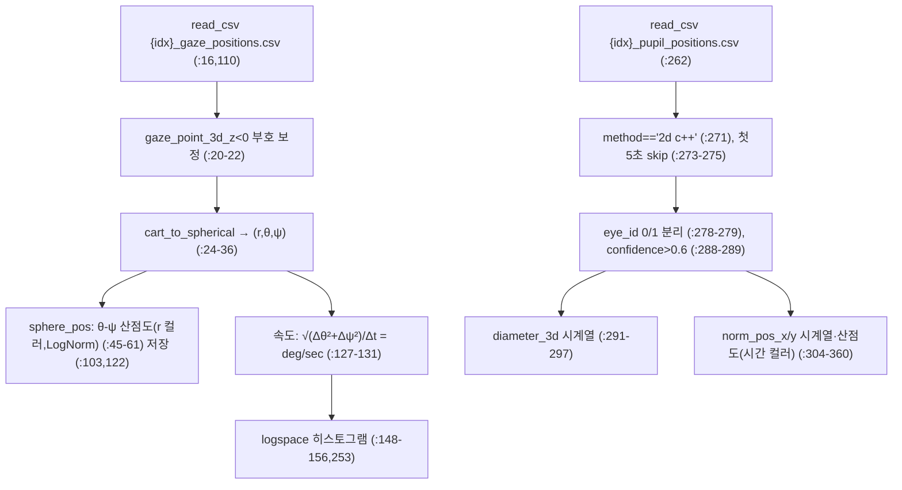

# eyegraph 모듈 통합 가이드 (S-PyTorch)

> 1차 요약: [`../eyegraph.md`](../eyegraph.md) — 본 문서는 그 요약을 모듈(스크립트/함수) 단위로 심화한 S-PyTorch 변형 통합 가이드다.
> 분석 대상: `\\wsl.localhost\ubuntu-24.04\home\user\project\PRJXR-HBTXR\REF\XR-Eye-Tracking\Codebase\eyegraph`
> 관련 논문: [`../../Papers/EyeGraph.md`](../../Papers/EyeGraph.md) (EyeGraph, NeurIPS 2024 Datasets & Benchmarks Track, openreview YxuuzyplFZ)
> 작성 원칙: 실제 소스 Read/Grep 후 `파일:라인` 근거 표기. 라인 근거 없는 해석은 "추정", 코드로 확인 불가/부재는 "확인 불가"로 명시. 정확도(p-accuracy/클러스터 품질)는 README/논문 인용, 미실행·미구현 수치는 "확인 불가".

---

## 0. 문서 머리말

### 0.1 대표 케이스 선정 + 근거 (★ 형제 가이드와의 근본적 비대칭)

형제 가이드(cb-convlstm)는 **학습 가능한 PyTorch 모델**(ConvLSTM 4단 + FC head)을 대상으로 params·MAC·activation을 산정했다. **eyegraph는 그 대칭이 성립하지 않는다.** 본 repo의 `src/`에는 **PyTorch 모델·학습 루프·논문 핵심 알고리즘이 전혀 없다.**

- **실재하는 커스텀 소스 = 정확히 3개 .py** (Glob 전수 확인, `src/*.py`):
  - `src/noise_analysis.py` (1~173) — DVS 이벤트 노이즈 필터 3종 비교 실험
  - `src/gt_annotator.py` (1~106) — 동공 중심 수동 클릭 GT 라벨링 도구
  - `src/pupil_gaze_analysis.py` (1~362) — Pupil-Core 기준데이터 시선/동공 통계·플롯
- **부재(확인됨)**: 논문 핵심(GMM 동적 그래프 구성 + Hawkes 엣지 + VGAE/modularity-aware 클러스터링 + tube-RANSAC)의 **구현 코드가 repo에 없다.** Grep `GaussianMixture|modularity|VGAE|GCN|RANSAC|networkx|torch_geometric|GMM` 결과: 매칭 파일 = `README.md`·`EyeGraph_DatasetDetails.md` **마크다운 2개뿐**, **어떤 .py에서도 0건**. `src/Readme.md:1`은 "EyeGraph method codes" 한 줄이나, 실제 method 코드 파일은 존재하지 않는다(별도 미공개 추정).
- **`src/sample_interactive_graph.html`** = Plotly.js v2.24.1로 내보낸 **자가완결 시각화 산출물**(`:4-6`, scatter3d+line+marker 트레이스 `:12`). 시공간 그래프(노드=marker, 엣지=line, 축=[t,x,y])의 **렌더 결과물**이지 구성 코드가 아니다. 2.3M 토큰(plotly.min.js + 임베드 데이터 인라인) → 본문 미열람, head/trace만 Grep로 식별.

> **대표 선정**: 본 repo는 **데이터셋 공개 + 전처리/주석/분석 유틸리티 저장소**다. 따라서 "대표 모델"이 아니라 **대표 유틸리티 3종**을 모듈로 해부하고(2~4절), 논문 알고리즘은 **코드 부재를 명시한 채 paper 기반으로 재구성**(5절)한다. cb-convlstm의 "trained 경로 / 논문 핵심 경로" 분리와 동형이되, eyegraph는 **"실재 유틸 경로 / 부재 알고리즘 경로"**로 분리된다.

### 0.2 수치 표기 규약 (S-PyTorch) — 본 repo 적용 결과

| S-PyTorch 항목 | cb-convlstm | eyegraph(본 repo) | 근거 |
|---|---|---|---|
| **params** | 차원 산정 0.417M | **N/A(학습 파라미터 없음)** — 3개 .py 모두 신경망 미정의 | Grep `nn\.`/`torch` 0건, 3.x절 |
| **FLOPs/MACs** | 2.44 GMAC/시퀀스 | **확인 불가** — 모델 부재. 논문도 FLOPs 미보고 | EyeGraph.md:59 "latency 보고 없음" |
| **activation memory** | combined_conv 지배 | **N/A** — 텐서 그래프 없음(스크립트는 이벤트 배치·CSV DataFrame만) | 3.x절 |
| **그래프 구성(노드/엣지)** | — | **논문 식만 존재(코드 부재)**. 노드=이벤트 $e_i$, 위치 $[\lambda_1 t,\lambda_2 x,\lambda_3 y]\in\mathbb{R}^3$, 특징 $\mathbb{R}^4$ | EyeGraph.md:26, README.md:10 |
| **클러스터링 복잡도** | — | **논문 알고리즘만**: GMM(BIC) + VGAE GCN message passing + modularity 행렬 B + tube-RANSAC. 구현 부재 → 복잡도 코드 검증 불가 | EyeGraph.md:31,38-40 |
| **이벤트 표현** | 누적 프레임 `[B,T,1,60,80]` | **두 갈래**: ① 논문=비동기 spatio-temporal 그래프(point cloud), ② 본 repo 코드=`EventVisualizer.generateImage` 누적 프레임 이미지(`noise_analysis.py:93`, `gt_annotator.py:48`) | — |
| **정확도** | 논문 p3/p5/p10 인용 | 논문 p1/p5/p10·SC/DB/Mo/Cd 인용(5.4절). **본 repo 미실행·미구현 → 확인 불가** | EyeGraph.md:44-55 |

### 0.3 운영 경로 (데이터셋 ↔ 유틸리티 ↔ [부재] 방법론)

```
[원시 이벤트: *.aedat4  (DAVIS346 DVS 346×260, grayscale 30FPS, IMU, trigger)]   ───┐
   │  dv_processing.MonoCameraRecording.getNextEventBatch (배치 단위 이벤트)            │
   ▼                                                                                  │
[① noise_analysis.py] BackgroundActivity/FastDecay/RefractoryPeriod 필터 3종           │
   │  → reduction factor 평균(np.mean) 비교  (전처리 파라미터 탐색)                     │
   ▼                                                                                  │
[② gt_annotator.py] EventVisualizer.generateImage → 180° 회전 → 사람이 동공 중심 클릭   │
   │  → {frame, center_x, center_y, radius=50} JSON append (in-the-wild GT)            │
   ▼                                                                                  │
[데이터셋 산출: annotations_*.json (in-the-wild 동공 GT) + Pupil-Core export CSV]       │
   │                                                                                  │
[③ pupil_gaze_analysis.py] Pupil-Core CSV → 구면좌표/시선속도/동공지름 통계·플롯 ◄──────┘
   │  (검증용 기준데이터 분석, 40명 subject 루프)
   ▼
[★ 부재: 논문 방법론]  이벤트 → GMM 동적 그래프 → VGAE+modularity 클러스터 → tube-RANSAC 동공중심
   └─ 구현 코드 repo에 없음(확인됨). sample_interactive_graph.html은 그래프 "렌더 결과"만 제공.
```
- **진입점(실재)**: 세 스크립트 모두 **하드코딩 경로 후 직접 실행**(CLI/argparse 없음). `noise_analysis.py:10` `directory='./userStudy_eyeTracking_Davis346'`; `gt_annotator.py:18` `filename="/file/path"`(플레이스홀더); `pupil_gaze_analysis.py:14` `/content/...`(Colab).
- **진입점(부재)**: 학습/추론/평가 CLI 없음. p-accuracy·Silhouette 등 메트릭 계산 코드 부재(확인됨).

### 0.4 모델 / 데이터셋 / 정확도 요약

| 항목 | 값 | 근거 |
|---|---|---|
| 입력(코드) | DVS 이벤트 배치(aedat4) + Pupil-Core CSV | `noise_analysis.py:23,64`, `pupil_gaze_analysis.py:16` |
| 입력(논문) | 비동기 이벤트 $e_i=(x,y,p,t)$ → 동적 그래프 | EyeGraph.md:26 |
| 출력(코드) | 노이즈 reduction factor·동공 GT JSON·시선/동공 플롯 | `:108`, `gt_annotator.py:89-97`, `pupil_gaze_analysis.py:103` |
| 출력(논문) | 동공 중심 좌표(클러스터→tube-RANSAC) | EyeGraph.md:40 |
| 모델 | **없음**(본 repo). 논문=GMM+VGAE+RANSAC 파이프라인 | 0.1절, EyeGraph.md:38-40 |
| params / FLOPs | **N/A / 확인 불가** | 0.2절 |
| 데이터셋 | EyeGraph 40명, 3 셋업(lab·조명변화·이동성), 다중모달 | DatasetDetails.md:28-34, README.md:28 |
| 센서 | DAVIS346 DVS 346×260 + grayscale 30FPS + IMU + trigger + Pupil-Core 기준 | `noise_analysis.py:8`, DatasetDetails.md:171 |
| 메트릭(논문) | SC↑/DB↓/Mo↑/Cd↓(클러스터), p1/p5/p10↑·l1/l2↓(동공) | EyeGraph.md:44 |
| 정확도(논문, 3ET+) | **Ours(비지도) p10=91.45, p5=89.22, p1=28.34, l2=3.88** | EyeGraph.md:53 (본 repo 미구현 → 확인 불가) |
| 정확도(논문, EyeGraph 셋) | Ours p10=93.67 vs MambaPupil(supervised) 95.88 | EyeGraph.md:55 |

---

## 1. Repo / Layer 개요 (그래프 구성 / 클러스터링 맵)

eyegraph = **이벤트 카메라 기반 비지도 시선추적 데이터셋**의 공개 저장소 + 전처리/주석/분석 **유틸리티 3종**. 논문 방법(modularity-aware 시공간 그래프 클러스터링)은 **이름과 결과 시각화만** 동봉되고 **구현은 부재**하다(0.1절). HW 커널·CUDA·PyTorch **전부 무의존**(순수 NumPy/OpenCV/pandas + iniVation `dv_processing` SDK).

### 1.1 파일 역할 맵

| 구분 | 파일 | 역할 | 메인 사용 |
|---|---|---|---|
| **① 이벤트 전처리(노이즈)** | `src/noise_analysis.py` | DVS 노이즈 필터 3종 reduction factor 비교 | ★ 전처리 파라미터 탐색 |
| **② GT 라벨링 도구** | `src/gt_annotator.py` | 이벤트 프레임 위 동공 중심 수동 클릭 → JSON | ★ in-the-wild GT 생성 |
| **③ 기준데이터 분석** | `src/pupil_gaze_analysis.py` | Pupil-Core CSV → 구면좌표/속도/동공지름 플롯 | ★ 논문 figure·검증 |
| **그래프 시각화 산출물** | `src/sample_interactive_graph.html` | Plotly scatter3d 시공간 그래프 렌더(데이터 인라인) | 결과물(코드 아님) |
| **데이터셋 문서** | `README.md`, `EyeGraph_DatasetDetails.md` | 초록·비교표·수집 프로토콜·파일 구조 | ★ 데이터셋 명세 |
| **메타** | `src/Readme.md`("method codes" 1줄), `resources/Readme.md`, `LICENSE.txt` | 안내 | — |
| **[제외]** | `.git/`, `resources/EyeGraph_overview.png`, aedat4·CSV 원본 데이터 | 버전관리·바이너리·외부 데이터 | 제외 |
| **[부재·확인됨]** | GMM/VGAE/modularity/RANSAC 구현, 학습·평가 루프, 모델 정의 | 논문 핵심 알고리즘 | repo에 없음 |

### 1.2 "그래프 구성 / 클러스터링" 맵 (논문 기준, 코드 부재)

```
이벤트 e_i=(x,y,p,t)  ──[노드화]──►  노드 위치 p_v=[λ1 t, λ2 x, λ3 y]∈R³, 특징 ∈R⁴   (EyeGraph.md:26)
        │
   [동적 임계 엣지 구성]  공간-시간 거리 분포를 GMM(최대 c=5 클러스터, BIC 최소화)으로 적합
        │                ξ1 = λ·min(μ_i − 3σ_i)  → 공간엣지 ‖p_vi−p_vj‖≤ξ1 (동시각±δ, degree≤N)
        │                시간엣지(directed) λ1(t_j−t_i)≤ξ2  + Hawkes 프로세스 엣지 특징
        ▼               (EyeGraph.md:31-34)
   [VGAE + modularity 클러스터링]  GCN 인코더 X^(l+1)=η(Ã X^(l) W^(l)); q(Z|X,A)=ΠN(μ_i,σ_i²)
        │                결합손실 L = γ1·재구성 − γ2·Tr(BXXᵀ)/2m − γ3·KL   (EyeGraph.md:38-39)
        ▼
   [tube-model RANSAC]  홍채+동공의 시공간 tube(원기둥+토러스) 궤적 중심선 추정 → 동공 (x,y)
                         (EyeGraph.md:40)
```
> **위 박스 전체가 코드로는 부재**. 본 repo가 제공하는 것은 박스 진입 직전(이벤트 노이즈 필터·GT 라벨)과 검증(Pupil-Core 분석), 그리고 박스 출력의 시각화(html)뿐.

### 1.3 제외 목록
- **외부 데이터/바이너리**: `*.aedat4`(이벤트 원본), Pupil-Core export CSV, `eye0/1.mp4`, `.npy`, `resources/EyeGraph_overview.png`, `.git/`.
- **외부 프레임워크 원본**: `dv_processing`(iniVation DV SDK), OpenCV·numpy·pandas·seaborn·matplotlib·IPython(import만, 본 repo 소스 아님).
- **산출물(코드 아님)**: `sample_interactive_graph.html`(Plotly 렌더 결과, 2.3M 토큰 — 본문 비분석, 라이브러리·trace만 식별).
- **부재로 분석 불가**: 논문 핵심 알고리즘 구현 일체(5절에서 paper 기반 재구성만).

---

## 2. 모듈: 이벤트 노이즈 필터 비교 — `noise_analysis.py`

### 2.1 역할 + 상위/하위
- **역할**: 동일 DVS 이벤트 스트림에 3종 노이즈 필터를 적용해 각 필터의 **reduction factor(폐기 이벤트 비율)** 평균을 비교. 그래프 구성 전 **전단(front-end) 전처리 파라미터 탐색**용 실험 스크립트.
- **상위**: 없음(최상위 실행 스크립트, `__main__` 구조 없이 모듈 로드 시 즉시 실행). **하위**: `dv_processing`의 `MonoCameraRecording`(I/O), `noise.*Filter`(필터), `visualization.EventVisualizer`(시각화), `cv2`(표시).
- **PyTorch/신경망 요소 0**(Grep 확인). 순수 SDK 호출 + numpy 평균.

### 2.2 데이터플로우 (이벤트 배치 단위)

```mermaid
flowchart LR
  DIR["os.listdir(directory) .aedat4 순회 (:17-19)"] --> RD["MonoCameraRecording (:23)"]
  RD --> CHK["스트림 점검: event/frame/IMU/trigger (:29-52)"]
  CHK --> BATCH["while isRunning: getNextEventBatch (:62-64)"]
  BATCH --> F1["BackgroundActivityNoiseFilter(100ms) (:76)"]
  F1 --> RF1["getReductionFactor → noise_1[] (:87)"]
  RF1 --> VIZ["EventVisualizer.generateImage(in/out) (:93-94)"]
  VIZ --> SHOW["hconcat → imshow → waitKey (:97-102, 블로킹)"]
  SHOW --> M1["np.mean(noise_1) (:108)"]
  M1 --> F2["FastDecayNoiseFilter(halfLife100ms,subdiv4,th1.0) (:122-125) → noise_2 (:134)"]
  F2 --> F3["RefractoryPeriodFilter(100ms) (:162) → len(filtered)/len(events) (:171)"]
```


### 2.3 forward call stack (실행 흐름)
```
(module load)
├─ for file in os.listdir (:17) → MonoCameraRecording (:23)
│  ├─ isEventStreamAvailable/getEventResolution (:29-34)  [resolution 갱신, 그래프 X]
│  └─ while isRunning (:62) → getNextEventBatch (:64)
│     ├─ BackgroundActivityNoiseFilter.accept/generateEvents (:76-82)
│     ├─ noise_1.append(getReductionFactor()) (:87)
│     └─ EventVisualizer → hconcat → imshow → waitKey() (:90-102)
├─ print(np.mean(noise_1)) (:108)   ← 단일 파일(./3.aedat4)로 F2 재실행 (:106,112-150)
└─ F3 RefractoryPeriodFilter 루프 → print(np.mean(noise_3)) (:152-173)
```

### 2.4 대표 코드 위치
`:8`(해상도 346×260 하드코딩), `:76`(BG filter), `:122-125`(FastDecay), `:162`(Refractory), `:108/150/173`(평균 출력).

### 2.5 대표 코드 블록

**(a) 노이즈 필터 3종 정의 (`:76`, `:122-125`, `:162`)**
```python
filter = dv.noise.BackgroundActivityNoiseFilter(resolution, backgroundActivityDuration=timedelta(milliseconds=100))  # :76
filter = dv.noise.FastDecayNoiseFilter(resolution, halfLife=timedelta(milliseconds=100), subdivisionFactor=4, noiseThreshold=1.0)  # :122-125
filter = dv.RefractoryPeriodFilter(resolution, timedelta(milliseconds=100))  # :162
```
→ 세 필터 모두 100ms 시정수. **HW 친화 포인트**: BackgroundActivity·Refractory는 픽셀별 마지막-타임스탬프 메모리 + 비교 로직으로 FPGA에 직접 매핑되는 표준 DVS 전처리 IP(8.2절). subdivisionFactor=4·noiseThreshold=1.0은 데모 기본값(**추정**).

**(b) reduction factor 누적·평균 (`:87`, `:171-173`)**
```python
noise_1.append(filter.getReductionFactor())            # SDK 제공 폐기율 (:87)
...
noise_3.append(len(filtered)/len(events))              # 직접 산정 잔존율 (:171)
print(np.mean(noise_3))                                # 평균 출력 (:173)
```
→ noise_1/noise_2는 SDK `getReductionFactor()`, noise_3는 `잔존수/입력수`(**의미 반대** — reduction이 아닌 retention, 직접 비교 시 보정 필요, **추정/주의**).

### 2.6 연산 분해 + 정량
- **params 없음**(전처리 스크립트). 비용은 이벤트 I/O + 필터 + 시각화.
- **이벤트 표현**: 배치 단위 이벤트(`getNextEventBatch`, `:64`) → 필터 → `generateImage`로 누적 프레임 이미지화(`:93`). 해상도 346×260(`:8`, 단 실제는 `getEventResolution`로 덮어씀 `:31`).
- **정량(reduction factor 평균값)**: 데이터 의존 + **본 repo 미실행 → 확인 불가**(로깅 print만, `:108/150/173`).
- **실행성 한계(확인됨)**: `cv.waitKey()`(`:102,149`) 인자 없음 = 키 입력까지 **무한 블로킹** → 자동 배치 분석 불가, 대화형 전용. noise_2/noise_3는 첫 루프에서 정의된 `noise_2=[]`(`:58`)를 단일 파일 경로(`./3.aedat4` `:106`)로 재사용 → 첫 루프 미진입 시 NameError 위험(**추정**).

---

## 3. 모듈: 동공 GT 수동 주석 도구 — `gt_annotator.py`

### 3.1 역할 + 상위/하위
- **역할**: 이벤트 누적 프레임을 사람이 보고 **동공 중심을 2회 클릭**해 ground-truth 좌표를 JSON으로 저장. 데이터셋의 in-the-wild 녹화(`annotations_[subject][X]_dvSave.json`, DatasetDetails.md:105,176)에 대응하는 GT 생성기.
- **상위**: 없음(최상위). **하위**: `dv_processing`(I/O·visualizer), `cv2`(창·마우스콜백·circle), `json`.

### 3.2 데이터플로우

```mermaid
flowchart LR
  RD["MonoCameraRecording(filename) (:20)"] --> VIZ["EventVisualizer + 색상(흰/iniBlue/darkGrey) (:24-27)"]
  VIZ --> LOOP["while isRunning: getNextEventBatch (:39-41)"]
  LOOP --> GATE["event_count>1000 프레임만 (:46)"]
  GATE --> IMG["generateImage → 180°회전(2×90° CW) (:48-50)"]
  IMG --> CLICK["setMouseCallback on_mouse_click (:55) → 좌클릭 2회 수집 (:12-16,59)"]
  CLICK --> CTR["center=coords[0], radius=50 고정 (:71-72)"]
  CTR --> JSON["{frame,filename,center_x,center_y,radius} append (:80-97)"]
  GATE -->|q종료/s스킵| LOOP
```


### 3.3 forward call stack
```
(module load)
├─ on_mouse_click 정의 (:12-16): LBUTTONUP 시 mouse_coordinates.append, 2개면 콜백 재설정
├─ MonoCameraRecording(filename="/file/path") (:18-20)  ← 플레이스홀더 경로
├─ EventVisualizer 색상 설정 (:24-27)
├─ output_file = annotations_{datetime}.json (:31-33)  ← 파일명에서 datetime 추출
└─ while isRunning (:39) → getNextEventBatch (:41)
   └─ if event_count>1000 (:46):
      ├─ generateImage → rotate×2 (:48-50)
      ├─ imshow + setMouseCallback (:53-55)
      ├─ while len(coords)<2: waitKey(1) [q종료/s스킵] (:59-66)
      └─ center=coords.pop(0); radius=50; circle; json.dump+'\n' (:71-97)
```

### 3.4 대표 코드 위치
`:12-16`(마우스 콜백), `:46`(이벤트 수 게이트), `:48-50`(프레임 생성·회전), `:71-72`(중심·반경), `:80-97`(JSON append).

### 3.5 대표 코드 블록

**(a) 이벤트 프레임 생성·정렬 (`:46-50`)**
```python
if event_count > 1000:                         # 희소 프레임 폐기(노이즈/blink 회피, 추정)
    frame = visualizer.generateImage(events)   # 이벤트 배치 → 누적 프레임 이미지
    frame = cv.rotate(frame, cv.ROTATE_90_CLOCKWISE)   # 90°×2 = 180° 회전
    frame = cv.rotate(frame, cv.ROTATE_90_CLOCKWISE)   # (카메라 우안 부착 방향 보정, 추정)
```
→ event_count>1000(`:46`) 임계로 정보량 낮은 프레임 제외. 180° 회전은 DAVIS가 우안 인접·HMD 부착(DatasetDetails.md:28)인 광학 방향 보정으로 **추정**.

**(b) GT 좌표·반경 + JSON append (`:70-97`)**
```python
center_coordinates = mouse_coordinates.pop(0)  # 첫 클릭 = 동공 중심
radius = 50                                    # ★ 반경 고정 50 (타원피팅 없음)
annotations.append({"frame_number":..., "center_x":..., "center_y":..., "radius":radius})
with open(output_file, "a") as jsonfile:       # 프레임마다 즉시 append (:89)
    json.dump({...}, jsonfile); jsonfile.write('\n')
```
→ **반경 고정 50**(`:72`): 본 repo에는 ellipse fitting/동공 크기 추정이 없음(GT는 중심점만 유효, 반경은 표시용 상수). 두 번째 클릭은 콜백 종료 트리거로만 쓰이고 좌표는 미사용(`:15,70`) — 코드상 "2회 클릭으로 중심+반경 산정" 의도는 **미구현**(**확인됨**, 반경은 하드코딩 50).

### 3.6 연산 분해 + 정량
- **params 없음**. 출력: 프레임당 JSON 1행(`{frame,filename,center_x,center_y,radius}`, `:90-96`).
- **이벤트 표현**: `generateImage` 누적 프레임(논문의 비동기 그래프 표현과 **다름** — 라벨링 편의상 프레임화).
- **GT 정량**: 클릭 의존(주관적), 반경 상수 50 → 동공 **중심 좌표만 신뢰**. 프레임율↔라벨율 매칭은 event_count>1000 게이트가 결정(데이터 의존 → 프레임 수 확인 불가).

---

## 4. 모듈: 기준데이터(Pupil-Core) 분석 — `pupil_gaze_analysis.py`

### 4.1 역할 + 상위/하위
- **역할**: 검증용 기준 아이트래커 **Pupil-Core**의 export CSV(`*_gaze_positions.csv`, `*_pupil_positions.csv`)에서 시선 방향(구면좌표)·시선 속도·동공 지름·동공 위치를 산출·플롯. 논문 figure 및 이벤트 추적기 **검증 기준**을 만드는 분석 노트북(Colab `/content/` 경로 `:14`).
- **상위**: 없음(최상위). **하위**: pandas(CSV), numpy(수치), seaborn/matplotlib(플롯), IPython.display(`:268`, Colab).
- **40명 subject 루프** 3회(`:109-123` 시선 산점도, `:161-196` 속도 히스토그램, `:206-256` 통계 집계).

### 4.2 데이터플로우


### 4.3 forward call stack (분석 흐름)
```
(module load)
├─ cart_to_spherical (:24-36): r=√(x²+y²+z²), θ=arccos(y/r), ψ=arctan2(z,x)
├─ sphere_pos / sphere_pos_over_time (:38-61): 산점도·시계열 플롯
├─ 단일 idx="10" gaze 플롯 (:12-106)
├─ for index 1..40 gaze 산점도 저장 (:109-123)
├─ Gaze Velocity: np.diff(θ,ψ)/np.diff(ts) (:127-131) → 히스토그램 (:148-156)
├─ for index 1..40 속도 히스토그램 저장 (:161-196)
├─ for index 1..40 min/max/mean 속도 집계 (:206-256)
└─ Pupil: method 필터·5초skip·eye분리·conf>0.6 → diameter/norm_pos 플롯 (:257-360)
```

### 4.4 대표 코드 위치
`:24-36`(구면좌표 변환), `:127-131`(시선 속도), `:271-289`(동공 필터 체인), `:291-360`(동공 플롯).

### 4.5 대표 코드 블록

**(a) 3D gaze → 구면좌표 (`:24-36`)**
```python
r = np.sqrt(x**2 + y**2 + z**2)
theta = np.arccos(y / r)     # Z축 기준 elevation
psi = np.arctan2(z, x)       # azimuth
```
→ z<0 사전 부호 보정(`:20-22`, Pupil-Core 좌표계 절반구 정렬). 시선 방향을 (θ,ψ)로 환산해 산점도/속도 계산의 기반.

**(b) 시선 속도(saccade/fixation 구분 근거) (`:127-131`)**
```python
deg_diff = np.sqrt(np.diff(theta)**2 + np.diff(psi)**2)   # 각거리 차분
deg_per_sec = deg_diff / np.diff(gaze_timestamp)          # deg/sec
```
→ 논문 배경의 saccade(수백 deg/s)·fixation 구분 근거(EyeGraph.md:12, 가속 24,000°/s²). logspace bin 히스토그램(`:144,253`)으로 분포 시각화.

**(c) 동공 데이터 필터 체인 (`:271-289`)**
```python
detector_3d_data = pupil_pd_frame[pupil_pd_frame.method == '2d c++']   # :271
start_time = ts.iloc[0] + 5; data = data[data.pupil_timestamp > start_time]  # 3D 수렴 위해 첫5초 skip :273-275
eye0_df = data[data.eye_id == 0]; eye1_df = data[data.eye_id == 1]     # 좌/우안 분리 :278-279
eye0_high_conf = eye0_df[eye0_df.confidence > 0.6]                      # 신뢰도 필터 :288
```
→ Pupil-Core 표준 후처리(메서드 선택·워밍업 skip·신뢰도 게이트). `method=='2d c++'` 주석은 "3d" 의도이나 실제 2D 필터(코드-주석 불일치, **확인됨**).

### 4.6 연산 분해 + 정량
- **params 없음**(분석 스크립트). 비용: CSV I/O + numpy 벡터 연산 + matplotlib 렌더.
- **정량**: subject 40명 루프(`:109,161,206`), confidence>0.6·5초 skip 필터(`:288,273`). 산출 통계값(min/max/mean 속도)은 데이터 의존 + **본 repo 미실행 → 확인 불가**.
- **이벤트 무관**: 본 모듈은 **이벤트가 아닌 Pupil-Core(프레임 기반) 기준데이터** 분석 → 논문 그래프 파이프라인과 직접 연결 없음(검증/figure 전용).

---

## 5. 모듈: 논문 핵심 알고리즘 — GMM 그래프 구성 + modularity-aware 클러스터링 (★ 코드 부재, paper 재구성)

> **본 절은 repo 코드가 아니라 논문(EyeGraph.md) 기반 재구성이다.** Grep로 GMM/VGAE/modularity/RANSAC/networkx/torch_geometric의 **.py 매칭 0건**(마크다운만)을 확인했다. 따라서 아래 모든 수치·구조는 **논문 인용**이며, 코드 검증·실행은 **확인 불가**. cb-convlstm 5절(delta encoder)과 동형 위치이나, cb-convlstm은 셀이 실재(미결선)한 반면 eyegraph는 **파일 자체가 부재**라는 점이 결정적 차이.

### 5.1 이벤트 → 동적 그래프 구성 (그래프 정밀 해부, 논문)
- **노드**: 각 이벤트 $e_i=(x_i,y_i,p_i,t_i)$가 1노드. 위치 $p_{v_i}=[\lambda_1 t_i,\lambda_2 x_i,\lambda_3 y_i]\in\mathbb{R}^3$, 특징 $[\lambda_1 t_i,\lambda_2 x_i,\lambda_3 y_i,p_i]\in\mathbb{R}^4$ (EyeGraph.md:26). → 희소·비동기 spatio-temporal point cloud (`sample_interactive_graph.html`의 scatter3d가 이 [t,x,y] 공간을 렌더, 0.1절).
- **동적 임계 엣지(핵심)**: 고정반경/kNN 회피 → 공간-시간 거리 분포를 **GMM**으로 적합 $\mathcal{N}(\mu_a,\sigma_a)=\sum_a\pi_a\mathcal{N}(x|\mu_a,\sigma_a)$, **BIC 최소화**, 최대 클러스터 **c=5**(동공/홍채/상하 눈꺼풀·속눈썹/눈썹). 동적 임계 $\xi_1=\lambda\times\min(\mu_i-3\sigma_i)$ (EyeGraph.md:31-32).
  - **공간 엣지**: $\|p_{v_i}-p_{v_j}\|\le\xi_1$ (동일 시각 ±δ, 노드 degree ≤ N).
  - **시간 엣지(directed)**: $\lambda_1(t_j-t_i)\le\xi_2$ ($t_i<t_j$) + 공간 이웃 조건 → 그래프의 시간 진화 반영 (EyeGraph.md:33).
  - **엣지 특징**: Hawkes 프로세스 기반 attribution(과거 이벤트 영향을 decay factor로 누적, EyeGraph.md:34).

### 5.2 비지도 modularity-aware 클러스터링 (논문)
- **VGAE**: GCN 인코더 message passing $X^{(l+1)}=\eta(\tilde A X^{(l)}W^{(l)})$, $q(Z|X,A)=\prod_i\mathcal{N}(z_i|\mu_i,\mathrm{diag}(\sigma_i^2))$, 디코더 $p(A_{ij}=1|z_i,z_j)=\eta(z_i^\top z_j)$ (EyeGraph.md:38).
- **결합 손실**: $L=\gamma_1\mathbb{E}_q[\log p(A|Z)]-\gamma_2\frac{\mathrm{Tr}(BXX^\top)}{2m}-\gamma_3\,\mathrm{KL}[q\|p]$ — ①엣지 재구성(topology), ②modularity 행렬 $B$ 기반 클러스터 멤버십(모듈성 최대화), ③KL 정규화 (EyeGraph.md:39).
- **동공 좌표 추정**: 홍채+동공의 시공간 tube(원기둥+토러스) 궤적 → **tube-model RANSAC**으로 중심선 추정 → 동공 (x,y) (EyeGraph.md:40).

### 5.3 S-PyTorch 수치 규약 적용 (논문 기준, 코드 검증 불가)
- **그래프 구성 복잡도**: GMM 적합은 EM 반복(노드 수 n, 성분 c=5) — 거리행렬 상삼각 추출 $O(n^2)$ + EM $O(n\cdot c\cdot \text{iter})$. **코드 부재로 실제 n·iter 확인 불가**(추정/논문 기반).
- **클러스터링 복잡도**: GCN message passing = $O(|E|\cdot d_h)$/layer(희소 인접). VGAE 학습 반복 + RANSAC 반복(비결정) → **비결정적 지연**(EyeGraph.md:59 "연산 무겁고 비결정적, latency 보고 없음").
- **params / FLOPs / activation**: 논문·코드 모두 **미보고 → 확인 불가**. cb-convlstm처럼 차원 산정 불가(레이어 정의 부재).
- **이벤트 표현**: 비동기 그래프(논문) — voxel/누적프레임/SSM 아님. 단 본 repo 코드는 라벨링·시각화 편의상 누적 프레임(`generateImage`)을 사용(표현 이원성, 0.2절).

### 5.4 정확도 (논문 인용, 본 repo 미구현)
- **클러스터 품질**(EyeGraph.md:44-46): Silhouette↑/Davies-Bouldin↓/Modularity↑/Conductance↓. Ours = EyeGraph SC 0.66·Mo 69.34·Cd 11.30, EBV-Eye Mo 75.70·Cd 5.07.
- **동공 좌표(3ET+, EyeGraph.md:53)**: Ours(비지도) **p10=91.45, p5=89.22, p1=28.34, l2=3.88, l1=4.24**. supervised 최고 MambaPupil(p10=99.42)·bigBrains(p10=99.00) 대비 p10 ~8%↓이나 **비지도 중 최고**(DMoN p10=77.45 대비 +14%, EyeGraph.md:54).
- **자체 EyeGraph 셋(조명/이동, EyeGraph.md:55)**: Ours p10=93.67 vs MambaPupil(supervised) 95.88 → 라벨 없이 2%차 근접·강건.
- **본 repo 미실행·미구현 → 위 수치 재현 불가, 전부 논문 인용**.

### 5.5 결선 공백 (확인됨)
- **방법론 코드 전무**: 모델·학습·평가·그래프 구성·클러스터링 어느 것도 repo에 없음(Grep 전수). `src/Readme.md:1` "EyeGraph method codes"는 **명칭만**, 실파일 부재 → 재현·이식 출발점으로 **사용 불가**(별도 미공개 추정). 재현하려면 paper + supplementary(README.md:5 링크) + 외부 GNN 프레임워크(torch_geometric 등)로 **처음부터 구현** 필요.

---

## 6. 모듈 한눈표

| # | 모듈 | 파일:라인 | 역할 | 대표 정량 |
|---|---|---|---|---|
| 2 | 이벤트 노이즈 필터 비교 | noise_analysis.py:1-173 | BG/FastDecay/Refractory 3종 reduction factor | params 0 / reduction 평균(미실행→확인불가) |
| 3 | 동공 GT 수동 주석 | gt_annotator.py:1-106 | 이벤트프레임 클릭 → JSON GT | params 0 / 반경 고정 50, event>1000 게이트 |
| 4 | Pupil-Core 기준 분석 | pupil_gaze_analysis.py:1-362 | 구면좌표·시선속도·동공지름 플롯 | params 0 / 40명 루프, conf>0.6·5초skip |
| 5 | **[부재]** GMM그래프+modularity클러스터 | (repo에 .py 없음) | 논문 핵심 알고리즘 | params/FLOPs 확인불가 / 논문 p10=91.45(3ET+) |
| — | 시공간 그래프 시각화 | sample_interactive_graph.html | Plotly scatter3d 렌더 결과물(코드 아님) | 2.3M토큰(plotly v2.24.1 인라인) |
| — | 데이터셋 명세 | README.md / EyeGraph_DatasetDetails.md | 40명·3셋업·다중모달 프로토콜 | DAVIS346, 348↔24 Lux, 56°×34° FoV |

---

## 7. 학습 · 평가 파이프라인 + 재현

### 7.1 학습 루프 — 부재 (확인됨)
- **학습/추론 코드 없음**: 비지도 방법(README.md:23)이며 본 repo에 모델 정의·학습 루프·optimizer·loss 일체 없음. cb-convlstm의 SmoothL1Loss/Adam/100ep 대응물 **전무**.
- **평가 메트릭 코드 없음**: p-accuracy/Silhouette/Modularity/Conductance 계산 부재(Grep 확인). 메트릭 정의·수치는 논문(EyeGraph.md:44) 의존.

### 7.2 평가 메트릭 (논문 정의, 코드 부재)
- 클러스터: SC↑(분리도), DB↓(클러스터 산포), Mo↑(modularity), Cd↓(conductance) — EyeGraph.md:44.
- 동공 좌표: p_k = `dist≤k px` 검출률(p1/p5/p10↑), Mean Euclidean(l2↓)·Manhattan(l1↓) — EyeGraph.md:44. cb-convlstm err_rate(`dist>k`)의 보수 대응(p_k = 1−err_rate_k 개념).

### 7.3 재현 명령 (실재 유틸리티만)
```bash
# 데이터셋 접근: 신청 폼 필요 (README.md:5,7)
# 의존성: pip install dv_processing opencv-python numpy pandas seaborn matplotlib

# ① 노이즈 필터 비교 (경로 하드코딩 수정 필요: noise_analysis.py:10)
python src/noise_analysis.py        # cv.waitKey() 블로킹 → 대화형, 키 입력 필요

# ② GT 라벨링 (filename 수정 필요: gt_annotator.py:18 "/file/path")
python src/gt_annotator.py          # 동공 중심 클릭 ×2, q=종료 s=스킵 → annotations_*.json

# ③ Pupil-Core 분석 (Colab 경로 /content/ 수정 필요: pupil_gaze_analysis.py:14)
python src/pupil_gaze_analysis.py   # CSV → 시선/동공 플롯 저장

# ★ 논문 방법론(GMM+VGAE+RANSAC) 실행 명령: 없음 (코드 부재, 5.5절)
```
- 세 스크립트 모두 **하드코딩 경로** 선수정 필요(0.3절). 정식 CLI/argparse 없음.

---

## 8. 우리 프로젝트(XR + FPGA 저지연) 시사점 + HW 이식성

> "XR 시선추적 + FPGA 저지연 on-device 가속" 맥락은 인벤토리 전반 가정(추정).

### 8.1 그래프 연산 HW 이식성 — cb-convlstm과 정반대 결론 (추정+논문)
- **부적합(논문 시사 + 추정)**: 논문 파이프라인(GMM 적합·BIC, VGAE message passing, tube-RANSAC)은 **동적 그래프·반복 최적화·비결정 제어흐름** 다수 → FPGA 저지연 데이터패스에 매핑 곤란, latency·전력 보고 전무(EyeGraph.md:59,62). cb-convlstm(정형 conv+게이트 dataflow, 9.1절)이 FPGA 1차 타깃으로 우월한 것과 **대조**.
- **결정론 부족**: 동적 노드 수·가변 엣지·RANSAC 반복 횟수가 입력 의존 → 파이프라인 II/지연 보장 불가(추정). 정적 systolic array·고정 dataflow와 상극.
- **그래프 연산 자체의 HW 난점**: 희소·불규칙 인접행렬의 message passing은 메모리 비국소성(gather/scatter) 지배 → DSP보다 **메모리 대역폭·랜덤액세스**가 병목(추정). FPGA보다 CPU/GPU 또는 전용 GNN 가속기 영역.

### 8.2 재사용 가능 자산 — 전단 전처리 IP (확인+추정)
- **이벤트 노이즈 필터의 HW화(유력)**: `noise_analysis.py:76,162`의 BackgroundActivity·RefractoryPeriod 필터는 **픽셀별 last-timestamp SRAM + 시간차 비교** 로직 → FPGA에 직접 매핑되는 표준 DVS 전처리 IP(흔한 구현). 우리 이벤트 가속기 **front-end 전처리**로 재사용 후보(확인된 필터 정의 + 추정 매핑).
- **이벤트→누적프레임 가교**: `EventVisualizer.generateImage`(`gt_annotator.py:48`, `noise_analysis.py:93`) 식 누적 프레임화는, 이벤트 입력을 우리 **기존 프레임 기반 경량 CNN/ConvLSTM FPGA 파이프라인**(cb-convlstm·EllSeg류)에 연결하는 현실적 변환 경로(추정). 논문의 비동기 그래프 표현은 회피하고 프레임 누적으로 결정론 확보.

### 8.3 데이터셋·검증 자산 (확인)
- **robustness 검증셋**: EyeGraph는 **조명변화(348↔24 Lux)·머리이동·사용자 이동성을 반영한 유일한 이벤트 시선 데이터셋**(README.md:28-31). 우리가 3ET+/EV-Eye로 학습한 경량 이벤트 추적기/FPGA IP의 **in-the-wild 일반화 평가**에 직접 활용(접근 신청 전제, README.md:7).
- **다중모달 기준**: 이벤트 + grayscale 30FPS + IMU + trigger + Pupil-Core GT(DatasetDetails.md:171) → 우리 IP 출력을 Pupil-Core 기준과 cross-modal 검증 가능(`pupil_gaze_analysis.py`의 분석 코드 재사용).
- **baseline 비교표**: 논문 Table 4(EyeGraph.md:50-53)에 MambaPupil/bigBrains/DMoN/Ours의 3ET+ p-accuracy 정리 → 우리 모델 정확도 비교표 작성 시 직접 인용 가능.

### 8.4 tube형 궤적 prior (확인)
- 동공/홍채가 시공간에서 **tube(원기둥) 궤적**을 형성한다는 관찰(EyeGraph.md:40,65)은 우리 입력 표현·트래킹 prior 설계에 참고. 단 tube-RANSAC 자체는 HW보다 **후처리(CPU)** 적합(추정).

### 8.5 결정: 알고리즘 이식 불가, 데이터·전처리·prior만 흡수 (종합)
- **알고리즘 직접 이식 = 불가**(① 코드 부재 5.5절, ② 부재가 아니어도 HW 부적합 8.1절). cb-convlstm처럼 "HLS/RTL 변환 출발점"으로 쓸 수 없음.
- **흡수 대상**: 노이즈 필터 IP(8.2), 데이터셋(8.3), tube prior(8.4). 비지도 학습 철학(라벨 없이 supervised 2%내 근접, EyeGraph.md:55,64)은 우리 시스템의 self/pseudo-label 보조 방향과 정합(추정).

---

## 9. 근거 표기 정리
- **확인됨(코드 라인)**: 커스텀 .py = 정확히 3개(Glob `src/*.py`); 노이즈 필터 3종(`noise_analysis.py:76,122-125,162`); GT 반경 고정 50·event>1000 게이트(`gt_annotator.py:46,72`); 동공 필터 체인 conf>0.6·5초skip(`pupil_gaze_analysis.py:271-289`); html = Plotly v2.24.1 scatter3d 렌더 산출물(`:4-6,12`).
- **★ 확인된 부재(가장 중요)**: 논문 핵심(GMM 그래프 구성·Hawkes 엣지·VGAE/modularity 클러스터링·tube-RANSAC) 구현, 모델 정의, 학습·평가 루프, 메트릭 계산 **일체가 repo에 없음**. Grep `GaussianMixture|modularity|VGAE|GCN|RANSAC|networkx|torch_geometric|GMM` = .py 매칭 0건(마크다운만). PyTorch/`nn.` 사용 0.
- **추정(라인 근거 없는 해석)**: gt_annotator 180° 회전 의도; event>1000 임계 의미; noise_3 retention vs reduction 부호; 노이즈 필터 FPGA 매핑; 알고리즘 HW 부적합; tube prior 활용.
- **확인 불가(미실행/부재/미열람)**: reduction factor·시선속도·클러스터 품질 실측값; 논문 알고리즘 params/FLOPs/latency(논문도 미보고); `sample_interactive_graph.html` 본문(2.3M 토큰, 라이브러리·trace만 식별); 데이터셋 원본(신청 폼 필요).
- **인용(논문 EyeGraph.md / README.md)**: 노드 위치 $[\lambda_1 t,\lambda_2 x,\lambda_3 y]$·특징 $\mathbb{R}^4$; 동적 임계 $\xi_1=\lambda\min(\mu-3\sigma)$·c=5·BIC; VGAE 결합손실 $L=\gamma_1\cdot\text{재구성}-\gamma_2\cdot\text{Tr}(BXX^\top)/2m-\gamma_3\text{KL}$; 정확도 Ours p10=91.45(3ET+)·93.67(EyeGraph); 데이터셋 40명·3셋업·DAVIS346·348↔24 Lux.
