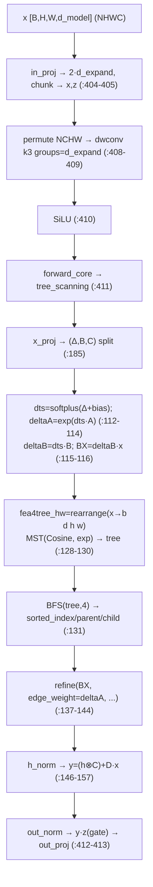
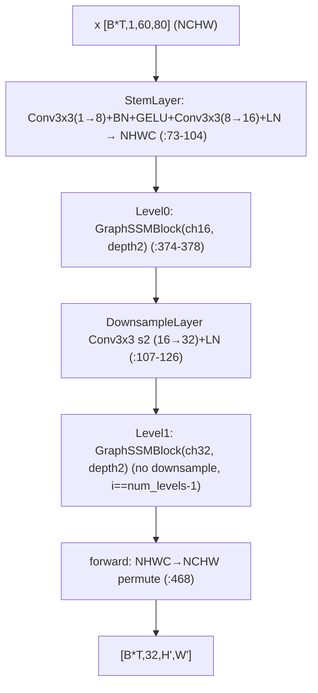
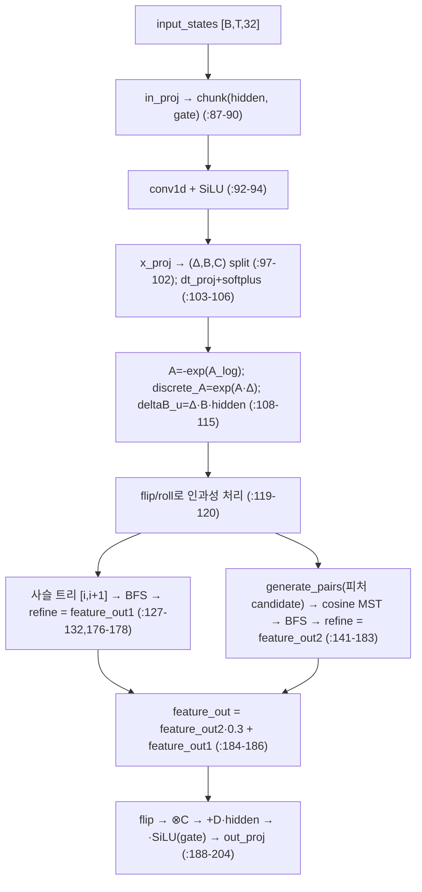
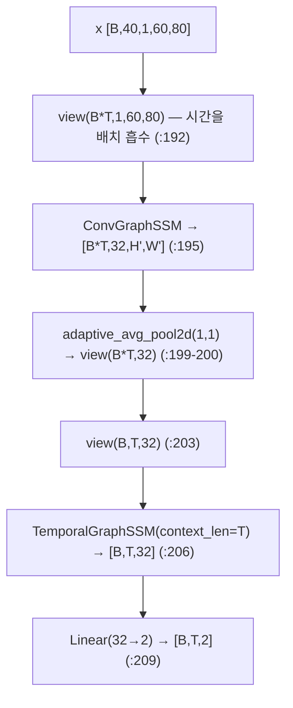
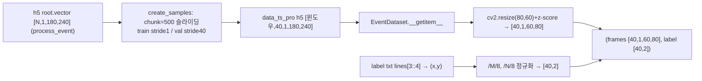

# gg_ssms 모듈 통합 가이드 (S-PyTorch)

> 1차 요약: [`../gg_ssms.md`](../gg_ssms.md) — 본 문서는 그 요약을 모듈(클래스/함수) 단위로 심화한 S-PyTorch 변형 통합 가이드다.
> 분석 대상: `\\wsl.localhost\ubuntu-24.04\home\user\project\PRJXR-HBTXR\REF\XR-Eye-Tracking\Codebase\gg_ssms`
> 관련 논문: *Graph-Generating State Space Models (GG-SSMs)*, Zubić & Scaramuzza, **CVPR 2025 Highlight** (arXiv:2412.12423). README:1-35 근거.
> 작성 원칙: 실제 소스 Read 후 `파일:라인` 근거 표기. 라인 근거 없는 추론은 "추정", 코드로 확인 불가는 "확인 불가"로 명시. 정확도(검출률/p-error)는 README/poster 인용, 미실행 수치는 "확인 불가".
> 제약: bash 미사용(UNC 경로), Glob/Grep/Read/Write만. 외부 원본·third_party CUDA 커널(TreeScan/TreeScanLan)·체크포인트 제외(인터페이스만 분석).

---

## 0. 문서 머리말

### 0.1 대표 케이스 선정 + 근거

본 repo는 **GG-SSM 핵심 알고리즘(공간 트리 스캔 + 시간 트리 스캔)**을 두 시선추적 경로(LPW, Ini-30)에 동일하게 끼워 넣는다. 메인 학습 스크립트가 실제 결선하는 시공간 모델과, 그 안에서 호출되는 GG-SSM 본체를 모두 대표로 선정한다.

- **대표 실행 모델(시공간 결합): `graph_ssm_train.GraphSSMModel`**
  - 근거: LPW 학습 스크립트가 `ConvGraphSSM`(공간) + `TemporalGraphSSM`(시간) + `Linear(32,2)`를 결선(`graph_ssm_train.py:160-182`)하고, `model(images)`로 직접 학습/검증/플롯에 사용(`:270,296,367`). **실제 학습되는 유일한 모델 본체**다.
  - 입력 `[B,T,1,60,80]`(`:184-192`) → 출력 동공 좌표 `[B,T,2]`(`:209`). Ini-30 경로의 `Baseline_3ET`(`retina/training/models/baseline_3et.py:15-71`)는 **이와 사실상 동일 구조**(동일 인자값, 확인됨).
- **대표 공간 백본: `graph_ssm.GraphSSM` (= ConvGraphSSM)**
  - 근거: ImageNet 분류용 4-stage 계층 백본을 시선추적은 `num_levels=2, depths=[2,2], channels=16`으로 경량 호출(`graph_ssm_train.py:160-170`). 내부에 핵심 SSM 블록 `Tree_SSM`을 stage당 depth만큼 적층(`graph_ssm.py:184-196`).
- **대표 GG-SSM 알고리즘 본체 2종(논문 핵심)**:
  1. **공간 트리 스캔 `tree_scanning_core`**(`tree_scanning.py:108-158`): 픽셀 격자 → 코사인 MST → BFS → 트리 위 상태 누적(refine) → `C·h+D·x`. **선택적 스캔을 트리로 일반화**(Mamba selective scan 대체).
  2. **시간 트리 스캔 `tree_scanning_algorithm`**(`graph_ssm/main.py:82-205`): 표준 Mamba 전반부 + **사슬 트리 스캔 + 피처-MST 스캔의 가중합**(`:184-186`).

> 정리: **실행 경로 = `GraphSSMModel`(공간 ConvGraphSSM + 시간 TemporalGraphSSM)**. GG-SSM의 "동적 그래프 스캔"은 `tree_scanning_core`(2D)와 `tree_scanning_algorithm`(1D)이 담당하며, MST/BFS/refine 실연산은 **커스텀 CUDA 커널 `tree_scan._C` / `tree_scan_lan._C`**에 위임(제외 대상, 인터페이스만 분석). 비교용 ConvLSTM 변형군(`convlstm*.py`)은 동일 입력으로 baseline 비교를 위해 보존(미결선, 6.5절).

### 0.2 수치 표기 규약 (S-PyTorch)

- **params** = 레이어 차원에서 직접 산정. `Tree_SSM`은 in_proj `Linear(d_model→2·d_expand)`(`tree_scanning.py:259-260`), depthwise `Conv2d(d_expand→d_expand, k=3, groups=d_expand)`(`:264-273`), x_proj_weight `(K, dt_rank+2·d_state, d_inner)`(`:276-284`), dt_projs(`:292-311`), out_proj `Linear(d_expand→d_model)`(`:288`)로 구성. `d_expand=ssm_ratio·d_model`, `d_inner=min(ssm_rank_ratio,ssm_ratio)·d_model`(`:242-247`).
- **MACs / FLOPs** = (a) 공간: StemLayer conv 2개 + stage별 Tree_SSM(선형 projection + depthwise conv + 트리 refine) + MLP, (b) 시간: in_proj/x_proj/dt_proj/out_proj 선형 + conv1d + 트리 refine. **트리 refine 자체의 MAC은 커널 내부**(노드 수 L에 대한 O(L) sweep, 정확한 연산량은 커널 미공개 → "확인 불가"). 선형/conv 항만 차원으로 산정 가능.
- **activation memory** = 텐서 `shape × bit`. 공간 백본은 시간을 배치에 흡수(`B·T`)하므로 메모리 지배항이 큼(0.4절). NHWC 표현(`graph_ssm.py:23-38`)이 주 포맷.
- **그래프 구성/SSM 스캔** = 공간: H·W 격자의 4-이웃 간선(`tree_scan_core.py:46-55`)에서 코사인 유사도(`:68-91`) MST → BFS 직렬화(`tree_scanning.py:131`) → A_bar=edge_weight로 refine(`:137-144`). 시간: 사슬 트리(`main.py:127-132`) + 피처 MST(`:141-166`)의 0.3 가중합(`:184-186`).
- **이벤트 표현** = LPW/SEET 원시 이벤트를 누적한 **이벤트 프레임**(그레이스케일 1채널) 시퀀스 `[T,1,60,80]`. graph는 입력이 아니라 **모델 내부에서 동적 생성**(픽셀 격자 MST / 시간 candidate MST). 본 repo는 누적·전처리된 h5를 입력으로 받음(`process_event.py`, `EventDataset`).
- **정확도** = README는 "eye-tracking 검출률 최대 +0.33% 개선·파라미터 감소"(README:23), ImageNet top-1 84.9%, KITTI-15 오류율 2.77%(README:23) 인용. **본 repo 미실행 → 학습 결과 수치는 "확인 불가"**. poster(CVPR25_Zubic_poster.pdf)는 repo 트리에 부재(README:5가 GitHub 링크만 제공) → poster 수치 "확인 불가".

### 0.3 운영 경로 (전처리 ↔ 학습 ↔ 평가)

```
[원시 이벤트 h5: /DATA/pupil_st/data_ts_500/*.h5  (root.vector, 180×240 누적 프레임)]
      │  process_event.py: get_data → create_samples (chunk=500 슬라이딩 윈도우, seq=40)
      │    train stride=1(증강), val stride=40(비중첩)  →  blosc 압축 carray 저장 (:61-63)
      ▼
[전처리 h5: data_ts_pro/{train,val}/*.h5]   +   [라벨 txt: pupil_st/label/*.txt (lines[3::4])]
      │  EventDataset.__getitem__: cv2.resize(80,60) + z-score normalize → [seq,1,60,80] (:118-125)
      │    label = (x/M/8, y/N/8) 정규화 → [seq,2] (:127-129)
      ▼
[학습: eye_tracking_lpw/graph_ssm_train.py]
      │  GraphSSMModel = ConvGraphSSM(2-level,ch16) → adaptive_avg_pool → TemporalGraphSSM(d=32) → FC(32→2)
      │  criterion = SmoothL1Loss (:252), optimizer = Adam lr=1e-3 (:253), 100 epoch (:36)
      ▼
[검증: dis=target-output, 픽셀 환산(×H/×W) → dist=norm → err_rate(>1/3/5/10px) (:298-313)]
      │  best val loss 시 best_model.pth 저장 (epoch/model/optimizer/loss, :336-348)
      ▼
[평가/플롯: 좌표 시계열 + 프레임 위 예측/GT점 오버레이 (:350-505), training_log.txt 기록 (:330-334), wandb (:317-327)]
```
- Ini-30 경로는 `retina/scripts/train.py --run_name=graph_ssm`(README:131), PyTorch Lightning + wandb 프로젝트 `eye_tracking_ini_30`(`train.py:5-27,44`). 체크포인트·데이터 원본은 [제외].

### 0.4 모델 / 데이터셋 / 정확도 요약

| 항목 | 값 | 근거 |
|---|---|---|
| 입력 | 이벤트 프레임 시퀀스 `[B,T=40,1,60,80]` | `graph_ssm_train.py:29-35,184-189` |
| 출력 | 동공 중심 `(x,y)` 정규화 `[B,T,2]` | `GraphSSMModel.forward:209` |
| 모델 | ConvGraphSSM(2-level, ch16) + TemporalGraphSSM(d=32) + FC | `:160-182` |
| 공간 d_model | 32 = 16·2^(2-1) | `graph_ssm.py:340`, `graph_ssm_train.py:172-174` |
| Loss | SmoothL1Loss(Huber) | `:252` |
| optimizer | Adam lr=1e-3, 100ep | `:253,36` |
| 데이터셋 | LPW(SEET event frame), Ini-30(tonic/sinabs) | README:127-166 |
| 메트릭 | err_rate(dist>{1,3,5,10}px) / p-accuracy(Ini-30) | `:298-313` / `loss.py:48-68` |
| 정확도(논문) | eye-tracking 검출률 +0.33%, ImageNet 84.9% | README:23 (본 repo 미실행 → 확인 불가) |
| 핵심 의존성 | TreeScan/TreeScanLan CUDA 확장 필수 | README:49-56 (이식 장벽) |

---

## 1. Repo / Layer 개요 (모델 / 데이터 / 학습 맵)

gg_ssms = SSM의 고정된 1D 스캔 한계를 **동적 그래프(MST) 스캔**으로 극복하는 범용 시공간 프레임워크(GG-SSM, CVPR'25). 시선추적은 그 응용 하나로, **공간 트리 SSM 백본 + 시간 트리 SSM**으로 동공 좌표 (x,y)를 회귀한다. MST/BFS/refine은 **커스텀 CUDA 커널** 의존(이식성 최대 장벽, 9절).

### 1.1 파일 역할 맵

| 구분 | 파일 | 역할 | 메인 사용 |
|---|---|---|---|
| **메인(LPW 학습/모델/평가)** | `eye_tracking_lpw/graph_ssm_train.py` | EventDataset·GraphSSMModel·Train·Val·Plot 전부 | ★ 실행 진입점 |
| **공간 백본** | `core/.../classification/models/graph_ssm.py` | `GraphSSM`(Stem/Block/Level) + 보조 레이어 | ★ ConvGraphSSM |
| **공간 트리 스캔(GG-SSM 본체)** | `core/.../classification/models/tree_scanning.py` | `Tree_SSM` + `tree_scanning_core`(2D MST 스캔) | ★ 핵심 |
| **격자 MST 생성** | `core/.../models/tree_scan_utils/tree_scan_core.py` | `MinimumSpanningTree`(코사인, 4-이웃 격자) | ★ 핵심 |
| **시간 트리 스캔(GG-SSM 본체)** | `core/graph_ssm/main.py` | `GraphSSM`(=TemporalGraphSSM) + `tree_scanning_algorithm` | ★ 핵심 |
| **Ini-30 모델** | `retina/training/models/baseline_3et.py` | `Baseline_3ET`(LPW 모델과 동형) | 보조 진입점 |
| **분류 빌더** | `core/.../models/build.py` | config→GraphSSM(분류용) | ImageNet 경로 |
| **비교 baseline** | `eye_tracking_lpw/convlstm*.py` | ConvLSTM 5변형(희소율 계측) | 미결선(비교) |
| **전처리** | `eye_tracking_lpw/process_event.py` | 원시 h5 → 슬라이딩 윈도우 h5(blosc) | ★ 1차 실행 |
| **Ini-30 학습/손실** | `retina/scripts/train.py`, `retina/training/loss.py` | Lightning 학습 + Euclidean/Yolo/Speck loss | Ini-30 경로 |
| **[제외] CUDA 커널** | `.../third-party/TreeScan`, `TreeScanLan` | bfs/mst/refine forward·backward | 제외(인터페이스만) |
| **[제외]** | `best_model.pth`, `MambaTS/`(시계열), `plot/*` | 체크포인트·시계열·산출 이미지 | 제외 |

### 1.2 forward 진입점

`model(images)` → `GraphSSMModel.forward(x)`(`graph_ssm_train.py:184`) → `x.view(B*T,C,H,W)`로 시간 흡수(`:192`) → `ConvGraphSSM`(공간, `graph_ssm.py:464`) → `adaptive_avg_pool2d`로 프레임당 벡터(`:199`) → `view(B,T,32)` → `TemporalGraphSSM(seq_in, context_len=T)`(`main.py:303`) → `fc_out` → `[B,T,2]`(`:209`).

공간 내부: `GraphSSM.forward_features` → level별 `GraphSSMBlock` → `GraphSSMLayer` → `Tree_SSM.forward`(`tree_scanning.py:403`) → `forward_core` → `tree_scanning` → `tree_scanning_core`(`:108`) → MST(`:129`) + BFS(`:131`) + refine(`:137`).

### 1.3 제외 목록
- **CUDA 커널 원본**: `core/.../third-party/TreeScan`, `core/graph_ssm/third-party/TreeScanLan`(bfs/mst/refine forward·backward). 인터페이스(`_C.*`)만 분석, 내부 구현 "확인 불가".
- **외부 데이터/체크포인트**: LPW/SEET·Ini-30 h5 원본, `best_model.pth`, `plot/`의 png.
- **외부 프레임워크 원본**: torch/torchvision/cv2/tables/einops/timm/sinabs/tonic/wandb(import만, 본 repo 소스 아님).
- **범위 외 요약만**: `MambaTS/`(시계열 예측, TemporalGraphSSM을 인코더로 교체 — README:108). poster PDF(repo 트리 부재).

---

## 2. 모듈: 공간 트리 스캔 본체 — `tree_scanning.Tree_SSM` + `tree_scanning_core` (GG-SSM 핵심)

### 2.1 역할 + 상위/하위
- **역할**: Mamba selective scan의 1D 순차 스캔을 **2D 픽셀 격자 위 MST 트리 스캔**으로 대체. 입력 피처맵으로 코사인 유사도 기반 MST를 동적 생성하고, 이산화된 상태 전이(A_bar)와 입력항(B_bar·x)을 트리 BFS 순서로 누적(refine)한 뒤 `y=C·h+D·x`로 출력. **공간 비국소 의존성을 데이터 적응형 그래프로 포착**.
- **상위**: `GraphSSMLayer`가 pre-norm 잔차로 호출(`graph_ssm.py:221`). 그 위는 Block→Level→`GraphSSM` 백본.
- **하위**: `MinimumSpanningTree`(`tree_scan_core.py:39`), CUDA 커널 `tree_scan._C.bfs_forward`/`tree_scan_refine_forward`(`tree_scanning.py:19,39` — 제외, 인터페이스만).

### 2.2 데이터플로우 (텐서 shape · 그래프)

그래프: edge_weight = deltaA(이산화 A_bar, `:122`)를 BFS 순서로 gather(`:125`). 트리는 매 forward 데이터 의존적으로 재생성(no_grad, `tree_scan_core.py:94`).

### 2.3 forward call stack
```
GraphSSMLayer.forward (graph_ssm.py:214)
└─ self.TreeSSM(self.norm1(x)) → Tree_SSM.forward (tree_scanning.py:403)
   ├─ in_proj → chunk(x,z); z=SiLU(z) (:404-405)
   ├─ dwconv(x); x=SiLU(x) (:408-410)
   └─ forward_core → tree_scanning (:411 → :161)
      ├─ x_proj_weight einsum → split (Δ,B,C) (:182-185)
      ├─ dt_projs einsum → dts; As=-exp(A_logs) (:186-189)
      ├─ force_fp32=True (:195)
      └─ tree_scanning_core (:202 → :108)
         ├─ dts=softplus; deltaA=exp(dts·As); BX=deltaB·xs (:112-116)
         ├─ MST("Cosine",exp)(fea4tree_hw) (:129-130)
         ├─ bfs(tree,4) (:131); edge_weight gather (:132)
         ├─ refine(feat_in, edge_weight, ...) (:137-144)
         └─ y=(h⊗C)+Ds·xs (:149-157)
```

### 2.4 대표 코드 위치
`tree_scanning.py:108-158`(core 상태 전이), `:161-210`(tree_scanning 래퍼), `:213-414`(Tree_SSM 클래스: 파라미터·init·forward), `:356-371`(A_log S4D 초기화).

### 2.5 대표 코드 블록

**(a) 이산화 + 트리 스캔 (`tree_scanning.py:112-144`)**
```python
dts = F.softplus(dts + delta_bias...)             # Δ
deltaA = (dts * As.unsqueeze(0)).exp_()           # 이산화 A_bar (b d l) — 트리 edge_weight
deltaB = rearrange(dts,...) * Bs ; BX = deltaB * xs   # 입력항 B_bar·x → feat_in
fea4tree_hw = rearrange(xs, "b d (h w) -> b d h w", h=H, w=W)
tree = MinimumSpanningTree("Cosine", torch.exp)(fea4tree_hw)   # 코사인 MST
sorted_index, sorted_parent, sorted_child = bfs(tree, 4)       # BFS 직렬화
edge_weight = batch_index_opr(deltaA, sorted_index)           # A_bar를 트리 순서로 gather
feature_out = refine(feat_in, edge_weight, sorted_index, sorted_parent, sorted_child, ...)
```
→ 표준 SSM `h_t = A_bar·h_{t-1} + B_bar·x_t`의 **순차 재귀를 트리 위 associative scan(refine)으로 일반화**. A_bar가 트리 간선 가중치가 되는 것이 GG-SSM의 핵심(추정: 노드 간 상태 전파 강도).

**(b) 출력 = C·h + D·x (`tree_scanning.py:146-157`)**
```python
if h_norm is not None: out = h_norm(feature_out.transpose(-1,-2)...)
y = (rearrange(out,...).unsqueeze(-1) @ rearrange(Cs,...).unsqueeze(-1)).squeeze(-1)  # h ⊗ C
y = rearrange(y, "b l k d -> b (k d) l")
y = y + Ds.reshape(1,-1,1) * xs                  # skip 연결 D·x
```
→ 표준 SSM 출력식. K=1 단일 스캔(`:109`), `force_fp32=True` 강제(`:195`)로 저정밀 추론 경로 부재(9절 리스크).

**(c) Mamba 게이팅 구조 (`tree_scanning.py:403-413`)**
```python
x = self.in_proj(x); x, z = x.chunk(2, dim=-1); z = self.act(z)   # gate 분리
x = self.conv2d(x.permute(0,3,1,2)...) ; x = self.act(x)          # depthwise conv + SiLU
y = self.forward_core(x, ...) ; y = y * z                          # gated
out = self.dropout(self.out_proj(y))
```
→ Mamba/VMamba 게이팅(SiLU(z)로 곱) + 트리 스캔. d_state=1로 매우 경량(`graph_ssm.py:187`).

### 2.6 연산 분해 + 정량 (시선추적 설정: `Tree_SSM(d_model=16 또는 32, d_state=1, ssm_ratio=2)`)
- **차원**(`graph_ssm.py:184-196`, 시선추적 stage별 channels=16→32): `d_expand=2·d_model`, `d_inner=2·d_model`(min(2,2)), `dt_rank=ceil(d_model/16)`, `d_state=1`.
  - stage0(d_model=16): d_expand=d_inner=32, dt_rank=1. in_proj `16·64+0`=1,024(bias=False), out_proj `32·16`=512, dwconv `32·1·9+32`=320, x_proj_weight `(1, 1+1·2, 32)`=96, dt_projs_weight `(1,32,1)`=32 + bias 32, A_logs `32·1`=32, Ds `32`. → 약 **2.08K params/Tree_SSM(stage0)**.
  - stage1(d_model=32): d_expand=d_inner=64, dt_rank=2. in_proj `32·128`=4,096, out_proj `64·32`=2,048, dwconv `64·9+64`=640, x_proj_weight `(1,2+2,64)`=256, dt_projs_weight `(1,64,2)`=128+64, A_logs `64`, Ds `64`. → 약 **7.46K params/Tree_SSM(stage1)**.
  - (bias 옵션·LayerNorm γβ 등 부속 포함 시 소폭 증가. 정확한 model.state_dict 합계는 미실행 → "확인 불가", 차원 산정만 제시.)
- **MAC**: 선형/conv 항만 차원 산정 가능. **트리 refine MAC은 CUDA 커널 내부(O(L) sweep, L=H·W)로 미공개 → "확인 불가"**. 입력 60×80 → Stem 후 H·W≈ stage별 다운샘플(60→30, 80→40 등) 따라 L 변동.
- **activation memory**: 공간 백본은 `B·T`(=16·40=640)를 배치로 처리(`graph_ssm_train.py:192`) → StemLayer 출력 `[640,30,40,16]`(NHWC, fp32) ≈ 640·30·40·16·4B ≈ **49MB**. 시간 흡수로 메모리 지배항이 큼(0.4절, 학습 OOM 리스크 — 추정).
- **트리 구조 메모리**: sorted_index/parent/child는 노드 수 L에 비례(`bfs(tree,4)`, max_adj=4). edge_weight `[B,D,L]`.

---

## 3. 모듈: 공간 백본 — `graph_ssm.GraphSSM` (= ConvGraphSSM)

### 3.1 역할 + 상위/하위
- **역할**: 이벤트 프레임을 patch-embed(Stem) 후 num_levels stage로 계층 처리. 각 stage = depth개 `GraphSSMLayer`(Tree_SSM + MLP, pre-norm 잔차) + (선택)Downsample. 시선추적은 2-level/channels=16으로 경량 호출, **분류 head(avgpool/fc)는 forward에서 호출 안 함** → 백본 피처맵 `[B*T,32,H',W']`만 출력(외부 pooling).
- **상위**: `GraphSSMModel`(LPW) / `Baseline_3ET`(Ini-30)가 `spatial_backbone`으로 생성(`graph_ssm_train.py:160`, `baseline_3et.py:21`).
- **하위**: StemLayer, GraphSSMBlock(→Layer→Tree_SSM), DownsampleLayer.

### 3.2 데이터플로우

> 주: num_levels=2 → 첫 stage만 downsample(`:397` `downsample=(i<num_levels-1)`). Stem stride=1로 해상도 유지(`:84-93`), Downsample stride=2로 1회 2× 다운샘플(`:117`). 최종 채널 `num_features=16·2^(2-1)=32`(`:340`).

### 3.3 forward call stack
```
ConvGraphSSM(x) → GraphSSM.forward (graph_ssm.py:464)
├─ forward_features (:438)
│  ├─ patch_embed=StemLayer (:439)
│  ├─ pos_drop (:440)
│  └─ for level in levels: level(x) (:442-443)  → GraphSSMBlock.forward (:284)
│     └─ for blk: GraphSSMLayer.forward (:285) → Tree_SSM + MLP (:221-222)
└─ permute NHWC→NCHW (:468)
```

### 3.4 대표 코드 위치
`graph_ssm.py:73-104`(StemLayer), `:107-126`(DownsampleLayer), `:164-236`(GraphSSMLayer), `:239-296`(GraphSSMBlock), `:299-470`(GraphSSM 백본).

### 3.5 대표 코드 블록

**(a) pre-norm 잔차 블록 (`graph_ssm.py:221-222`)**
```python
x = x + self.drop_path(self.TreeSSM(self.norm1(x)))   # 공간 트리 SSM
x = x + self.drop_path(self.mlp(self.norm2(x)))       # FFN
```
→ Transformer류 pre-norm 구조. TreeSSM이 attention 자리를 대체. post_norm/layer_scale 변형 지원(`:217-229`).

**(b) Tree_SSM 인스턴스 (시선추적 경량 설정) (`graph_ssm.py:184-196`)**
```python
self.TreeSSM = Tree_SSM(d_model=channels, d_state=1, ssm_ratio=2, ssm_rank_ratio=2,
                        dt_rank="auto", act_layer=nn.SiLU, d_conv=3, conv_bias=False, dropout=0.0)
```
→ **d_state=1**로 극경량(논문 효율 주장 근거). channels는 stage별 16→32.

**(c) stage 수 결정 + downsample 게이팅 (`graph_ssm.py:365-378,397`)**
```python
num_levels = {"one_layer":1,"two_layer":2,"default":self.num_levels}.get(...)
for i in range(self.num_levels):
    level = self._create_ssm_block(...)   # downsample=(i < num_levels-1) (:397)
```
→ one_layer/two_layer 플래그로 stage 축소. 시선추적은 둘 다 False·num_levels=2(`graph_ssm_train.py:163,168-169`).

### 3.6 연산 분해 + 정량
- **params(공간 백본 핵심항, 차원 산정)**:
  - StemLayer: Conv3x3(1→8) `1·8·9+8`=80, BN(8) 16, Conv3x3(8→16) `8·16·9+16`=1,168, LN(16) 32 → 약 1.30K.
  - DownsampleLayer(16→32): Conv3x3 s2 `16·32·9`=4,608(bias=False) + LN(32) 64 → 약 4.67K.
  - GraphSSMLayer ×4(stage0 2개 ch16 + stage1 2개 ch32): 각 Tree_SSM(2.6절) + MLP(`Linear(ch→4ch)+Linear(4ch→ch)`: ch16 → 16·64+64+64·16+16≈2.13K; ch32 → 32·128+128+128·32+32≈8.45K) + LN 2개.
  - 대략 stage0 블록 ≈ (2.08K Tree_SSM + 2.13K MLP)×2, stage1 블록 ≈ (7.46K + 8.45K)×2. **백본 합 ≈ 수십 K params 규모**(정확합계 미실행 → "확인 불가").
- **`GraphSSMModel` 전체 total_params는 스크립트가 런타임 출력**(`graph_ssm_train.py:249-250` `sum(p.numel())`) — 미실행이라 절대값 "확인 불가". README "fewer parameters"(README:23) 인용만 가능.
- **activation memory**: 2.6절(B·T 흡수로 ≈49MB/Stem 출력). 깊은 stage는 H·W↓·채널↑로 부분 상쇄.
- **코드 결함(확인됨)**: `GraphSSMBlock.forward`의 `self.center_feature_scale`(`:287`)는 클래스에 미정의 속성 → post_norm=True 경로에서 AttributeError 가능. 기본 post_norm=False에선 단락평가로 회피. `lr_decay_keywards`(`:412-436`)는 `for i in range(4)` 4-stage 하드코딩(`:417`)이라 2-level 사용 시 KeyError 가능 — 단 시선추적 학습루프는 호출 안 함(`graph_ssm_train.py`는 단일 Adam, 확인됨).

---

## 4. 모듈: 시간 트리 스캔 본체 — `graph_ssm/main.GraphSSM` (= TemporalGraphSSM)

### 4.1 역할 + 상위/하위
- **역할**: 프레임 임베딩 시퀀스 `[B,T,d=32]`에 대해 표준 Mamba 전반부(in_proj/conv1d/x_proj/dt_proj) 수행 후, **(1) 인과 사슬 트리 스캔 + (2) 피처 기반 MST 스캔**을 0.3 가중으로 결합해 시간 의존성을 동적으로 포착. 비국소(non-local) 시간 관계를 데이터 적응형 그래프로 모델.
- **상위**: `GraphSSMModel`(`graph_ssm_train.py:177-179`) / `Baseline_3ET`(`baseline_3et.py:38-40`)가 `temporal_ssm`으로 생성, `forward(seq_in, context_len=T)` 호출(`:206`).
- **하위**: `tree_scanning_algorithm`(`main.py:82`), CUDA 커널 `tree_scan_lan._C.mst_forward`/`bfs_forward`/`tree_scan_refine_forward`(`:13,25,36` — 제외, 인터페이스만).

### 4.2 데이터플로우 (시간축)


### 4.3 forward call stack
```
TemporalGraphSSM(seq_in, context_len=T) → GraphSSM.forward (main.py:303)
└─ tree_scanning_algorithm(self, input_states, context_len) (:82)
   ├─ in_proj → chunk(hidden,gate); conv1d+SiLU (:87-94)
   ├─ x_proj split (Δ,B,C); dt_proj+softplus (:97-106)
   ├─ discrete_A/discrete_B/deltaB_u (:108-115); flip/roll (:119-120)
   ├─ 사슬 트리 build → bfs → refine = feature_out1 (:127-132,176-178)
   ├─ generate_pairs → cosine MST → bfs → refine = feature_out2 (:141-183)
   ├─ feature_out2·0.3 + feature_out1 (:184-186)
   └─ ⊗C + D·hidden, ·SiLU(gate), out_proj (:194-204)
```

### 4.4 대표 코드 위치
`main.py:82-205`(tree_scanning_algorithm), `:208-304`(GraphSSM 클래스: 표준 Mamba 시그니처·init), `:285-297`(A_log S4D·D skip 초기화).

### 4.5 대표 코드 블록

**(a) 이산화 (표준 Mamba 동일) (`main.py:108-115`)**
```python
A = -torch.exp(self.A_log.float())
discrete_A = torch.exp(A[None,:,None,:] * discrete_time_step[:,:,:,None])   # A_bar
discrete_B = discrete_time_step[:,:,:,None] * B[:,None,:,:].float()         # B_bar
deltaB_u = discrete_B * hidden_states[:,:,:,None].float()                   # B_bar·x
```
→ S4D 실수 초기화(`:285-291`), 표준 selective SSM 이산화.

**(b) 두 트리 결합 (핵심 차별점) (`main.py:127-186`)**
```python
# (1) 사슬 트리: 인과적 순차 스캔 = 표준 SSM
tree_ = [[i,i+1] for i in range(seq_len-1)] ; tree = tree_.repeat(batch,1,1)
sorted_index1,... = bfs(tree, 4)
feature_out1 = refine(feature_in, weight, sorted_index1, ...)
# (2) 피처 MST: 비국소 candidate (최근 context_len 구간은 i+1,i+2,i+3 다중 간선)
pairs = generate_pairs(seq_len, context_len)         # :141-152
tree_weight = cosine_distance(data1, data2)          # :163
tree = mst(pairs..., tree_weight, seq_len) ; sorted_index2,... = bfs(tree, context_len)
feature_out2 = refine(feature_in, edge_weight, sorted_index2, ...)
feature_out = feature_out2 * 0.3 + feature_out1      # :184-186 (0.3 하이퍼파라미터)
```
→ 사슬 트리만 쓰면 표준 인과 SSM(`h_t=A_bar·h_{t-1}+B_bar·x_t`)과 동일. 피처-MST 분기는 시간축 비국소 연결. 0.3 가중은 하드코딩 하이퍼파라미터(`:186`). flip/roll(`:119-120,189`)로 인과성 보존.

**(c) 출력 + 게이팅 (`main.py:194-204`)**
```python
scan_output_ = (feature_out @ C.unsqueeze(-1)).squeeze(-1).transpose(-1,-2)  # ⊗C
scan_output = scan_output_ + (hidden_states * self.D[None,:,None])           # +D·x skip
scan_output = scan_output * self.act(gate)                                    # SiLU(gate)
contextualized_states = self.out_proj(scan_output.transpose(1,2))
```

### 4.6 연산 분해 + 정량 (`TemporalGraphSSM(d_model=32, d_state=16, d_conv=4, expand=2)`)
- **차원**(`main.py:230-301`): d_inner=64(`expand·d_model`), dt_rank=2(`ceil(32/16)`).
  - in_proj `32·128`=4,096(bias=False), conv1d `64·4+64`=320(depthwise groups=64, bias=True), x_proj `64·(2+32+32)`=4,224, dt_proj `2·64+64`=192, A_log `64·16`=1,024, D `64`, out_proj `64·32`=2,048.
  - **TemporalGraphSSM params 합 ≈ 11.97K**(차원 산정; LayerNorm 등 부속 제외).
- **MAC**: 선형 항만 산정 가능. **트리 refine MAC은 CUDA 커널 내부 → "확인 불가"**. 시퀀스 길이 L=T=40, 노드 수 작음.
- **두 refine 호출**(`:176,181`) → 트리 스캔 비용 ×2 + MST 생성(피처 분기, `:165`). 사슬 트리는 매 forward 동일 재생성(`:127-130`).
- **`context_len=T=40 > 2`**(`:154`)이므로 피처-MST 분기 항상 활성(시선추적). generate_pairs는 최근 context_len 구간에서 i+1/i+2/i+3 다중 간선(`:145-152`).

---

## 5. 모듈: 메인 시공간 모델 — `GraphSSMModel` / `Baseline_3ET`

### 5.1 역할 + 상위/하위
- **역할**: 공간 백본(ConvGraphSSM)으로 프레임당 피처맵 추출 → adaptive_avg_pool로 프레임 벡터화 → 시간 백본(TemporalGraphSSM)으로 시퀀스 모델 → FC로 좌표 회귀. 입력 `[B,T,1,60,80]` → 출력 `[B,T,2]`.
- **상위**: 학습 루프(`:270`)·검증(`:296`)·플롯(`:367`)이 `model(images)` 호출. **하위**: ConvGraphSSM, TemporalGraphSSM, `Linear(32,2)`.

### 5.2 데이터플로우

> 주: 공간은 프레임 독립(시간을 배치로 흡수), 시간은 풀링된 벡터 시퀀스에서만 작동. **공간 트리는 프레임 내 픽셀 격자, 시간 트리는 프레임 간 시퀀스**로 역할 분리.

### 5.3 forward call stack
```
model(images) → GraphSSMModel.forward (graph_ssm_train.py:184)
├─ x.view(B*T,C,H,W) (:192)
├─ feat_2d = spatial_backbone(x_2d) (:195)
├─ adaptive_avg_pool2d → view(B*T,32) (:199-200)
├─ feat_2d.view(B,T,32) (:203)
├─ seq_out = temporal_ssm(seq_in, context_len=T) (:206)
└─ coords = fc_out(seq_out) → [B,T,2] (:209)
```

### 5.4 대표 코드 위치
`graph_ssm_train.py:154-182`(생성자), `:184-210`(forward). Ini-30 동형: `baseline_3et.py:15-71`(인자값 동일 — 확인됨).

### 5.5 대표 코드 블록

**(a) 시공간 결선 (`graph_ssm_train.py:160-182`)**
```python
self.spatial_backbone = ConvGraphSSM(in_chans=1, num_levels=2, depths=[2,2], channels=16, mlp_ratio=4.0, ...)
self.d_model = self.spatial_backbone.num_features   # 32
self.temporal_ssm = TemporalGraphSSM(d_model=32, d_state=16, d_conv=4, expand=2)
self.fc_out = nn.Linear(self.d_model, 2)
```

**(b) 시간 흡수 + 풀링 (`graph_ssm_train.py:192-203`)**
```python
x_2d = x.view(B*T, C, H, W)                 # 시간을 배치로 흡수
feat_2d = self.spatial_backbone(x_2d)
feat_2d = F.adaptive_avg_pool2d(feat_2d, (1,1)).view(B*T, self.d_model)  # 프레임당 32-d
seq_in = feat_2d.view(B, T, self.d_model)   # 시퀀스 복원
```

### 5.6 연산 분해 + 정량
- **params**: 공간 백본(3.6절, 수십 K) + 시간 TemporalGraphSSM(4.6절 ≈11.97K) + fc_out `32·2+2`=66. **총합은 런타임 출력**(`:249-250`)이며 미실행 → 절대값 "확인 불가". README "fewer parameters"(README:23)만 인용.
- **MAC**: 공간(B·T=640 프레임 ×백본) + 시간(B=16 ×TemporalGraphSSM) + 트리 refine(커널 내부, "확인 불가"). 공간이 B·T 배수라 지배항(추정).
- **activation memory**: 공간 `B·T=640` 흡수가 지배(2.6/3.6절). 시간은 `[16,40,64]` 규모로 작음.

---

## 6. 모듈: 데이터 파이프라인 + 비교 baseline

### 6.1 역할 + 상위/하위
- **역할**: 원시 이벤트 프레임 h5를 chunk(500) 슬라이딩 윈도우(seq=40)로 잘라 시퀀스 샘플 생성, 리사이즈·정규화·라벨 정렬해 `(frames, label)` 반환.
- **상위**: `DataLoader`(`graph_ssm_train.py:238-239`)가 배치화. **하위**: cv2.resize, normalize_data, tables(h5).

### 6.2 데이터플로우


### 6.3 forward call stack (데이터)
```
DataLoader → EventDataset.__getitem__ (:113)
├─ tables.open_file → file.root.vector[sample_index] (:118-119)
├─ for i: normalize_data(cv2.resize(sample[i,0],(80,60))) (:121-123)
├─ expand_dims axis=1 → [seq,1,60,80] (:125)
└─ label = (target[:,0]/M/8, target[:,1]/N/8) concat → [seq,2] (:127-129)
_concatenate_files (:133): label txt lines[3::4] → create_samples (:144)
process_event.get_data (:51): 원시 h5 → 슬라이딩 윈도우 h5(blosc) (:61-63)
```

### 6.4 대표 코드 위치
`graph_ssm_train.py:57-72`(normalize_data), `:75-96`(create_samples), `:99-146`(EventDataset), `process_event.py:51-63`(get_data).

### 6.5 대표 코드 블록

**(a) 슬라이딩 윈도우 인덱싱 (`graph_ssm_train.py:84-94`)**
```python
within_chunk_indices = np.arange(sequence) + np.arange(0, chunk_size-sequence+1, stride)[:, None]
indices = chunk_starts[:,None,None] + within_chunk_indices[None,:,:]
indices = indices.reshape(-1, indices.shape[-1]); subframes = data[indices]
```
→ chunk(500) 안에서 길이 seq=40 윈도우를 stride만큼 이동. train stride=1 → chunk당 461 윈도우(강한 시간 증강), val stride=40 → 비중첩 12 윈도우. interval=`(500-40)/stride+1`(`:106`). cb-convlstm과 **완전 동일 로직**(동일 upstream — README:152가 cb-convlstm 데이터 준비 지시, 확인됨).

**(b) 입력 리사이즈·정규화 + 라벨 스케일 (`graph_ssm_train.py:121-129`)**
```python
sample_resize.append(normalize_data(cv2.resize(sample[i,0], (width, height))))  # 240→80, 180→60
label1 = self.target[index][:,0] / M / (8)    # x / 80 / 8
label2 = self.target[index][:,1] / N / (8)    # y / 60 / 8
```
→ z-score 정규화(`normalize_data:57-72`, std=0 가드). 라벨 `/M/8`,`/N/8`: M·N으로 [0,1] 정규화 후 추가 `/8`은 주석 없음 — **추정**(스케일 보정). 검증부 픽셀 환산(`dis[...,0]*=height; *=width`(`:299-300`))과 정합성은 **확인 불가**(라벨 정의 M=width=80인데 검증부 [...,0]에 height 곱 — 축 교차 가능성, cb-convlstm과 동일 패턴).

**(c) 라벨 추출 — 4줄마다 1개 (`graph_ssm_train.py:140`)**
```python
lines = lines[3::4]   # LPW 라벨 txt에서 4번째 줄마다 1개 (프레임율↔라벨율 매칭)
```

### 6.6 비교 baseline: ConvLSTM 5변형 (`eye_tracking_lpw/convlstm*.py`, 미결선)
- `convlstm.py:49-90`: `ConvLSTMCell`이 `combined=cat(input, delta=h_cur)`(`:50-55`) + eval 모드 sparse_rate 로깅(`:57-71`) + conv 후 ReLU(`:81`). cb-convlstm의 change-based 희소율 계측과 동형(동일 upstream).
- `convlstmbak.py`(process_event.py가 import, `:9`), `convlstm_delta.py`/`convlstm_sp.py`/`convlstm_cell.py`도 함께 보존 — **GG-SSM vs ConvLSTM 동일 입력 비교 실험용**(별도 `convlstm_train.py`로 학습). graph_ssm_train.py 메인 경로엔 미결선(확인됨).

### 6.7 연산 분해 + 정량
- params 없음(전처리). 비용은 I/O·resize. train 윈도우 수 = 파일수 × 461(stride1), val = 파일수 × 12(stride40, `:106`).
- 입력 텐서/샘플: `[40,1,60,80]` fp32 = 40·60·80·4B = **768KB/샘플**, 배치(16) = 12.3MB. 전처리 h5: blosc complevel=5 압축(`process_event.py:62`).

---

## 7. 모듈 한눈표

| # | 모듈 | 파일:라인 | 역할 | 대표 정량 |
|---|---|---|---|---|
| 2 | Tree_SSM + tree_scanning_core | tree_scanning.py:108-414 | 공간 2D MST 트리 스캔(GG-SSM 본체) | d_state=1, refine MAC=확인불가 |
| 3 | GraphSSM(ConvGraphSSM) | graph_ssm.py:299-470 | 2-level 공간 백본(Stem/Block/Level) | d_model=32, B·T 흡수 |
| 4 | TemporalGraphSSM | graph_ssm/main.py:82-304 | 시간 1D 트리 스캔(사슬+MST 0.3) | ≈11.97K params(차원) |
| 5 | GraphSSMModel/Baseline_3ET | graph_ssm_train.py:154-210 / baseline_3et.py:15-71 | 공간+시간+FC 시공간 모델 | 출력 [B,T,2], total=확인불가 |
| 6 | EventDataset/create_samples | graph_ssm_train.py:75-146 | 슬라이딩 윈도우·resize·정규화 | 768KB/샘플, train ×461 윈도우 |
| 6 | process_event.get_data | process_event.py:51-63 | 원시 h5→윈도우 h5(blosc) | seq40, stride1/40 |
| 6.6 | ConvLSTM 5변형 | convlstm*.py | GG-SSM 비교 baseline(미결선) | 동일 입력 비교용 |
| — | MinimumSpanningTree | tree_scan_core.py:39-102 | 격자 4-이웃 코사인 MST | no_grad, 정점 H·W |
| — | [제외] TreeScan CUDA | third-party/TreeScan(Lan) | bfs/mst/refine 커널 | 인터페이스만 |

---

## 8. 학습 · 평가 파이프라인 + 재현 명령

### 8.1 학습 루프 (LPW, `graph_ssm_train.py:256-348`)
- 손실 `SmoothL1Loss`(`:252`), optimizer `Adam lr=1e-3`(`:253`), 100 epoch(`:36`). seed=1 고정(`:42-44`).
- 매 epoch 검증 후 best val loss면 best_model.pth 저장(`:336-348`), training_log.txt append(`:330-334`), wandb 로깅(`:317-327`), 좌표 시계열·프레임 오버레이 플롯(`:350-505`).
- **Ini-30 경로**: `retina/scripts/train.py`(PyTorch Lightning, fire CLI, `:1-46`). seed_everything(1234)(`:27`). 손실은 `retina/training/loss.py`의 `EuclidianLoss`(`:48-68`, PairwiseDistance)·`YoloLoss`·`SpeckLoss`(synops 제약, Speck HW) 중 config 선택. README:131 명령.

### 8.2 평가 메트릭 (`graph_ssm_train.py:298-313`)
```python
dis = targets - outputs
dis[:, :, 0] *= height   # 60: 정규좌표 → 픽셀
dis[:, :, 1] *= width    # 80
dist = torch.norm(dis, dim=-1)
num_values_{1,3,5}/num_values = Σ(dist > {1,3,5}/10)
err_rate_k = num_values_k / tot_values
```
→ err_rate = `dist>kpx` 초과 비율(작을수록 우수). p-accuracy p_k = `dist≤kpx`(=1−err_rate_k 대응). **본 repo 미실행 → 절대 수치 확인 불가**, README "검출률 +0.33%"(README:23) 인용. 축 교차(`dis[...,0]*=height`) 정합성은 6.5절과 동일하게 "확인 불가/추정".

### 8.3 재현 명령 (README:127-166)
```bash
# 설치: conda py3.11 + PyTorch 2.5 + CUDA 12.4
cd core/convolutional_graph_ssm/third-party/TreeScan/ && pip install -v -e .   # CUDA 확장 빌드 필수
cd core/graph_ssm/third-party/TreeScanLan/ && pip install -v -e .

# LPW: 데이터 준비(cb-convlstm 지시) → DATA_DIR_ROOT 설정 → 학습
python eye_tracking_lpw/process_event.py            # 원시 h5 → 윈도우 h5
python eye_tracking_lpw/graph_ssm_train.py          # 학습+검증+플롯 (100 epoch)

# Ini-30: CUDA_VISIBLE_DEVICES=i python retina/scripts/train.py --run_name=graph_ssm --device=i
# ImageNet 분류 forward: python core/.../models/graph_ssm.py
```
- **TreeScan/TreeScanLan CUDA 확장 빌드가 전제**(README:49-56). 미빌드 시 `tree_scan._C`/`tree_scan_lan._C` import 실패 → 전 경로 미실행.

---

## 9. 우리 프로젝트(XR + FPGA 저지연) 시사점 + HW 이식성

### 9.1 FPGA 매핑 난이도 — 세 후보(ConvLSTM / GG-SSM / Mamba) 중 GG-SSM 최난 (추정)
- **MST/BFS 동적 그래프 생성이 FPGA 비친화적**: 데이터 의존 트리 구조·불규칙 메모리 접근(`tree_scan_core.py:93-102` no_grad MST, `tree_scanning.py:131` BFS). systolic 정형 데이터플로와 정반대. CUDA 커널 의존(README:49-56)이라 HLS/RTL 변환 출발점으로 부적합.
- 대안: ConvLSTM(`convlstm.py`, 고정 conv 게이트)이 FPGA 매핑 훨씬 단순(cb-convlstm MODULE_GUIDE 9절 참조). **GG-SSM 정확도 이점(+0.33%) 대비 HW 복잡도 trade-off를 정량 비교 권장**(추정).

### 9.2 권장 이식 전략 — GG-SSM 단순화 (추정)
- **시간 SSM 사슬-스캔 단일화**: `tree_scanning_algorithm`에서 `feature_out2`(피처-MST 분기, 0.3 가중, `main.py:184-186`) 생략 → `feature_out1`(사슬 트리)만 쓰면 **표준 인과 SSM `h_t=A_bar·h_{t-1}+B_bar·x_t`** 형태로 FPGA의 systolic/pipelined MAC에 매핑 용이. 0.3 가중 분기의 정확도 기여는 작을 수 있어 HW에서 생략 검토 가치(정확도 영향 미실행 → "확인 불가").
- **공간 백본 정적 스캔 치환**: 픽셀 격자 코사인 MST를 정적 raster/행열 스캔(또는 고정 토폴로지)으로 대체하면 동적 그래프 제거 가능 — 단 정확도 손실 검증 필요(추정).
- **트리 refine를 호스트/가속 분할**: 트리 구성(MST/BFS)을 CPU에서, refine sweep만 가속기에서 처리하는 분할이 현실적(추정).

### 9.3 저정밀·양자화 여지
- **`force_fp32=True` 강제**(`tree_scanning.py:195`)로 저정밀 추론 경로 부재 — INT8/FP16 적용 전 제거 필요. 트리 refine의 정밀도 민감도 미검증("확인 불가").
- **양자화 자산**: `retina/training/models/quantization/`(lsq/lsqplus/dorefa, `train.py:20` lsqplusprepareV2)·binarization 존재 → SSM 백본 + 좌표 head 양자화 실험 출발점(동일 인벤토리 ViT-Quant 경로와 연계 가능, 추정).

### 9.4 경량성·on-device
- **극경량 설정 가능**: 공간 d_state=1(`graph_ssm.py:187`)·channels=16, 시간 d_state=16. README "fewer parameters"(README:23) 주장. 입력 80×60×1로 XR baseline 적합 — 단 절대 params/MAC은 미실행 "확인 불가"(트리 refine MAC은 커널 내부).
- **시간 직렬성 완화**: 사슬 트리는 본질적으로 순차 재귀(`main.py:127-130`)이나 SSM은 associative scan으로 병렬화 가능 구조 → 트리 refine를 prefix-scan 하드웨어로 매핑 시 직렬 stall 완화(추정).

### 9.5 벤치마크 정합 (추정)
- 본 repo의 EventDataset/전처리는 cb-convlstm upstream과 **동일 로직**(6.5절, README:152) → **동일 입력으로 GG-SSM vs ConvLSTM vs Mamba 정확도/지연/리소스 공정 비교** 가능. ConvLSTM을 FPGA 1차 타깃·reference, GG-SSM을 정확도 상한 비교군으로 배치 권장. Ini-30 경로는 Speck 뉴로모픽 칩 타깃 자산(synops loss)으로 별도 HW 비교축(추정).

---

## 10. 근거 표기 정리
- **확인됨(코드 라인)**: LPW 메인이 ConvGraphSSM+TemporalGraphSSM+FC 결선(`graph_ssm_train.py:160-182`); Ini-30 `Baseline_3ET`가 동일 인자값(`baseline_3et.py:21-43`); d_model=32=16·2^(2-1)(`graph_ssm.py:340`); 공간 d_state=1(`:187`); 시간 두 트리 0.3 가중합(`main.py:184-186`); `force_fp32=True`(`tree_scanning.py:195`); `center_feature_scale` 미정의 결함(`graph_ssm.py:287`); EventDataset이 cb-convlstm과 동일 슬라이딩 윈도우(`:84-94`); ConvLSTM 변형군 미결선.
- **추정(라인 근거 없는 해석)**: 라벨 `/8` 의미; deltaA가 트리 간선 가중치로서의 의미; 피처-MST 분기 생략 가능성; FPGA 정적 스캔 치환·refine 분할·양자화 전략; B·T 흡수 메모리 지배.
- **확인 불가(미실행/부재)**: 실제 학습 정확도·err_rate(README 주장만); GraphSSMModel total_params 절대값(런타임 출력 `:249`); 트리 refine MAC(CUDA 커널 내부); TreeScan/TreeScanLan 커널 구현(제외); 검증부 축 교차 정합성; best_model.pth 내부(제외); poster PDF 수치(repo 트리 부재).
- **인용(README)**: eye-tracking 검출률 +0.33%·fewer params(README:23); ImageNet top-1 84.9%·KITTI-15 2.77%(README:23); Chazelle MST 동적 그래프(README:21); 11개 데이터셋 검증(README:23); CVPR'25 Highlight(README:1).
