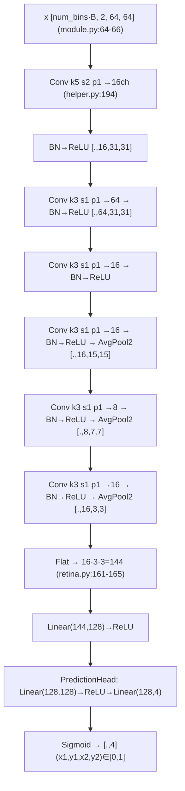
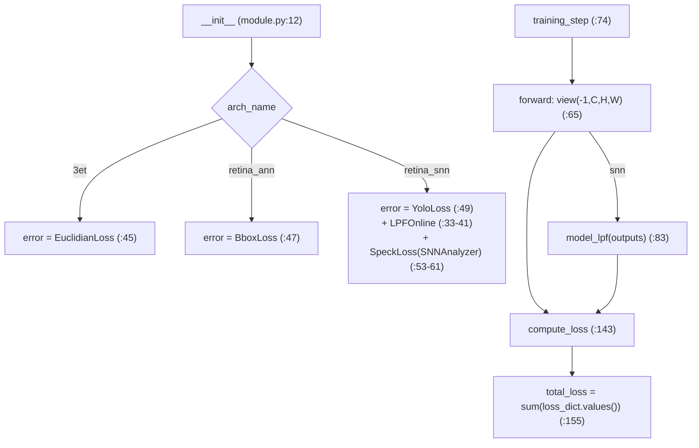
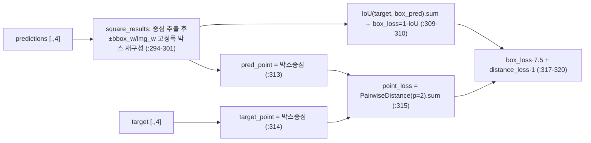
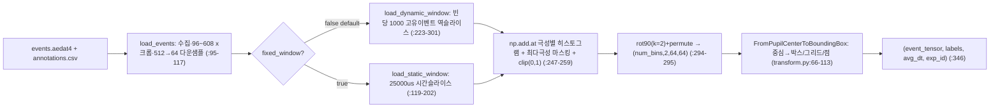

# retina 모듈 통합 가이드 (S-PyTorch)

> 1차 요약: [`../retina.md`](../retina.md) — 본 문서는 그 요약을 모듈(클래스/함수) 단위로 심화한 S-PyTorch 변형 통합 가이드다.
> 분석 대상: `\\wsl.localhost\ubuntu-24.04\home\user\project\PRJXR-HBTXR\REF\XR-Eye-Tracking\Codebase\retina`
> 관련 논문: [`../../Papers/Retina.md`](../../Papers/Retina.md) (Retina, CVPRW 2024, pp.5684-5692, arXiv:2312.00425)
> 작성 원칙: 실제 소스 Read 후 `파일:라인` 근거 표기. 라인 근거 없는 추론은 "추정", 코드로 확인 불가는 "확인 불가"로 명시. 정확도(centroid error)·전력은 README/논문 인용, 미실행 수치는 "확인 불가". sinabs/tonic/dv_processing 등 외부 SNN·이벤트 프레임워크 원본은 import 경계까지만(커스텀 코드만 해부).

---

## 0. 문서 머리말

### 0.1 대표 케이스 선정 + 근거

본 repo는 **단일 `Retina` 클래스가 레이어 딕셔너리 리스트를 순회하며 `nn.Sequential`을 동적 조립**해 ANN/SNN/이진/양자화를 한 골격으로 표현한다(`retina.py:57-194`). 메인 config가 실제 학습에 쓰는 ANN 경로와, 논문 기여(뉴로모픽 배포)인 SNN 경로를 모두 대표로 선정한다.

- **대표 실행 모델(config 기본): `retina_ann` + `config_retina_for_64x64`**
  - 근거: `configs/default.yaml:3`이 `arch_name: retina_ann`을 기본값으로 지정. `get_retina_model_configs`가 64x64일 때 `config_retina_for_64x64`를 선택(`helper.py:13-15`). **6단 Conv(+BN+ReLU)+AvgPool×3 → Flatten → Linear(.,128) → PredictionHead(.,4) → Sigmoid**(`helper.py:185-227`). 출력 = 박스 4좌표 `(x1,y1,x2,y2)`, 중심이 동공 좌표(`utils.py:17-18`, `eval.py:28-30`).
  - 특이점: `PredictionHead`는 `Linear(hidden,128)→ReLU→Linear(128,4)`로 헤드 안에 또 MLP가 있음(`retina.py:15-19`). 마지막 `Sigmoid`(`helper.py:226`)로 출력 [0,1] 정규 좌표. Conv는 모두 `bias=False`(`retina.py:77`) → BN과 fuse 전제 설계.
- **대표 뉴로모픽 모델(논문 핵심): `retina_snn` + `config_retina_snn_for_64x64`**
  - 근거: `from_torch.from_model(model.seq, synops=True)`로 ANN을 SNN 변환(`train.py:109-113`). SNN config는 각 Conv 뒤 `BatchNorm→IAF→(SumPool)`을 배치(`helper.py:81-115`). 출력은 YOLO 그리드 `S×S×(C+B·5)`(`utils.py:19-22`). `verify_hardware_compatibility`면 `convert_to_dynap`로 **Speck2f config 생성**(`train.py:114-116`, `utils.py:122-151`).
  - 특이점: 논문 핵심인 **temporal weighted-sum filter = `LPFOnline`**(`lpf.py:7-115`)이 SNN 출력을 연속값으로 변환(spike→좌표). **단 `forward`에 `pdb.set_trace()` 잔존(`lpf.py:110`) → 현재 그대로는 디버거 정지(미완성/주의)**.
- **대표 모드 노브(일원화 증거)**: ① **양자화** — `a_bit/w_bit`가 1이면 Conv/Linear를 `DoReFaConv2d/DoReFaLinear`로 치환(`helper.py:178-183`), 2~8bit면 `lsqplusprepareV2`를 inplace 적용(`train.py:133-143`). ② **SNN** — `arch_name=="retina_snn"`이면 IAF 활성/리셋/대리기울기 구성(`retina.py:39-54`). 본문 5절에서 4모드(ANN/SNN/binary/quant)를 표로 비교.

> 정리: **메인 경로 = `retina_ann`(순수 CNN, FPGA 1차 타깃)**, **논문 2.89~4.8mW 경로 = `retina_snn`(IAF SNN + temporal weighted-sum, Speck 전용)**. 한 `Retina` 클래스 + layer config가 두 경로를 분기해 표현하며, 이진/양자화는 layer 빌더 단의 이름 치환·prepare 호출로 직교 적용된다(확인됨, 5.4절).

### 0.2 수치 표기 규약 (S-PyTorch)

- **params** = 레이어 차원에서 직접 산정. `Conv2d(c_in→out_dim, k×k, bias=False)` → 가중치 `c_in·out_dim·k²`, bias 없음(`retina.py:71-78`). BN2d = `2·C`(γ,β)(`retina.py:137`). `Linear(c_in,out, bias=False)` = `c_in·out`(`retina.py:119`). `PredictionHead` = `hidden·128 + 128·4`(bias 포함, `nn.Linear` 기본, `retina.py:15-18`). `DoReFaConv2d/Linear`는 동일 차원이나 가중치를 1-bit로 저장(스케일 1개/채널)(`binary_operator.py:21,28-33`).
- **MACs / FLOPs** = ANN은 표준 `MAC = c_out·c_in·k²·H_out·W_out`(conv), `c_in·c_out`(fc). 본 repo는 `__main__`에서 **ptflops/fvcore/thop 3종으로 자동 측정**(`retina.py:229-239`) — 미실행이므로 절대치는 "확인 불가", 논문값(3.03M MAC, 63k param) 인용. **SNN은 MAC이 아니라 SynOps**(이벤트/스파이크 1개당 fanout 시냅스 연산)로 계측: `SNNAnalyzer`가 layer별 `synops/s`·`firing_rate` 산출(`loss.py:154-172`, `logging.py:56-73`). SynOps 절대치는 데이터 의존·미실행 → "확인 불가".
- **activation memory** = 텐서 `shape × bit`. retina ANN은 입력 `(num_bins·B, C, 64, 64)`(시간·배치 병합, `module.py:64-66`)를 Sequential로 흘림 → step별 feature map이 지배항. SNN은 IAF 막전위 상태(`record_states=True`, `retina.py:177`)를 timestep마다 보관 + `LPFOnline.past_inputs` 버퍼(`lpf.py:39`).
- **비트폭(모드별)**: ANN fp32(`default.yaml:69-70` a/w=32), **binary** = act/weight 1-bit(STE, `binary_operator.py:24-33`), **quant** = LSQ+ 2~8bit(`train.py:133-143`), **SNN** = 논문상 8-bit weight + 16-bit neuron state(Speck 제약, Retina.md:51) — 코드는 sinabs `discretize=True`(`utils.py:147`)에 위임(자체 비트폭 코드 부재 → "확인 불가", 논문 인용).
- **IAF 뉴런** = `sinabs.layers.IAFSqueeze`(`retina.py:167-180`): `num_timesteps=num_bins`, `spike_threshold=1`, `min_v_mem=-1.0`, `tau_syn=None`(synaptic decay 미사용 — Speck은 recurrent/decay 미지원, Retina.md:17 정합), `record_states=True`. 막전위 적분-발화 모델(논문 §IAF, Retina.md:31-33).
- **temporal weighted-sum filter** = `LPFOnline`(`lpf.py:92-115`): 출력 채널별 1D conv. 커널은 synaptic kernel `exp(-t/τ_syn)`와 membrane kernel `exp(-t/τ_mem)`의 convolution으로 생성(`lpf.py:98-102`). `scale_factor`만 학습(`lpf.py:19`, `train_scale`), τ는 고정(`requires_grad=False`, `lpf.py:20-21`). 논문: 이 filter 없으면 24.46px → 있으면 3.24px(Retina.md:37) **핵심 역할**.
- **정확도** = 코드 메트릭은 **centroid Euclidean distance(px)** — train/val 로깅(`logging.py:91-103`), SNN은 LPF 커널 이후 구간만 평균(`logging.py:101-102`). 논문: Retina **3.24px(±0.79)** vs 3ET 4.48px(Retina.md:45). p-error 함수는 코드에 명시 부재(`eval.py`는 거리 분포 통계만, `eval.py:60-67`) → "확인 불가/추정". **본 repo 미실행 → 절대 정확도 확인 불가, 논문 인용**.
- **전력** = 코드에 전력 측정 부재. 논문 Speck 실측: **Fixed Window(3ms) 2.89mW/5.57ms/16.10mJ, Dynamic Window(300ev) 4.80mW/8.01ms/38.40mJ**(Retina.md:47) **인용**.

### 0.3 운영 경로 (학습 ↔ Speck 배포)

```
[원시 aedat4: INI30_DATA_PATH/{exp}/events.aedat4 + annotations.csv + silver.csv]
      │  Ini30Dataset.load_events: AedatProcessorLinear로 이벤트 수집, 96~608 x크롭, 512→64 다운샘플 (ini_30_dataset.py:95-117)
      │  load_dynamic_window: 빈당 events_per_frame=1000 고유 이벤트까지 역슬라이스 + np.add.at 히스토그램 누적 (:223-301)
      │    or load_static_window: fixed_window_dt=25000us 시간슬라이스 (:119-202)
      ▼
[이벤트 프레임 텐서 (num_bins,2,64,64), clip(0,1) 이진, rot90+permute (ini_30_dataset.py:190,195-196)]
      │  FromPupilCenterToBoundingBox: 중심점 → arch별 타깃(점/박스/그리드) (transform.py:47-113)
      │    + tonic Compose: CenterCrop→Downscale→(decimate/denoise/drop)→(Merge)→ToFrame (helper.py:28-51)
      ▼
[학습: scripts/train.py (fire CLI)]
      │  Retina(dataset_params,training_params,layers_config) = nn.Sequential 동적 조립 (retina.py:57-194)
      │  ┌─ retina_ann: BboxLoss (1-IoU + L2), Adam lr=1e-3, StepLR (module.py:46-47, default.yaml:3-8)
      │  ├─ retina_snn: from_model(synops=True) → IAF SNN, YoloLoss + SpeckLoss(synops/firing 제약) (train.py:109-113, module.py:48-61)
      │  └─ binary(a/w=1)→DoReFa 치환 / quant(2~8bit)→LSQ+ prepare (helper.py:178-183, train.py:133-143)
      ▼
[검증: distance(centroid Euclidean px), SNN은 IoU 추가 (logging.py:91-110)]
      │  PL Trainer.fit + validate (train.py:167-168)
      ▼
[배포]
      │  retina_ann: convert_to_n6(conv-bn fuse) → ONNX export opset11 dynamic batch (train.py:170-178, utils.py:153-169)
      │    → onnxsim → onnx2tf → INT8 양자화(scripts.quantize) (README:114-120, 단 quantize.py 부재)
      │  retina_snn: convert_to_dynap → DynapcnnNetwork.make_config(speck2fmodule) (train.py:114-116, utils.py:122-151)
      ▼
[Speck2f 온칩 추론: 전력 2.89~4.8mW, 지연 5.57~8.01ms (논문 Retina.md:47)]
```
- pretrained 모델은 Zenodo 배포(README:95). 체크포인트/aedat4 원본은 [제외].

### 0.4 모델 / 데이터셋 / 정확도·전력 요약

| 항목 | 값 | 근거 |
|---|---|---|
| 입력 | 이벤트 프레임 `(num_bins=1, C=2, 64, 64)` | `default.yaml:45-48`, `ini_30_dataset.py:131` |
| 출력 | 동공 중심(arch별): ann=박스4 / snn=YOLO그리드 / 3et=점2 | `utils.py:13-22` |
| 모델(ann) | 6단 Conv+BN+ReLU+AvgPool×3 + FC + PredictionHead + Sigmoid | `helper.py:185-227` |
| params | 논문 63k (코드 미실행→확인불가) | Retina.md:46 (3ET 418k 대비 6.63×↓) |
| MAC | 논문 3.03M (코드 미실행→확인불가) | Retina.md:46 (3ET 107M 대비 ~35×↓) |
| Loss(ann) | BboxLoss = w_box·(1-IoU) + w_euc·L2 | `loss.py:309-320`, w_box=7.5/w_euc=1 (`default.yaml:31-32`) |
| Loss(snn) | YoloLoss + SpeckLoss(synops/firing/input) | `module.py:48-61`, `loss.py:141-181` |
| optimizer | Adam lr=1e-3, StepLR(γ=0.8) | `module.py:127,135`, `default.yaml:4,7` |
| 데이터셋 | Ini-30(aedat4, 30실험, val=[1]) / 3ET(비교) | `default.yaml:41-42`, `helper.py:39-48` |
| 메트릭 | centroid distance(px) / SNN IoU | `logging.py:91-110` |
| 정확도(논문) | Retina **3.24px(±0.79)** vs 3ET 4.48px | Retina.md:45 (본 repo 미실행→확인불가) |
| 전력(논문 Speck) | **2.89mW/5.57ms (Fixed3ms)**, 4.80mW/8.01ms (Dyn300ev) | Retina.md:47 |

---

## 1. Repo / Layer 개요 (모드별 맵)

retina = 이벤트 카메라(aedat4) 입력으로 동공 중심 좌표를 회귀하는 **config-driven 경량 CNN**을 ANN/SNN/이진/양자화/배포로 **일원화**한 코드베이스. 단일 `Retina` 클래스가 레이어 딕셔너리를 순회하며 모드별 레이어를 조립한다(`retina.py:57-194`). 학습은 순수 PyTorch+Lightning, SNN/배포는 sinabs(Speck/DYNAP)에 위임.

### 1.1 모드별 맵 (4모드 직교 조합)

| 모드 | 활성 조건 | 핵심 레이어/연산 | 진입 라인 | 출력 |
|---|---|---|---|---|
| **ANN** (기본) | `arch_name=retina_ann` | Conv+BN+ReLU+AvgPool, FC, PredictionHead, Sigmoid | `retina.py:67-85,130-148`, `helper.py:185-227` | 박스4 `(x1,y1,x2,y2)` |
| **SNN** (논문) | `arch_name=retina_snn` | Conv+BN+IAF+SumPool, Decimation, LPF(temporal) | `retina.py:39-54,167-190`, `helper.py:70-115` | YOLO 그리드 `S²(C+5B)` |
| **binary** | `a_bit==1 or w_bit==1` | DoReFaConv2d/DoReFaLinear (1-bit STE) | `helper.py:178-183`, `binary_operator.py:7-104` | (ann/snn에 직교) |
| **quant** | `1<bit<32` | LSQ+ V2 inplace prepare (2~8bit) | `train.py:133-143` | (ann/snn에 직교) |
| **3et** (비교) | `arch_name=3et` | `Baseline_3ET` (4단 ConvLSTM) | `baseline_3et.py`, `train.py:124-130` | 점2 `(x,y)` |

### 1.2 파일 역할 맵

| 구분 | 파일 | 역할 | 메인 사용 |
|---|---|---|---|
| **설정** | `configs/default.yaml` | training/dataset/quant 전 파라미터 | ★ |
| **모델 본체** | `engine/models/retina/retina.py` | `Retina`(동적 Sequential) + `PredictionHead` | ★ |
| **레이어 구성표** | `engine/models/retina/helper.py` | 64/128 × ann/snn config 딕셔너리 | ★ |
| **학습/추론 모듈** | `engine/module.py` | LightningModule(시간축 처리·loss선택·optim) | ★ |
| **loss** | `engine/loss.py` | Bbox/Yolo/Euclidian/Speck/IoU | ★ |
| **IAF/SNN** | `engine/models/spiking/{lpf,decimation,residual,speck_compute_config}.py` | LPF(temporal sum)·Decimation·Speck config | ★ snn |
| **이진화** | `engine/models/binarization/binary_operator.py` | DoReFa Conv/Linear (1-bit) | ★ binary |
| **양자화** | `engine/models/quantization/lsqplus_quantize_V2.py` 외 | LSQ+/DoReFa 저비트 (외부 이식, 진입점만) | ★ quant |
| **모델 유틸** | `engine/models/utils.py` | conv-bn fuse, DYNAP/N6 변환, synops, output_dim | ★ |
| **데이터셋** | `data/datasets/ini_30/ini_30_dataset.py` | aedat4→이벤트프레임(static/dynamic window) | ★ |
| **타깃 변환** | `data/transforms/transform.py` | 중심점→박스/그리드, 입력 파이프라인 | ★ |
| **학습/배포 진입** | `scripts/train.py` | fire CLI + SNN변환 + 양자화 + ONNX export | ★ 진입점 |
| **평가** | `scripts/eval.py` | fp32/int8 ONNX 거리 분포 비교 | 배포 검증 |
| **로깅** | `engine/callbacks/logging.py` | distance/IoU/synops/firing/GIF/wandb | — |
| **비교 모델** | `engine/models/baseline_3et.py` | 3ET ConvLSTM 베이스라인 | 비교용 |
| **[제외]** | aedat4 원본, Zenodo 체크포인트, `docs/*.gif`, `plots/`, `stm32ai_*.ipynb` | 데이터·산출물·MCU 노트북 | 제외 |

### 1.3 forward 진입점

`training_module.forward(x)` → `EyeTrackingModelModule.forward`(`module.py:63`) → retina계열은 `(B,T,C,H,W)`를 `(-1,C,H,W)`로 병합(`module.py:64-66`) → ANN은 `self.model(x)`=`Retina.forward`=`self.seq(x)`(`retina.py:196-197`), SNN은 `self.model.spiking_model(x)`(`module.py:67-68`) → SNN이면 출력에 `model_lpf` 적용(`module.py:82-83`). 즉 **시간축(num_bins) 병합은 상위 Lightning 모듈, 공간 conv는 `Retina`**가 담당.

### 1.4 제외 목록
- **외부 데이터/체크포인트**: Ini-30 aedat4·annotations.csv·silver.csv, Zenodo pretrained, `docs/*.gif`.
- **외부 프레임워크 원본**: `sinabs`(IAFSqueeze/SumPool2d/SNNAnalyzer/from_torch/DynapcnnNetwork), `tonic`(ToFrame/CenterCrop/augment), `dv_processing`(aedat4 디코딩), `pytorch_lightning`, `fire`, `wandb`, `ptflops/fvcore/thop`(import만).
- **양자화 원본 알고리즘**: `engine/models/quantization/*`의 LSQ/DoReFa는 외부 이식분(추정) — 진입점 `lsqplusprepareV2`(`train.py:14,134`) 호출 경계까지만.
- **보조/시각화**: `plots/`, `stm32ai_quantize_onnx_benchmark.ipynb`(MCU 배포 노트북).

---

## 2. 모듈: 동적 백본 — `Retina` (config-driven CNN, 메인 본체)

### 2.1 역할 + 상위/하위
- **역할**: 별도 backbone/neck/head 분리 없이 **레이어 딕셔너리 리스트를 순회하며 `nn.Sequential`을 동적 조립**(`retina.py:57-194`). 동일 클래스가 ANN/SNN/이진을 모두 표현 — config의 `name` 필드가 어떤 레이어를 만들지 결정.
- **상위**: `EyeTrackingModelModule`이 `self.model`로 보유(`module.py:14`), forward에서 시간축 병합 후 호출(`module.py:64-69`). SNN은 `from_model`이 `Retina.seq`를 받아 `spiking_model`로 변환(`train.py:109-113`).
- **하위**: `nn.Conv2d`/`nn.Linear`/`nn.BatchNorm2d`/`nn.ReLU`/`nn.Sigmoid`/`nn.AvgPool2d`(ANN), `sinabs.layers.IAFSqueeze`/`SumPool2d`(SNN, `retina.py:153,169`), `DoReFaConv2d`/`DoReFaLinear`(binary), `DecimationLayer`/`PredictionHead`(커스텀).

### 2.2 데이터플로우 (ANN 64x64, 텐서 shape)

> 주: H/W는 `c_x = (c_x - k + 2p)//s + 1`로 빌더가 추적(`retina.py:83-84`). AvgPool은 `(c_x-k)//s+1`(`retina.py:145-147`). 위 H/W는 64 입력 가정 산정값(코드 print로 출력, 미실행→"추정"). Flatten 입력 차원 = `c_x·c_y·c_in`(`retina.py:165`).

### 2.3 forward call stack
```
EyeTrackingModelModule.forward (module.py:63)
├─ B,T,C,H,W = x.shape; x = x.view(-1,C,H,W) (module.py:65-66)  # 시간축 병합
└─ self.model(x) → Retina.forward (retina.py:196)
   └─ self.seq(x)  # nn.Sequential 순차 (retina.py:197)
      └─ [Conv → BN → ReLU → ...] or [Conv → BN → IAF → SumPool] (SNN)
(SNN) → outputs = self.model_lpf(outputs) (module.py:82-83)  # temporal weighted-sum
```

### 2.4 대표 코드 위치
`retina.py:26-54`(생성자·SNN 활성 분기), `:57-194`(레이어 빌더 루프), `:196-197`(forward), `:12-23`(PredictionHead), `helper.py:185-227`(ann 64x64 config).

### 2.5 대표 코드 블록

**(a) Conv 빌더 + 출력차원 추적 (`retina.py:67-85`)**
```python
elif layer["name"] == "Conv":
    modules.append(nn.Conv2d(in_channels=c_in, out_channels=layer["out_dim"],
                             kernel_size=(layer["k_xy"], layer["k_xy"]),
                             stride=(layer["s_xy"], layer["s_xy"]),
                             padding=(layer["p_xy"], layer["p_xy"]), bias=False))
    c_in = layer["out_dim"]
    c_x = ((c_x - layer["k_xy"] + 2 * layer["p_xy"]) // layer["s_xy"]) + 1
    c_y = ((c_y - layer["k_xy"] + 2 * layer["p_xy"]) // layer["s_xy"]) + 1
```
→ `bias=False`(BN/fuse 전제). 빌더가 `c_x/c_y/c_in`을 갱신해 Flatten 차원과 다음 conv in_channel을 자동 산정. **이 차원 추적이 config만으로 모델을 닫게 하는 핵심.**

**(b) SNN 활성/리셋/대리기울기 분기 (`retina.py:39-54`)**
```python
if self.training_params["arch_name"] =="retina_snn":
    spike_fn = sina.MultiSpike if training_params["spike_multi"] else sina.SingleSpike
    spike_reset = sina.MembraneReset() if training_params["spike_reset"] else sina.MembraneSubtract()
    spike_grad = sina.Heaviside(window=training_params["spike_window"])
    if training_params["spike_surrogate"]:
        spike_grad = sina.PeriodicExponential() if training_params["spike_multi"] else sina.SingleExponential()
```
→ default는 `spike_multi=false`(SingleSpike), `spike_reset=false`(MembraneSubtract=soft reset), `spike_surrogate=true`(SingleExponential 대리기울기)(`default.yaml:20-23`). 논문 surrogate=periodic exponential(Retina.md:28)과 default(single)는 상이 — **추정**(spike_multi=true일 때만 periodic).

**(c) IAF 뉴런 빌더 (`retina.py:167-180`)**
```python
elif layer["name"] == "IAF":
    modules.append(sinabs.layers.IAFSqueeze(
        batch_size=training_params["batch_size"], spike_fn=spike_fn,
        surrogate_grad_fn=spike_grad, reset_fn=spike_reset,
        num_timesteps=self.num_bins, tau_syn=layer["tau_syn"],
        spike_threshold=layer["spike_threshold"], record_states=True,
        min_v_mem=layer["min_v_mem"]))
```
→ config의 모든 IAF는 `tau_syn=None, spike_threshold=1, min_v_mem=-1.0`(`helper.py:84,89,...`). `record_states=True`로 막전위 추적(SpeckLoss·디버깅용). `num_timesteps=num_bins`로 squeeze된 시간축을 IAF가 재해석.

### 2.6 연산 분해 + 정량
- **params(ANN 64x64, 차원 산정, bias=False conv)**: Conv 합 = (2·16·25)+(16·64·9)+(64·16·9)+(16·16·9)+(16·8·9)+(8·16·9) = 800+9,216+9,216+2,304+1,152+1,152 = **23,840**; BN2d(16,64,16,16,8,16) = 2·136 = 272; FC `Linear(144,128, bias=False)`=18,432; PredictionHead `Linear(128,128)+Linear(128,4)`(bias有) = (128·128+128)+(128·4+4) = 16,512+516 = 17,028. **합 ≈ 59,572 ≈ 0.060M** → 논문 63k(Retina.md:46)와 근사(확인됨, Flatten 차원=144 가정 하; 미실행→"추정").
- **MAC**: conv가 지배. 코드 `__main__`의 ptflops/fvcore/thop로 측정(`retina.py:229-239`)하나 미실행 → 절대치 "확인 불가". 논문 **3.03M MAC**(Retina.md:46) 인용.
- **SNN MAC→SynOps**: 동일 conv 차원이나 dense MAC 대신 **스파이크 fanout만 계산**(0-입력은 연산 생략). `SNNAnalyzer.get_layer_statistics()`가 `synops/s` 산출(`loss.py:154-160`). 절대 SynOps는 데이터·firing rate 의존 → "확인 불가".
- **activation memory(ANN, fp32, 1프레임)**: C2 출력 `[1,64,31,31]` = 64·31·31·4B ≈ 246KB가 최대 feature map. 입력 `[1,2,64,64]`=32KB. → 매우 경량(on-device 적합).

---

## 3. 모듈: 학습/추론 모듈 — `EyeTrackingModelModule` (시간축·loss·optim 일원화)

### 3.1 역할 + 상위/하위
- **역할**: PyTorch Lightning 모듈로 ① 시간축(`B,T` 병합) 처리, ② arch별 loss 선택, ③ SNN 전용 LPF·SpeckLoss 구성, ④ optimizer/scheduler 구성, ⑤ train/val step을 일원화(`module.py:11-157`).
- **상위**: `scripts/train.py`의 PL `Trainer.fit`이 호출(`train.py:146,167`). **하위**: `Retina`(또는 SNN변환 모델), `LPFOnline`, `BboxLoss/YoloLoss/EuclidianLoss`, `SpeckLoss`.

### 3.2 데이터플로우 (loss 선택 분기)


### 3.3 forward call stack
```
Trainer.fit → training_step (module.py:74)
├─ data, labels, _, _ = batch (:75)
├─ outputs = self.forward(data) (:79)
│  └─ x.view(-1,C,H,W); (snn) model.spiking_model(x) else model(x) (:64-69)
├─ (snn) outputs = self.model_lpf(outputs) (:82-83)
├─ loss_dict, output_dict = compute_loss(outputs.clone(), labels.clone()) (:86)
│  └─ loss_dict.update(self.error(outputs, labels)) (:147)
│  └─ (snn) loss_dict.update(self.speck_loss()) (:152)
│  └─ total_loss = sum(loss_dict.values()) (:155)
└─ self.log("train_loss", ...) (:91)
```

### 3.4 대표 코드 위치
`module.py:44-49`(loss 선택), `:63-69`(forward 시간축), `:116-141`(optimizer/scheduler), `:143-156`(compute_loss 합산), `:32-41`(LPF 구성), `:51-61`(SpeckLoss 구성).

### 3.5 대표 코드 블록

**(a) 시간축 병합 + SNN 분기 (`module.py:63-69`)**
```python
def forward(self, x):
    if self.training_params["arch_name"][:6] =="retina":
        B, T, C, H, W = x.shape
        x = x.view(-1, C, H, W)                # (B·T, C, H, W) 시간·배치 병합
        if self.training_params["arch_name"] =="retina_snn":
            return self.model.spiking_model(x) # IAF가 num_timesteps로 시간 재해석
    return self.model(x)
```
→ retina는 시간축(num_bins)을 배치에 흡수해 2D conv로 처리. **시간 모델링은 conv가 아니라 (a) 데이터단 빈 누적, (b) SNN IAF 막전위/LPF**가 담당(논문 핵심, Retina.md:35). default `num_bins=1`(`default.yaml:45`)이라 ANN은 사실상 단일 프레임.

**(b) SNN optimizer — LPF τ·scale에 별도 lr (`module.py:119-124`)**
```python
if self.training_params["arch_name"] =="retina_snn":
    param_list += [
        {"params": self.model_lpf.tau_mem, "lr": lr_model_lpf_tau},
        {"params": self.model_lpf.tau_syn, "lr": lr_model_lpf_tau},
        {"params": self.model_lpf.scale_factor, "lr": lr_model_lpf}]
```
→ temporal filter의 τ_mem/τ_syn/scale을 본 모델과 다른 lr로 학습(`lr_model_lpf=1e-4, lr_model_lpf_tau=1e-3`, `default.yaml:11-12`). 단 `lpf.py:20-21`에서 τ는 `requires_grad=False`로 고정되어 있어 **param_list 등록과 모순**(τ는 실제 미학습) — **확인됨(코드 불일치), scale_factor만 학습**(`lpf.py:19`).

**(c) loss 합산 (`module.py:143-156`)**
```python
loss_dict.update(self.error(outputs, labels))         # ann: box+distance / snn: box+conf+distance
if self.training_params["arch_name"] =="retina_snn":
    loss_dict.update(self.speck_loss())               # upper/lower synops + input + fire
loss_dict["total_loss"] = sum(loss_dict.values())
```
→ SNN은 task loss + HW 제약 loss를 단순 합산. SpeckLoss가 synops·firing rate를 학습 목적함수에 직접 주입 → **HW-aware 학습**(4절).

### 3.6 연산 분해 + 정량
- 모듈 자체는 파라미터 없음(loss/optim 컨테이너). LPF는 `scale_factor`(스칼라) + 비학습 τ(`lpf.py:19-21`)로 학습 파라미터 **사실상 1개**.
- 시간 복잡도: ANN은 `O(B·T·conv_cost)`(병렬), SNN은 IAF가 timestep 직렬 적분(`num_timesteps=num_bins`). default num_bins=1이라 직렬 부담 미미하나, 논문 학습은 **64 timebin**(Retina.md:23) → SNN은 T=64 직렬 적분(HW 매핑시 고려, 8절).

---

## 4. 모듈: Loss — `BboxLoss` / `YoloLoss` / `SpeckLoss` / `EuclidianLoss` (모드별 목적함수)

### 4.1 역할 + 상위/하위
- **역할**: arch별 회귀 목적함수 + SNN HW 제약. `EyeTrackingModelModule.error`(`module.py:45-49`)와 `speck_loss`(`module.py:53`)로 결선.
- **상위**: `compute_loss`(`module.py:147,152`). **하위**: `intersection_over_union`(`loss.py:12-44`), `PairwiseDistance`, `nn.MSELoss`, `SNNAnalyzer`(sinabs).

### 4.2 데이터플로우 (BboxLoss, 메인)


### 4.3 forward call stack
```
compute_loss (module.py:147) → BboxLoss.forward (loss.py:303)
├─ target.flatten(end_dim=1) if 5D (:304-305)
├─ box_predictions = self.square_results(predictions) (:307)
│  └─ point=중심; norm_pred[:2]=point-bbox_w/img; [2:]=point+bbox_w/img (:294-301)
├─ box_loss = 1 - IoU(box_targets, box_predictions).sum (:309-310)
├─ point_loss = PairwiseDistance(pred_point, target_point).sum (:312-315)
└─ {box_loss·w_box_loss, distance_loss·w_euclidian_loss} (:317-320)
```

### 4.4 대표 코드 위치
`loss.py:12-44`(IoU), `:47-67`(EuclidianLoss), `:261-328`(BboxLoss), `:331-467`(YoloLoss), `:90-181`(SpeckLoss), `:294-301`(square_results 고정폭 박스).

### 4.5 대표 코드 블록

**(a) 고정폭 박스 재구성 (`loss.py:294-301`) — 실질 중심점 회귀**
```python
def square_results(self, predictions):
    point_1 = predictions[..., :2] + (predictions[..., 2:] - predictions[..., :2]) / 2
    norm_pred1[..., :2] = point_1 - self.bbox_w / self.img_width   # bbox_w=5, img=64
    norm_pred1[..., 2:] = point_1 + self.bbox_w / self.img_width
    return norm_pred1
```
→ 모델 출력 박스의 **중심만 취해 고정폭(`bbox_w/img_width`) 정사각형으로 덮어씀**. 즉 박스 폭은 학습되지 않고 상수 → **실질 task = 중심점 회귀 + 고정 박스**(논문 "1px 라벨을 2px 확장한 target box", Retina.md:29 정합). IoU loss는 중심 정합 surrogate 역할.

**(b) SpeckLoss — HW 제약을 loss로 (`loss.py:158-172`)**
```python
for key in self.layer_stats["parameter"].keys():
    synops = self.layer_stats["parameter"][key]["synops/s"]
    if synops < self.synops_lim[0]: lower_synops_loss += (lim0 - synops)**2 / lim0**2
    if synops > self.synops_lim[1]: upper_synops_loss += (lim1 - synops)**2 / lim1**2
firing_rates = np.linspace(firing_lim[0], firing_lim[1], last_layer_idx)
for i, (_, stats) in enumerate(self.layer_stats["spiking"].items()):
    inputs_clipped = relu(stats["input"] - self.spiking_thresholds[i])
    self.input_loss += sqrt(mean(inputs_clipped**2) + 1e-8)
    self.fire_loss += (firing_rates[i] - stats["firing_rate"])**2 / firing_rates[i]**2
```
→ ① synops/s를 `[1e3,1e6]`(`default.yaml:24`) 범위로 제약(Speck 코어 한계), ② layer별 firing_rate를 목표 선형분포(0.3→0.4, `default.yaml:27`)로 유도, ③ IAF 임계 초과 입력 패널티. **이것이 "뉴로모픽 HW 친화 학습"의 핵심** — 칩 자원/발화율을 직접 목적함수화(논문 L_syn, Retina.md:40). 단 default 가중치 `w_synap/w_input/w_fire=0`(`default.yaml:19,25-26`)이라 **기본 config에선 비활성**(추정: 데모값, 실제 학습시 상향 필요).

**(c) YoloLoss — best-box 선택 (`loss.py:396-415`)**
```python
if self.B == 2:
    ious = torch.cat([iou_b1.unsqueeze(0), iou_b2.unsqueeze(0)], dim=0)
    iou_maxes, bestbox = torch.max(ious, dim=0)
    box_predictions = exists_box * (bestbox*pred_box2 + (1-bestbox)*pred_box1)
```
→ SNN 그리드 셀당 B=2 박스 중 IoU 최대 박스 선택(YOLO v1). default `num_boxes=1`(`default.yaml:36`)이라 단일 박스 분기(`loss.py:416-420`) 사용. `box_loss`(MSE)·`conf_loss`(MSE)·`distance_loss`(L2) 합산(`:455-459`).

### 4.6 연산 분해 + 정량
- params 없음(loss). IoU `+1e-6` 안정화(`loss.py:44`). BboxLoss 가중치 box=7.5/euc=1(`default.yaml:31-32`), 논문 λ_box=7.5/λ_conf=1.5(Retina.md:41)와 box 일치·conf는 코드 7.5(`default.yaml:33`)로 상이.
- 미사용(정의만): `GaussianLoss`(`loss.py:70-87`), `FocalIoULoss`(`loss.py:184-233`), `encode_to_spike_pattern`(Poisson, `loss.py:236-259`) — 호출처 없음("확인 불가/미사용 추정").

---

## 5. 모듈: 모드 일원화 — IAF SNN / temporal weighted-sum / binary / quant 정밀 해부

본 repo의 차별점은 **하나의 골격에 4모드를 직교 적용**하는 것이다. 각 모드의 핵심 커스텀 코드를 해부한다.

### 5.1 IAF SNN 변환 — `from_model` + `IAFSqueeze`
- **ANN→SNN 변환**: `sinabs.from_torch.from_model(model.seq, add_spiking_output=False, synops=True, batch_size=...)`(`train.py:109-113`). ANN의 ReLU를 IAF로 치환하는 sinabs 표준 변환(원본 제외). 단 본 repo SNN config는 이미 `IAF` 레이어를 명시 조립(`helper.py:84,...`)하므로, retina_snn 경로는 config 단에서 IAF를 박고 from_model이 synops 분석을 부착(추정).
- **IAF 모델**: 막전위 적분-발화(`spike_threshold=1`, `min_v_mem=-1.0`), `tau_syn=None`(synaptic decay 미사용). 논문: Speck은 voltage decay/recurrent 미지원이라 IAF + 외부 temporal filter로 시간정보 학습(Retina.md:17). soft reset(MembraneSubtract, default `spike_reset=false`, `retina.py:46`).

### 5.2 temporal weighted-sum filter — `LPFOnline` (논문 핵심)
- **역할**: SNN 출력(스파이크 카운트)을 연속 좌표로 변환하는 비-spiking 1D temporal filter. `y(t)=Σ w_i·x(t-i)`(논문 Retina.md:36).
- **커널 생성**(`lpf.py:98-102`): synaptic kernel `exp(-t/τ_syn)`와 membrane kernel `exp(-t/τ_mem)`를 conv1d로 합성 → 지수감쇠 가중 필터. τ_mem=τ_syn=5(`default.yaml:13`), 논문 최적값 5(Retina.md:48) 일치.
- **forward**(`lpf.py:92-115`): 출력채널별 grouped conv1d로 시계열 적분 후 `scale_factor` 곱. `past_inputs` 버퍼로 스트리밍 상태 유지(`shift_past_inputs`, `lpf.py:83-86`).
- **치명 결함**: `forward`에 `pdb.set_trace()` 잔존(`lpf.py:110`) → **SNN+LPF 실행시 디버거 정지**. 또한 `set_low_pass_kernel`/`set_custom_kernel`/conv 초기화가 다수 주석처리(`lpf.py:22-40`)되어 forward에서 커널 매번 재계산(비효율) — **미완성/주의**(확인됨).

```python
# lpf.py:98-113 (커널 합성 + grouped conv)
syn_kernel = exp(-arange(kernel_size)/tau_syn); mem_kernel = exp(-arange(kernel_size)/tau_mem)
kernel = conv1d(syn_kernel.flip(-1), mem_kernel.flip(-1))[..., :-1]
padded = cat((self.past_inputs, x), -1)
pdb.set_trace()  # ★ 실행 차단 버그
convd = conv1d(padded, kernel.flip(-1).repeat(num_channels,1,1), groups=num_channels) * self.scale_factor
```
→ 논문: filter 없으면 24.46px, 있으면 3.24px(Retina.md:37) — **spike→좌표 회귀의 결정적 모듈**. FPGA에선 고정 가중치 1D conv = 단순 MAC 누산으로 매우 저비용(8절).

### 5.3 Decimation — `DecimationLayer` (입력 율 제어)
- **역할**: 학습 불가 항등 1×1 conv(`weight=I`, `requires_grad=False`, `decimation.py:30-31`) + IAF(`spike_threshold=decimation_rate`)로 입력 이벤트 율을 솎아냄(`decimation.py:6-47`). `decimation_rate=1`(default, `default.yaml:64`)이면 사실상 통과.
- SNN config Layer0 직후 배치(`helper.py:80`). 5D 입력을 4D로 reshape 후 conv+spk(`decimation.py:36-42`).

### 5.4 binary — `DoReFaConv2d` / `DoReFaLinear` (1-bit STE)
- **활성 조건**: `quant_params["a_bit"]==1 or w_bit==1`이면 layer config의 conv2d/linear 이름을 DoReFa로 치환(`helper.py:178-183`).
- **DoReFaConv2d**(`binary_operator.py:23-36`): 입력은 `sign` 이진화(STE: `binary.detach() - cliped.detach() + cliped`, `:24-26`), 가중치는 **채널별 |w| 평균 스케일 × sign**(`:28-33`). XNOR-net/DoReFa 계열 1-bit conv. weight를 `rand*0.001`로 초기화(`:21`).
- **DoReFaLinear**(`binary_operator.py:87-104`): `BinaryQuantizer`(STE, |x|>1에서 grad=0, `:71-84`)로 act/weight 이진화 + 가중치 채널평균 스케일(`:97-99`). `nn.Linear` 상속이라 bias 옵션 보유.

```python
# binary_operator.py:28-33 (가중치 1-bit + 채널 스케일)
real_weights = self.weight.view(self.shape)
scaling_factor = mean(mean(mean(abs(real_weights),dim=3),dim=2),dim=1).detach()  # 채널별 스케일
binary_weights_no_grad = scaling_factor * torch.sign(real_weights)
binary_weights = binary_weights_no_grad.detach() - cliped_weights.detach() + cliped_weights  # STE
```
→ **비트폭 = 1-bit weight/act + fp32 채널 스케일**. FPGA에선 XNOR+popcount MAC으로 직접 매핑(8절).

### 5.5 quant — LSQ+ V2 (2~8bit, 외부 이식)
- **활성 조건**: `(a_bit<32 or w_bit<32) and (a_bit>1 or w_bit>1)` → `lsqplusprepareV2(model, inplace=True, a_bits, w_bits, all_positive, quant_inference, per_channel, batch_init)`(`train.py:133-143`).
- LSQ+(learned step size)는 외부 이식분(`quantization/lsqplus_quantize_V2.py`)이라 진입점 호출 경계까지만(제외). default fp32(a/w=32, `default.yaml:69-70`)라 비활성. per_channel=true(`:73`).

### 5.6 4모드 비교표

| 모드 | 활성 조건 | 비트폭(act/weight) | 핵심 연산 | 시간 모델링 | 메인 결선 |
|---|---|---|---|---|---|
| **ANN** | `retina_ann`(default) | fp32/fp32 | Conv+BN+ReLU+AvgPool+FC+Sigmoid | 데이터단 빈 누적(num_bins) | **★ default** |
| **SNN** | `retina_snn` | 8b/16b state(논문, Speck) | Conv+BN+IAF+SumPool, Decimation, LPF | IAF 막전위 + LPF temporal sum | ★ 논문 |
| **binary** | `a_bit==1 or w_bit==1` | 1b/1b+채널스케일(STE) | DoReFa Conv/Linear (sign) | (ann/snn 직교) | 직교 |
| **quant** | `1<bit<32` | 2~8b/2~8b (LSQ+) | LSQ+ fake-quant | (ann/snn 직교) | 직교 |

### 5.7 연산 분해 + 정량 (모드 절감)
- **binary**: conv 차원은 ANN과 동일 → 이론 MAC 동일하나, HW에서 1-bit XNOR+popcount로 곱셈 제거 → DSP→LUT 절감(추정, PyTorch dense는 wall-time 절감 없음 → "확인 불가").
- **SNN SynOps**: 논문 **3.03M MAC**(Retina.md:46)은 ANN 기준 MAC이며, SNN 실배포는 firing rate(첫 layer 10%, Retina.md:48) × fanout만 발생 → 추가 sparsity 절감. SynOps 절대치 미실행 "확인 불가".
- **quant 정확도 곡선**: `eval.py`가 fp32 vs int8 ONNX 거리 분포 비교(`eval.py:56-67`) → 양자화 정밀도-비트폭 trade-off 측정 인프라 존재. 단 `scripts/quantize.py` **부재**(README:119 호출, Glob 결과 없음) → "확인 불가/누락".

---

## 6. 모듈: 데이터 파이프라인 — `Ini30Dataset` / `FromPupilCenterToBoundingBox` / window 2종

### 6.1 역할 + 상위/하위
- **역할**: aedat4 raw 이벤트를 **이벤트-카운트 2D 히스토그램 프레임**으로 변환, 라벨(동공 중심)을 arch별 타깃으로 변환해 `(frames, label, avg_dt, exp_id)` 반환.
- **상위**: `get_ini_30_dataset`(`helper.py:14-37`) → `DataLoader`(`eval.py:53`, `EyeTrackingDataModule`). **하위**: `AedatProcessorLinear`(dv_processing 래퍼), tonic transform, `FromPupilCenterToBoundingBox`.

### 6.2 데이터플로우


### 6.3 forward call stack (데이터)
```
DataLoader → Ini30Dataset.__getitem__ (ini_30_dataset.py:303)
├─ labels = load_labels(index) (:306)  # 640x480→512x512 센터크롭 보정 (:90-91)
├─ events = load_events(index) (:307)  # x크롭 96~608, //=512//64 다운샘플 (:107-115)
├─ (augment) TimeJitter/UniformNoise/DropEvent (:312-325)
├─ if fixed_window: load_static_window else load_dynamic_window (:334-338)
│  └─ np.add.at(data[i,0], (xy[p==0,0], xy[p==0,1]), 1) (:247)  # 극성별 누적
│  └─ 최다극성만 유지 마스킹 (:252-257); clip(0,1) (:259)
│  └─ target_transform(np.vstack([x,y])) (:298)
└─ if C==1: event_tensor = 1 - event_tensor (:343-344)
```

### 6.4 대표 코드 위치
`ini_30_dataset.py:95-117`(load_events), `:119-202`(static window), `:223-301`(dynamic window), `:204-221`(find_first_n_unique_pairs), `transform.py:66-113`(타깃 변환), `transforms/helper.py:28-51`(입력 파이프라인).

### 6.5 대표 코드 블록

**(a) 동적 이벤트수 윈도우 (`ini_30_dataset.py:240-247`)**
```python
for i in reversed(range(self.num_bins)):
    xy = self.find_first_n_unique_pairs(evs_xy[:end_idx, :], self.events_per_frame)  # 1000 고유 좌표
    start_idx = end_idx - len(xy)
    p = evs_p[start_idx:end_idx]
    np.add.at(data[i, 0], (xy[p == 0, 0], xy[p == 0, 1]), 1)  # ON/OFF 극성별 히스토그램
```
→ **빈당 고유 픽셀 1000개**가 모일 때까지 역방향 슬라이스(활동량 적응형). 논문 dynamic window가 fixed보다 정밀(3.24 vs 3.71px, Retina.md:48). 단 `find_first_n_unique_pairs`(Python 루프, `:204-221`) + `dv.Accumulator`가 DataLoader 병목(README:84 자인). **이벤트→프레임을 HW로 이관할 핵심 후보**(8절).

**(b) 극성 마스킹 + 이진화 (`ini_30_dataset.py:252-259`)**
```python
np.add.at(data[i, self.input_channel-1], (xy[p==1,0], xy[p==1,1]), 1)
data[i,0][data[i,1] >= data[i,0]] = 0   # ch1이 많으면 ch0 제거
data[i,1][data[i,1] <  data[i,0]] = 0   # ch0이 많으면 ch1 제거
data[i] = data[i].clip(0, 1)            # "no double events" 이진화
```
→ 픽셀별 **최다 극성만 유지** 후 0/1 clip. 논문 "동일 픽셀 다중 이벤트 시 최다 polarity 유지 후 clip"(Retina.md:23) 정합. 이벤트의 1-bit 비동기성 활용.

**(c) arch별 타깃 변환 (`transform.py:78-109`)**
```python
if self.dataset_name=="ini-30": x_norm, y_norm = x/self.image_size[0], y/self.image_size[1]
if self.arch_name == "3et": labels.append(torch.tensor([x_norm, y_norm]))         # 점
box_coordinates = torch.tensor([x_norm-x_delta, y_norm-y_delta,
                                x_norm+x_delta, y_norm+y_delta]).clip(0,1)
if self.arch_name == "retina_ann": labels.append(box_coordinates)                  # 박스4
elif self.arch_name == "retina_snn":
    label_matrix[row, column, self.C] = 1                          # obj conf
    label_matrix[row, column, (C+1):(C+5)] = box_coordinates       # 그리드 셀에 박스 기입
```
→ 동일 중심점을 arch별로 점(3et)/박스(ann)/YOLO그리드(snn)로 변환. **이 transform이 멀티-arch를 한 데이터로더로 닫는 어댑터.**

### 6.6 연산 분해 + 정량
- params 없음(전처리). 비용은 I/O + `find_first_n_unique_pairs` Python 루프(병목).
- 입력 텐서/샘플: `(1,2,64,64)` fp32 = 2·64·64·4B = **32KB/샘플**, 배치(32) = 1MB. 매우 경량.
- train/val 분할: 30 실험 중 `ini30_val_idx=[1]`만 val, 나머지 29개 train(`helper.py:39-48`) → LOSO 유사(피험자 단위 일반화 평가).

---

## 7. 모듈 한눈표

| # | 모듈 | 파일:라인 | 역할 | 대표 정량 |
|---|---|---|---|---|
| 2 | Retina (동적 백본) | retina.py:25-197 | config 순회 nn.Sequential 조립(ann/snn/binary) | params ≈ 0.060M(산정, 논문 63k) |
| 2 | PredictionHead | retina.py:12-23 | Linear(.,128)→ReLU→Linear(128,4) | params 17,028(64x64) |
| 3 | EyeTrackingModelModule | module.py:11-157 | 시간축 병합·loss선택·optim·LPF/Speck구성 | LPF 학습파라미터 1개(scale) |
| 4 | BboxLoss (ann) | loss.py:261-328 | (1-IoU)·7.5 + L2·1, 고정폭 박스 | 실질 중심점 회귀 |
| 4 | YoloLoss (snn) | loss.py:331-467 | box(MSE)+conf(MSE)+L2, best-box | S=4, B=1(default) |
| 4 | SpeckLoss (HW) | loss.py:90-181 | synops[1e3,1e6]·firing[0.3,0.4]·input 제약 | default 가중치 0(비활성) |
| 5.2 | LPFOnline (temporal) | lpf.py:7-115 | exp 커널 1D conv (spike→좌표) | filter 유무 24.46→3.24px(논문) |
| 5.3 | DecimationLayer | decimation.py:6-47 | 항등1×1conv+IAF 입력율 제어 | rate=1(default 통과) |
| 5.4 | DoReFaConv2d/Linear | binary_operator.py:7-104 | 1-bit act/weight STE + 채널스케일 | 1b/1b+fp32 스케일 |
| 5.5 | LSQ+ V2 (quant) | train.py:133-143 | 2~8bit fake-quant prepare(외부) | default 비활성(fp32) |
| 6 | Ini30Dataset | ini_30_dataset.py:24-347 | aedat4→이벤트프레임(static/dynamic) | 32KB/샘플, val=[1] |
| 6 | FromPupilCenterToBoundingBox | transform.py:47-113 | 중심→점/박스/그리드 어댑터 | arch별 분기 |
| 6 | utils(fuse/dynap/n6) | utils.py:122-213 | conv-bn fuse, DYNAP/N6 변환, synops | 배포 최적화 |

---

## 8. 학습 · 평가 · 배포

### 8.1 학습 (`scripts/train.py`, `engine/module.py`)
- 진입: `python3 -m scripts.train --run_name="retina-ann"`(README:102). fire CLI(`train.py:30-181`), seed=1234(`:21`).
- config 로드 → DataModule setup → arch 분기 모델 생성(`:86-130`) → (quant) LSQ+ prepare(`:133-143`) → PL Trainer.fit+validate(`:167-168`).
- **SNN 경로**: `from_model(model.seq, synops=True)`로 SNN 변환(`:109-113`), `verify_hardware_compatibility`면 `convert_to_dynap`로 Speck2f config(`:114-116`).
- loss: ann=BboxLoss(box7.5+euc1), snn=YoloLoss+SpeckLoss(`module.py:46-61`). optimizer Adam lr=1e-3, StepLR γ=0.8(`module.py:127,135`). 논문: ADAM, 576 iter, RTX4090 1시간, 매 iter neuron reset(Retina.md:41).

### 8.2 평가 메트릭 (`engine/callbacks/logging.py`, `scripts/eval.py`)
```python
# logging.py:96-103 (centroid distance)
point_pred[:,0] *= img_width; point_pred[:,1] *= img_height   # 정규→픽셀
distance = PairwiseDistance(p=2)(point_pred, point_target)
if arch_name=="retina_snn": distance = distance[-(num_bins-lpf_kernel_size):].mean()  # LPF 이후 구간만
```
→ **centroid Euclidean distance(px)**가 1급 메트릭. SNN은 LPF 커널 길이 이후 구간만 평균(필터 warm-up 제외). SNN val에서 IoU 추가(`logging.py:106-110`). p-error 명시 함수 부재 → distance 분포에서 파생(추정). `eval.py`는 fp32 vs int8 ONNX 거리 히스토그램 비교(`eval.py:56-79`).
- **본 repo 미실행 → 절대 정확도 확인 불가**. 논문 인용: Retina **3.24px(±0.79)** vs 3ET 4.48px(Retina.md:45).

### 8.3 배포 (Speck SNN ↔ ONNX/TFLite ANN)
- **ANN→N6/ONNX**(`train.py:170-178`, `utils.py:153-169`): `convert_to_n6`로 **conv-bn fuse**(`utils.py:193-213`) → ONNX export(opset 11, dynamic batch). 이후 onnxsim → onnx2tf → INT8(README:114-120, 단 `scripts/quantize.py` 부재).
- **SNN→Speck**(`train.py:114-116`, `utils.py:122-151`): `convert_to_dynap`가 Decimation 분해 + BN fuse 후 `DynapcnnNetwork(discretize=True)` 생성 → `make_config(device="speck2fmodule")`. → 논문 Speck 온칩 2.89~4.8mW(Retina.md:47).

### 8.4 재현 명령 (README 근거)
```bash
# 1. Ini-30(Zenodo) 다운로드 → INI30_DATA_PATH; .env 설정 (README:71,90)
python3 -m scripts.train --run_name="retina-ann"      # 학습+검증 (README:102)
# 배포(INT8):
python3 -m onnxsim output/.../model.onnx output/.../model-simplified.onnx
onnx2tf -i output/.../model.onnx -o output/.../model_tf
python3 -m scripts.quantize                            # ★ quantize.py 부재(README:119)
```

---

## 9. 우리 프로젝트(XR + FPGA 저지연) 시사점 — 뉴로모픽 vs FPGA, 저전력

> 전제: 우리 방향 = "XR용 이벤트 기반 시선추적을 FPGA에서 저지연 on-device 가속"(추정). retina는 ASIC형 뉴로모픽(Speck)을 쓰나, 직접 차용 가능한 요소가 다수.

### 9.1 뉴로모픽 vs FPGA — 정량 baseline (직접 연관, 높은 가치)
- retina는 우리 목표의 거의 정확한 사례 — SNN을 뉴로모픽 SoC에 배치해 **mW급 전력·ms급 지연 실측**(2.89~4.8mW / 5.57~8.01ms, Retina.md:47). **FPGA로 동일 목표 추구시 정량 비교 기준**으로 직접 활용(추정).
- **경로 선택**: SNN(IAF/LPF/Decimation)은 Speck 전용 설계 → FPGA는 **`retina_ann`(순수 CNN, 0.060M params·3.03M MAC) 기반**이 합리적. SNN 요소는 선택적. 논문도 ANN 기준 MAC을 보고(Retina.md:46) → ANN이 HW 매핑 출발점.

### 9.2 양자화/이진 자산 재사용 (FPGA DSP/LUT 직결)
- **binary**(`binary_operator.py`): 1-bit XNOR+popcount MAC 어레이 설계의 레퍼런스. 채널별 스케일(`:28-33`)은 FPGA에서 출력 후처리 곱으로 흡수 가능. **이진 가중치 가정 RTL MAC** 정밀도 곡선을 `eval.py`(fp32 vs int8)로 확보.
- **quant**(LSQ+ 2~8bit): INT8 FPGA 데이터패스와 정합. 논문 8-bit weight/16-bit state(Retina.md:51) → INT8 DSP packing(2 MAC/DSP) 적용 여지(추정).

### 9.3 conv-bn fuse — HLS 전 필수 그래프 최적화
- `fuse_conv_bn`(`utils.py:193-213`)은 Conv(bias=False)에 BN을 흡수해 곱셈/덧셈 절감. retina는 **전 Conv가 bias=False**(`retina.py:77`)라 fuse 전제 설계 → **HLS/RTL 변환 전 단계로 그대로 채택**.

### 9.4 이벤트→프레임 변환을 HW로 이관 (차별화 포인트)
- `np.add.at` 히스토그램 누적(`ini_30_dataset.py:247-259`)은 단순 scatter-add → **FPGA 이벤트 스트림을 프레임 버퍼에 직접 누적하는 전처리 IP**로 구현시 DataLoader 병목(README:84) 근본 해소 + 저지연. 최다극성 마스킹·clip(0,1)도 단순 비교 로직 → HW 친화(추정).
- **dynamic event-count window**(`load_dynamic_window`, `:223-301`): 활동량 적응형 → FPGA에서 **이벤트 카운터 임계 도달시 추론 트리거하는 event-driven 파이프라인** 설계 근거(논문 fixed보다 정밀, Retina.md:48).

### 9.5 temporal weighted-sum filter — FPGA 초저비용
- `LPFOnline`의 고정 가중치 1D conv(`lpf.py:98-113`)는 FPGA에서 **단순 MAC 누산(shift register + 곱-누산)**으로 매우 저비용 구현. spike→좌표 회귀의 핵심을 LUT/DSP 몇 개로 매핑 가능(논문 24.46→3.24px 효과, Retina.md:37). 단 `pdb.set_trace()`(`lpf.py:110`)·주석처리 초기화는 재구현 전제.

### 9.6 HW-aware loss 개념 차용
- `SpeckLoss`의 "자원/발화율을 loss로 제약"(`loss.py:158-172`)을 FPGA로 일반화 → **리소스(LUT/DSP/BRAM)·지연 제약을 학습 목적함수에 반영하는 algo↔HW 공동최적화**로 확장(추정, 본 repo는 Speck synops 전용).

### 9.7 벤치마크 정합
- 본 repo는 `retina_ann`/`retina_snn`/`3et`(ConvLSTM baseline)를 한 코드로 비교 → **동일 입력(Ini-30)으로 CNN vs SNN vs ConvLSTM 정확도/MAC 공정 비교** 가능. `retina_ann`을 FPGA 1차 타깃, SNN을 전력 하한, ConvLSTM(`baseline_3et.py`, cb-convlstm 가이드 참조)을 정확도 비교군으로 배치 권장(추정).

### 9.8 코드 리스크 (재구현 전 제거)
- **`lpf.py:110` `pdb.set_trace()`**: SNN+LPF 실행 차단(확인됨). 다수 파일 `import pdb` 잔존(retina.py:1, module.py:1, loss.py:4 등).
- **`scripts/quantize.py` 부재**(README:119 호출, Glob 없음) → INT8 재현시 작성 필요.
- **LPF τ 학습 모순**: `module.py:121-122`가 τ를 optimizer에 등록하나 `lpf.py:20-21`은 `requires_grad=False`(실제 미학습, 확인됨).
- **세그/타원 미지원**: 라벨 CSV에 타원 컬럼 옵션 있으나(`ini_30_aeadat_processor.py`) 파이프라인 미사용 → 동공 형상 필요시 부족.

---

## 10. 근거 표기 정리
- **확인됨(코드 라인)**: 단일 `Retina`가 config 순회로 ann/snn/binary 조립(`retina.py:57-194`); 4모드 직교 조건(`helper.py:178-183`, `train.py:133-143`, `retina.py:39`); 시간축 병합은 module(`module.py:64-66`); IAF tau_syn=None/threshold=1(`helper.py:84`); BboxLoss 고정폭 박스→실질 중심점 회귀(`loss.py:294-301`); conv 전부 bias=False(`retina.py:77`); conv-bn fuse(`utils.py:193-213`); ONNX/DYNAP 배포(`train.py:114-116,170-178`); `lpf.py:110` pdb 버그; LPF τ 학습 모순.
- **추정(라인 근거 없는 해석)**: params 0.060M(Flatten=144 가정·미실행); surrogate default(single)와 논문(periodic) 상이 의도; SpeckLoss default 가중치 0의 의도(데모값); binary/quant FPGA 매핑; 이벤트 누적 HW 이관; p-error는 distance 분포 파생.
- **확인 불가(미실행/부재)**: 실제 centroid distance·params·MAC 절대치(논문값만); SNN SynOps·firing rate 실측; `scripts/quantize.py`(README 호출, 파일 없음); 자체 비트폭 코드(sinabs discretize 위임); 세그/타원 사용; checkpoint(Zenodo, 제외).
- **인용(논문 Retina.md)**: 63k param·3.03M MAC(3ET 대비 6.63×/~35×↓); 3.24px(±0.79) vs 4.48px; Speck 2.89mW/5.57ms(Fixed3ms)·4.80mW/8.01ms(Dyn300ev); temporal filter 24.46→3.24px; 8-bit weight/16-bit state; IAF threshold=1·min_v=-1·periodic surrogate.
