# HG-PIPE `src/` + `case/` 모듈 통합 가이드

이 문서는 기존의

- `SRC_CASE_ANALYSIS.md`
- `SRC_CASE_DIAGRAMS.md`
- `SRC_CASE_MICROARCH.md`

를 모듈 중심으로 다시 묶은 통합 문서다.  
즉, 이제는 "분석 / 그림 / 마이크로아키텍처"를 따로 보지 않고, 각 모듈 섹션 안에서 다음을 한 번에 본다.

- 역할과 상위/하위 관계
- Mermaid 다이어그램
- function call stack
- 코드 참조 위치
- stage 단위 데이터흐름
- 메모리 구조, 데이터 재사용, 파이프라인
- representative case 기준 구체 수치

대표 수치 기준:

- `PATCH_EMBED`: `case/PATCH_EMBED.cpp`
- `ATTN0`: `case/ATTN0.cpp`
- `MLP0`: `case/MLP0.cpp`
- `HEAD`: `case/HEAD.cpp`

수치 표기 규칙:

- `MAC lanes`: 한 cycle에 병렬로 열리는 곱셈 lane 수
- `scalar MACs`: 수학적으로 수행되는 전체 스칼라 곱셈 수
- `loop trips`: 주된 `II=1` scheduler loop의 반복 횟수
- `memory size`: payload bit 수 기준이며, FIFO/BRAM의 구현 오버헤드는 별도일 수 있다

## 1. Repo / Case Layer

역할:

- `src/`는 reusable HLS kernel library다.
- `case/`는 그 커널들을 concrete instance로 굳힌 top/testbench 계층이다.
- `case/refs/`는 weight, bias, LUT, golden I/O를 compile-time include 형태로 공급한다.
- `step0_case_generation.py`는 `ATTN.cpp.template`, `MLP.cpp.template`를 레이어별로 구체화한다.

다이어그램:

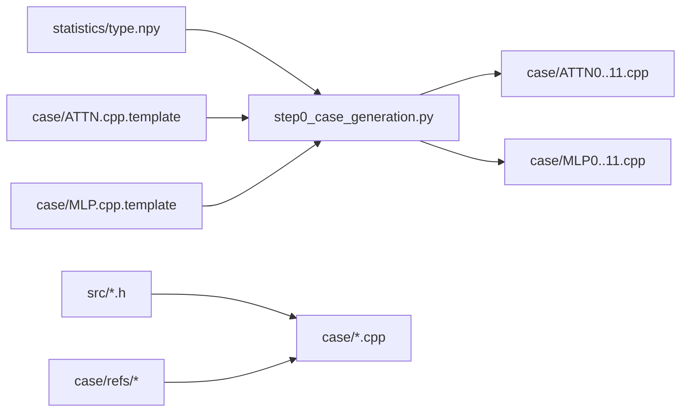

Function call stack:

1. `case/*.cpp`에서 concrete typedef / 상수 / refs를 정의한다.
2. `top()`에서 concrete instance의 `do_*()`를 호출한다.
3. 실제 stage topology는 `src/*.h` 안에 있다.

Code refs:

- case generation 관계: `step0_case_generation.py`
- 대표 config:
  - `case/PATCH_EMBED.cpp:12-24`
  - `case/ATTN0.cpp:7-187`
  - `case/MLP0.cpp:5-67`
  - `case/HEAD.cpp:4-41`

구체 수치:

- `ATTN0`/`MLP0`는 generated case지만 topology는 동일하고, 주로 bitwidth / LUT / FIFO / RAM style이 concretize 된다.
- `ATTN0` 주요 상수:
  - `H=3`, `T=196`, `TP=2`, `C=192`, `CH=64`
- `MLP0` 주요 상수:
  - `T=196`, `TP=2`, `C=192`, `CH=768`

## 2. `common.h` + `utils.h` + `wrapper.h`

역할:

- `common.h`: 공통 타입과 memory style 상수 정의
- `utils.h`: clamp/quantize helper와 C-sim stream checker
- `wrapper.h`: 내부 vector stream을 AXI stream으로 감싸는 egress wrapper

다이어그램:

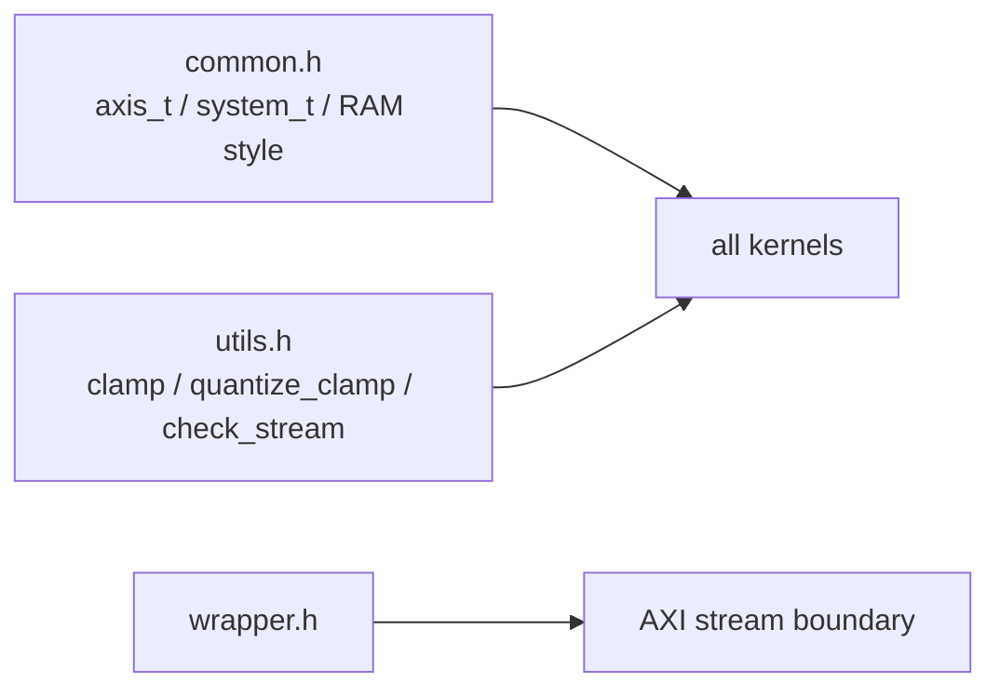

Function call stack:

1. 거의 모든 case가 `../src/common.h`를 include 한다.
2. `Layernorm`, `Softmax`, `Quant`, `GeLU`는 `utils.h` helper를 내부에서 호출한다.
3. `Wrapper::do_wrap()`는 board/package 경계에서만 사용될 수 있는 formatting stage다.

Code refs:

- `src/common.h:21-39`
- `src/utils.h:5-23`
- `src/utils.h:28-71`
- `src/wrapper.h:28-52`

대표 코드 블록:

```cpp
const unsigned int SYSTEM_WIDTH = 64;
typedef ap_int<SYSTEM_WIDTH> system_t;
typedef ap_axiu<SYSTEM_WIDTH, 0, 0, 0> axis_t;

constexpr const int BRAM_STYLE = 0;
constexpr const int URAM_STYLE = 1;
constexpr const int LRAM_STYLE = 2;
```

이 블록은 모든 모듈이 공유하는 인터페이스 폭과 memory binding policy를 정한다.

```cpp
template<typename _typename>
_typename quantize_clamp(_typename val, int bits, bool is_signed) {
    int min_val, max_val;
    if (is_signed) {
        min_val = -(1 << (bits - 1));
        max_val = +(1 << (bits - 1)) - 1;
    } else {
        min_val = 0;
        max_val = (1 << bits) - 1;
    }
    return clamp(val, min_val, max_val);
}
```

이 코드는 `Layernorm`, `Softmax`의 마지막 requant stage에서 실제 saturating cast를 수행한다.

```cpp
void do_wrap(case_index_t N,
             hls::stream<hls::vector<__data_t, CP*HP*WP> > &i_stream,
             hls::stream<axis_t> &o_stream) const{
    N_LOOP: for(int n=0; n<N; ++n){
        HT_LOOP: for(int ht=0; ht<HT; ++ht){
            WT_LOOP: for(int wt=0; wt<WT; ++wt){
                CT_LOOP: for(int ct=0; ct<CT; ++ct){
                    #pragma HLS pipeline II=1
                    hls::vector<__data_t, CP*HP*WP> vec_i = i_stream.read();
                    axis_t axis_o;
                    axis_o.data = vec_i;
                    axis_o.last = n == N-1 && ht == HT-1 && wt == WT-1 && ct == CT-1;
                    o_stream.write(axis_o);
                }
            }
        }
    }
}
```

`Wrapper`는 내부 vector stream을 AXI stream으로 감싸는 얇은 formatting stage다.

마이크로아키텍처:

- 이 셋은 본격 compute kernel이 아니라 support layer다.
- `quantize_clamp()`는 여러 stage의 마지막 saturating post-process combinational logic이다.
- `check_stream()`는 합성 하드웨어가 아니라 C-sim 전용 stage snooper다.
- `Wrapper`는 register-to-register packing stage로 보면 된다.

구체 수치:

- `SYSTEM_WIDTH = 64b`
- `class_index_t = 10b`
- `case_index_t = 18b`
- `Wrapper::do_wrap()` 반복 횟수는 `N * HT * WT * CT`

## 3. `adapter.h`

역할:

- 동일 tensor를 유지한 채 channel parallelism만 바꾸는 stream-width adapter

다이어그램:

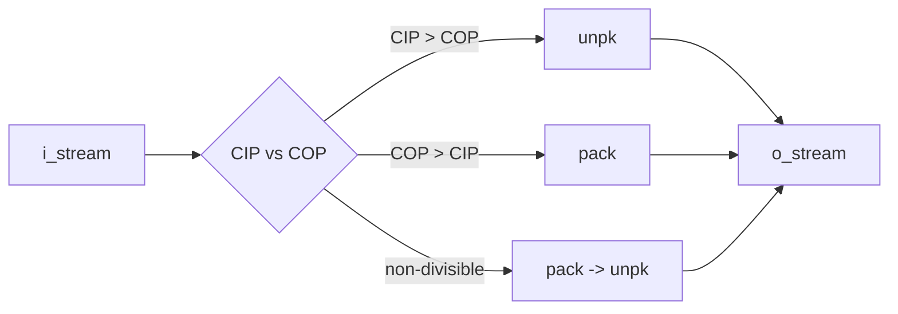

Function call stack:

1. `Matmul::do_matmul()` -> `Adapter::do_adapt()`
2. `PatchEmbed::do_patch_embed()` -> `Adapter::do_adapt()`
3. `MLP::do_mlp()` / `Attn::do_attn()` residual path -> `Adapter::do_adapt()`

Code refs:

- constants and gcd/lcm: `src/adapter.h:8-37`
- `unpk()`: `src/adapter.h:40-73`
- `pack()`: `src/adapter.h:75-104`
- `non_divisible()`: `src/adapter.h:106-113`
- `do_adapt()`: `src/adapter.h:116-127`

대표 코드 블록:

```cpp
void do_adapt(hls::stream<hls::vector<__data_t, TP*CIP> > &i_stream,
              hls::stream<hls::vector<__data_t, TP*COP> > &o_stream) const{
    if(CIP % COP == 0 or COP % CIP == 0){
        if(CIP > COP)   unpk(i_stream, o_stream);
        else            pack(i_stream, o_stream);
    } else {
        non_divisible(i_stream, o_stream);
    }
}
```

이 블록이 `Adapter`의 전체 동작 정책을 결정한다. 핵심은 산술이 아니라 병렬도 관계에 따라 `pack`, `unpk`, `pack->unpk`를 고른다는 점이다.

```cpp
if(cop + CIP < COP)     vec_o[tp*COP + cop] = vec_o[tp*COP + (cop+CIP)];
else                    vec_o[tp*COP + cop] = vec_i[tp*CIP + (cop+CIP-COP)];
```

이 두 줄이 `pack()`의 핵심 lane shuffle 동작이다.

마이크로아키텍처:

- stage 자체는 산술기가 아니라 register shuffle + mux network다.
- divisible path에서는 scratchpad가 거의 없다.
- non-divisible path만 중간 `packed_stream`을 갖는 2-stage repack 구조다.

구체 수치:

- `PATCH_EMBED` input adapter
  - `CIAP=2 -> CIP=16`
  - `PACK_TRIP = 8`
- `PATCH_EMBED` output adapter
  - `COP=16 -> COAP=1`
  - `UNPK_TRIP = 16`
- `MLP0` residual adapter
  - `CAP=1 -> RESI_CP=2`
  - `PACK_TRIP = 2`
- `ATTN0` residual adapter도 동일한 `1 -> 2` pack path다.

## 4. `matmul.h`

역할:

- HG-PIPE의 핵심 PE cluster
- static-weight matmul과 dynamic-weight matmul 두 형태를 모두 제공

다이어그램:

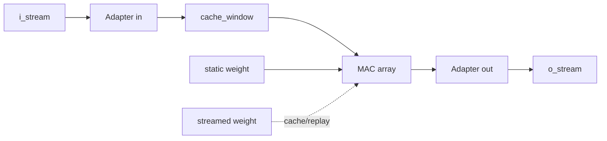

Function call stack:

1. `PATCH_EMBED`
   - `case/PATCH_EMBED.cpp:65-71` -> `PatchEmbed::do_patch_embed()`
2. `MLP0`
   - `case/MLP0.cpp:195-202` -> `MLP::do_mlp()` -> `m1.do_matmul()` / `m2.do_matmul()`
3. `HEAD`
   - `case/HEAD.cpp:109-115` -> `Head::do_head()` -> `matmul.do_matmul()`
4. `ATTN0`
   - `case/ATTN0.cpp:549-572` -> `Attn::do_attn()` -> `matmul_gen_q/k/v/o.do_matmul()`
   - `Attn::do_attn()` -> `matmul_qk_head*` / `matmul_rv_head*`

Code refs:

- static path
  - declaration: `src/matmul.h:6-37`
  - `matmul_step1_cache_window()`: `src/matmul.h:57-98`
  - static `matmul_step2_mac()`: `src/matmul.h:100-169`
  - static `do_matmul()`: `src/matmul.h:171-192`
- dynamic path
  - `matmul_step1_cache_weight()`: `src/matmul.h:204-264`
  - `matmul_step1_cache_weight_transposed()`: `src/matmul.h:266-326`
  - dynamic `matmul_step2_mac()`: `src/matmul.h:328-386`
  - dynamic `do_matmul()`: `src/matmul.h:389-421`

대표 코드 블록:

```cpp
if(cot == 0){
    vec_o = i_stream.read();
    for(int tp=0; tp<TP; ++tp){
        #pragma HLS unroll
        for(int cip=0; cip<CIP; ++cip){
            #pragma HLS unroll
            wb[tp][cit*CIP + cip] = vec_o[tp*CIP + cip];
        }
    }
} else {
    for(int tp=0; tp<TP; ++tp){
        #pragma HLS unroll
        for(int cip=0; cip<CIP; ++cip){
            #pragma HLS unroll
            vec_o[tp*CIP + cip] = wb[tp][cit*CIP + cip];
        }
    }
}
```

이 코드는 입력 activation을 `wb[TP][CI]`에 저장하고, 이후 output-channel tile에서 재사용하는 핵심 메커니즘이다.

```cpp
if(cit == 0){
    vec_o[tp*COP + cop] = bias_arr[cot*COP + cop];
}
auto mul_res = vec_i[tp*CIP + cip] * weight_arr[cot*COP + cop][cit*CIP + cip];
#pragma HLS bind_op variable=mul_res op=mul impl=dsp
vec_o[tp*COP + cop] += mul_res;
```

이 블록은 output-stationary accumulation을 보여준다. `vec_o`는 현재 output tile의 partial sum register bank다.

```cpp
dynamic_weight_arr[cot*COP + cop][cit*CIP + cip] = vec_i[cop*CIP + cip];
...
hls::vector<__we_t, COP*CIP> vec_w = w_stream.read();
auto mul_res = vec_i[tp*CIP + cip] * vec_w[cop*CIP + cip];
vec_o[tp*COP + cop] += mul_res;
```

dynamic path에서는 다른 activation branch를 먼저 local SRAM에 적재한 뒤, 그것을 weight처럼 replay해서 MAC에 넣는다.

마이크로아키텍처:

- static path
  - Stage M0: input adapter
  - Stage M1: `wb[TP][CI]` input window scratchpad
  - Stage M2: output-stationary MAC register tile `vec_o[TP*COP]`
  - Stage M3: output adapter
- dynamic path
  - feature는 `wb`에 저장
  - 다른 stream을 `dynamic_weight_arr[CO][CI]`에 적재 후 replay
  - `TRANSPOSED`는 저장 loop order만 바꿔 downstream read order를 맞춘다.

데이터 재사용:

- static path
  - input activation을 `COT` 축으로 재사용
  - weight는 resident ROM/SRAM
- dynamic path
  - query/relation은 `wb`에서 재사용
  - K/V는 local SRAM에 적재 후 `TT` 동안 재사용

구체 수치:

- generic
  - `MAC lanes = TP * COP * CIP`
  - `loop trips = TT * COT * CIT`
  - `scalar MACs = T * CO * CI`
- `MLP0` FC1
  - `C=192`, `CH=768`, `CIP=12`, `COP=24`, `TP=2`
  - `MAC lanes = 576`
  - `loop trips = 50,176`
  - `scalar MACs = 28,901,376`
  - `weight_arr = 54.00 KiB`
  - `bias_arr = 1.03 KiB`
  - `wb = 0.14 KiB`
- `MLP0` FC2
  - `MAC lanes = 576`
  - `loop trips = 50,176`
  - `scalar MACs = 28,901,376`
  - `weight_arr = 54.00 KiB`
  - `wb = 0.56 KiB`
- `ATTN0` Q/K/V projection each
  - `MAC lanes = 144`
  - `loop trips = 50,176`
  - `scalar MACs = 7,225,344`
  - `weight_arr = 13.50 KiB`
- `ATTN0` QK per head
  - `CI=64`, `CO=196`, `CIP=4`, `COP=7`
  - `MAC lanes = 56`
  - `loop trips = 43,904`
  - `scalar MACs = 2,458,624`
  - `dynamic_weight_arr = 4.59 KiB`
- `ATTN0` RV per head
  - `MAC lanes = 56`
  - `loop trips = 43,904`
  - `scalar MACs = 2,458,624`
  - `dynamic_weight_arr = 4.59 KiB`
- `HEAD`
  - `MAC lanes = 4`
  - `loop trips = 48,000`
  - `scalar MACs = 192,000`
  - `weight_arr = 187.50 KiB`

## 5. `layernorm.h`

역할:

- 3-pass temporal reduction 기반의 normalize kernel

다이어그램:

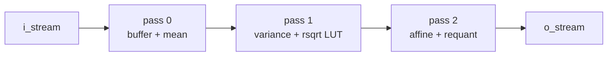

Function call stack:

1. `MLP::do_mlp()` -> `lnq.do_layernorm()`
2. `Head::do_head()` -> `lnq.do_layernorm()`
3. `Attn::do_attn()` -> `lnq.do_layernorm()`

Code refs:

- setup: `src/layernorm.h:31-74`
- main body: `src/layernorm.h:78-197`

대표 코드 블록:

```cpp
if(state == 0){
    hls::vector<__if_t, CP*TP> vec_i = i_stream.read();
    if(ct == 0){
        for(int tp=0; tp<TP; tp++){
            #pragma HLS unroll
            acc[tp] = 0;
        }
    }
    for(int tp=0; tp<TP; tp++){
        #pragma HLS unroll
        for(int cp=0; cp<CP; cp++){
            #pragma HLS unroll
            buffer[tp][ct*CP + cp] = vec_i[tp*CP + cp];
            acc[tp] += vec_i[tp*CP + cp];
        }
    }
}
```

첫 번째 pass는 입력을 `buffer`에 저장하면서 mean reduction을 동시에 수행한다.

```cpp
else if(state == 1){
    __if_t diff = buffer[tp][ct*CP + cp] - mean[tp];
    auto diff_pow2 = diff * diff;
    sum[tp] = (ct == 0 && cp==0) ? __var_t(diff_pow2) : __var_t(sum[tp] + diff_pow2);
    ...
    __cursor_t cursor = (sum[tp] + b) >> s1;
    cursor = clamp(cursor, 0, bound);
    st_sqrt[tp] = rsqrt_table[cursor];
}
```

두 번째 pass는 variance를 누산하고 `rsqrt_table` lookup을 수행한다.

```cpp
else if(state == 2){
    __if_t diff = buffer[tp][ct*CP + cp] - mean[tp];
    __affine_t val = diff * st_sqrt[tp] * lnw[ct*CP + cp] + lnb[ct*CP + cp];
    __shift_t rel = val >> s2;
    o_vec[tp*CP + cp] = quantize_clamp(rel, clamp_bits, true);
}
```

세 번째 pass는 affine normalization과 requant를 수행한다.

마이크로아키텍처:

- Stage LN0
  - input read
  - `buffer[TP][C]` 저장
  - `acc[TP]`로 mean reduction
- Stage LN1
  - `buffer` 재방문
  - variance accumulation
  - `rsqrt_table` lookup
- Stage LN2
  - `buffer` 세 번째 방문
  - affine + requant + output

메모리/재사용:

- `buffer[TP][C]`가 핵심 scratchpad
- `lnw[C]`, `lnb[C]`, `rsqrt_table[]`는 parameter ROM
- 같은 activation tile을 3회 사용한다.

구체 수치:

- `ATTN0` / `MLP0`
  - `T=196`, `TP=2`, `C=192`, `CP=1`
  - `TT=98`, `CT=192`
  - `scheduler trips = 98 * 3 * 192 = 56,448`
  - `ATTN0 buffer = 2 * 192 * 13b = 4,992b = 0.61 KiB`
  - `MLP0 buffer = 2 * 192 * 15b = 5,760b = 0.70 KiB`
- `HEAD`
  - instantiated as `T=1`, `TP=1`, `C=192`, `CP=1`
  - `scheduler trips = 576`
  - `buffer = 2,496b = 0.30 KiB`
  - `lnw = 6,144b`
  - `lnb = 12,288b`
  - `rsqrt_table = 1,408b`

## 6. `quant.h` + `gelu.h`

역할:

- 둘 다 1-stage LUT-based pointwise stage
- `Quant`는 quantization / requant
- `GeLU`는 activation LUT

다이어그램:

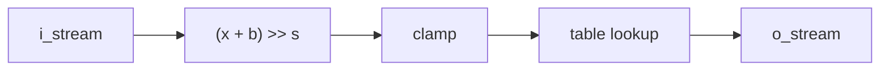

Function call stack:

- `Quant`
  - `Attn::do_attn()` -> `quant_q`, `quant_k`, `quant_v`, `quant_a`
- `GeLU`
  - `MLP::do_mlp()` -> `ge.do_gelu()`

Code refs:

- `Quant`: `src/quant.h:32-79`
- `GeLU`: `src/gelu.h:32-79`

대표 코드 블록:

```cpp
__cursor_t cursor = (vec_i[tp*CP + cp] + b) >> s;
cursor = clamp(cursor, 0, bound);
vec_o[tp*CP + cp] = table[cursor];
```

이 3줄이 `Quant`의 본체다. 입력을 LUT index로 바꾼 뒤 table lookup을 수행한다.

```cpp
__cursor_t cursor = (vec_i[tp*CP + cp] + b) >> s;
cursor = clamp(cursor, 0, bound);
vec_o[tp*CP + cp] = table[cursor];
```

`GeLU`도 구조는 동일하고, 차이는 `table[]`의 의미가 GeLU activation LUT라는 점뿐이다.

마이크로아키텍처:

- `TP * CP` lane fully unrolled
- scratchpad 없음
- LUT만 persistent memory

구체 수치:

- `ATTN0` Q/K/V/A quant
  - `scheduler trips = 98 * 192 = 18,816`
  - lane count = `2`
  - table size = `64 * 3b = 192b`
- `MLP0` GeLU
  - `T=196`, `TP=2`, `C=768`, `CP=2`
  - `scheduler trips = 98 * 384 = 37,632`
  - lane count = `4`
  - table size = `192b`

## 7. `softmax.h`

역할:

- attention relation matrix를 3-pass로 normalize 하는 kernel

다이어그램:

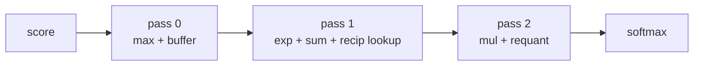

Function call stack:

1. `ATTN0`
2. `Attn::do_attn()`
3. `softmax_qk_head1/2/3.do_softmax()`

Code refs:

- setup: `src/softmax.h:36-96`
- main body: `src/softmax.h:101-215`

대표 코드 블록:

```cpp
if(state == 0){
    buffer[tp][ct*CP + cp] = vec_i[tp*CP + cp];
    max_val[tp] = max(max_val[tp], vec_i[tp*CP + cp]);
}
```

첫 pass는 relation score를 `buffer`에 저장하면서 row-wise max를 찾는다.

```cpp
else if(state == 1){
    __minus_t minus = max_val[tp] - buffer[tp][ct*CP + cp];
    __cursor1_t cursor = (minus + b1) >> s1;
    cursor = clamp(cursor, 0, bound1);
    exp_score[tp][ct*CP + cp] = exp_table[cursor];
    acc_val[tp] += exp_table[cursor];
}
```

둘째 pass는 `buffer`를 다시 읽어 `exp(x - xmax)`를 계산하고, `exp_score`와 `acc_val`을 만든다.

```cpp
else if(state == 2){
    __affine_t val = exp_score[tp][ct*CP + cp] * recip_val[tp];
    int rel_b3 = (in_two[tp] == 1) ? b3_two : b3_one;
    int rel_s3 = (in_two[tp] == 1) ? s3_two : s3_one;
    __cursor3_t rel = (val + rel_b3) >> rel_s3;
    o_vec[tp*CP + cp] = quantize_clamp(rel, clamp_bits, false);
}
```

셋째 pass는 `exp_score`를 다시 읽어 reciprocal과 곱하고 requant한다.

마이크로아키텍처:

- Stage SM0
  - raw score buffer + max reduction
- Stage SM1
  - exp LUT + exp buffer + sum reduction + recip LUT
- Stage SM2
  - exp/recip multiply + requant

메모리/재사용:

- `buffer[TP][C]`에 raw relation 저장
- `exp_score[TP][C]`에 exp 결과 저장
- relation과 exp를 각각 두 번째, 세 번째 pass에서 재사용

구체 수치:

- `ATTN0` per head
  - `T=196`, `TP=2`, `C=196`, `CP=1`
  - `TT=98`, `CT=196`
  - `scheduler trips = 57,624`
  - `buffer = 3,920b = 0.48 KiB`
  - `exp_score = 6,272b = 0.77 KiB`
  - `exp_table = 512b`
  - `recip tables total = 1,024b`
  - relation payload = `196 * 196 = 38,416` elements
  - 3 heads 전체 softmax scheduler trips = `172,872`

## 8. `reshaper.h`

역할:

- attention에서 dynamic matmul이 읽기 쉬운 weight-stream order를 만드는 layout engine

다이어그램:

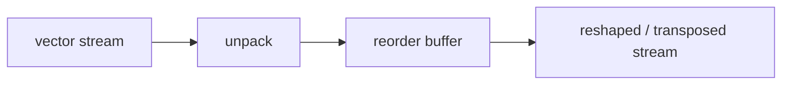

Function call stack:

1. `Attn::do_attn()` -> `reshape_k_head*.do_reshape(..., false)`
2. `Attn::do_attn()` -> `reshape_v_head*.do_reshape(..., true)`

Code refs:

- shape constants: `src/reshaper.h:24-35`
- `unpack()`: `src/reshaper.h:38-58`
- `reorder()`: `src/reshaper.h:60-110`
- `do_reshape()`: `src/reshaper.h:112-119`

대표 코드 블록:

```cpp
if(tip==0 && cip==0){
    vec_i = i_stream.read();
}
o_stream.write(vec_i[tip*CIP + cip]);
```

`unpack()`은 입력 vector를 scalar stream으로 푸는 stage다.

```cpp
if(!TRANSPOSED){
    vec_o[top*COP + cop] = buffer[tp_top*TOP + top][cot*COP + cop];
} else {
    vec_o[cop*TOP + top] = buffer[tp_top*TOP + top][cot*COP + cop];
}
```

`reorder()`의 핵심은 이 인덱싱이다. transpose 유무에 따라 output lane 배치를 바꾼다.

마이크로아키텍처:

- Stage RS0: vector -> scalar unpack
- Stage RS1: `buffer[TP][C]` fill
- Stage RS2: reordered vector emit
- `TRANSPOSED=true`이면 lane ordering까지 transpose 된다.

구체 수치:

- `ATTN0` K reshape per head
  - `T=196`, `TIP=2`, `TOP=7`, `C=64`, `CIP=1`, `COP=4`
  - `TP = lcm(2,7) = 14`
  - `TT = 14`
  - `buffer = 14 * 64 * 3b = 2,688b = 0.33 KiB`
  - read/write scalar moves 각각 `12,544`
- `ATTN0` V transpose reshape per head
  - `T=64`, `TIP=2`, `TOP=4`, `C=196`, `CIP=1`, `COP=7`
  - `TP = 4`
  - `TT = 16`
  - `buffer = 2,352b = 0.29 KiB`
  - read/write scalar moves 각각 `12,544`

## 9. `head_split.h`

역할:

- head 차원을 별도 memory 없이 stream order만으로 분리/병합

다이어그램:

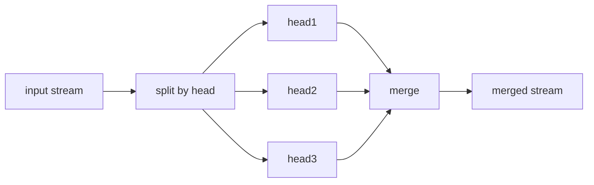

Function call stack:

1. `Attn::do_attn()` -> `split_q/k/v.do_split()`
2. `Attn::do_attn()` -> `merge_a.do_merge()`

Code refs:

- split: `src/head_split.h:28-53`
- merge: `src/head_split.h:55-82`

대표 코드 블록:

```cpp
if(h == 0){
    o_stream1.write(vec_i);
}else if(h == 1){
    o_stream2.write(vec_i);
}else if(h == 2){
    o_stream3.write(vec_i);
}
```

`do_split()`은 head index에 따라 입력을 세 stream으로 나누는 pure routing logic이다.

```cpp
if(h == 0){
    vec_o = i_stream1.read();
}else if(h == 1){
    vec_o = i_stream2.read();
}else if(h == 2){
    vec_o = i_stream3.read();
}
o_stream.write(vec_o);
```

`do_merge()`는 세 head stream을 다시 interleave 하는 반대 동작이다.

마이크로아키텍처:

- routing-only stage
- scratchpad 없음
- 구현은 사실상 3-head fixed routing이다.

구체 수치:

- `ATTN0`
  - `H=3`, `T=196`, `TP=2`, `C=192`, `CP=1`
  - `CH=64`, `CHT=64`, `TT=98`
  - split/merge scheduler trips = `98 * 3 * 64 = 18,816`

## 10. `patch_embed.h`

역할:

- patch projection + token bias + CLS overwrite + output shift

다이어그램:

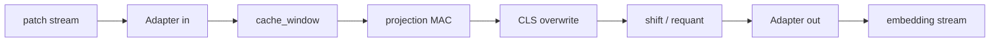

Function call stack:

1. `case/PATCH_EMBED.cpp:65-71`
2. `PatchEmbed::do_patch_embed()`
3. `Adapter::do_adapt()` -> `step1_cache_window()` -> `step2_mac_replace_shift()` -> `Adapter::do_adapt()`

Code refs:

- arrays/setup: `src/patch_embed.h:9-39`
- `step1_cache_window()`: `src/patch_embed.h:68-109`
- `step2_mac_replace_shift()`: `src/patch_embed.h:111-198`
- top-level dataflow: `src/patch_embed.h:200-221`
- representative config: `case/PATCH_EMBED.cpp:12-24`

대표 코드 블록:

```cpp
if(cit == 0){
    if(tt == 0 && tp == 0){
        vec_o[tp*COP + cop] = 0;
    } else {
        vec_o[tp*COP + cop] = bias_arr[tt*TP + tp][cot*COP + cop];
    }
}
```

일반 matmul과 달리 `PatchEmbed`는 bias가 `bias_arr[T][CO]`라서 token 위치별로 다른 bias를 쓴다.

```cpp
auto mul_res = vec_i[tp*CIP + cip] * weight_arr[cot*COP + cop][cit*CIP + cip];
#pragma HLS bind_op variable=mul_res op=mul impl=dsp
vec_o[tp*COP + cop] += mul_res;
```

projection MAC 자체는 `Matmul`과 같은 output-stationary accumulation 구조다.

```cpp
if(tt == 0){
    for(int cop=0; cop<COP; ++cop){
        #pragma HLS unroll
        vec_o[cop] = cls_arr[cot*COP + cop];
    }
}
vec_o_shift[tp*COP + cop] = ( vec_o[tp*COP + cop] + b ) >> s;
```

첫 token은 projection 결과 대신 `cls_arr`로 overwrite되고, 마지막에 shift/requant이 적용된다.

마이크로아키텍처:

- matmul 계열과 비슷하지만
  - bias가 `bias_arr[T][CO]`인 token-dependent 2D bias
  - 첫 token은 계산 결과 대신 `cls_arr`로 overwrite
- weight는 URAM, bias는 BRAM으로 묶여 있어 parameter hierarchy가 더 무겁다.

구체 수치:

- `TT=98`, `CIT=48`, `COT=12`
- `MAC lanes = 512`
- `loop trips = 56,448`
- `scalar MACs = 28,901,376`
- `weight_arr = 144.00 KiB`
- `bias_arr = 96.47 KiB`
- `cls_arr = 0.49 KiB`
- `wb = 1.50 KiB`
- top-level FIFO payload
  - `adpt_sm = 2.00 KiB`
  - `cache_window_sm = 512b`
  - `mac_sm = 832b`

## 11. `mlp.h`

역할:

- pre-norm feed-forward block + residual bypass

다이어그램:

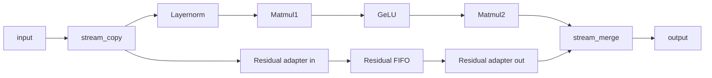

Function call stack:

1. `case/MLP0.cpp:195-202`
2. `MLP::do_mlp()`
3. `stream_copy()` -> residual adapters -> `lnq.do_layernorm()` -> `m1.do_matmul()` -> `ge.do_gelu()` -> `m2.do_matmul()` -> `stream_merge()`

Code refs:

- component graph: `src/mlp.h:89-179`
- fork/merge: `src/mlp.h:181-223`
- top-level dataflow: `src/mlp.h:225-263`
- representative config: `case/MLP0.cpp:5-67`

대표 코드 블록:

```cpp
this->              stream_copy     (   i_stream,   main_sm,    resi_i_sm   );
resi_i_adapter.     do_adapt        (   resi_i_sm,  resi_sm                 );
resi_o_adapter.     do_adapt        (   resi_sm,    resi_o_sm               );
lnq.                do_layernorm    (   main_sm,    ln_sm                   );
m1.                 do_matmul       (   ln_sm,      m1_sm                   );
ge.                 do_gelu         (   m1_sm,      ge_sm                   );
m2.                 do_matmul       (   ge_sm,      m2_sm                   );
this->              stream_merge    (   resi_o_sm,  m2_sm,      o_stream    );
```

이 8줄이 `MLP`의 전체 coarse pipeline graph다.

```cpp
vec_o[tp*CAP + cap] = vec_i2[tp*CAP + cap]
                    + __mlp_of_t( (vec_i1[tp*CAP + cap] * RM + RB) >> RS );
```

이 한 줄이 residual merge의 실제 수식이다. residual branch를 scale/shift한 뒤 main branch 결과와 더한다.

마이크로아키텍처:

- residual path는 compute path가 아니라 latency-alignment path다.
- main path는 `LN -> FC1 -> GeLU -> FC2`의 전형적인 coarse pipeline이다.
- 가장 큰 compute는 FC1/FC2 두 matmul이 지배한다.

구체 수치:

- `TT=98`, `CAT=192`
- `stream_copy()` trips = `18,816`
- `stream_merge()` trips = `18,816`
- `resi_sm` payload = `3.75 KiB`
- `Layernorm buffer = 0.70 KiB`
- FC1
  - `MAC lanes = 576`
  - `loop trips = 50,176`
  - `scalar MACs = 28,901,376`
  - `weight_arr = 54.00 KiB`
- GeLU
  - `scheduler trips = 37,632`
- FC2
  - `MAC lanes = 576`
  - `loop trips = 50,176`
  - `scalar MACs = 28,901,376`
  - `weight_arr = 54.00 KiB`
- block total scalar MACs = `57,802,752`

## 12. `head.h`

역할:

- sequence에서 CLS token만 골라 layernorm + classifier matmul을 수행

다이어그램:

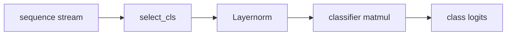

Function call stack:

1. `case/HEAD.cpp:109-115`
2. `Head::do_head()`
3. `select_cls()` -> `lnq.do_layernorm()` -> `matmul.do_matmul()`

Code refs:

- component setup: `src/head.h:61-107`
- `select_cls()`: `src/head.h:109-132`
- top-level dataflow: `src/head.h:134-153`
- representative config: `case/HEAD.cpp:4-41`

대표 코드 블록:

```cpp
if(tt==0){
    hls::vector<__if_t, CIAP> vec_o;
    for(int ciap=0; ciap<CIAP; ++ciap){
        #pragma HLS unroll
        vec_o[ciap] = vec_i[ciap];
    }
    o_stream.write(vec_o);
}
```

`select_cls()`는 전체 sequence를 읽지만, 첫 token lane만 downstream에 내보낸다.

```cpp
this->              select_cls      (   i_stream,   cls_sm      );
lnq.                do_layernorm    (   cls_sm,     ln_sm       );
matmul.             do_matmul       (   ln_sm,      o_stream    );
```

`Head` 전체 데이터플로우는 `CLS 추출 -> layernorm -> classifier matmul` 3-stage chain으로 끝난다.

마이크로아키텍처:

- 계산은 작지만 입력 sequence 전체를 drain 해야 한다.
- 즉 arithmetic-heavy라기보다 sequence reduction stage에 가깝다.

구체 수치:

- `select_cls()` input drain
  - vector reads = `98 * 192 = 18,816`
  - 실제 downstream으로 넘기는 것은 첫 token의 `192`개 vector뿐
- `Layernorm scheduler trips = 576`
- classifier
  - `MAC lanes = 4`
  - `loop trips = 48,000`
  - `scalar MACs = 192,000`
  - `weight_arr = 187.50 KiB`
  - `bias_arr = 2.32 KiB`

## 13. `attn.h`

역할:

- prenorm + QKV fanout + 3-head replicated relation engine + output projection + residual merge

다이어그램:

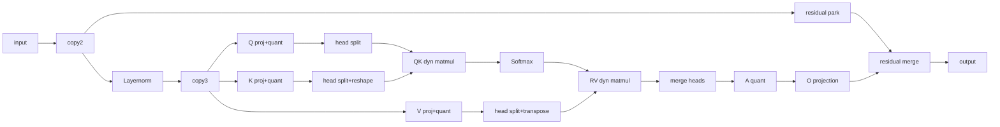

Function call stack:

1. `case/ATTN0.cpp:549-572`
2. `Attn::do_attn()`
3. `stream_copy2()` -> residual adapters -> `lnq.do_layernorm()`
4. `stream_copy3()`
5. `matmul_gen_q/k/v.do_matmul()`
6. `quant_q/k/v.do_quant()`
7. `split_q/k/v.do_split()`
8. `reshape_k_head*` / `reshape_v_head*`
9. `matmul_qk_head*` -> `softmax_qk_head*` -> `matmul_rv_head*`
10. `merge_a` -> `quant_a` -> `matmul_gen_o`
11. `stream_merge()` -> output

Code refs:

- member graph: `src/attn.h:207-250`
- helpers: `src/attn.h:303-365`
- top-level FIFO graph + stage calls: `src/attn.h:368-525`
- representative config: `case/ATTN0.cpp:7-187`, `case/ATTN0.cpp:369-544`

대표 코드 블록:

```cpp
this->              stream_copy2    (   i_stream,       main_sm,    resi_i_sm                   );
resi_i_adapter.     do_adapt        (   resi_i_sm,      resi_sm                                 );
resi_o_adapter.     do_adapt        (   resi_sm,        resi_o_sm                               );
lnq.                do_layernorm    (   main_sm,        lnq_sm                                  );
this->              stream_copy3    (   lnq_sm,         lnq_sm_cp1, lnq_sm_cp2,  lnq_sm_cp3     );
matmul_gen_q.       do_matmul       (   lnq_sm_cp1,     q_sm    );
matmul_gen_k.       do_matmul       (   lnq_sm_cp2,     k_sm    );
matmul_gen_v.       do_matmul       (   lnq_sm_cp3,     v_sm    );
quant_q.            do_quant        (   q_sm,           qq_sm   );
quant_k.            do_quant        (   k_sm,           kq_sm   );
quant_v.            do_quant        (   v_sm,           vq_sm   );
```

이 앞부분은 attention block의 `prenorm + residual park + QKV fanout` 단계다.

```cpp
split_q.            do_split        (   qq_sm,          qq_sm_head1,    qq_sm_head2,    qq_sm_head3    );
split_k.            do_split        (   kq_sm,          kq_sm_head1,    kq_sm_head2,    kq_sm_head3    );
split_v.            do_split        (   vq_sm,          vq_sm_head1,    vq_sm_head2,    vq_sm_head3    );
reshape_k_head1.    do_reshape      (   kq_sm_head1,    kq_sm_reshape_head1,    false);
reshape_v_head1.    do_reshape      (   vq_sm_head1,    vq_sm_transpose_head1,  true);
matmul_qk_head1.    do_matmul       (   qq_sm_head1,    kq_sm_reshape_head1,    r_sm_head1, false);
softmax_qk_head1.   do_softmax      (   r_sm_head1,     rq_sm_head1     );
matmul_rv_head1.    do_matmul       (   rq_sm_head1,    vq_sm_transpose_head1,  a_sm_head1, true);
```

이 부분은 head1 relation engine의 핵심 흐름이다. head2, head3에도 같은 구조가 복제된다.

```cpp
merge_a.            do_merge        (   a_sm_head1,     a_sm_head2,     a_sm_head3,     a_sm);
quant_a.            do_quant        (   a_sm,           aq_sm                               );
matmul_gen_o.       do_matmul       (   aq_sm,          o_sm                                );
stream_merge                        (   resi_o_sm,      o_sm,    o_stream                   );
```

마지막 부분은 per-head 결과를 다시 합치고 output projection과 residual add를 수행하는 tail stage다.

마이크로아키텍처:

- residual path는 deep FIFO로 park 된다.
- main path는
  - prenorm
  - 3-way QKV fanout
  - per-head relation engine
  - merge + output projection
  - residual add
- fully fused attention이 아니라, local buffering과 replay를 적극 쓰는 stream-friendly attention이다.

메모리/재사용:

- LN output은 Q/K/V 3-way fanout으로 재사용
- Q는 QK matmul에서 `wb`에 저장되어 K tile 전체에 재사용
- K/V는 dynamic weight SRAM에 적재 후 query/relation row 전체에 재사용
- softmax는 raw relation과 exp relation을 각각 재사용
- residual은 계산 없이 오래 hold되다가 마지막에 합쳐진다.

구체 수치:

- global
  - `H=3`, `T=196`, `TP=2`, `C=192`, `CH=64`, `TT=98`, `CAT=192`
- residual FIFO
  - depth `12,288`
  - payload `52b`
  - capacity `78.00 KiB`
- Q/K/V projection each
  - `MAC lanes = 144`
  - `loop trips = 50,176`
  - `scalar MACs = 7,225,344`
  - `weight_arr = 13.50 KiB`
- Q/K/V/O static projection total
  - scalar MACs = `28,901,376`
  - static weight total = `54.00 KiB`
- QK per head
  - `MAC lanes = 56`
  - `loop trips = 43,904`
  - `scalar MACs = 2,458,624`
  - dynamic K cache = `4.59 KiB`
- softmax per head
  - `scheduler trips = 57,624`
  - raw buffer = `0.48 KiB`
  - exp buffer = `0.77 KiB`
- RV per head
  - `MAC lanes = 56`
  - `loop trips = 43,904`
  - `scalar MACs = 2,458,624`
  - dynamic V cache = `4.59 KiB`
- 3-head QK + RV total
  - scalar MACs = `14,751,744`
- notable FIFO payloads
  - `qq_sm_head* = 5.86 KiB` each
  - `kq_sm_reshape_head* = 5.25 KiB` each
  - `vq_sm_transpose_head* = 5.25 KiB` each
  - `r_sm_head* = 1.25 KiB` each
- full `ATTN0` total scalar MACs
  - `43,653,120`

## 14. 모듈별 한눈 요약

- `Adapter`
  - 산술기보다 stream-width shuffle stage
- `Matmul`
  - output-stationary register tile + input-reuse scratchpad 구조
- `Layernorm`
  - 3-pass temporal reduction kernel
- `Quant` / `GeLU`
  - pure streaming LUT stage
- `Softmax`
  - 3-pass normalize engine + double scratchpad
- `Reshaper`
  - micro-batch transposer
- `HeadSplit`
  - 3-head fixed routing stage
- `PatchEmbed`
  - URAM-heavy projection + token bias + CLS overwrite
- `MLP`
  - FC1/FC2가 지배하는 residual feed-forward pipeline
- `Head`
  - CLS token extractor + classifier
- `Attn`
  - local buffer orchestration이 핵심인 multi-head relation engine
