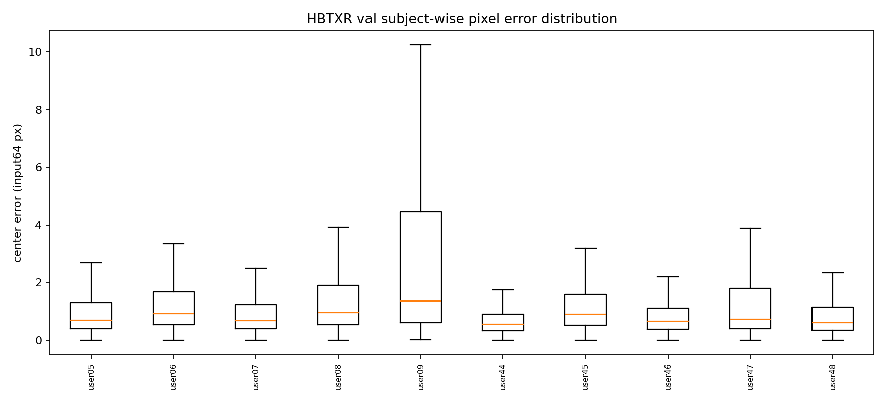
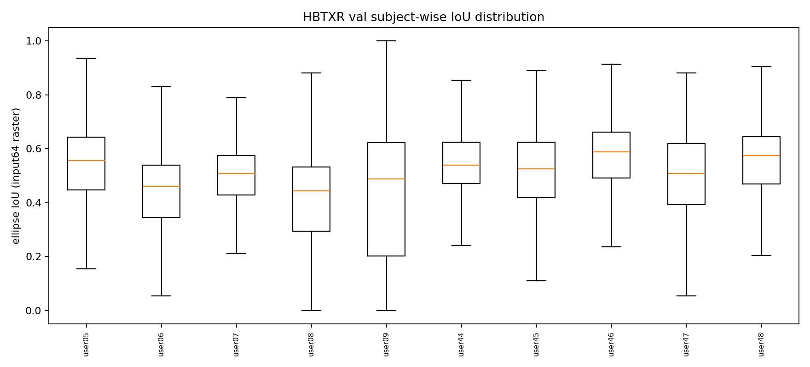
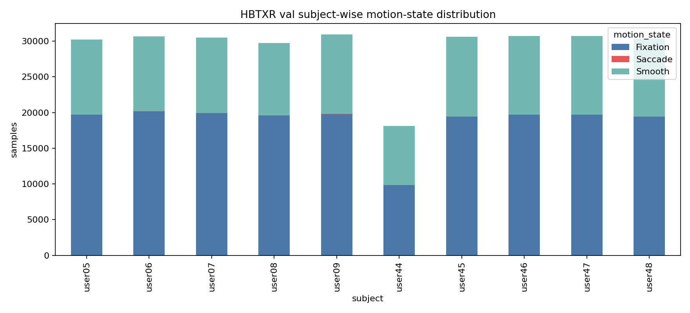
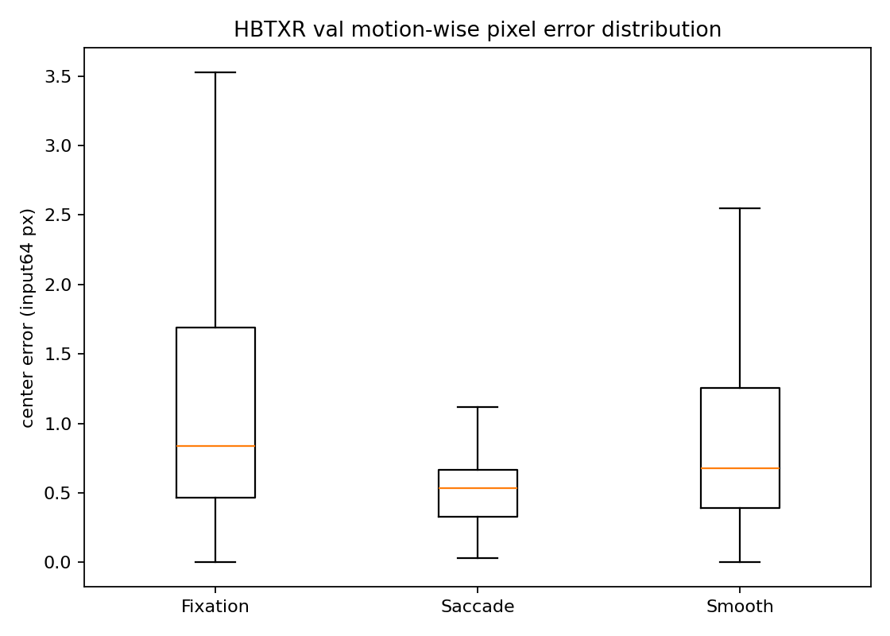
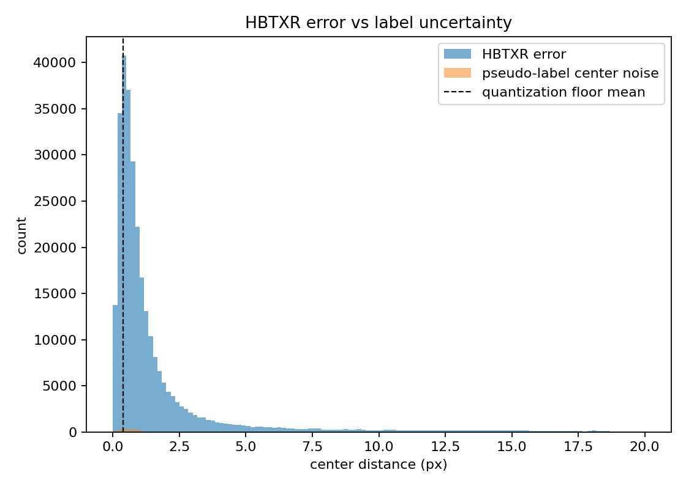

# HBTXR Val Motion Evaluation Detailed Report

## Technical Summary

- `HBTXR_full_unet_img64_patch4` was evaluated on `DeanDataset_full_unet/val` with 292,560 samples; 291,889 samples were valid for center-error and IoU statistics.
- Overall center error in 64x64 input coordinates is mean 1.795 px, median 0.773 px, P95 7.563 px, and P99 18.022 px.
- The subject-wise median error ranges from 0.561 px (user44) to 1.355 px (user09); tail risk is largest for user47 with P99 31.733 px.
- Velocity-based motion labels are highly imbalanced: Fixation 187,308 (64.02%), Saccade 58 (0.02%), Smooth 105,194 (35.96%). Saccade results are therefore descriptive only.
- Annotation uncertainty is not negligible at sub-pixel scale: integer-coordinate manual annotation floor is mean 0.383 px and the matched U-Net pseudo-label center noise is median 0.626 px / P95 1.395 px.
- Repeated-run confidence intervals requested in item (6) are intentionally excluded from this report.

## Scope, Data, And Metric Definitions

- Model: `HBTXR_full_unet_img64_patch4`.
- Checkpoint: `references/codebase/software/FACET/runs/logs/HBTXR_full_unet_img64_patch4/version_0/checkpoints/epoch=67-val_mean_distance=0.4492.ckpt`.
- Evaluation split: `DeanDataset_full_unet/val`; this is validation data, not the final held-out test split.
- Pixel error: Euclidean distance between predicted and target pupil center, reported in 64x64 input-image pixels.
- IoU: rasterized predicted ellipse vs target ellipse on the 64x64 input canvas.
- Motion state: velocity-based rule using pseudo-label pupil-center trajectory.
- `Saccade`: center speed > 493 px/s. `Fixation`: speed <= 493 px/s in session regimes 101/201. `Smooth`: speed <= 493 px/s in session regimes 102/202.

## (1) Subject-wise Pixel Error / IoU Distribution

Subject-level distributions show that typical center localization is mostly below 1 px, but IoU and tail errors vary materially by subject. The largest median-error subject is user09 (1.355 px), while the lowest median-error subject is user44 (0.561 px).

| subject | n | err_mean | err_median | err_p95 | err_p99 | iou_mean | iou_median | iou_p95 | iou_p99 |
|---|---|---|---|---|---|---|---|---|---|
| user05 | 30,206 | 1.376 | 0.692 | 5.173 | 12.322 | 0.527 | 0.557 | 0.764 | 0.836 |
| user06 | 30,524 | 1.587 | 0.925 | 5.101 | 13.370 | 0.434 | 0.462 | 0.662 | 0.771 |
| user07 | 30,399 | 1.513 | 0.685 | 5.795 | 16.535 | 0.480 | 0.509 | 0.730 | 0.824 |
| user08 | 29,374 | 2.086 | 0.954 | 9.566 | 17.347 | 0.399 | 0.444 | 0.641 | 0.730 |
| user09 | 30,940 | 3.941 | 1.355 | 18.359 | 25.405 | 0.415 | 0.489 | 0.725 | 0.803 |
| user44 | 18,089 | 0.779 | 0.561 | 1.954 | 4.209 | 0.545 | 0.538 | 0.762 | 0.840 |
| user45 | 30,593 | 1.487 | 0.900 | 4.400 | 12.924 | 0.502 | 0.526 | 0.730 | 0.804 |
| user46 | 30,702 | 1.033 | 0.656 | 2.869 | 8.912 | 0.568 | 0.588 | 0.770 | 0.829 |
| user47 | 30,709 | 2.440 | 0.735 | 12.557 | 31.733 | 0.471 | 0.509 | 0.740 | 0.804 |
| user48 | 30,353 | 1.268 | 0.615 | 4.379 | 13.607 | 0.540 | 0.574 | 0.740 | 0.819 |

Interpretation: median error is the most stable indicator of normal tracking quality, while P95/P99 captures rare failure modes. IoU is systematically lower for subjects with poorer ellipse geometry even when center error remains modest; this is why center error and IoU should be reported together.

## (2) Subject-wise Motion Distribution

The val split contains enough Fixation and Smooth samples for stable descriptive statistics, but Saccade is extremely sparse. This makes Saccade useful as a sanity-check slice, not as a robust performance claim.

| subject | Fixation | Saccade | Smooth | total | pct_fixation | pct_saccade | pct_smooth |
|---|---|---|---|---|---|---|---|
| user05 | 19,698 | 1 | 10,528 | 30,227 | 65.167 | 0.003 | 34.830 |
| user06 | 20,172 | 20 | 10,477 | 30,669 | 65.773 | 0.065 | 34.162 |
| user07 | 19,918 | 1 | 10,574 | 30,493 | 65.320 | 0.003 | 34.677 |
| user08 | 19,607 | 2 | 10,117 | 29,726 | 65.959 | 0.007 | 34.034 |
| user09 | 19,790 | 27 | 11,125 | 30,942 | 63.958 | 0.087 | 35.954 |
| user44 | 9,854 | 0 | 8,247 | 18,101 | 54.439 | 0.000 | 45.561 |
| user45 | 19,421 | 3 | 11,183 | 30,607 | 63.453 | 0.010 | 36.537 |
| user46 | 19,696 | 0 | 11,013 | 30,709 | 64.138 | 0.000 | 35.862 |
| user47 | 19,720 | 4 | 10,991 | 30,715 | 64.203 | 0.013 | 35.784 |
| user48 | 19,432 | 0 | 10,939 | 30,371 | 63.982 | 0.000 | 36.018 |

Interpretation: Saccade has only 58 samples out of 292,560 (0.02%). Any paper text should explicitly state this imbalance and avoid overclaiming saccade generalization from this val split.

## (3) Subject-wise Mean / Median / P95 / P99 Pixel Error

Subject-wise summary statistics confirm that mean error is dominated by tail events for several subjects. The three largest median-error subjects are user09, user08, user06; the three largest P99 subjects are user47, user09, user08.

| subject | n | err_mean | err_median | err_p95 | err_p99 | err_max |
|---|---|---|---|---|---|---|
| user05 | 30,206 | 1.376 | 0.692 | 5.173 | 12.322 | 27.379 |
| user06 | 30,524 | 1.587 | 0.925 | 5.101 | 13.370 | 25.403 |
| user07 | 30,399 | 1.513 | 0.685 | 5.795 | 16.535 | 37.091 |
| user08 | 29,374 | 2.086 | 0.954 | 9.566 | 17.347 | 30.279 |
| user09 | 30,940 | 3.941 | 1.355 | 18.359 | 25.405 | 41.799 |
| user44 | 18,089 | 0.779 | 0.561 | 1.954 | 4.209 | 18.379 |
| user45 | 30,593 | 1.487 | 0.900 | 4.400 | 12.924 | 25.377 |
| user46 | 30,702 | 1.033 | 0.656 | 2.869 | 8.912 | 20.709 |
| user47 | 30,709 | 2.440 | 0.735 | 12.557 | 31.733 | 43.880 |
| user48 | 30,353 | 1.268 | 0.615 | 4.379 | 13.607 | 26.372 |

Highest-median subjects:
- user09: median 1.355 px, mean 3.941 px, P95 18.359 px, P99 25.405 px, n=30,940.
- user08: median 0.954 px, mean 2.086 px, P95 9.566 px, P99 17.347 px, n=29,374.
- user06: median 0.925 px, mean 1.587 px, P95 5.101 px, P99 13.370 px, n=30,524.

Largest-tail subjects:
- user47: P99 31.733 px, P95 12.557 px, median 0.735 px, max 43.880 px.
- user09: P99 25.405 px, P95 18.359 px, median 1.355 px, max 41.799 px.
- user08: P99 17.347 px, P95 9.566 px, median 0.954 px, max 30.279 px.

Interpretation: subject-specific tails should be inspected against blink, occlusion, poor pseudo-labels, and motion imbalance. For reporting, mean/median/P95/P99 are all needed because the mean alone under-describes rare but large center errors.

## (4) Motion-wise Mean / Median / P95 / P99 Pixel Error

Motion-wise results show Fixation and Smooth have similar median-scale behavior, while Smooth has the larger P99 tail in this val split. Saccade appears low-error here, but its n=58 denominator is too small for a stable conclusion.

| motion | n | err_mean | err_median | err_p95 | err_p99 | err_max |
|---|---|---|---|---|---|---|
| Fixation | 186,810 | 1.852 | 0.839 | 7.664 | 15.996 | 43.880 |
| Saccade | 58 | 0.533 | 0.534 | 1.008 | 1.403 | 1.406 |
| Smooth | 105,021 | 1.695 | 0.678 | 6.862 | 21.236 | 43.402 |
| All | 291,889 | 1.795 | 0.773 | 7.563 | 18.022 | 43.880 |

Interpretation: report Fixation and Smooth as the main motion-regime comparison. For Saccade, report the number and mark it as underpowered; do not claim that saccades are easier simply because this sparse subset has lower errors.

## (7) Annotation Precision And Label Noise

The evaluation target is a U-Net-generated pseudo-label, not a repeated independent human annotation. Two uncertainty levels therefore matter: the manual annotation coordinate floor and the pseudo-label deviation from matched manual-GT frames.

Manual annotation precision floor:
| source | n_ref | per_axis_label_std_px | floor_mean_px | floor_median_px | floor_p95_px |
|---|---|---|---|---|---|
| manual_gt_integer_quantization_floor | 9,011 | 0.289 | 0.383 | 0.399 | 0.599 |

Pseudo-label center noise against matched manual-GT frames:
| motion | n | center_noise_mean | center_noise_median | center_noise_p95 | center_noise_p99 | center_noise_max |
|---|---|---|---|---|---|---|
| Fixation | 851 | 0.664 | 0.614 | 1.326 | 1.704 | 3.191 |
| Saccade | 1 | 0.862 | 0.862 | 0.862 | 0.862 | 0.862 |
| Smooth | 973 | 0.710 | 0.633 | 1.429 | 2.089 | 3.655 |
| All | 1,825 | 0.689 | 0.626 | 1.395 | 1.950 | 3.655 |

Interpretation: the model's overall median error (0.773 px) is only moderately larger than the pseudo-label median noise (0.626 px), while its P95 error (7.563 px) is much larger than pseudo-label P95 noise (1.395 px). This means typical sub-pixel improvements should be discussed cautiously, but the tail-error reduction problem remains larger than annotation uncertainty.

## Limitations And Robustness Notes

- This report uses validation data only; the final subject-independent test result should be reported separately after that training/evaluation finishes.
- Motion labels are derived from pseudo-label trajectory velocity, so motion-class uncertainty is coupled to label quality.
- Saccade is severely underrepresented in this val split; its statistics are descriptive and not suitable for strong claims.
- Item (6), repeated-run confidence interval, requires multiple independently trained checkpoints and is excluded by request.

## Recommended Next Steps

1. Use this report for reviewer response sections that do not require repeated-run CI.
2. Re-run the same report builder on the subject-independent val/test outputs once the current 70-epoch subject-independent HBTXR training finishes.
3. If Saccade performance is important, construct or sample a larger saccade-focused evaluation subset before making a strong motion-type claim.

## Source Artifacts

- Main evaluator: `references/codebase/software/FACET/EvEye/utils/scripts/evaluate_hbtxr_val_motion.py`.
- Detailed report builder: `references/codebase/software/FACET/EvEye/utils/scripts/build_hbtxr_val_motion_detailed_report.py`.
- CSV output directory: `references/report/FACET/HBTXR_val_motion_eval/`.
- Figure output directory: `references/report/FACET/HBTXR_val_motion_eval/figures/`.
- Prior short report: `references/report/FACET/HBTXR_val_motion_eval_2026-06-28.md`.

